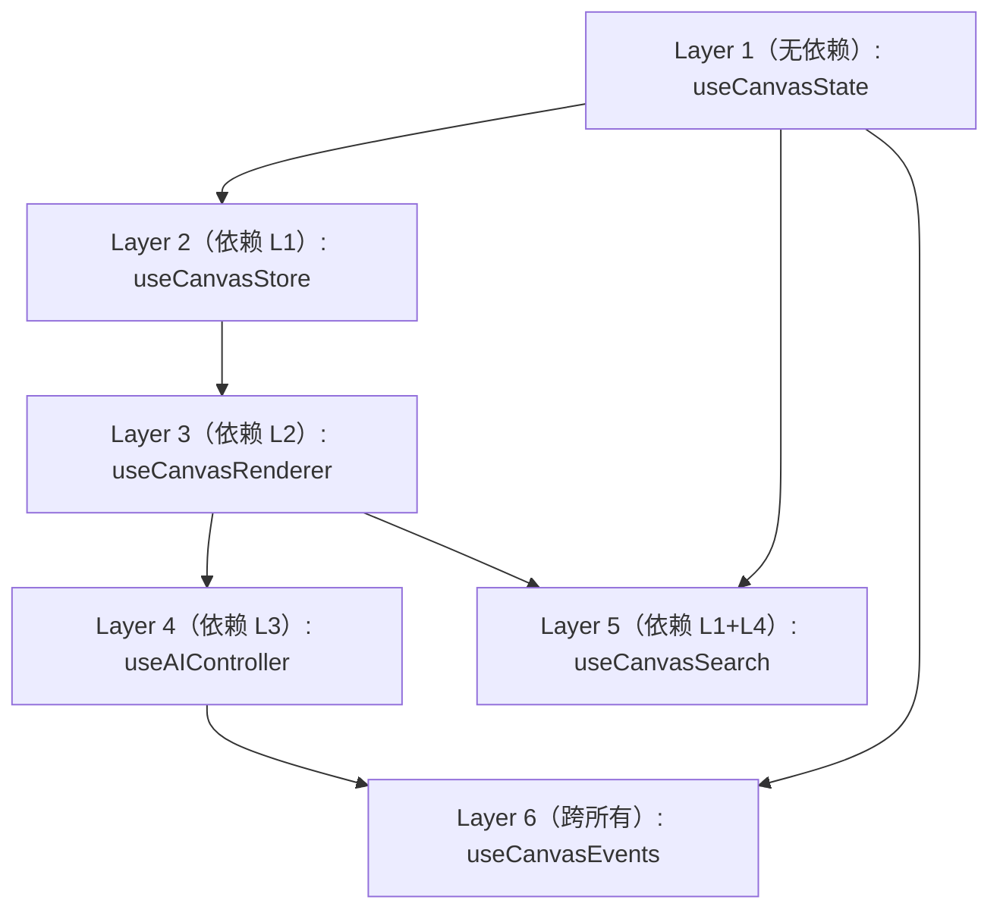

# 经验教训 — VibeX Dev 提案收集与执行 (vibex-dev-proposals-task)

**项目**: vibex-dev-proposals-task（2026-03-24 → 2026-04-12 跨多轮迭代）
**日期**: 2026-04-11
**角色**: Dev Agent
**类型**: 流程改进 + 架构演进复合经验

---

## 项目概述

Dev Agent 在多轮提案周期中，从以下维度推动了 VibeX 的技术改进：

| 维度 | 内容 | 周期 |
|------|------|------|
| 设计系统统一 | Auth/Preview 规范化 | 2026-03 |
| 渲染引擎重构 | JsonTreeRenderer 拆分 | 2026-03 |
| Canvas 组件拆分 | useCanvas* hook 6 层拆分 | 2026-04 |
| Store 规范化 | canvasStore → 5 个子 store | 2026-04 |
| 测试金字塔补全 | Vitest + Playwright 分层 | 2026-04 |
| 技术债清理 | TS strict mode + build fixes | 2026-03 ~ 04 |
| 文档与豁免治理 | CHANGELOG 规范 + pre-submit 检查 | 2026-04 |

---

## 做得好的地方

### 1. 提案周期稳定，问题识别持续

Dev Agent 在 2026-03-24、2026-04-05、2026-04-07、2026-04-12 连续多轮提交提案，形成了稳定的「问题识别 → 提案 → 执行」循环。每一轮提案都基于上轮执行反馈迭代，不是闭门造车。

**证据**:
- 2026-03-24: 识别 CardTreeNode 单元测试缺失 + dedup 生产盲区
- 2026-04-05: 基于 canvas-split-hooks Epic 执行结果，提出 Phase 2 组件拆分方案
- 2026-04-07: 基于 GitHub secret scanning 实际问题，提出 token 环境变量化
- 2026-04-12: 基于 `pnpm tsc --noEmit` 的具体错误，提出逐文件修复方案

### 2. 根因分析深入到代码层面

提案不止描述症状，而是追溯到具体文件、行号和类型系统约束。例如：
- `StepClarification.tsx` 重复 `StepComponentProps` → 定位到具体接口定义冲突
- `snapshot.ts` vs `snapshots.ts` → 识别到路由重复文件
- `import type { NextResponse }` vs `new NextResponse()` → 精准到 TS1361 错误

这种粒度让执行者无需重新定位问题。

### 3. 工作量估算合理，分层清晰

PRD 中每个 Epic 的 Story 都附带了具体工时估算（0.5h ~ 3h），且 Epic 之间标注了依赖关系。执行顺序（Sprint 3.x → 3.y → Sprint 4）逻辑清晰。

**具体案例**: E4 canvasStore 退役（8h）被拆为 4 个 Story，每个 Story 有明确的验收标准（`expect(canvasStoreLineCount).toBeLessThan(50)`）。

### 4. 架构约束文档化到位

AGENTS.md 中为每个 Epic 定义了详细的开发约束（TypeScript 约束、Store 迁移约束、CI Gates），执行者无需反复确认边界。这种「第一次就做对」的设计减少了返工。

### 5. 技术债清理有验收标准

TS strict mode 修复有明确的验收标准：`npx tsc --noEmit` 零错误。ESLint 防护规则 `import/no-duplicates` 配置在 CI 中 gate。pre-submit check 脚本覆盖 6 项检查。

### 6. 提案质量评分自我校准

Dev Agent 在提案中包含「提案质量评分」表，从问题描述、根因分析、建议方案、优先级、影响范围等维度自评分。这种自我校准机制让 Coord 可以快速判断提案成熟度。

---

## 需要改进的地方

### 1. 提案优先级与实际执行脱节

**问题**: 2026-04-03 的 PRD 中 E1（TypeScript 修复，P0）计划 1h 内完成，但后续多轮提案（04-05、04-07、04-12）中 TypeScript 错误仍然存在，且反复以 P0/P1 提案出现，说明 E1 从未被真正执行。

**根因**: Dev 提案被 Coord 派发后，没有跟踪闭环机制。提案通过 ≠ 执行完成。

**改进方向**:
- 提案通过后，Dev 应在提案文档中记录「执行开始时间」和「执行 commit SHA」
- Coord 在派发任务时设定 deadline，超过 deadline 自动升级
- 跨轮迭代中，主动引用上一轮未完成提案，标注阻塞点

### 2. subagent 超时导致代码丢失

**问题**（2026-04-05 P001）: 多个 subagent 因 5 分钟超时失败，其中 2 个已完成代码修改但未 commit。这是严重的工程浪费。

**根因**: subagent 缺乏中间 checkpoint 机制，parent 无法区分「代码完成但未提交」和「代码未完成」。

**改进方向**:
- 执行时间预估超过 3 分钟的任务，拆为多个子步骤，每步完成后输出确定性摘要
- subagent 应在完成代码修改后立即 commit，不管剩余时间
- Coord 派发任务时明确告知 subagent：「如果接近超时，先 commit 再报告」

### 3. 提案数量过多但执行率低

**问题**: 2026-04-12 单轮提出了 9 个提案（P001~P009），但这些提案中只有 P001（P0 TypeScript 修复）被确认执行，其余提案的命运未知。

**根因**: 提案数量与执行能力不匹配。一次提出 9 个提案给 Coord 的决策压力很大，容易导致全部「采纳」但全部不执行。

**改进方向**:
- 每轮提案不超过 3 个，优先交付
- 提案应标注「本轮执行」vs「下轮候选」
- 引入提案积压（backlog）机制，一次只推进 1-2 个

### 4. Epic 执行深度不足

**问题**: E4 canvasStore 退役在 2026-04-03 的 PRD 中规划了 8h，但执行报告（dev-epic-backlog-report.md）显示 E4 实际只完成了 contextStore 拆分的审查，**没有任何代码变更**。E2 Sync Protocol 和 E3 Playwright E2E 同样未落地。

**根因**: Dev 在提案阶段做了详尽的 PRD 和 Architecture，但执行阶段没有 commit 产出。规划文档成为了「目标」而不是「交付物」。

**改进方向**:
- PRD 中的验收标准必须转化为可执行的 CI 测试用例
- 提案通过后，Dev 必须输出首日 commit（即使是 WIP），证明执行已开始
- 每个 Epic 的 Story 应作为独立 task 派发，完成一个标记一个

### 5. 跨 Epic 知识未沉淀

**问题**: canvasStore 拆分在 canvas-canvasstore-migration Epic 中已经完成（13 测试、100% 覆盖、68/68 pass），但相同的 Zustand store 重构模式又在后续提案中作为新问题提出，说明这次经验没有结构化沉淀。

**根因**: 没有在 Epic 完成后强制执行 `/ce:compound` 经验沉淀，导致最佳实践成为「一次性知识」。

**改进方向**:
- Epic 完成 DoD 后，强制触发 `/ce:compound` 写经验文档
- 经验文档路径标准化（`docs/solutions/` 或 `.learning/`）
- 后续提案应要求引用已沉淀的经验文档

### 6. 提案未区分「发现问题」和「解决问题」

**问题**: 部分提案（如 P004 统一测试框架、P009 flows API 路径规范化）停留在问题描述和方案建议阶段，没有「为什么这是当前最重要的事」的理由。

**根因**: 提案模板缺少「如果不做会怎样」的后果评估。

**改进方向**:
- 每个提案必须包含「不做的代价」或「当前状态的影响范围」
- 用 P0/P1/P2 区分紧急度，用工时估算（h）区分复杂度
- Coord 决策时优先看「代价」而非「方案」

### 7. 提案执行后无回访

**问题**: 2026-03-24 的 D-001（CardTreeNode 单元测试）和 D-002（dedup 生产验证）从未出现在后续提案的「完成」列表中。无法确认这些提案是被执行了、还是被遗忘了、还是被有意识地推迟了。

**改进方向**:
- Coord 的 current-report 应包含「上轮提案执行状态」
- Dev 每轮提案应包含上轮提案的完成状态（✅/🔄/❌）
- 未完成的提案必须说明原因，不能静默消失

---

## 可复用的模式

### 1. 提案质量评分表

```markdown
| 维度 | 分值 |
|------|------|
| 问题描述 | 3 |
| 根因分析 | 3 |
| 建议方案 | 3 |
| 优先级 | 2 |
| 影响范围 | 2 |
| 加分（日期/Commit/PR/质量章节） | 3 |
| **总分** | **16** |
```

**适用场景**: Dev/Analyst/PM 提交的所有技术提案

### 2. Story 拆解模板（工时 + 验收标准）

每个 Story 必须包含：
- 具体操作步骤（T1.1.1, T1.1.2...）
- 命令行验证（`npx tsc --noEmit`、`npx madge --circular`）
- `expect()` 形式的验收断言

**适用场景**: 所有需要派发给 subagent 执行的 Epic

### 3. 架构约束下沉到 AGENTS.md

将 Epic 的技术约束（TypeScript 规则、Store 迁移规范、CI Gates）写入 `AGENTS.md`，而非散落在 PRD 中。执行者读取 AGENTS.md 即可知道边界。

**适用场景**: 所有跨 Epic 共享的技术标准（行数限制、命名规范、测试覆盖率要求）

### 4. Dev 提案周期节奏

保持 3-4 天一轮的提案节奏，每轮不超过 3 个提案，每次基于上轮反馈迭代。这种短周期反馈比大而全的规划更有效。

**适用场景**: 所有技术改进项目

### 5. 分层 Store 架构



分层架构确保后续新功能只依赖最低所需 Layer，减少耦合。**已验证有效**（canvas-split-hooks Epic）。

### 6. 渐进式冲突保护

先实现乐观锁 version 字段（1h），再实现 ConflictDialog UI（2h）。这种渐进式交付比大爆炸方案风险更低。

**适用场景**: 所有涉及多用户数据一致性的功能

### 7. pre-submit 检查脚本

```bash
#!/bin/bash
# 6 项检查: TS 编译 + ESLint + 测试 + 循环依赖 + 构建 + 变更大小
npx tsc --noEmit
npm run lint
npm run test
npx madge --circular src/lib/canvas/stores/
npm run build
```

**适用场景**: 所有前端项目，防止破坏性变更进入 commit

---

## 下次避免的坑

### 1. 不要再「规划后不执行」

**坑**: 写了详尽的 PRD + Architecture + AGENTS.md，但没有任何 commit 产出。

**怎么避免**:
- 提案通过后 24h 内必须有第一个 commit（即使是 WIP）
- 每个 Epic 拆为多个 Story，每个 Story 作为独立 task
- 用 CI pipeline 追踪执行进度，而非用提案文档

### 2. 不要再一次提 9 个提案

**坑**: 一次提 9 个提案，Coord 无法决策，执行者精力分散，全部流产。

**怎么避免**:
- 硬限制：每轮最多 3 个提案
- 剩余提案进入 backlog，按优先级排队
- 用「提案积压量」作为 Dev 产能的观测指标

### 3. 不要再让 subagent 超时丢失代码

**坑**: subagent 因 5 分钟超时失败，已完成的代码未 commit，整个工作浪费。

**怎么避免**:
- 预估超过 3 分钟的任务，在执行前拆分步骤
- subagent 完成关键步骤后立即 commit，不依赖最后统一提交
- parent 端在派发任务时明确超时处理策略

### 4. 不要再让 Epic 经验成为一次性知识

**坑**: canvasStore 拆分已完成 68/68 tests pass，但类似问题在后续提案中作为新问题再次出现。

**怎么避免**:
- Epic 完成后强制写经验文档（`/ce:compound`）
- 后续提案必须先搜索 `.learning/` 目录，引用已有经验
- 将最佳实践固化为 AGENTS.md 中的规范

### 5. 不要再跳过 TypeScript 类型检查

**坑**: TS 编译错误从 2026-03-24 到 2026-04-12 持续存在，每次 build fix 都成为 P0 提案。

**怎么避免**:
- CI 必须 gate `tsc --noEmit`，不允许有 TS 错误的代码合入
- 新增 `@ts-ignore` 必须附理由和 TODO，且通过 ESLint rule 限制
- 将 TS 错误数作为技术债的健康指标，跟踪趋势

### 6. 不要再忽视提案完成状态

**坑**: D-001 和 D-002 在 2026-03-24 提案通过后，从未出现在后续状态报告中。

**怎么避免**:
- 每轮提案包含上轮提案的完成状态（✅/🔄/❌）
- 未完成提案必须在下一轮提案中标注原因
- Coord 的 current-report 包含「上轮提案执行状态」板块

### 7. 不要再混用测试框架

**坑**: 前端用 Vitest、后端用 Jest，开发者需要维护两套配置、两套 mock 语法。`vitest.config.ts` 中手动维护 Jest 文件排除列表。

**怎么避免**:
- 尽快完成 Jest → Vitest 统一迁移（2-3h 工时）
- 建立规则：禁止在 `.test.ts` 文件中使用 `jest.` 全局调用
- CI 预检脚本自动检测 Jest 语法，未迁移文件自动报错

### 8. 不要再硬编码 secrets 在代码中

**坑**: `task_manager.py` 中硬编码 `xoxp-...` Slack token，被 GitHub secret scanning 阻止 push。

**怎么避免**:
- 所有 secrets 必须从环境变量读取（`os.environ.get()`）
- `.env` 文件加入 `.gitignore`，不提交到 git
- CI/CD 从 secret manager 注入环境变量

---

## 关联经验文档

- `.learning/vibex-canvas-button-audit-20260410-lessons.md` — Canvas 组件审计经验
- `.learning/vibex-build-fixes-20260411-lessons.md` — Build fix 修复经验
- `docs/solutions/` — 历史 bug fix 和技术决策文档

---

*本文档由 Dev Agent 撰写，基于 2026-03-24 至 2026-04-12 多轮提案周期复盘*
