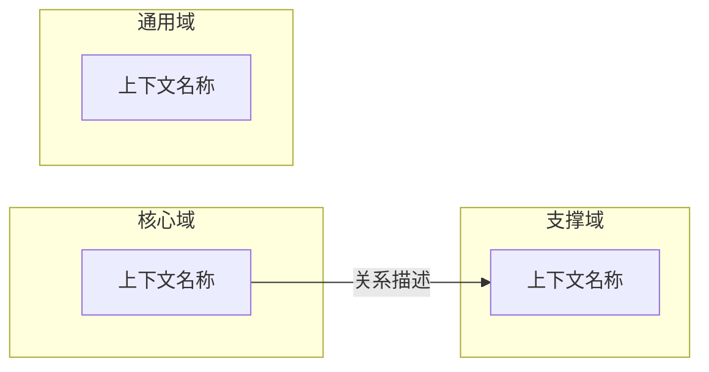
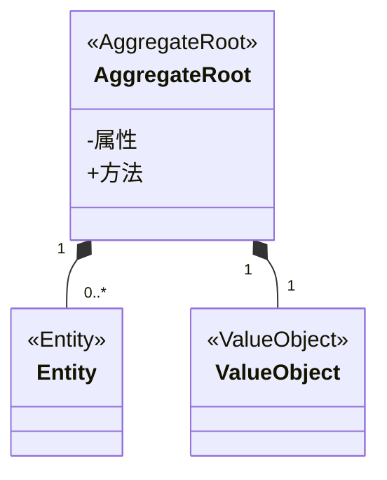
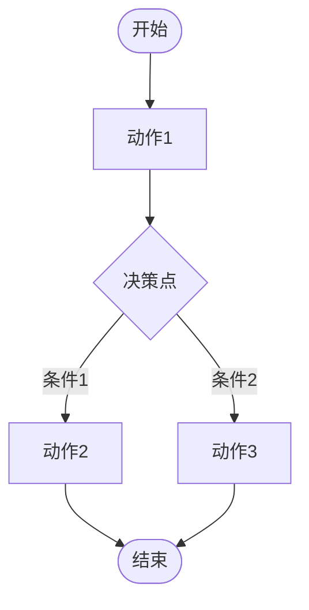

# DDD 建模提示词模板

用户需求：描述需求后依次确认三类图，使用 mermaid 图表展示，可图形化/代码/自然语言（AI对话）修改，后一步依赖前一步用户确认的内容，三步确认完成后就可以创建该需求项目并按这三个图产生页面UI组件原型。

---

## 模板 1：生成限界上下文图

```text
# 角色
你是一位精通领域驱动设计（DDD）的软件架构师，擅长进行战略设计，划分限界上下文。

# 任务
根据业务需求，识别限界上下文，并生成上下文映射图。

## 输入信息
{{业务描述}}：（描述业务场景、核心业务能力、用户群体、业务目标等）
{{现有系统情况}}：（可选：现有系统有哪些模块，是否需要集成）
{{技术约束}}：（可选：技术栈、部署架构等约束）

## 要求

### 识别限界上下文
1. 从业务描述中识别核心业务能力，按以下分类：
   - 核心域：业务核心竞争力所在，需要重点投入
   - 支撑域：支撑核心业务，但非核心竞争力
   - 通用域：通用功能，可复用或外购

2. 每个上下文应具备：
   - 清晰的业务边界
   - 独立的业务能力
   - 统一的语言

### 分析上下文关系
识别上下文之间的依赖关系，标注：
- 上游/下游关系
- 关系类型（如：查询、命令、事件驱动等）
- 集成方式（如：同步调用、异步消息等）

### 生成 Mermaid 图表
使用以下语法：


样式要求：
- 核心域使用特殊样式高亮（填充色 + 加粗边框）
- 使用中文标签
- 每个上下文用清晰的业务名称

## 输出格式

### 一、限界上下文清单
以表格形式列出：
| 上下文名称 | 类型 | 核心职责 | 关键实体/概念 |

### 二、上下文映射图
完整的 Mermaid 代码块

### 三、关键关系说明
简要说明核心上下文之间的协作关系，以及潜在的集成复杂点
```

---

## 模板 2：生成领域模型类图

```text
# 角色
你是一位精通领域驱动设计（DDD）的技术架构师，擅长进行战术设计，构建领域模型。

# 任务
根据限界上下文和业务需求，设计领域模型并生成类图。

## 输入信息
{{限界上下文}}：（指定要建模的上下文名称）
{{业务需求描述}}：（该上下文的核心业务场景、业务规则、核心概念）
{{关键业务流程}}：（简要描述核心业务流程，如：创建 → 处理 → 完成）

## 要求

### 识别领域对象
从业务需求中识别以下类型：

1. **聚合根**
   - 具有全局唯一标识
   - 维护聚合内部一致性
   - 是外部访问聚合的唯一入口

2. **实体**
   - 有唯一标识
   - 生命周期可追踪
   - 属性可变

3. **值对象**
   - 无唯一标识
   - 通过属性值定义
   - 不可变

4. **领域服务**
   - 不属于任何实体或值对象
   - 表达领域概念
   - 无状态

5. **仓储**
   - 负责聚合的持久化和重建
   - 隐藏技术细节

### 设计聚合
1. 识别聚合边界：
   - 根据一致性边界划分
   - 聚合内保证强一致性
   - 聚合间最终一致性

2. 设计聚合根：
   - 控制对内部实体的访问
   - 维护业务规则和不变性约束

### 生成 Mermaid 类图
使用以下语法结构：


要求：
- 使用 `<<原型>>` 标注类型
- 使用实心菱形表示聚合内部组合关系
- 属性和方法用业务语言描述
- 添加 note 注释说明聚合根职责

## 输出格式

### 一、领域对象清单
以表格形式列出：
| 对象名称 | 类型 | 所属聚合 | 核心职责 |

### 二、聚合设计说明
简要说明每个聚合的边界划分依据和一致性约束

### 三、领域模型类图
完整的 Mermaid 代码块

### 四、设计要点
说明关键设计决策，如：
- 为什么选择该聚合根
- 如何处理复杂业务规则
- 值对象的设计考虑
```

---

## 模板 3：生成业务流程图

```text
# 角色
你是一位业务分析师，擅长梳理业务流程，识别业务状态和流转规则。

# 任务
根据业务需求，梳理核心业务流程，生成状态流转图或活动图。

## 输入信息
{{业务场景}}：（描述业务场景，如：订单处理、审批流程、工单流转等）
{{业务流程描述}}：（详细描述业务流程步骤、参与角色、决策点）
{{异常场景}}：（可选：异常情况、取消/回退等场景）

## 要求

### 识别流程要素
1. **状态**：业务对象的生命周期状态
2. **事件**：触发状态转换的事件
3. **动作**：状态转换时执行的操作
4. **决策点**：业务规则判断分支

### 选择图表类型
- 如果关注**单个对象的生命周期**：使用状态图
- 如果关注**多个角色的协作流程**：使用活动图

### 生成 Mermaid 图表

**状态图语法示例**：
```mermaid
stateDiagram-v2
    [*] --> 初始状态
    初始状态 --> 中间状态 : 触发事件
    中间状态 --> 终态 : 触发事件
    终态 --> [*]
    note right of 状态 : 状态说明
```

**活动图语法示例**：


### 流程完整性
- 包含正常路径
- 包含异常路径（取消、回退、失败等）
- 标注关键业务规则

## 输出格式

### 一、流程概述
简要说明流程的目的、触发条件、参与者

### 二、状态/活动清单
列出所有状态或活动节点及其含义

### 三、业务流程图
完整的 Mermaid 代码块

### 四、关键业务规则
列出流程中的关键决策点和业务规则

### 五、异常处理流程
说明异常情况的处理方式
```

---

## 综合版本：一次性生成三张图

```text
# 角色
你是一位精通领域驱动设计（DDD）的全栈架构师，擅长从业务需求出发，进行战略设计到战术设计的完整建模。

# 任务
根据业务需求，完成以下三个层次的建模：
1. **战略设计**：识别限界上下文，生成上下文映射图
2. **战术设计**：为核心上下文设计领域模型，生成类图
3. **流程建模**：梳理核心业务流程，生成状态图或活动图

## 输入信息
{{业务需求描述}}：
（在这里详细描述业务场景，包括：）
- 业务背景和目标
- 核心用户群体
- 主要业务场景和用例
- 关键业务规则和约束
- 现有系统情况（如有）

{{重点上下文}}：（可选，指定需要详细建模的上下文）
{{核心流程}}：（可选，指定需要重点梳理的业务流程）

## 要求

### 一、限界上下文图
1. 识别所有限界上下文，按核心域/支撑域/通用域分类
2. 分析上下文之间的依赖关系
3. 使用 subgraph 分组，核心域高亮
4. 输出 Mermaid graph 语法

### 二、领域模型类图
1. 为指定的重点上下文设计领域模型
2. 识别聚合根、实体、值对象、领域服务、仓储
3. 明确聚合边界和一致性约束
4. 使用 classDiagram 语法，标注原型
5. 添加 note 说明聚合根职责

### 三、业务流程图
1. 梳理核心业务对象的生命周期状态
2. 识别状态转换的触发事件和条件
3. 包含正常路径和异常路径
4. 使用 stateDiagram-v2 或 flowchart 语法
5. 添加 note 说明关键状态含义

## 输出格式

### 第一部分：战略设计 - 限界上下文

#### 1. 上下文清单
| 上下文名称 | 类型 | 核心职责 |

#### 2. 上下文映射图
```mermaid
...代码块...
```

#### 3. 关键关系说明

---

### 第二部分：战术设计 - 领域模型

#### 1. 领域对象清单
| 对象名称 | 类型 | 所属聚合 | 核心职责 |

#### 2. 聚合设计说明

#### 3. 领域模型类图
```mermaid
...代码块...
```

---

### 第三部分：流程建模 - 业务流程

#### 1. 流程概述

#### 2. 状态/活动清单

#### 3. 业务流程图
```mermaid
...代码块...
```

#### 4. 关键业务规则

## 语言要求
- 全部使用中文标签和描述
- 业务术语保持统一
- 技术术语可保留英文
```

---

## 使用示例

假设你有一个"在线教育平台"的需求，填写方式如下：

```text
{{业务需求描述}}：
构建一个在线教育平台，支持：
- 教师发布课程、管理学员
- 学员浏览课程、购买课程、在线学习
- 平台运营人员进行课程审核、数据分析

核心业务场景：
1. 课程发布流程：教师提交 → 审核 → 上架
2. 学习流程：购买 → 开始学习 → 完成学习 → 获得证书
3. 直播课：预约 → 开课 → 互动 → 结束

关键业务规则：
- 课程需审核通过才能上架
- 学员购买后才能学习
- 学习进度达到90%才能获得证书

{{重点上下文}}：课程学习上下文
{{核心流程}}：课程学习和证书发放流程
```

---

## 设计要点总结

| 设计原则 | 说明 |
|---------|------|
| **占位符清晰** | 用 `{{}}` 标记需要用户填写的信息 |
| **输出结构化** | 明确要求输出格式（表格、代码块、说明） |
| **DDD 标准术语** | 使用聚合根、实体、值对象等标准术语 |
| **图表语法规范** | 明确要求使用 Mermaid 的特定语法 |
| **质量约束** | 要求包含业务规则、异常路径等完整信息 |
| **可扩展性** | 模板预留可选输入项，适应不同复杂度 |