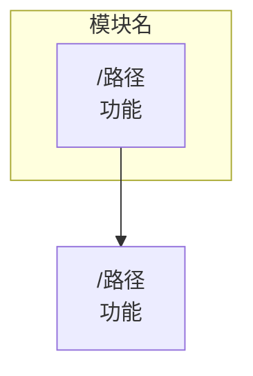
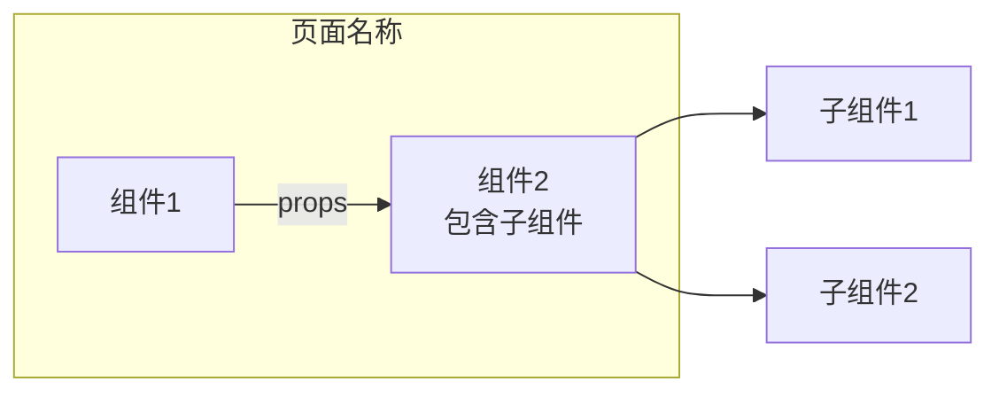

# VibeX Mermaid 流程图生成提示词

> 用于生成 VibeX 项目业务流程的 Mermaid 流程图

---

## 提示词模板

```markdown
请生成一个 VibeX 项目的 Mermaid 流程图，展示以下业务流程：

项目结构：
- [列出所有模块]
- [列出每个模块的页面/功能]
- [描述模块之间的关系]

要求：
1. 使用 graph TB 布局（从上到下）
2. 每个节点显示页面路径和功能描述
3. 用 --> 箭头表示页面跳转/流程
4. 用 subgraph 分组不同模块
5. 节点格式：["/路径<br/>功能描述"]
6. 确保箭头流向清晰，展示用户操作路径

示例格式：


请生成 Mermaid 代码。
```

---

## 具体使用示例

### 1. 整体项目流程图

```markdown
请生成 VibeX 项目的整体 Mermaid 流程图，展示以下模块和关系：

模块：
1. 首页模块：/ 首页（需求输入+AI分析）、登录注册抽屉、Step1需求澄清、Step2业务流程、Step3页面组件、创建项目
2. 项目管理模块：/projects 项目列表页、草稿项目、进行中、已完成
3. 原型编辑模块：/project/:id 项目原型页、左侧菜单树、原型预览区、组件详情抽屉、AI助手悬浮
4. 模板模块：/templates 模板市场、使用模板
5. 工具模块：/changelog 更新日志

关系：
- 首页 → 创建项目 → 项目列表
- 项目列表 → 选择项目 → 原型页
- 首页 → 模板市场 → 创建项目
- 首页 → 更新日志
```

### 2. 页面组件树图

```markdown
请生成一个页面的 UI 组件树结构 Mermaid 图，使用 graph LR 布局。

示例格式：


页面：[页面名称]
布局比例：[如 左侧40% | 右侧60%]
组件：[列出所有组件及其层级关系]
```

---

## 生成规则

1. **整体流程图**：使用 `graph TB`，从上到下展示流程
2. **组件结构图**：使用 `graph LR`，从左到右展示层级
3. **节点命名**：使用中文 + 路径，便于理解
4. **subgraph**：按功能模块分组
5. **箭头**：使用 `-->` 表示流转关系

---

*文档版本: 1.0 | 创建日期: 2026-03-20*
