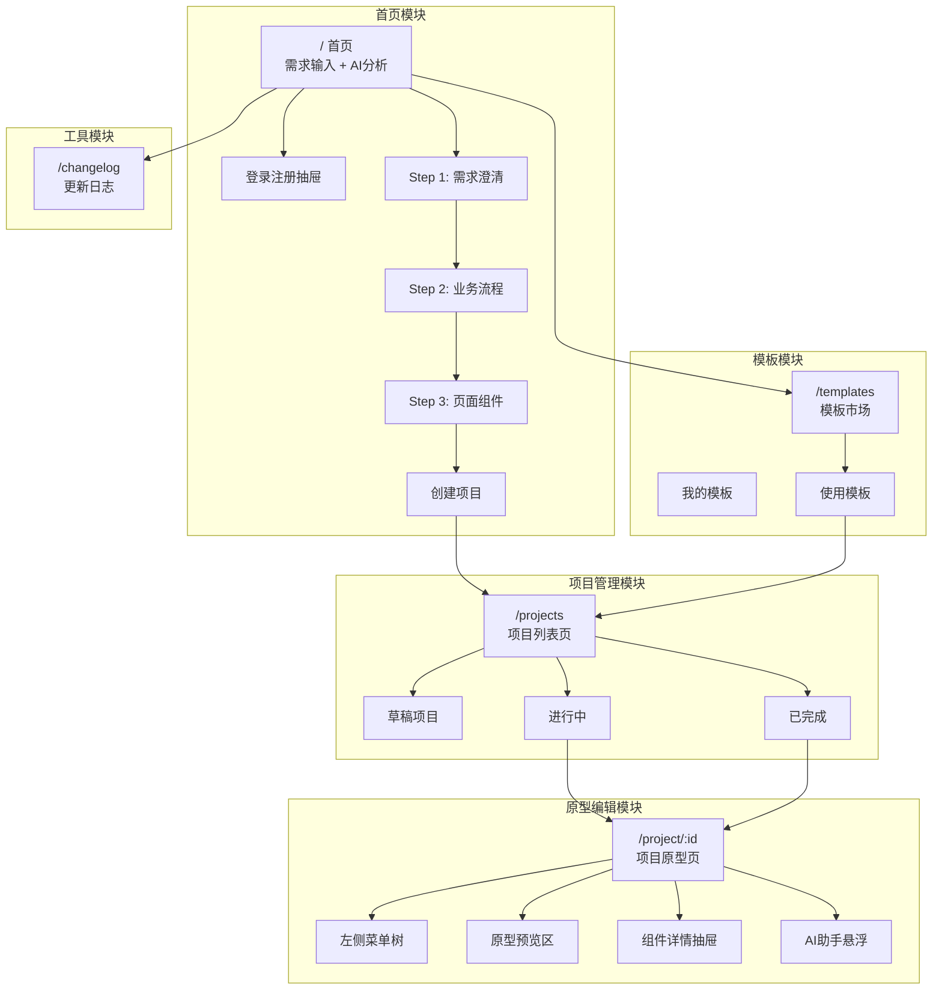
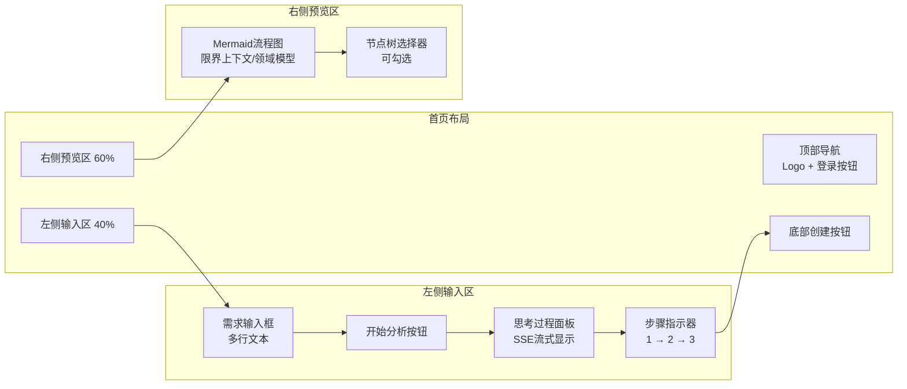
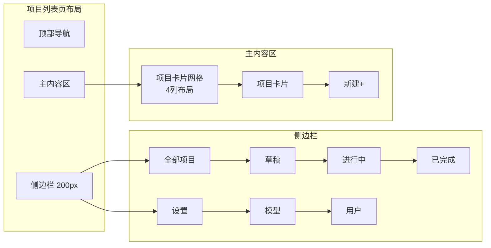
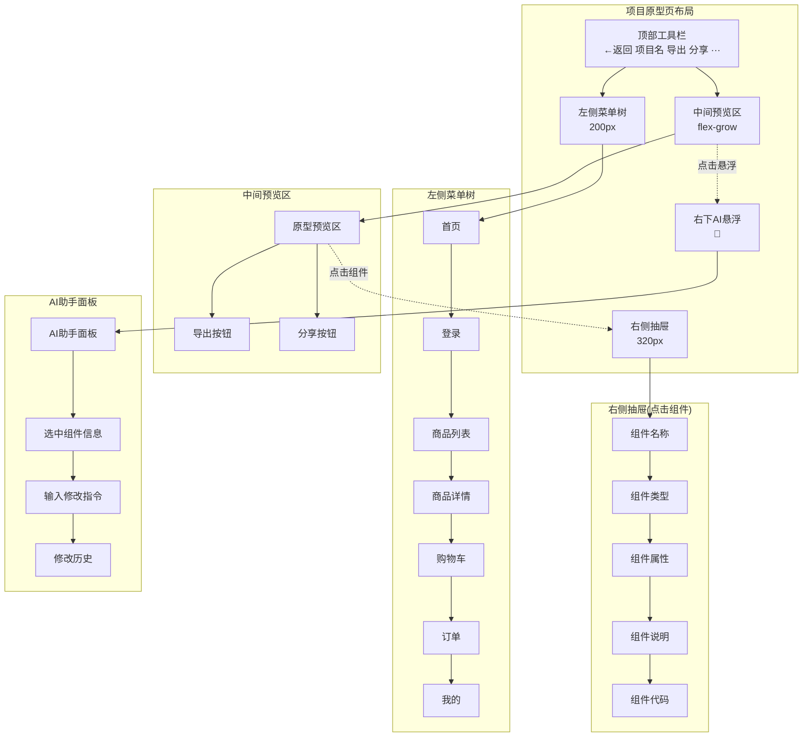
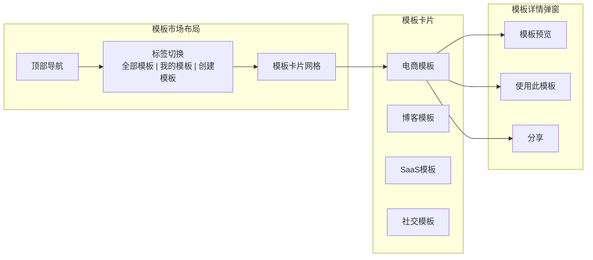
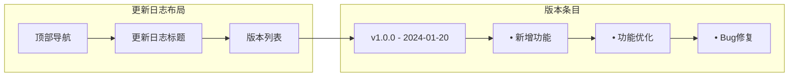
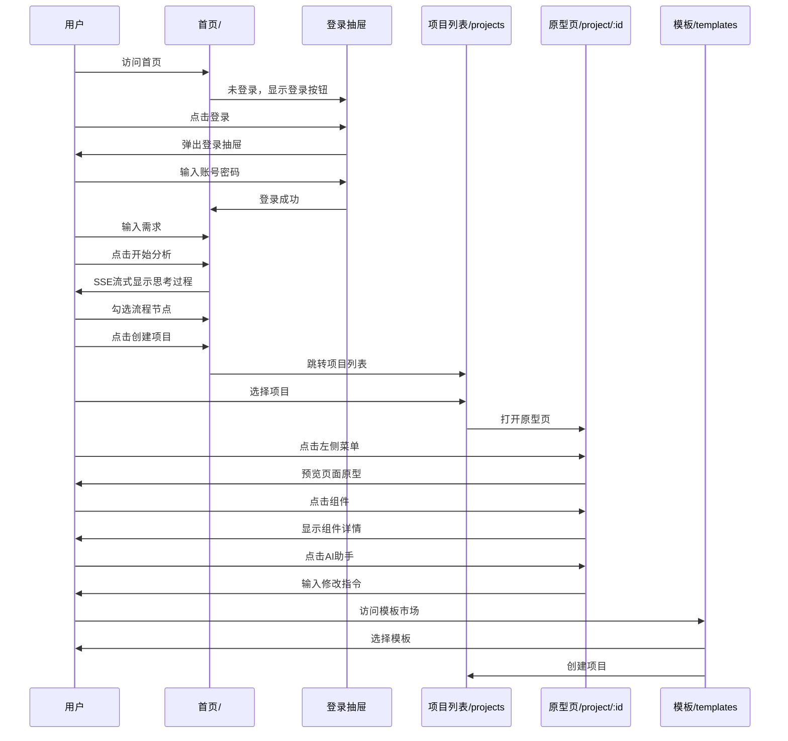

# VibeX 项目原型设计文档

> **版本**: v1.0  
> **日期**: 2026-03-20  
> **状态**: 最终版  
> **负责人**: Coord  
> **用途**: VibeX 项目自己的原型页设计指导

---

## 一、项目整体 Mermaid 流程图



---

## 二、首页 `/` 原型



**布局比例**: 左侧 40% | 右侧 60%

---

## 三、项目列表页 `/projects` 原型



---

## 四、项目原型页 `/project/:id` 原型



**布局比例**: 左侧 200px | 中间 flex-grow | 右侧 320px

---

## 五、模板市场 `/templates` 原型



---

## 六、更新日志 `/changelog` 原型



---

## 七、页面结构树

```
VibeX
├── /                     首页
│   ├── 顶部导航 (Logo + 登录)
│   ├── 左侧输入区 (40%)
│   │   ├── 需求输入框
│   │   ├── 开始分析按钮
│   │   ├── 思考过程面板
│   │   └── 步骤指示器 (1→2→3)
│   ├── 右侧预览区 (60%)
│   │   ├── Mermaid流程图
│   │   └── 节点树选择器
│   ├── 底部创建按钮
│   └── 登录注册抽屉
│
├── /projects             项目列表页
│   ├── 顶部导航
│   ├── 侧边栏 (200px)
│   │   ├── 全部项目
│   │   ├── 草稿
│   │   ├── 进行中
│   │   ├── 已完成
│   │   ├── 设置
│   │   ├── 模型
│   │   └── 用户
│   └── 主内容区
│       └── 项目卡片网格
│
├── /project/:id         项目原型页
│   ├── 顶部工具栏
│   ├── 左侧菜单树 (200px)
│   │   └── 页面节点列表
│   ├── 中间预览区 (flex)
│   │   ├── 原型预览
│   │   └── 导出/分享按钮
│   ├── 右侧抽屉 (320px)
│   │   └── 组件详情
│   └── 右下AI助手悬浮
│
├── /templates           模板市场
│   ├── 顶部导航
│   ├── 标签切换
│   └── 模板卡片网格
│
└── /changelog          更新日志
    ├── 顶部导航
    └── 版本列表
```

---

## 八、用户交互流程图



---

## 九、组件清单

| 页面 | 组件 | 类型 | 说明 |
|------|------|------|------|
| 首页 | Logo | 品牌 | VibeX Logo |
| 首页 | LoginButton | 按钮 | 触发登录抽屉 |
| 首页 | RequirementInput | 输入框 | 多行文本输入 |
| 首页 | AnalyzeButton | 按钮 | 触发AI分析 |
| 首页 | ThinkingPanel | 面板 | SSE流式显示 |
| 首页 | StepIndicator | 指示器 | 1→2→3步骤 |
| 首页 | MermaidPreview | 图表 | 流程图渲染 |
| 首页 | NodeTreeSelector | 树形 | 可勾选节点 |
| 首页 | CreateButton | 按钮 | 创建项目 |
| 首页 | LoginDrawer | 抽屉 | 登录注册表单 |
| 项目列表 | Sidebar | 布局 | 侧边栏导航 |
| 项目列表 | ProjectCard | 卡片 | 项目缩略信息 |
| 项目列表 | FilterTabs | 标签 | 全部/草稿/进行中/已完成 |
| 原型页 | MenuTree | 树形 | 页面菜单 |
| 原型页 | PrototypePreview | 预览 | 原型静态展示 |
| 原型页 | ComponentDrawer | 抽屉 | 组件详情 |
| 原型页 | ExportModal | 弹窗 | 导出选择 |
| 原型页 | ShareModal | 弹窗 | 二维码分享 |
| 原型页 | AIAssistant | 悬浮 | AI对话助手 |
| 模板 | TemplateCard | 卡片 | 模板缩略 |
| 模板 | TemplatePreview | 弹窗 | 模板预览 |
| 日志 | VersionEntry | 条目 | 版本更新记录 |

---

## 十、技术实现要点

| 功能 | 技术方案 |
|------|----------|
| 页面路由 | Next.js App Router |
| 状态管理 | Zustand (confirmationStore, projectStore) |
| 流程图渲染 | Mermaid.js |
| AI对话 | SSE流式 + MiniMax API |
| 拖拽布局 | react-resizable-panels |
| 抽屉组件 | 自定义 Drawer 组件 |
| 二维码生成 | qrcode.react |

---

**文档版本**: v1.0 | **最后更新**: 2026-03-20
