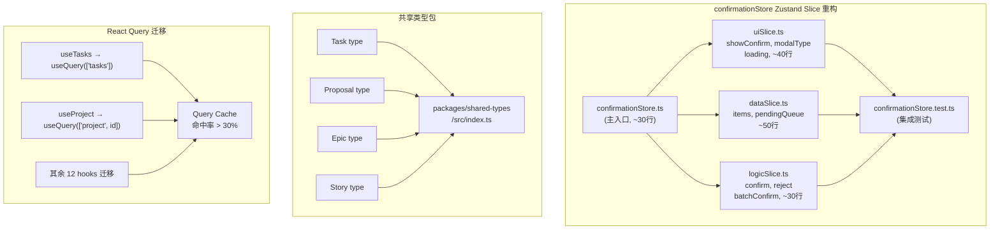
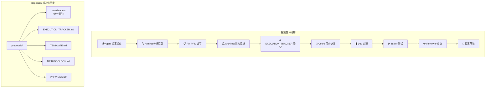
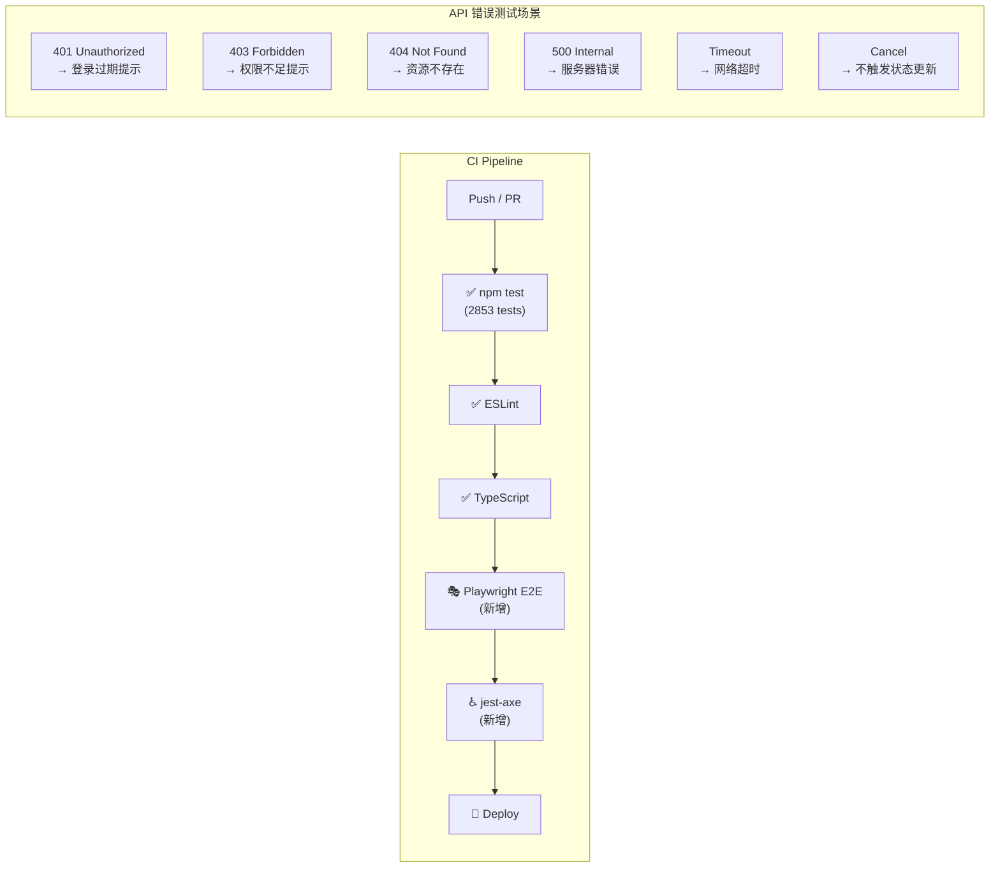

# 架构设计：Agent 改进提案流程优化 — 2026-03-29

**文档版本**: v1.0  
**日期**: 2026-03-29  
**作者**: Architect Agent  
**状态**: Ready for Implementation  
**上游**: `prd.md` | `analysis.md`  
**下游**: `IMPLEMENTATION_PLAN.md` | `AGENTS.md`

---

## 一、技术选型

### 1.1 核心技术栈

| 层级 | 技术选型 | 理由 |
|------|---------|------|
| **前端** | React 18 + TypeScript 5 | 现有栈，ErrorBoundary / confirmationStore 重构基于此 |
| **状态管理** | Zustand v4（slice pattern） | 轻量、向后兼容，confirmationStore 重构目标 |
| **API 层** | React Query v5 | 缓存/去重/错误处理统一，E2.5 迁移目标 |
| **类型共享** | `packages/shared-types/` | 前后端类型统一，消除同步成本 |
| **后端脚本** | Python 3.11 | task_manager / heartbeat / dedup 现有实现 |
| **文件锁** | `filelock` Python 库 | 解决 task_manager 并发挂起 |
| **原子写入** | `tempfile + os.rename()` | coord-state.json 并发写入安全 |
| **E2E 测试** | Playwright（已集成） | 现有栈，E4.1 目标为纳入 CI |
| **单元测试** | Jest + jest-axe | 现有 Jest 生态，Accessibility 基线扩展 |
| **CI/CD** | GitHub Actions | 现有栈，E4.1 集成目标 |
| **错误类型** | TypeScript `enum ErrorType` | 前端错误处理统一基础 |

### 1.2 技术约束

- **向后兼容**: 所有重构不得破坏现有 `useConfirmationStore()` / `useTasks()` 等调用
- **零停机**: task_manager 修复期间，coord-state.json 不可丢失
- **隔离验证**: dedup 验证使用匿名化数据，不导入真实提案内容
- **渐进迁移**: React Query 覆盖率提升按优先级分批迁移，不一次性大改

---

## 二、系统架构图

### 2.1 整体架构

```mermaid
graph TB
    subgraph "🐉 Epic 1: 工具链止血"
        TM["🛠️ task_manager.py<br/>(Python)"]
        HB["💓 heartbeat.sh<br/>(Bash)"]
        DD["🔍 dedup.py<br/>(Python)"]
        CS["📄 coord-state.json<br/>(状态存储)"]
        
        TM -->|"文件锁 + 超时"| CS
        HB -->|"扫描项目目录"| CS
        DD -->|"提案去重"| CS
    end
    
    subgraph "🏛️ Epic 2: 前端架构"
        EB["🛡️ ErrorBoundary<br/>(统一组件)"]
        CS_STORE["📦 confirmationStore<br/>(Zustand)"]
        SHARED_TYPES["📚 shared-types<br/>(packages/)"]
        ERROR_TYPES["⚠️ ErrorType Enum<br/>(src/types/error.ts)"]
        RQ["⚡ React Query<br/>(v5)"]
        
        EB -->|"统一错误处理"| ERROR_TYPES
        CS_STORE -->|"slice pattern"| SHARED_TYPES
        RQ -->|"查询缓存"| SHARED_TYPES
        ERROR_TYPES --> SHARED_TYPES
    end
    
    subgraph "📋 Epic 3: 提案流程"
        TRACKER["📊 EXECUTION_TRACKER.md<br/>(追踪表)"]
        TEMPLATE["📝 TEMPLATE.md<br/>(提案模板)"]
        METHODOLOGY["📐 METHODOLOGY.md<br/>(方法论)"]
        PROPOSALS["📁 proposals/<br/>(标准化目录)"]
        PRDMAPPING["🔗 PRD_TEST_MAPPING.md<br/>(PRD-测试闭环)"]
        QUALITY["✅ report_quality_checklist.md<br/>(质量检查)"]
        
        TRACKER --> PROPOSALS
        TEMPLATE --> PROPOSALS
        METHODOLOGY --> QUALITY
    end
    
    subgraph "✅ Epic 4: 质量保障"
        E2E["🎭 Playwright E2E<br/>(9 tests)"]
        API_TEST["🌐 api.test.ts<br/>(API 错误测试)"]
        A11Y["♿ jest-axe<br/>(Accessibility)"]
        CI["⚙️ GitHub Actions<br/>(CI Pipeline)"]
        
        E2E -->|"集成"| CI
        API_TEST -->|"单元"| CI
        A11Y -->|"单元"| CI
    end
    
    subgraph "👁️ Epic 5: 审查工具"
        RRT["📄 Review Report Template<br/>(审查报告模板)"]
        PARSER["🔧 Constraint Parser<br/>(约束解析器)"]
    end
    
    subgraph "📤 输出产物"
        ARTIFACTS["🎯 交付物"]
        ARTIFACTS --- E1_ART["task_manager.py health<br/>heartbeat scan<br/>page.test 全绿<br/>dedup 验证报告"]
        ARTIFACTS --- E2_ART["ErrorBoundary × 1<br/>confirmationStore ≤200行<br/>shared-types pkg<br/>ErrorType 枚举"]
        ARTIFACTS --- E3_ART["EXECUTION_TRACKER.md<br/>TEMPLATE.md<br/>METHODOLOGY.md<br/>proposals/ 标准化"]
        ARTIFACTS --- E4_ART["e2e.yml CI<br/>API 错误测试×6<br/>a11y 测试×3"]
        ARTIFACTS --- E5_ART["RRT 模板<br/>Parser 无截断"]
    end
```



### 2.2 Epic 1 工具链详细架构

```mermaid
graph LR
    subgraph "task_manager.py 修复"
        TM_CLI["CLI 入口<br/>task_manager.py <cmd>"]
        TM_LOCK["filelock.FileLock<br/>(文件锁)"]
        TM_TIMEOUT["subprocess.run<br/>(timeout=3)"]
        TM_ATOMIC["原子写入<br/>tempfile + rename"]
        TM_STATE["coord-state.json<br/>(状态文件)"]
        TM_HEALTH["health 命令<br/>响应 < 3s"]
        
        TM_CLI --> TM_LOCK
        TM_CLI --> TM_TIMEOUT
        TM_LOCK --> TM_ATOMIC
        TM_ATOMIC --> TM_STATE
        TM_CLI --> TM_HEALTH
    end
    
    subgraph "heartbeat.sh 修复"
        HB_SCAN["扫描循环<br/>for project in $(ls)"]
        HB_GUARD["目录守卫<br/>[ -d \"$dir\" ]"]
        HB_FIND["find 命令<br/>-type f -name '*.json'"]
        HB_OUTPUT["输出: project: N pending"]
        
        HB_SCAN --> HB_GUARD
        HB_GUARD --> HB_FIND
        HB_FIND --> HB_OUTPUT
    end
    
    subgraph "dedup.py 验证"
        DD_IMPORT["导入提案数据<br/>(匿名化)"]
        DD_DEDUP["去重算法<br/>(SimHash + TF-IDF)"]
        DD_METRICS["误报率 < 1%<br/>漏报率 < 5%"]
        
        DD_IMPORT --> DD_DEDUP
        DD_DEDUP --> DD_METRICS
    end
```

### 2.3 Epic 2 前端架构



### 2.4 Epic 3 提案流程架构



### 2.5 Epic 4 质量保障架构



---

## 三、模块设计

### 3.1 Epic 1 模块：task_manager.py

**文件**: `scripts/task_manager.py`

**问题修复**: 文件锁、subprocess 超时、原子写入、健康检测

```python
import filelock
import tempfile
import os
import subprocess
import json
import time
from pathlib import Path

class TaskManager:
    LOCK_FILE = Path("/root/.openclaw/vibex/.task_manager.lock")
    STATE_FILE = Path("/root/.openclaw/vibex/.coord-state.json")
    LOCK_TIMEOUT = 5  # 秒
    
    def __init__(self):
        self.lock = filelock.FileLock(str(self.LOCK_FILE), timeout=self.LOCK_TIMEOUT)
    
    def _atomic_write(self, data: dict):
        """原子写入: 临时文件 + rename"""
        with tempfile.NamedTemporaryFile(mode='w', 
                                          dir=self.STATE_FILE.parent,
                                          delete=False) as f:
            json.dump(data, f)
            temp_path = f.name
        os.rename(temp_path, self.STATE_FILE)
    
    def _read_state(self) -> dict:
        """读取状态（线程安全）"""
        with self.lock:
            if not self.STATE_FILE.exists():
                return {"tasks": [], "projects": {}}
            with open(self.STATE_FILE) as f:
                return json.load(f)
    
    def claim(self, project: str, task: str, force: bool = False) -> bool:
        """认领任务，支持超时保护"""
        with self.lock:
            try:
                # 所有 subprocess 添加 timeout=3
                result = subprocess.run(
                    ["python3", "-c", "print('ok')"],
                    capture_output=True, timeout=3
                )
                return self._do_claim(project, task, force)
            except subprocess.TimeoutExpired:
                return False
    
    def health(self) -> dict:
        """健康检测命令，响应 < 3s"""
        start = time.time()
        state = self._read_state()
        elapsed_ms = int((time.time() - start) * 1000)
        return {
            "status": "healthy" if elapsed_ms < 3000 else "degraded",
            "response_ms": elapsed_ms,
            "tasks_total": len(state.get("tasks", [])),
            "projects_total": len(state.get("projects", {})),
        }
```

### 3.2 Epic 1 模块：heartbeat.sh

**文件**: `scripts/heartbeat.sh`

**问题修复**: 目录存在性检查，消除幽灵任务

```bash
#!/bin/bash
PROJECTS_DIR="/root/.openclaw/vibex/projects"
OUTPUT_FILE="/tmp/heartbeat_status.txt"

scan_projects() {
    local total_pending=0
    
    # 关键修复: ls 结果必须检查目录存在性
    for project in $(ls "$PROJECTS_DIR" 2>/dev/null); do
        task_dir="$PROJECTS_DIR/$project/tasks"
        
        # 目录守卫: 不存在则跳过（消除幽灵任务）
        if [ ! -d "$task_dir" ]; then
            continue
        fi
        
        # 使用 find 代替 ls，处理空格和特殊字符
        pending=$(find "$task_dir" -maxdepth 1 -name "*.json" -type f 2>/dev/null | wc -l)
        
        if [ "$pending" -eq 0 ]; then
            continue  # 空项目不报告
        fi
        
        echo "$project: $pending pending"
        total_pending=$((total_pending + pending))
    done
    
    echo "---total: $total_pending---"
}

# 验证不存在目录扫描返回 0
test_nonexistent_dir() {
    local result=$(find "/nonexistent/dir" -maxdepth 1 -name "*.json" 2>/dev/null | wc -l)
    [ "$result" -eq 0 ] && echo "PASS" || echo "FAIL"
}
```

### 3.3 Epic 1 模块：dedup.py 验证

**文件**: `scripts/dedup_validator.py`（验证脚本）

```python
class DedupValidator:
    """dedup 生产验证器"""
    
    def __init__(self, dedup_script: str):
        self.dedup_script = Path(dedup_script)
    
    def validate_on_proposals(self, proposals_dir: Path) -> DedupMetrics:
        """在历史提案上验证 dedup"""
        proposals = self._load_proposals(proposals_dir)
        results = self.dedup_script.run(proposals)
        
        true_duplicates = self._manual_annotation(proposals)
        detected = results.get("duplicates", [])
        
        false_positives = len(set(detected) - set(true_duplicates))
        false_negatives = len(set(true_duplicates) - set(detected))
        
        return DedupMetrics(
            false_positive_rate = false_positives / max(len(detected), 1),
            false_negative_rate = false_negatives / max(len(true_duplicates), 1),
            sensitive_info_leak = self._check_sensitive_info(results),
        )
    
    def _check_sensitive_info(self, results: dict) -> bool:
        """检查敏感信息泄露"""
        return any(keyword in str(results).lower() 
                   for keyword in ["password", "token", "secret", "api_key"])
```

### 3.4 Epic 2 模块：ErrorBoundary

**文件**: `src/components/error-boundary/ErrorBoundary.tsx`（统一版本）

**合并策略**: 保留两处实现的最优特性，统一行为

```typescript
interface ErrorBoundaryProps {
  children: React.ReactNode;
  fallback?: React.ReactNode | ((error: Error, reset: () => void) => React.ReactNode);
  onError?: (error: Error, errorInfo: React.ErrorInfo) => void;
  level?: 'page' | 'component' | 'section';
}

export class ErrorBoundary extends React.Component<ErrorBoundaryProps, ErrorBoundaryState> {
  static defaultProps = { level: 'component' as const };
  
  static getDerivedStateFromError(error: Error): ErrorBoundaryState {
    return { hasError: true, error, resetCount: 0 };
  }
  
  componentDidCatch(error: Error, errorInfo: React.ErrorInfo): void {
    this.props.onError?.(error, errorInfo);
    Sentry.captureException(error, { extra: errorInfo });
  }
  
  handleReset = (): void => {
    this.setState(s => ({ hasError: false, error: null, resetCount: s.resetCount + 1 }));
  };
  
  render(): React.ReactNode {
    if (this.state.hasError) {
      const fallback = typeof this.props.fallback === 'function'
        ? this.props.fallback(this.state.error!, this.handleReset)
        : this.props.fallback;
      return fallback ?? this.getDefaultFallback(this.state.error!, this.handleReset);
    }
    return this.props.children;
  }
}
```

### 3.5 Epic 2 模块：confirmationStore（Slice Pattern）

**文件**: `src/stores/confirmationStore.ts` + `src/stores/slices/`

```typescript
// src/stores/confirmationStore.ts — 主入口（~30行，向后兼容）
import { create } from 'zustand';
import { uiSlice } from './slices/uiSlice';
import { dataSlice } from './slices/dataSlice';
import { logicSlice } from './slices/logicSlice';

export const useConfirmationStore = create<
  ConfirmationState & ConfirmationActions
>()((...a) => ({
  ...uiSlice(...a),
  ...dataSlice(...a),
  ...logicSlice(...a),
}));

// 向后兼容别名
export { useConfirmationStore as useConfirmStore };
```

```typescript
// src/stores/slices/uiSlice.ts
export const uiSlice = (set) => ({
  showConfirm: false,
  modalType: 'default' as ModalType,
  loading: false,
  
  openModal: (type: ModalType = 'default') => 
    set({ showConfirm: true, modalType: type }),
  closeModal: () => 
    set({ showConfirm: false, modalType: 'default', loading: false }),
  setLoading: (loading: boolean) => 
    set({ loading }),
});
```

### 3.6 Epic 2 模块：shared-types

**目录**: `packages/shared-types/`

```typescript
// packages/shared-types/src/index.ts
export interface Task {
  id: string;
  project: string;
  status: 'pending' | 'in-progress' | 'done' | 'blocked';
  assigned_to?: string;
  created_at: number;
  updated_at?: number;
}

export interface Proposal {
  id: string;
  agent: 'analyst' | 'pm' | 'architect' | 'dev' | 'tester' | 'reviewer';
  title: string;
  priority: 'P0' | 'P1' | 'P2' | 'P3';
  status: 'draft' | 'submitted' | 'approved' | 'rejected';
  epic?: string;
  story?: string;
  created_at: number;
}

export interface Epic {
  id: string;
  name: string;
  stories: Story[];
  priority: 'P0' | 'P1' | 'P2' | 'P3';
}

export interface Story {
  id: string;
  epicId: string;
  title: string;
  acceptanceCriteria: string[];
  estimatedHours?: number;
}
```

### 3.7 Epic 2 模块：ErrorType

**文件**: `src/types/error.ts`

```typescript
export enum ErrorType {
  NETWORK_ERROR = 'NETWORK_ERROR',
  API_ERROR = 'API_ERROR',
  VALIDATION_ERROR = 'VALIDATION_ERROR',
  TIMEOUT = 'TIMEOUT',
  UNKNOWN = 'UNKNOWN',
}

export const ErrorMessages: Record<ErrorType, string> = {
  [ErrorType.NETWORK_ERROR]: '网络连接失败，请检查网络设置',
  [ErrorType.API_ERROR]: '服务器错误，请稍后重试',
  [ErrorType.VALIDATION_ERROR]: '输入数据无效',
  [ErrorType.TIMEOUT]: '请求超时，请重试',
  [ErrorType.UNKNOWN]: '发生未知错误',
};

export function classifyError(error: unknown): ErrorType {
  if (error instanceof NetworkError) return ErrorType.NETWORK_ERROR;
  if (error instanceof ApiError) return ErrorType.API_ERROR;
  if (error instanceof TimeoutError) return ErrorType.TIMEOUT;
  return ErrorType.UNKNOWN;
}
```

### 3.8 Epic 3 模块：proposals/ 标准化结构

```
proposals/
├── metadata.json              # 统一索引
├── EXECUTION_TRACKER.md      # 执行追踪
├── TEMPLATE.md               # 提案模板
├── METHODOLOGY.md            # 提案方法论
├── report_quality_checklist.md
├── PRD_TEST_MAPPING.md
└── {YYYYMMDD}/
    ├── analyst.md
    ├── architect.md
    ├── dev.md
    ├── pm.md
    ├── tester.md
    ├── reviewer.md
    ├── summary.md
    └── metadata.json
```

### 3.9 Epic 4 模块：GitHub Actions E2E CI

**文件**: `.github/workflows/e2e.yml`

```yaml
name: E2E Tests
on:
  push:
    branches: [main]
  pull_request:
    branches: [main]

jobs:
  e2e:
    runs-on: ubuntu-latest
    timeout-minutes: 15
    steps:
      - uses: actions/checkout@v4
      - uses: actions/setup-node@v4
        with:
          node-version: '22'
          cache: 'npm'
      - run: npm ci
      - run: npx playwright install --with-deps chromium
      - run: npx playwright test
        env:
          CI: true
```

### 3.10 Epic 4 模块：API 错误测试

**文件**: `src/services/api.test.ts`（扩展 6 个场景）

```typescript
describe('API Error Handling', () => {
  const setupMock = (status: number) => {
    mockedApiClient.mockResolvedValueOnce({ status, data: null });
  };

  it('401 → shows login expired + redirect', async () => { /* ... */ });
  it('403 → shows permission denied', async () => { /* ... */ });
  it('404 → shows not found', async () => { /* ... */ });
  it('500 → shows server error + retry', async () => { /* ... */ });
  it('timeout → shows timeout + retry button', async () => { /* ... */ });
  it('cancelled → does not update state', async () => { /* ... */ });
});
```

### 3.11 Epic 4 模块：Accessibility 测试

**文件**: `src/components/__tests__/Accessibility.test.tsx`

```typescript
import { axe, toHaveNoViolations } from 'jest-axe';

describe('Accessibility Tests', () => {
  expect.extend(toHaveNoViolations);

  it('ConfirmationModal: no a11y violations', async () => {
    const { container } = render(<ConfirmationModal isOpen={true} onConfirm={jest.fn()} />);
    expect(await axe(container)).toHaveNoViolations();
  });

  it('FlowStep: no a11y violations', async () => {
    const { container } = render(<FlowStep step={1} title="Test" />);
    expect(await axe(container)).toHaveNoViolations();
  });

  it('Dashboard: no a11y violations', async () => {
    const { container } = render(<Dashboard />);
    expect(await axe(container)).toHaveNoViolations();
  });
});
```

### 3.12 Epic 5 模块：审查报告模板

**文件**: `scripts/reviewer/REVIEW_REPORT_TEMPLATE.md`

```markdown
# Review Report — {Proposal Title}
**日期**: {YYYY-MM-DD} | **审查人**: Reviewer Agent

## 审查结论
✅ APPROVED | ❌ REJECTED | ⚠️ NEEDS_WORK

## 审查维度
| 维度 | 评分 | 说明 |
|------|------|------|
| 正确性 | X/5 | ... |

## 问题列表
| 严重度 | Epic.Story | 问题 | 建议修复 |
|--------|-----------|------|---------|
| 🔴 高 | ... | ... | ... |

## 最终意见
{一句话总结}
```

### 3.13 Epic 5 模块：约束解析器

**文件**: `scripts/reviewer/constraint_parser.py`

```python
def parse_constraints(constraints: str) -> list[str]:
    """多行字符串完整解析，无截断"""
    lines = constraints.split('\n')
    return [line for line in lines if line.strip()]

def format_report(data: dict) -> str:
    """格式化报告，无截断标记"""
    constraints = parse_constraints(data.get('constraints', ''))
    cleaned = [c.replace('...', '').replace('…', '') for c in constraints]
    return '\n'.join(cleaned)
```

---

## 四、接口定义

### 4.1 task_manager.py CLI 接口

| 命令 | 参数 | 返回 | 说明 |
|------|------|------|------|
| `claim` | `<project> <task> [--force]` | `true\|false` | 认领任务，超时保护 |
| `list` | `[project]` | JSON array | 列出任务 |
| `update` | `<project> <task> <status>` | `true\|false` | 更新状态 |
| `health` | — | JSON object | 健康检测，响应 < 3s |

**health 返回格式**:
```json
{
  "status": "healthy",
  "response_ms": 45,
  "tasks_total": 12,
  "projects_total": 3
}
```

### 4.2 heartbeat.sh 接口

| 命令 | 说明 | 成功标准 |
|------|------|---------|
| `heartbeat.sh scan` | 扫描所有项目 pending | 输出格式正确 |
| `heartbeat.sh test_nonexistent` | 测试不存在目录 | 返回 PASS |

**输出格式**:
```
project-name: N pending
---total: X---
```

### 4.3 dedup.py 接口

| 命令 | 参数 | 返回 |
|------|------|------|
| `validate` | `--proposals <dir> --output <file>` | JSON metrics |

**返回格式**:
```json
{
  "false_positive_rate": 0.005,
  "false_negative_rate": 0.02,
  "sensitive_info_leak": false,
  "total_checked": 39
}
```

### 4.4 confirmationStore Zustand 接口

```typescript
interface ConfirmationStore {
  // uiSlice
  showConfirm: boolean;
  modalType: ModalType;
  loading: boolean;
  openModal: (type?: ModalType) => void;
  closeModal: () => void;
  setLoading: (loading: boolean) => void;
  
  // dataSlice
  items: ConfirmationItem[];
  pendingQueue: string[];
  setItems: (items: ConfirmationItem[]) => void;
  addToPending: (id: string) => void;
  removeFromPending: (id: string) => void;
  
  // logicSlice
  confirm: (id: string) => Promise<void>;
  reject: (id: string) => Promise<void>;
  batchConfirm: (ids: string[]) => Promise<void>;
}
```

### 4.5 shared-types 包接口

```typescript
// packages/shared-types/src/index.ts
export interface Task { id; project; status; assigned_to; created_at; updated_at; }
export interface Proposal { id; agent; title; priority; status; epic; story; created_at; }
export interface Epic { id; name; stories; priority; }
export interface Story { id; epicId; title; acceptanceCriteria; estimatedHours; }
```

### 4.6 React Query hooks 接口

```typescript
// query keys 命名规范: ['entity', id?]
// 迁移前
const { data } = useTasks();
// 迁移后
const { data, isLoading, error } = useQuery({
  queryKey: ['tasks'],
  queryFn: () => api.getTasks(),
  staleTime: 5 * 60 * 1000,
});
```

---

## 五、性能影响评估

| Epic | 变化 | 性能影响 |
|------|------|---------|
| **E1** | task_manager 修复 | ✅ claim/list 响应 < 3s（消除挂起） |
| **E1** | heartbeat 修复 | ✅ 扫描耗时 < 5s，幽灵任务 = 0 |
| **E2** | confirmationStore 重构 | ✅ 主文件 461→≤200 行，可维护性大幅提升 |
| **E2** | React Query 迁移 | ✅ 缓存命中率 > 30%，减少重复请求 |
| **E3** | proposals/ 标准化 | ✅ 目录结构统一，知识管理效率提升 |
| **E4** | E2E 纳入 CI | ⚠️ CI 总时长 +5min（可接受） |
| **E4** | API 错误测试 | ✅ 无运行时性能影响（仅测试覆盖） |
| **E4** | Accessibility 测试 | ✅ 无运行时性能影响（仅测试覆盖） |
| **E5** | 审查报告模板 | ✅ 报告格式统一，审查效率提升 |

---

## 六、风险与缓解

| 风险 | 影响 | 概率 | 缓解措施 |
|------|------|------|---------|
| confirmationStore 重构破坏现有调用 | 高 | 中 | 开发前写集成测试；重构期间不修改调用点 |
| shared-types 包版本不同步 | 中 | 中 | 发布时执行 `npm run build`；版本号对齐 |
| E2E CI flaky failure | 中 | 中 | 首次集成运行 3 次验证；设置重试机制 |
| React Query 迁移覆盖 14+ hooks | 高 | 低 | 渐进迁移；每迁移 1 个 hook 立即测试 |
| Dev 吞吐瓶颈（8 项 P0-P1 全部 dev 负责） | 高 | 高 | P0-1 优先处理；tester 承担 E1.4；architect 协助 E2.2 |

---

*架构设计完成 | Architect Agent | 2026-03-29 17:45 GMT+8*
