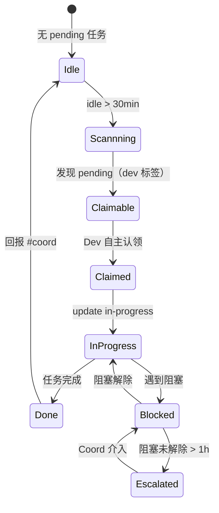
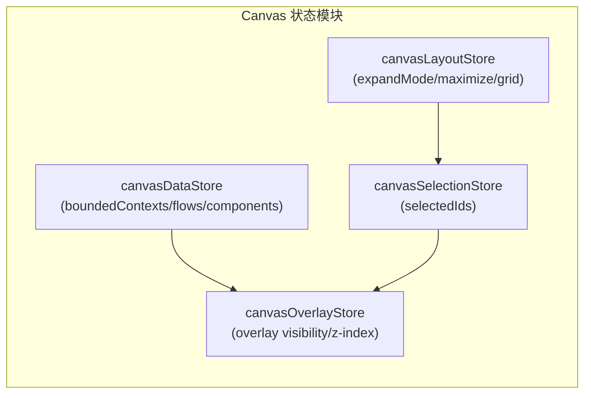

# IMPLEMENTATION_PLAN — Agent 流程与质量改进（晚间提案）

**项目**: agent-proposals-20260329-evening
**Architect**: 架构设计
**总工时**: ~9d
**最后更新**: 2026-03-29

---

## Epic 概览

| Epic | 内容 | 工时 | 负责 |
|------|------|------|------|
| Epic 1 | 提案执行追踪闭环 | ~3d | dev+analyst+pm |
| Epic 2 | Dev 自主性提升 | ~1d | coord+dev+reviewer |
| Epic 3 | Canvas 状态与质量 | ~5d | dev+tester |

---

## Epic 1: 提案执行追踪闭环

### E1.1: proposal_tracker.py 自动化脚本

**任务卡**:
```
任务: E1.1 proposal_tracker.py
文件: scripts/proposal_tracker.py
负责人: dev
工时: 2h
验收: 执行 < 10s，追踪准确率 > 95%
```

**步骤**:
1. 扫描 `proposals/` 下所有日期目录，解析 `summary.md`
2. 查询 task_manager 任务状态，构建状态映射
3. 生成 `proposals/EXECUTION_TRACKER.json` + `.md`
4. 接入 cronjob，每日自动运行

**检查清单**:
- [ ] `proposal_tracker.py run_time < 10s`
- [ ] `EXECUTION_TRACKER.json` + `.md` 存在
- [ ] 状态与 task_manager 一致性 > 95%
- [ ] cronjob 每日自动运行

---

### E1.2: Sprint 速度基线建立

**任务卡**:
```
任务: E1.2 Sprint 速度基线
文件: vibex/SPRINT_BASELINE.md
负责人: analyst
工时: 1d
验收: 覆盖 5 种类型，10+ 历史项目校准，估算误差 < 30%
```

**步骤**:
1. 收集 10+ 历史项目数据
2. 按类型分类建立基线模板
3. 新估算误差率验证 < 30%

---

### E1.3: Epic 规模标准化落地追踪

**任务卡**:
```
任务: E1.3 Epic 规模标准化
文件: AGENTS.md（Architect veto 机制）
负责人: architect
工时: 0.5d（规范设计）
验收: 平均 Epic 规模 ≤ 8 功能点，超大 Epic 打回率 > 0
```

**架构设计 — Epic 规模否决机制**:
```python
# AGENTS.md Architect veto 检查清单
EPIC_SCALE_RULES = {
    "standard":  (3, 8),   # ✅ 直接进入 phase2
    "large":     (9, 15),  # ⚠️ 必须拆分 sub-Epic
    "oversized": (16, 999) # 🔴 强制拆分 + Coord 审批
}

def check_epic_scale(epic_feature_count):
    if epic_feature_count > 15:
        return "reject"  # Architect veto
    elif epic_feature_count > 8:
        return "split_required"
    else:
        return "approved"
```

---

### E1.4: Sprint 回顾机制

**任务卡**:
```
任务: E1.4 Sprint 回顾机制
文件: vibex/docs/SPRINT_RETRO_TEMPLATE.md
负责人: pm
工时: 1d
验收: 每 5 个项目自动触发，识别 ≥ 2 跨项目模式
```

---

## Epic 2: Dev 自主性提升

### E2.1: Dev 自主认领规范

**架构设计 — 状态机**:


**关键架构决策**:
- Dev idle 检测：task_manager.py 加 `--idle-since` 选项
- 回报机制：完成时自动发送 Slack 到 #coord
- 禁止事项：不得跳过 phase1，不得认领非 dev 标签任务

---

### E2.2: Code Review 报告可执行性

**Review 报告模板**:
```markdown
## Code Review Report — [PR Title]

### 🔴 P0 阻断级
| # | 问题 | 文件 | 修复时间 | 状态 |
|---|------|------|---------|------|
| P0-1 | ... | ... | 0.5h | ⬜ |

### 🟠 P1 建议级
| # | 问题 | 文件 | 修复时间 | 状态 |
|---|------|------|---------|------|
| P1-1 | ... | ... | 1h | ⬜ |

### 🟡 P2 可选级
| # | 问题 | 文件 | 建议 |
|---|------|------|------|
| P2-1 | ... | ... | 可选 |
```

---

## Epic 3: Canvas 状态与质量

### E3.1: canvasStore 状态分层

**架构设计 — 4 模块划分**:


**文件结构**:
```
src/stores/
├── canvasLayoutStore.ts      # ~80 行
├── canvasDataStore.ts        # ~150 行
├── canvasSelectionStore.ts   # ~60 行
├── canvasOverlayStore.ts     # ~50 行
└── canvasStore.ts            # 入口（向后兼容 alias，~20 行）
```

**向后兼容策略**:
```typescript
// canvasStore.ts — 向后兼容 alias
import { create } from 'zustand';
import { canvasLayoutStore } from './canvasLayoutStore';
import { canvasDataStore } from './canvasDataStore';

// 向后兼容：所有既有 useCanvasStore() 调用无需修改
export const useCanvasStore = create(
  (...a) => ({
    ...canvasLayoutStore(...a),
    ...canvasDataStore(...a),
  })
);
```

---

### E3.2: Canvas E2E 测试覆盖率

**Playwright 测试用例**:
```typescript
// e2e/canvas-fullscreen.spec.ts
test('全屏展开 expand-both 三栏等宽', async ({ page }) => {
  await page.goto('/canvas');
  await page.click('button:has-text("全屏展开")');
  const cols = await page.locator('.canvas-grid > *').count();
  expect(cols).toBe(3);
});

test('SVG overlay pointer-events: none 不阻挡交互', async ({ page }) => {
  await page.goto('/canvas');
  const overlay = page.locator('.bounded-edge-layer');
  if (await overlay.count() > 0) {
    const pointerEvents = await overlay.evaluate(el => window.getComputedStyle(el).pointerEvents);
    expect(pointerEvents).toBe('none');
  }
});

test('全屏 maximize 工具栏隐藏', async ({ page }) => {
  await page.goto('/canvas');
  await page.keyboard.press('F11');
  const toolbar = page.locator('.toolbar');
  const visibility = await toolbar.evaluate(el => window.getComputedStyle(el).visibility);
  expect(visibility).toBe('hidden');
});
```

---

### E3.3: SVG Overlay 性能基线

**性能测试用例**:
```typescript
// performance/canvas-overlay-perf.spec.ts
test('20 BC 节点渲染 < 100ms', async ({ page }) => {
  await page.goto('/canvas');
  await page.evaluate(() => {
    // 注入 20 个 mock BC 节点
    window.__TEST__ = { nodeCount: 20 };
  });
  const start = performance.now();
  await page.reload();
  await page.waitForSelector('.bounded-group');
  const duration = performance.now() - start;
  expect(duration).toBeLessThan(100);
});

test('50 BC 节点 FPS ≥ 30', async ({ page }) => {
  await page.goto('/canvas');
  await page.evaluate(() => {
    window.__TEST__ = { nodeCount: 50 };
  });
  // 模拟滚动触发重绘
  const fps = await page.evaluate(() => measureFPS());
  expect(fps).toBeGreaterThanOrEqual(30);
});
```

---

### E3.4: dedup 生产验证

**延续 morning session E1.4 任务**，在真实历史提案数据上验证。

---

## 依赖关系

```
E1.1 (proposal_tracker) — 最优先，解锁提案追踪自动化
├── E1.2 (Sprint 基线) — 独立
├── E1.3 (Epic 规模) — 独立
└── E1.4 (Sprint 回顾) — 独立

E2.1 (Dev 自主认领) — 依赖 E1.3 Epic 规模规范
└── E2.2 (Review 报告) — 独立

E3.1 (canvasStore 分层) — 独立，但依赖 canvas-phase2 成果
├── E3.2 (E2E 测试) — 依赖 E3.1 完成
├── E3.3 (性能基线) — 依赖 E3.2 完成
└── E3.4 (dedup 验证) — 独立
```

---

## 风险缓解

| 风险 | 影响 | 缓解 |
|------|------|------|
| proposal_tracker 与 task_manager 状态不一致 | 高 | 状态映射算法需充分测试，准确率 > 95% |
| canvasStore 重构破坏向后兼容 | 高 | 所有既有 useCanvasStore() 调用必须有向后兼容测试 |
| Dev 自主认领规范难以推广 | 中 | 从 canvas-phase2 项目开始试点，验证后再推广 |

---

*Architect Agent | 2026-03-29 21:15 GMT+8*
