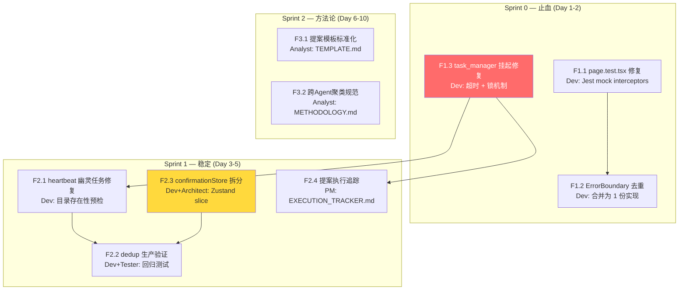
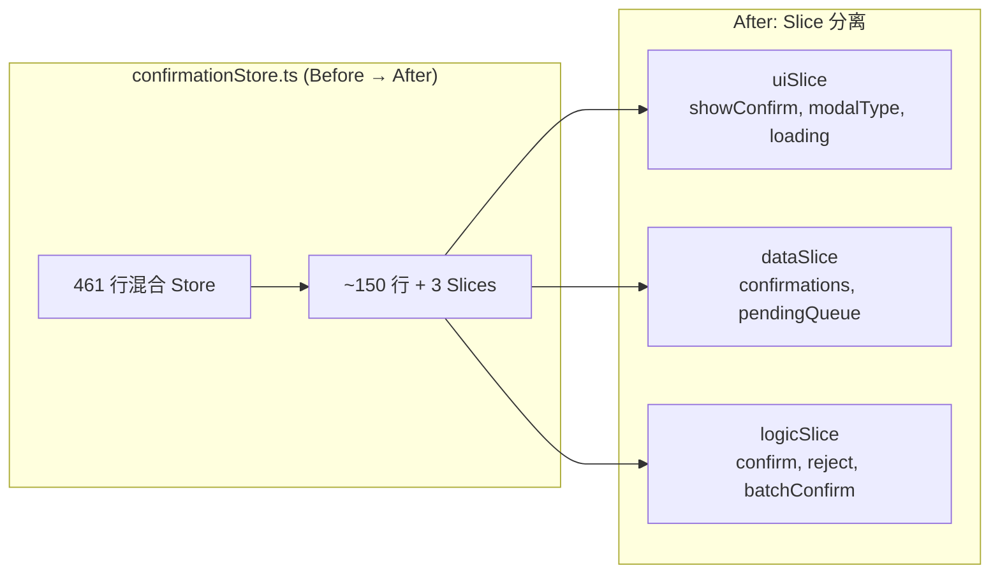

# ADR-051: VibeX Agent 提案汇总 — 架构决策记录

**状态**: Proposed  
**日期**: 2026-03-29  
**角色**: Architect

---

## Context

VibeX AI Agent 团队在 2026-03-29 的提案汇总中，识别出 5 项 P0-P1 技术债务需要在本周 Sprint 内落地。本 ADR 记录 Sprint 0 + Sprint 1 的技术架构决策。

### 关键问题

1. **task_manager 挂起**：阻塞所有 Agent 任务管理，必须优先修复
2. **confirmationStore.ts 461 行**：违反单一职责，需要 Zustand slice 重构
3. **heartbeat 幽灵任务误报**：脚本读取不存在目录仍报告 pending
4. **提案执行追踪缺失**：21 条提案无追踪机制，提案流于形式

---

## Decision

### Tech Stack

| 技术 | 版本 | 决策理由 |
|------|------|---------|
| Zustand | v4 (existing) | confirmationStore 已有，v4 slice pattern 重构 |
| Python 3 | (existing) | task_manager.py 已用 Python，无迁移必要 |
| Bash | (existing) | heartbeat.sh / proposer-dedup.sh 已用 Bash |
| Vitest | v1.x (existing) | 项目已有测试框架 |

### 架构图



---

## 技术方案详述

### F1.3 — task_manager 挂起修复

**根因分析**：task_manager.py 可能存在：
- 文件锁未释放（并发写入 coord-state.json）
- 无超时保护的网络调用
- 循环引用阻塞

**修复方案**：
```
修复点1: 文件锁
- 使用 fcntl.flock() 或 Python filelock 库
- 超时 5s 后自动放弃锁并重试 2 次

修复点2: 命令超时
- 所有 subprocess 调用添加 timeout=3 参数
- 超时则 kill 进程并报告错误

修复点3: 状态一致性
- coord-state.json 每次写入前先写临时文件再 rename（原子操作）
```

**关键代码**：
```python
import filelock
with filelock.FileLock("/tmp/task_manager.lock", timeout=5):
    # 所有写操作在锁内
    pass
```

**验收标准**：
- `python3 task_manager.py health` 响应 < 3s
- 并发 3 个实例同时执行无数据损坏
- 无 timeout 错误输出

---

### F2.3 — confirmationStore 拆分重构

**现状**：
- 文件: `src/stores/confirmationStore.ts` — 461 行
- 问题: 单一职责违反，类型混杂，action 过长

**重构方案**: Zustand v4 Slice Pattern



**文件结构**：
```
src/stores/
├── confirmationStore.ts          # 主文件（入口，约 30 行）
├── slices/
│   ├── uiSlice.ts                # ~40 行
│   ├── dataSlice.ts              # ~50 行
│   └── logicSlice.ts             # ~30 行
└── confirmationStore.test.ts     # 单元测试
```

**Slice 接口定义**：

```typescript
// uiSlice.ts
export interface UiState {
  showConfirm: boolean;
  modalType: 'default' | 'danger' | 'info';
  loading: boolean;
}
export interface UiActions {
  openConfirm: (type: UiState['modalType']) => void;
  closeConfirm: () => void;
  setLoading: (v: boolean) => void;
}

// dataSlice.ts
export interface ConfirmationItem {
  id: string;
  type: string;
  payload: unknown;
  createdAt: number;
}
export interface DataState {
  items: Record<string, ConfirmationItem>;
  pendingQueue: string[];
}

// logicSlice.ts — 核心业务逻辑
export interface LogicActions {
  confirm: (id: string) => Promise<void>;
  reject: (id: string) => Promise<void>;
  batchConfirm: (ids: string[]) => Promise<void>;
}
```

**向后兼容策略**：
```typescript
// confirmationStore.ts — 对外暴露统一 API，兼容所有已有调用
import { create } from 'zustand';
import { devtools } from 'zustand/middleware';
import { uiSlice } from './slices/uiSlice';
import { dataSlice } from './slices/dataSlice';
import { logicSlice } from './slices/logicSlice';

export const useConfirmationStore = create<
  UiState & DataState & UiActions & LogicActions
>()(
  devtools(
    (...a) => ({
      ...uiSlice(...a),
      ...dataSlice(...a),
      ...logicSlice(...a),
    }),
    { name: 'confirmationStore' }
  )
);
```

**风险缓解**：
- 全量测试覆盖重构前后的行为一致性
- 灰度：先用 feature flag 切换，确认无误后删除旧代码
- 保留旧接口作为 alias（3 周后删除）

**验收标准**：
- `confirmationStore.ts` 总行数 ≤ 200
- 所有 `useConfirmationStore()` 调用点无需修改
- `vitest run src/stores/confirmationStore` PASS

---

### F2.1 — heartbeat 幽灵任务误报修复

**根因**：heartbeat 脚本在扫描 `projects/` 目录时，未验证目录是否存在就报告 pending。

**修复方案**：
```bash
# 伪代码
for task_file in $(find projects/ -name "*.json" 2>/dev/null); do
    dir=$(dirname "$task_file")
    if [ -d "$dir" ]; then
        # 正常报告
        echo "$(basename $dir): pending"
    else
        # 跳过幽灵任务
        continue
    fi
done
```

**验收标准**：
- `openclaw heartbeat` 无"幽灵任务"报告
- 不存在目录的任务不被计入 pending 数量

---

### F2.4 — 提案执行追踪机制

**方案**: Markdown 表格 + 自动化脚本

```
proposals/EXECUTION_TRACKER.md
├── P0-P1 提案状态表
├── 每条记录: ID / 标题 / 负责人 / 状态 / 预计工时 / 实际工时 / 更新时间
└── 自动更新脚本: scripts/update-tracker.sh (可选)
```

**状态枚举**: `待领取 | 进行中 | 已完成 | 已取消 | 阻塞`

---

## Data Model

| 实体 | 字段 | 说明 |
|------|------|------|
| ConfirmationItem | id, type, payload, createdAt | 确认项 |
| UiState | showConfirm, modalType, loading | UI 状态 |
| ProposalRecord | id, title, owner, status, estimate, actual, updated | 提案追踪 |
| TaskState | project, task, status, assigned_to | 任务状态 |

---

## Testing Strategy

| 测试类型 | 框架 | 覆盖率要求 | 核心用例 |
|---------|------|-----------|---------|
| 单元测试 | Vitest | > 80% | confirmationStore slices 行为一致 |
| 集成测试 | Vitest | 100% | task_manager health, claim, update |
| E2E | Playwright | — | heartbeat 无幽灵任务 |
| 回归测试 | — | 全部历史提案 | dedup 无漏报/误报 |

**核心测试用例示例**：
```typescript
// confirmationStore.test.ts
describe('confirmationStore slices', () => {
  it('confirm() should resolve and remove item from queue', async () => {
    const store = useConfirmationStore.getState();
    await store.confirm('test-id');
    expect(store.items['test-id']).toBeUndefined();
  });

  it('backward compatibility: useConfirmationStore() same as before', () => {
    const result = useConfirmationStore();
    expect(result).toHaveProperty('showConfirm');
    expect(result).toHaveProperty('confirm');
  });
});
```

---

## Consequences

### Positive
- Sprint 0 止血完成，CI 可信度恢复
- confirmationStore 重构为可维护状态
- 提案执行追踪机制建立，避免提案流于形式

### Negative
- confirmationStore 重构有破坏风险，需要充分测试
- Dev 是瓶颈：5 项 P0-P1 全由 dev 负责，可能延期

### Trade-offs
- **选择 Zustand slice 而非抽离独立 store**：保留现有 API，向后兼容，改动风险低
- **选择 Markdown 而非数据库**：轻量，无需额外基础设施，符合现有工作流

---

*Architect Agent | 2026-03-29 17:20 GMT+8*
