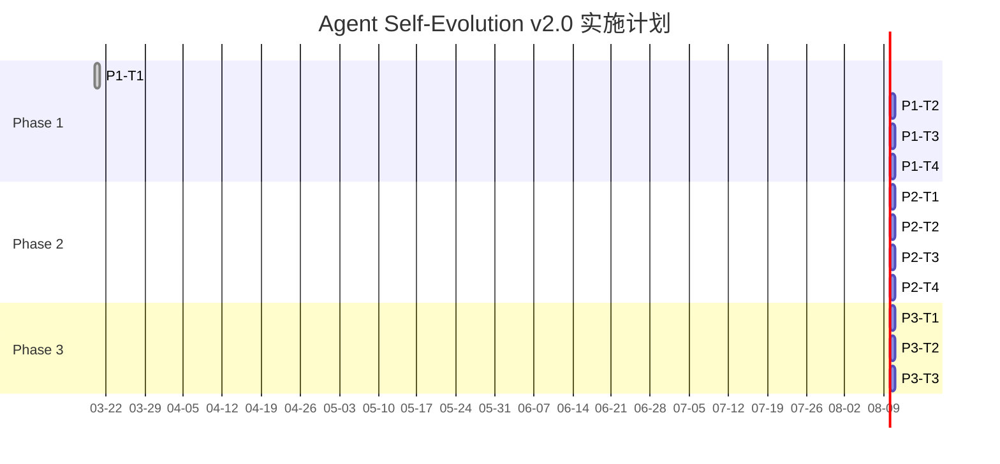

# 实施计划: Agent 每日自检系统 v2.0

> **项目**: agent-self-evolution-YYYYMMDD
> **版本**: 1.0
> **日期**: 2026-03-20
> **基于**: PRD + architecture.md + specs/*

---

## 实施概览

| 维度 | 内容 |
|------|------|
| **总工期** | 7 天（分 3 个 Phase） |
| **Phase 1** | D+1: 模板标准化 + 基础设施 |
| **Phase 2** | D+3: 闭环追踪 + 提案汇总 |
| **Phase 3** | D+7: 效果追踪 + 报告生成 |

---

## Phase 1: 模板标准化 + 基础设施

### 目标
建立标准化提案模板和各 Agent 自检任务模板，消除格式不一致问题。

### 任务列表

#### Task: P1-T1 - 创建标准化提案模板

| 字段 | 值 |
|------|-----|
| **Spec 映射** | F5.1, F5.2, F5.3 |
| **Epic** | Epic 1: 每日自检任务执行 |
| **执行者** | Architect |
| **工作目录** | `/root/.openclaw/vibex` |

**任务描述**:
1. 创建 `docs/templates/proposal-template.md`
2. 包含所有必需字段：问题描述、现状分析、建议方案、优先级、工作量估算、验收标准
3. 提供完整的示例提案
4. 链接到模板文件

**验收标准 (AC21, AC22)**:
```bash
# 验收命令
test -f docs/templates/proposal-template.md && \
grep -q "问题描述" docs/templates/proposal-template.md && \
grep -q "现状分析" docs/templates/proposal-template.md && \
grep -q "建议方案" docs/templates/proposal-template.md && \
grep -q "优先级" docs/templates/proposal-template.md && \
grep -q "工作量估算" docs/templates/proposal-template.md && \
grep -q "验收标准" docs/templates/proposal-template.md && \
grep -q "## 示例" docs/templates/proposal-template.md
```

---

#### Task: P1-T2 - 更新 HEARTBEAT.md 添加提案格式要求

| 字段 | 值 |
|------|-----|
| **Spec 映射** | F1.6, F5.4 |
| **Epic** | Epic 1: 每日自检任务执行 |
| **执行者** | Architect + Coord |

**任务描述**:
1. 在各 Agent 的 HEARTBEAT.md 中添加提案格式说明
2. 添加"提案格式不达标 → Slack 提醒"规则
3. 说明提案文件命名规范：`[agent]-proposals.md`

**验收标准**:
```bash
# 验收命令
grep -q "proposals/" HEARTBEAT.md && \
grep -q "提案格式" HEARTBEAT.md
```

---

#### Task: P1-T3 - 实现 Coord 双重唤醒机制

| 字段 | 值 |
|------|-----|
| **Spec 映射** | F1.5, F1.2 |
| **Epic** | Epic 1: 每日自检任务执行 |
| **执行者** | Coord |

**任务描述**:
1. 在 `coord-heartbeat.sh` 中增加遗漏检测逻辑
2. D+0 06:00 UTC 检测 → 第一次唤醒
3. D+0 08:00 UTC 检测 → 最终唤醒
4. 唤醒方式：Slack 消息 + sessions_send 同时发送

**验收标准 (AC5)**:
```bash
# 验收：检查唤醒逻辑存在
grep -q "双重唤醒" coord-heartbeat.sh || \
grep -q "sessions_send" coord-heartbeat.sh
```

---

#### Task: P1-T4 - 创建标准化的自检任务模板

| 字段 | 值 |
|------|-----|
| **Spec 映射** | F1.3, F1.7 |
| **Epic** | Epic 1: 每日自检任务执行 |
| **执行者** | Coord |

**任务描述**:
1. 在 `team-tasks/` 目录下建立自检任务模板
2. 6 个 Agent 自检任务使用统一模板结构
3. 任务输出路径规范：`proposals/{date}/[agent]-proposals.md`

**验收标准 (AC3, AC4)**:
```bash
# 验收：验证任务创建后提案目录结构正确
ls proposals/$(date +%Y%m%d)/dev-proposals.md 2>/dev/null && \
ls proposals/$(date +%Y%m%d)/architect-proposals.md 2>/dev/null
```

---

## Phase 2: 提案汇总与闭环追踪

### 目标
实现提案自动汇总、可行性评估、优先级排序和闭环追踪。

### 任务列表

#### Task: P2-T1 - 实现提案汇总 INDEX.md 自动生成

| 字段 | 值 |
|------|-----|
| **Spec 映射** | F2.1, F2.2, AC7 |
| **Epic** | Epic 2: 提案汇总与优先级排序 |
| **执行者** | Coord |

**任务描述**:
1. Coord 检测到所有 6 个提案文件存在后
2. 自动扫描 `proposals/{date}/` 目录
3. 生成 `INDEX.md`，包含：提案标题、提案人、优先级、文件链接
4. INDEX.md 格式：

```markdown
# 提案索引 - YYYYMMDD

| # | 提案标题 | 提案人 | 优先级 | 文件 |
|---|---------|--------|--------|------|
| 1 | xxx | dev | P0 | dev-proposals.md |
| 2 | xxx | architect | P1 | architect-proposals.md |
...
```

**验收标准 (AC7)**:
```bash
# 验收：INDEX.md 包含所有 6 个 Agent 的提案
test -f proposals/$(date +%Y%m%d)/INDEX.md && \
grep -q "dev" proposals/$(date +%Y%m%d)/INDEX.md && \
grep -q "architect" proposals/$(date +%Y%m%d)/INDEX.md && \
grep -q "P0" proposals/$(date +%Y%m%d)/INDEX.md
```

---

#### Task: P2-T2 - 实现 Analyst 可行性评估自动化

| 字段 | 值 |
|------|-----|
| **Spec 映射** | F2.3, F2.4, AC8 |
| **Epic** | Epic 2: 提案汇总与优先级排序 |
| **执行者** | Analyst |

**任务描述**:
1. Analyst 心跳领取 `analyst-feasibility` 任务
2. 读取所有 `*-proposals.md` 文件
3. 对每个提案输出可行性评估：
   - 技术可行性：高/中/低
   - 资源需求：少/中/多
   - 风险点：列出主要风险
4. 评估结果追加到 `proposals/{date}/feasibility-analysis.md`

**验收标准 (AC8, AC9)**:
```bash
# 验收
test -f proposals/$(date +%Y%m%d)/feasibility-analysis.md && \
grep -q "可行性" proposals/$(date +%Y%m%d)/feasibility-analysis.md
```

---

#### Task: P2-T3 - 实现 PM 路线图生成

| 字段 | 值 |
|------|-----|
| **Spec 映射** | F2.5, F2.6, AC9, AC10 |
| **Epic** | Epic 2: 提案汇总与优先级排序 |
| **执行者** | PM |

**任务描述**:
1. PM 读取 INDEX.md + feasibility-analysis.md
2. 确认 P0/P1/P2 优先级
3. 生成 `ROADMAP.md`，包含：
   - P0 提案（48h 内启动）
   - P1 提案（本周启动）
   - P2 提案（ backlog）
   - 资源估算

**验收标准 (AC9, AC10)**:
```bash
# 验收
test -f proposals/$(date +%Y%m%d)/ROADMAP.md && \
grep -q "P0" proposals/$(date +%Y%m%d)/ROADMAP.md && \
grep -q "P1" proposals/$(date +%Y%m%d)/ROADMAP.md
```

---

#### Task: P2-T4 - 实现提案来源字段和闭环追踪

| 字段 | 值 |
|------|-----|
| **Spec 映射** | F3.2, F3.5, F3.6, AC12, AC13, AC14 |
| **Epic** | Epic 3: 提案闭环执行 |
| **执行者** | PM + Coord |

**任务描述**:
1. team-tasks 新增项目时增加 `proposal_source` 字段
2. PM 创建 `vibex-proposal-[xxx]` 项目时记录来源
3. 实现提案状态追踪表：
   - `proposals/{date}/STATUS.md` — 记录每个提案状态
   - 状态：已闭环 / 执行中 / 已驳回

**验收标准 (AC12, AC13, AC14)**:
```bash
# 验收
test -f proposals/$(date +%Y%m%d)/STATUS.md && \
grep -q "已闭环" proposals/$(date +%Y%m%d)/STATUS.md || \
grep -q "执行中" proposals/$(date +%Y%m%d)/STATUS.md || \
grep -q "已驳回" proposals/$(date +%Y%m%d)/STATUS.md
```

---

## Phase 3: 效果追踪与报告生成

### 目标
量化自我进化机制的价值，生成统计报告和趋势分析。

### 任务列表

#### Task: P3-T1 - 实现批次 REPORT.md 自动生成

| 字段 | 值 |
|------|-----|
| **Spec 映射** | F4.1, F4.2, AC16, AC17 |
| **Epic** | Epic 4: 进化效果追踪 |
| **执行者** | Coord |

**任务描述**:
1. Coord 在批次完成后（D+1 12:00）自动生成 REPORT.md
2. REPORT.md 包含：
   - 统计数字：提案总数、质量达标率、转化率
   - Agent 状态表
   - 异常告警列表
   - 最近 7 天趋势

**验收标准 (AC16, AC17)**:
```bash
# 验收
test -f proposals/$(date +%Y%m%d)/REPORT.md && \
grep -q "提案总数" proposals/$(date +%Y%m%d)/REPORT.md && \
grep -q "质量达标率" proposals/$(date +%Y%m%d)/REPORT.md && \
grep -q "转化率" proposals/$(date +%Y%m%d)/REPORT.md
```

---

#### Task: P3-T2 - 实现异常检测和告警

| 字段 | 值 |
|------|-----|
| **Spec 映射** | F4.4, F4.5, AC18, AC19 |
| **Epic** | Epic 4: 进化效果追踪 |
| **执行者** | Coord |

**任务描述**:
1. 实现 3 种异常检测：
   - 单批次提案 < 3 个 → 告警
   - 单 Agent 连续 2 批无提案 → 告警
   - 转化率 < 20%（连续 3 批次）→ 告警
2. 告警冷却：同一告警 24h 不重复
3. 告警发送到 #coord 频道

**验收标准 (AC18, AC19)**:
```bash
# 验收：检查告警逻辑
grep -q "告警" coord-heartbeat.sh || \
test -f scripts/coord/alert-manager.sh
```

---

#### Task: P3-T3 - 实现 7 天趋势汇总

| 字段 | 值 |
|------|-----|
| **Spec 映射** | F4.3, AC20 |
| **Epic** | Epic 4: 进化效果追踪 |
| **执行者** | Coord |

**任务描述**:
1. 读取最近 7 天的 REPORT.md
2. 汇总趋势表格：

```markdown
## 7 天趋势

| 日期 | 提案总数 | 质量达标率 | 转化率 | 异常 |
|------|---------|-----------|--------|------|
| 03-13 | 8 | 75% | 50% | - |
| 03-14 | 6 | 83% | 33% | analyst 提案<3 |
...
```

**验收标准 (AC20)**:
```bash
# 验收：趋势表格存在
grep -q "7 天趋势" proposals/$(date +%Y%m%d)/REPORT.md || \
grep -q "趋势" proposals/$(date +%Y%m%d)/REPORT.md
```

---

## 实施依赖关系图



---

## 验收总览表

| ID | 验收标准 | 对应任务 | 验证命令 |
|----|---------|---------|---------|
| AC1 | Coord 03:15 UTC 前完成创建 | P1-T3 | cron 检查 |
| AC2 | 每 Agent 每天 ≥1 提案 | P1-T4 | `ls proposals/*/dev-proposals.md` |
| AC3 | 提案文件名符合规范 | P1-T4 | 同上 |
| AC4 | 所有提案在 08:00 前保存 | P1-T3 | 时间戳检查 |
| AC5 | 遗漏 Agent 收到双重唤醒 | P1-T3 | 通知日志检查 |
| AC6 | Coord 报告体现批次状态 | P1-T3 | 报告检查 |
| AC7 | INDEX.md 包含所有提案 | P2-T1 | 文件检查 |
| AC8 | 可行性评估覆盖 100% | P2-T2 | 覆盖率检查 |
| AC9 | ROADMAP.md 包含 P0/P1/P2 | P2-T3 | 内容检查 |
| AC10 | PM 确认后 Slack 通知 | P2-T3 | Slack 日志 |
| AC11 | P0 提案 48h 内启动 | P2-T4 | team-tasks 检查 |
| AC12 | 每个任务有 acceptCriteria | P2-T4 | team-tasks JSON |
| AC13 | 提案状态追踪表存在 | P2-T4 | `test -f STATUS.md` |
| AC14 | 驳回提案有理由 | P2-T4 | STATUS.md 内容 |
| AC15 | 转化率可从报告读取 | P3-T1 | REPORT.md |
| AC16 | REPORT.md 自动生成 | P3-T1 | 文件存在 |
| AC17 | REPORT.md 包含统计指标 | P3-T1 | 内容检查 |
| AC18 | 异常检测覆盖 3 种场景 | P3-T2 | 逻辑检查 |
| AC19 | 告警 1 小时内送达 | P3-T2 | Slack 时间戳 |
| AC20 | 可查询 7 天趋势 | P3-T3 | 趋势表格 |
| AC21 | 模板包含所有必需字段 | P1-T1 | 字段检查 |
| AC22 | 模板有示例 | P1-T1 | 示例存在 |
| AC23 | 格式不达标被识别 | P1-T2 | 校验逻辑 |
| AC24 | 格式达标率 >80% | P3-T1 | 统计计算 |

---

*Generated by: Architect Agent*
*Date: 2026-03-20*
