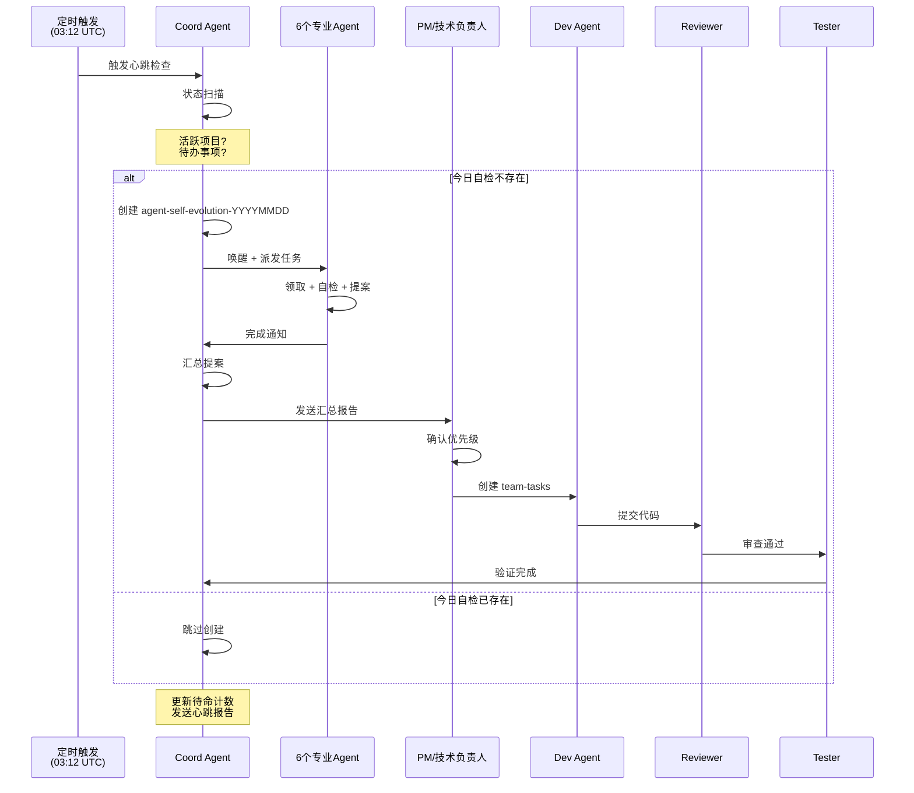
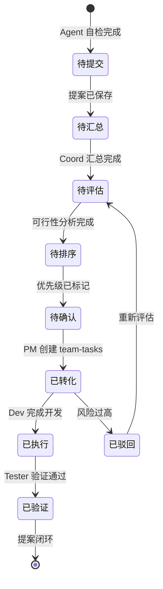

# Agent 每日自检系统 — 需求分析

> 为所有 Agent 创建每日自我总结任务，收集改进提案
> 日期: 2026-03-20 | 分析师: Analyst Agent
> 产出路径: `/root/.openclaw/vibex/docs/agent-self-evolution-20260320/analysis.md`

---

## 1. 项目背景与目标

### 1.1 项目起源

Agent 每日自检系统（`agent-self-evolution`）于 **2026-03-16** 首次创建，是 OpenClaw 多 Agent 协作框架的自我进化机制。系统在每天固定时间自动触发，驱动 6 个专业 Agent（dev, analyst, architect, pm, tester, reviewer）进行自我审视和改进提案收集。

**核心驱动**：
- Coord Agent 每天定时（03:12 UTC）扫描所有 Agent 心跳
- 发现"今日自检任务不存在"时，自动创建 `agent-self-evolution-YYYYMMDD` 项目
- 每个 Agent 领取自己的自检任务，产出改进提案
- Coord 汇总所有提案，协调执行

### 1.2 当前系统流程

```
每天 03:12 UTC
    │
    ▼
heartbeat-coord 触发
    │
    ├─ 状态扫描：活跃项目？待办事项？异常？
    │
    ├─ 决策派发：
    │   └─ "今日自检任务不存在" → 创建 agent-self-evolution-YYYYMMDD
    │       └─ 分配 6 个子任务（每个 Agent 1 个）
    │
    ├─ 协作通知：唤醒所有 Agent 领取任务
    │
    └─ 自我驱动：重置待命计数器
```

**已运行的日期批次**：
- `agent-self-evolution-20260316` ✅ 完成 6/6
- `agent-self-evolution-20260320` 🔄 进行中

### 1.3 项目目标

| 目标 | 描述 | 衡量指标 |
|------|------|----------|
| **自我审视** | 每个 Agent 每天审视自己的输出质量 | 提案数量/Agent |
| **问题识别** | 发现代码、流程、协作中的实际问题 | 问题数/批次 |
| **提案沉淀** | 将改进想法结构化存档 | 提案文档数 |
| **闭环执行** | 提案转化为具体开发任务 | 提案→任务转化率 |

### 1. 4 核心价值

> "没有自我反思的团队，进步是偶然的。"

- **Agent 层面**：每个 Agent 有固定机会审视自身工作，发现知识盲区
- **团队层面**：6 个视角汇聚，形成完整的改进全景图
- **系统层面**：自我进化不依赖外部推动，是自治系统的核心能力

---

## 2. 核心用户画像

### 2.1 Agent 角色定义

| Agent | 专业领域 | 每日自检关注点 |
|-------|----------|---------------|
| **Dev** | 前端/后端开发 | 代码质量、技术债、测试覆盖 |
| **Analyst** | 需求分析、产品研究 | 分析质量、需求完整性、洞察深度 |
| **Architect** | 系统架构、技术规划 | 架构合理性、扩展性、技术选型 |
| **PM** | 产品管理、用户价值 | 产品方向、优先级、用户体验 |
| **Tester** | 质量保障、测试策略 | 测试覆盖率、缺陷发现效率 |
| **Reviewer** | 代码审查、质量把关 | 审查效率、问题发现率 |

### 2.2 受益用户

| 用户类型 | 受益方式 |
|----------|----------|
| 开发团队 | 接收来自 6 个视角的改进建议，优先处理最高价值项 |
| 技术负责人 | 获取技术债全景图，制定迭代计划 |
| 产品负责人 | 获取用户/市场洞察，指导产品方向 |
| 外部协作者 | 提案文档可作为项目知识库存档 |

---

## 3. 核心 Jobs-To-Be-Done (JTBD)

### JTBD 1: 每日 Agent 自检

> **作为一个 Agent，我希望每天自动执行一次自我审视，以便发现自己的改进空间。**

**触发条件**：Coord 心跳检测到"今日自检任务不存在"

**执行步骤**：
1. 领取 `analyze-requirements` 自检任务
2. 审视当日工作产出（代码、文档、提案）
3. 识别问题或改进点
4. 产出结构化改进提案
5. 更新任务状态为 done

**验收标准**：
- [ ] 每天至少产出 1 个有效改进提案
- [ ] 提案包含问题描述、建议方案、优先级
- [ ] 提案保存到 `proposals/YYYYMMDD/[agent]-proposals.md`
- [ ] 阶段任务文件记录执行过程

**技术风险**：
- 提案质量参差不齐（解决方案：提供提案模板）
- Agent 自我评价可能不客观（解决方案：Reviewer 交叉审查）

---

### JTBD 2: 提案自动汇总

> **作为一个协调者，我希望所有 Agent 提案自动汇总到统一目录，以便快速浏览和决策。**

**触发条件**：所有 Agent 完成自检任务

**执行步骤**：
1. Coord 检测到所有提案已产出
2. 自动汇总到 `proposals/YYYYMMDD/` 目录
3. 生成提案索引文件
4. 生成可行性分析报告（如有 Analyst 参与）
5. 通知决策者（PM/技术负责人）

**验收标准**：
- [ ] 提案文件命名规范：`[agent]-proposals.md`
- [ ] 汇总索引包含所有提案的标题和优先级
- [ ] 可行性分析覆盖所有提案
- [ ] 汇总结果通过 Slack 通知

**技术风险**：
- 并行提案写入冲突（解决方案：按 Agent 分目录）
- 提案格式不一致（解决方案：提供标准模板）

---

### JTBD 3: 提案优先级排序

> **作为一个决策者，我希望看到提案的优先级排序，以便决定先做什么。**

**触发条件**：可行性分析完成

**执行步骤**：
1. Analyst 对所有提案进行可行性评估
2. 按 P0/P1/P2 分级
3. 考虑依赖关系和资源约束
4. 输出 Sprint 路线图建议
5. PM/技术负责人确认优先级

**验收标准**：
- [ ] 每个提案有 P0/P1/P2 标记
- [ ] 提案按综合评分排序
- [ ] 标注提案间的依赖关系
- [ ] 提供资源估算

**技术风险**：
- 评分主观性强（解决方案：多维度客观评分）
- 提案相互依赖导致排序困难（解决方案：依赖关系可视化）

---

### JTBD 4: 提案转化为开发任务

> **作为一个开发者，我希望提案能转化为具体的开发任务，以便直接执行。**

**触发条件**：决策者确认优先级

**执行步骤**：
1. PM 将高优先级提案拆解为具体任务
2. 创建对应的 team-tasks 项目
3. 分配给相应的 Agent 执行
4. Reviewer 审查产出
5. Tester 验证完成

**验收标准**：
- [ ] P0 提案 48 小时内转化为 team-tasks
- [ ] 每个任务有明确的验收标准
- [ ] 任务状态可追踪
- [ ] 完成后有回执通知

**技术风险**：
- 提案粒度不一致（解决方案：提供提案模板）
- 执行者与提案者脱节（解决方案：提案者参与评审）

---

### JTBD 5: 自我进化效果追踪

> **作为一个系统管理者，我希望追踪自我进化效果，以便评估系统健康度。**

**触发条件**：每个批次完成后

**执行步骤**：
1. 统计本批次提案总数和完成率
2. 对比历史批次（提案数量、质量趋势）
3. 追踪提案→任务→完成的全链路转化率
4. 生成进化报告
5. 识别系统性问题（如某 Agent 长期无提案）

**验收标准**：
- [ ] 每批次有完整的统计报告
- [ ] 追踪历史趋势（至少 7 天）
- [ ] 发现异常（如连续无提案）自动告警
- [ ] 报告保存到知识库

**技术风险**：
- 数据收集不完整（解决方案：标准化任务文件）
- 效果归因困难（解决方案：明确因果链）

---

## 4. 核心业务流程

### 4.1 每日自检完整流程



### 4.2 提案生命周期



---

## 5. 技术可行性评估

### 5.1 当前技术栈

| 组件 | 技术 | 说明 |
|------|------|------|
| 任务管理 | team-tasks (JSON) | 共享任务文件，状态追踪 |
| 心跳机制 | heartbeat scripts | 定时扫描，任务派发 |
| 协作通信 | Slack | 频道通知，@唤醒 |
| 提案存储 | Markdown 文件 | 人类可读，版本控制 |
| 知识库 | docs/ 目录 | 存档分析报告 |

### 5.2 架构评估

| 维度 | 当前状态 | 评估 |
|------|----------|------|
| **自动化程度** | 定时触发 + 任务派发 | ✅ 成熟 |
| **跨 Agent 协作** | Slack 通知 + sessions_send | ✅ 可用 |
| **提案管理** | Markdown 文件 | ⚠️ 缺乏结构化 |
| **效果追踪** | 手动统计 | ❌ 缺失 |
| **提案质量控制** | 无 | ❌ 缺失 |
| **依赖关系管理** | 无 | ❌ 缺失 |

### 5.3 改进机会

| 改进项 | 优先级 | 工作量 | 说明 |
|--------|--------|--------|------|
| 提案模板标准化 | P1 | 1天 | 统一格式，便于汇总 |
| 提案质量评分 | P1 | 1天 | 自动评估提案完整性 |
| 效果追踪 Dashboard | P2 | 2天 | 可视化进化趋势 |
| 提案依赖关系图 | P2 | 1天 | 辅助优先级决策 |
| 提案→任务自动转化 | P3 | 3天 | 高阶功能 |
| AI 驱动的提案摘要 | P3 | 2天 | 自动生成摘要 |

---

## 6. 技术风险点

| 风险 | 等级 | 缓解措施 |
|------|------|----------|
| Agent 自检流于形式 | 🟡 中 | 提供检查清单，Reviewer 交叉验证 |
| 提案质量参差不齐 | 🟡 中 | 提供模板，PM 评审 |
| 提案过多难以处理 | 🟡 中 | 优先级排序，限制单批次数量 |
| Coord 单点依赖 | 🟢 低 | 心跳超时兜底机制 |
| Slack 通知丢失 | 🟢 低 | 双重通知（心跳 + sessions_send） |
| 提案长期无人执行 | 🟡 中 | 自动创建 team-tasks 并跟踪 |

---

## 7. 验收标准

### 7.1 基础验收（必须满足）

- [ ] Coord 每天 03:12 UTC 自动创建自检任务
- [ ] 每个 Agent 领取并完成自检任务
- [ ] 提案保存到 `proposals/YYYYMMDD/` 目录
- [ ] Coord 发送每日汇总报告到 Slack

### 7.2 进阶验收（目标状态）

- [ ] 每个提案包含：问题描述、建议方案、优先级、工作量估算
- [ ] 可行性分析覆盖所有提案
- [ ] 提案→任务转化率 > 50%
- [ ] 追踪历史趋势（至少 7 天）
- [ ] 单批次提案数量稳定在 5-15 个

### 7.3 卓越验收（长期目标）

- [ ] 提案质量自动评分
- [ ] 进化效果 Dashboard 可视化
- [ ] 提案按依赖关系自动排序
- [ ] P0 提案 48 小时内开始执行
- [ ] 跨批次的模式识别（如"连续 3 次提到同一问题"）

---

## 8. 实现方案建议

### 8.1 Phase 1: 标准化（1天）

```
1. 制定提案模板（Markdown）
   ├── 问题描述
   ├── 现状分析
   ├── 建议方案
   ├── 优先级 (P0/P1/P2)
   ├── 工作量估算
   └── 验收标准

2. 制定自检清单
   ├── 代码/产出物审视
   ├── 问题识别
   ├── 改进提案
   └── 风险预警
```

### 8.2 Phase 2: 可视化（2天）

```
1. 提案汇总索引自动生成
2. 优先级排序自动化
3. Slack 通知增强（摘要 + 链接）
4. 基础统计报告（提案数、质量评分）
```

### 8.3 Phase 3: 闭环（3天）

```
1. 提案→team-tasks 自动创建
2. 任务状态追踪
3. 完成回执通知
4. 效果归因分析
```

---

## 9. 结论

**可行性总评**：✅ **可行（当前系统已运行）**

**当前成熟度**：
- 基础流程：✅ 运行中
- 提案质量：⚠️ 参差不齐
- 效果追踪：❌ 缺失
- 闭环执行：⚠️ 部分

**改进优先级**：
1. **提案模板标准化**（P1）— 立即可做，收益明显
2. **自检清单规范化**（P1）— 提升自检质量
3. **效果追踪 Dashboard**（P2）— 可视化进化趋势

**下一步行动**：
1. PM 确认提案模板 → 落地执行
2. Analyst 制定自检清单 → 下批次应用
3. Coord 增加统计报告 → 自动追踪

---

*Generated by: Analyst Agent*
*Date: 2026-03-20*
*项目路径: /root/.openclaw/vibex/docs/agent-self-evolution-20260320/*
