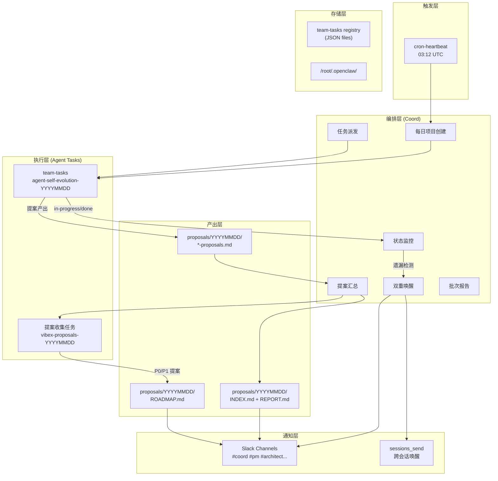

# 架构设计: Agent 每日自检系统 v2.0

> **项目**: agent-self-evolution-YYYYMMDD
> **架构师**: Architect Agent
> **版本**: 1.0
> **日期**: 2026-03-20

---

## 1. 架构总览

### 1.1 系统定位

Agent 每日自检系统是一个**跨 Agent 的流程编排系统**，不负责具体业务逻辑，而是协调多个 Agent（dev/analyst/architect/pm/tester/reviewer）按统一节奏完成自检、提案、评审、闭环的全流程。

### 1.2 核心设计原则

| 原则 | 说明 |
|------|------|
| **去中心化** | 每个 Agent 自主执行，Coord 只负责编排和兜底唤醒 |
| **事件驱动** | 通过 team-tasks 状态变更驱动下游流程 |
| **可追溯** | 每个提案都有来源、状态、闭环的完整链路 |
| **无状态协调** | Coord 不持有状态，只读取 team-tasks 和文件系统 |

### 1.3 整体架构图



---

## 2. 模块划分与职责

### 2.1 模块列表

| 模块 | 职责 | 负责人 |
|------|------|--------|
| `coord/heartbeat` | 定时触发、创建项目、派发任务 | Coord |
| `coord/wake-manager` | 检测遗漏 Agent、双重唤醒 | Coord |
| `coord/aggregator` | 汇总提案、生成 INDEX/REPORT | Coord |
| `team-tasks` | 任务注册、状态管理 | 共享基础设施 |
| `agent/proposals` | 各 Agent 产出提案 | dev/analyst/architect/pm/tester/reviewer |
| `agent/heartbeat` | Agent 心跳领取任务、执行自检 | 各 Agent |
| `slack/notifier` | 发送通知到各频道 | Coord |

### 2.2 数据流

```
cron@03:12 UTC
    ↓
Coord 心跳脚本
    ↓
检查 agent-self-evolution-{today} 是否存在
    ├─ 不存在 → 创建项目 + 6个自检任务 + 提案汇总任务
    └─ 存在 → 检查遗漏 → 唤醒
    ↓
各 Agent 心跳
    ↓
Agent 领取并执行任务
    ↓
提案保存到 proposals/{today}/-proposals.md
    ↓
team-tasks 状态更新为 done
    ↓
Coord 检测到所有提案完成
    ↓
生成 INDEX.md + analyst 评估 + PM 路线图
    ↓
生成 REPORT.md (统计报告)
    ↓
Slack 通知 → 高优先级提案进入 team-tasks 开发
```

---

## 3. 核心接口定义

### 3.1 team-tasks JSON Schema

**自检项目** (`agent-self-evolution-YYYYMMDD.json`):

```typescript
interface SelfEvolutionProject {
  project: string           // "agent-self-evolution-YYYYMMDD"
  goal: string              // "为所有 agent 创建每日自我总结任务，收集改进提案"
  created: string            // ISO timestamp
  status: "active" | "completed"
  mode: "dag"               // 有依赖关系
  stages: Record<string, Stage>
}

interface Stage {
  agent: "dev" | "analyst" | "architect" | "pm" | "tester" | "reviewer" | "coord"
  status: "pending" | "in-progress" | "done" | "failed" | "skipped"
  task: string              // 任务描述（Markdown）
  startedAt: string | null
  completedAt: string | null
  output: string            // 产物路径
  dependsOn: string[]       // 依赖的任务ID
  constraints: string[]     // 约束条件
  verification?: {
    command: string          // 验收命令
  }
}
```

**提案汇总项目** (`vibex-proposals-YYYYMMDD.json`):

```typescript
interface ProposalsProject {
  project: string
  goal: string
  status: "active" | "completed"
  mode: "dag"
  stages: Record<string, Stage>
  // 特殊字段
  metadata: {
    batchId: string         // "YYYYMMDD"
    agents: string[]        // 参与提案的 Agent 列表
    proposalDir: string     // "proposals/YYYYMMDD/"
  }
}
```

### 3.2 提案文件 Schema

**`proposals/YYYYMMDD/[agent]-proposals.md`**:

```typescript
interface ProposalDocument {
  agent: string
  date: string
  proposals: Array<{
    id: string              // "ARCH-001"
    title: string
    priority: "P0" | "P1" | "P2"
    problem: string         // 问题描述
    currentState: string    // 现状分析
    solutions: string[]     // 建议方案
    effort: "small" | "medium" | "large"  // 工作量
    acceptance: string     // 验收标准
    relatedFiles?: string[] // 相关文档/代码
    feasibility?: string   // 可行性评估（由 Analyst 填写）
    decision?: string       // 决策结果（PM 填写）
  }>
  selfCheck?: {
    qualityScore: number    // 1-10
    issuesFound: string[]
  }
}
```

### 3.3 报告文件 Schema

**`proposals/YYYYMMDD/REPORT.md`**:

```typescript
interface BatchReport {
  batchId: string
  generatedAt: string
  stats: {
    totalProposals: number
    qualityPassRate: number  // 格式达标率
    conversionRate: number    // 提案→任务转化率
    p0Count: number
    p1Count: number
    p2Count: number
  }
  agentStatus: Record<string, {
    proposalSubmitted: boolean
    qualityPass: boolean
    proposalCount: number
  }>
  anomalies: Array<{
    type: "no_proposal" | "low_quality" | "low_conversion"
    agent?: string
    message: string
  }>
  trend: {
    // 最近7天统计
  }
}
```

---

## 4. 技术选型与理由

| 组件 | 技术 | 选择理由 |
|------|------|----------|
| **任务编排** | team-tasks (JSON) | 已有基础设施，支持依赖、状态、验证 |
| **定时触发** | cron + heartbeat | 可靠、低成本 |
| **跨 Agent 通信** | Slack + sessions_send | 双重保障，已有集成 |
| **提案存储** | 文件系统 (Markdown) | 人类可读、易于 review |
| **汇总分析** | Agent (Claude) | 需要理解提案内容做评估 |
| **无数据库** | 纯文件系统 | 避免过度工程，team-tasks JSON 即为状态 |

**不引入的技术**:
- 消息队列（team-tasks 状态变更已足够）
- 专用数据库（team-tasks JSON + 文件系统）
- 工作流引擎（cron + shell 脚本已足够）

---

## 5. 关键设计决策

### 决策 1: 为什么不使用集中式状态存储？

**选项 A（采用）**: team-tasks JSON + 文件系统
- 优点：人类可读、版本控制友好、无额外依赖
- 缺点：并发写入需注意（但当前场景无并发写入同一文件）

**选项 B**: 专用数据库（Postgres/D1）
- 缺点：引入额外依赖，当前规模不需要

**结论**: 采用 A，team-tasks registry 已经是状态存储的事实标准。

### 决策 2: 唤醒机制为什么是双重保障？

**背景**: 单个通知渠道可能失败（Slack 服务中断、sessions_send 超时）

**设计**: Slack 消息 + sessions_send 同时发送
- 任何一路成功即可唤醒目标 Agent
- sessions_send 失败不影响 Slack
- Slack 失败不影响 sessions_send

### 决策 3: 提案格式校验是否强制？

**采用**: 软强制（提醒但不阻止）
- 理由：不应因格式问题阻断提案产出
- 格式不达标 → Slack 提醒 Agent 补全
- REPORT.md 记录格式达标率作为质量指标

---

## 6. 性能与可靠性

| 维度 | 指标 | 说明 |
|------|------|------|
| **心跳扫描耗时** | < 30s | shell 脚本轻量执行 |
| **提案汇总耗时** | < 60s | 文件扫描 + Markdown 拼接 |
| **并发安全** | ✅ | 各 Agent 操作不同文件 |
| **单点故障** | 无 | 无中心节点 |
| **数据持久性** | ✅ | 文件系统 + team-tasks JSON |
| **恢复能力** | ✅ | 心跳脚本幂等，可重复执行 |

---

## 7. 扩展性设计

### 7.1 新增 Agent 类型

步骤：
1. Coord 创建项目时增加新 Agent 的任务
2. 新 Agent 实现 `*-proposals.md` 产出逻辑
3. 提案汇总逻辑自动包含新 Agent（目录扫描）
4. 无需修改核心编排逻辑

### 7.2 新增提案类型

提案模板扩展通过 `proposal-template.md` 实现：
- 新增字段 → 更新模板 → Agent 按新模板产出
- 已有提案不受影响

### 7.3 多 Workspace 支持

当前设计针对单 Workspace（/root/.openclaw）：
- 扩展到多 Workspace → team-tasks 目录分区
- 每个 Workspace 独立运行自检循环

---

## 8. 安全性考虑

| 风险 | 缓解措施 |
|------|----------|
| Agent 提案写入路径穿越 | 提案路径固定在 `proposals/YYYYMMDD/` |
| sessions_send 误唤醒其他 Agent | 目标 Agent 由 project/stage 精确指定 |
| 提案内容注入 | Markdown 渲染前进行 XSS 过滤（Slack） |
| 敏感信息泄露 | 提案评审在内部频道，不对外暴露 |

---

## 9. 与现有系统的集成

| 现有系统 | 集成点 |
|----------|--------|
| `team-tasks` | 任务注册、状态管理 |
| `slack` | #coord #pm 等频道通知 |
| `sessions_send` | 跨会话 Agent 唤醒 |
| `HEARTBEAT.md` | 各 Agent 心跳入口 |
| `proposals/` | 提案存储目录 |

---

*Generated by: Architect Agent*
*Date: 2026-03-20*
