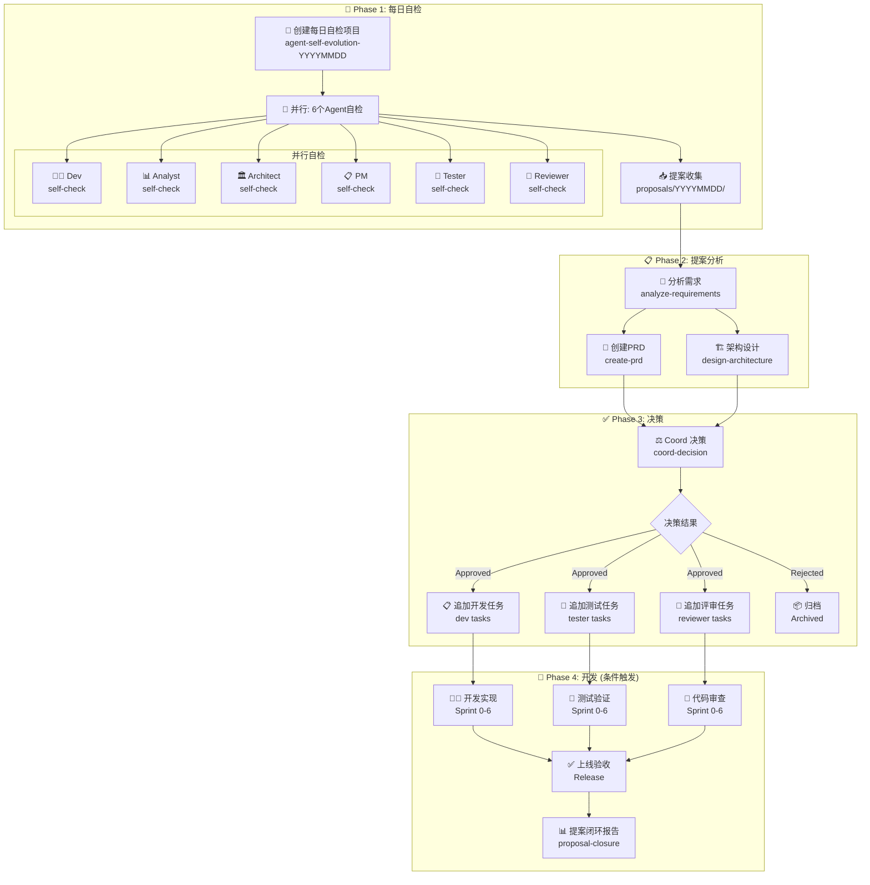
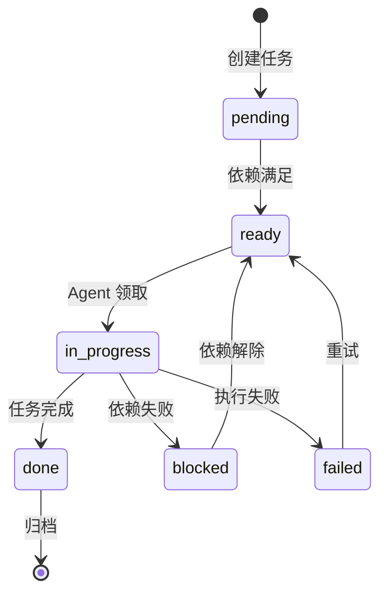
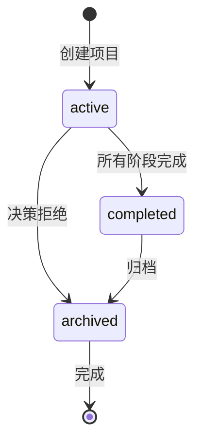

# AGENTS.md — Agent 职责与任务流转定义

**项目**: agent-self-evolution-20260323
**Architect**: architect
**日期**: 2026-03-23
**状态**: ✅ 完成

---

## 1. Agent 职责矩阵

| Agent | 核心职责 | 自进化任务 | 提案主题 |
|-------|---------|-----------|---------|
| **dev** | 功能开发、代码实现 | 每日代码质量扫描、技术债识别 | 工具链改进、代码质量提升 |
| **analyst** | 需求分析、可行性评估 | 提案优先级排序、依赖分析 | 可视化扩展、功能补全 |
| **architect** | 架构设计、技术选型 | 系统架构演进、接口设计 | 技术债务、架构优化 |
| **pm** | 产品规划、PRD 管理 | 提案产品价值评估、路线图更新 | 流程简化、用户体验 |
| **tester** | 测试计划、质量保障 | 测试覆盖率分析、测试策略优化 | 集成测试改进、自动化增强 |
| **reviewer** | 代码审查、规范制定 | 代码规范执行情况、审查效率分析 | 审查流程优化、自动化 |

---

## 2. 任务流转图 (DAG 模式)



---

## 3. Agent 详细任务定义

### 3.1 Dev Agent

**自进化职责**:
- 扫描代码库，识别技术债务和效率改进点
- 提交工具链改进提案 (ESLint 规则、Lint-staged 配置等)
- 参与 ReactFlow 可视化实现 (Epic 2)

**提案模板** (`proposals/YYYYMMDD/dev-proposals.md`):

```markdown
## 执行时间
{start_time} - {end_time}

## 状态扫描
- 代码覆盖率: {coverage}%
- 技术债项数: {count}
- 待处理 PR: {pending_prs}

## 提案列表

### 提案 N: {标题}
- **问题描述**: {清晰描述问题}
- **改进建议**: {具体可执行建议}
- **预期收益**: {量化的收益}
- **工作量估算**: S/M/L/XL
- **关联 Epic**: E{num}-S{num}.{num}
```

### 3.2 Analyst Agent

**自进化职责**:
- 读取所有 Agent 提案，进行可行性分析
- 产出 `analysis.md`，包含优先级矩阵和风险评估
- 参与 ReactFlow 可视化需求分析

**提案模板** (`proposals/YYYYMMDD/analyst-proposals.md`):

```markdown
## 执行时间
{start_time} - {end_time}

## 状态扫描
- 活跃提案数: {count}
- 待分析提案数: {pending}

## 提案分析

### 提案 N: {标题}
- **问题描述**: {描述}
- **JTBD 框架**: {用户想要完成的工作}
- **优先级**: P0/P1/P2
- **可行性评分**: 1-5
- **风险等级**: 🟢低/🟡中/🔴高
- **建议**: {采纳/改进/拒绝}
```

### 3.3 Architect Agent

**自进化职责**:
- 基于 PRD 设计系统架构
- 产出 `architecture.md` + `IMPLEMENTATION_PLAN.md` + `AGENTS.md`
- 定义 API 契约和接口规范
- 评估性能影响和扩展性

**提案模板** (`proposals/YYYYMMDD/architect-proposals.md`):

```markdown
## 执行时间
{start_time} - {end_time}

## 状态扫描
- 架构文档完整性: {score}/100
- 接口覆盖率: {coverage}%
- 技术债架构风险: {risk_level}

## 提案列表

### 提案 N: {标题}
- **问题描述**: {架构层面的问题}
- **改进建议**: {架构层面的建议}
- **预期收益**: {可维护性/性能/扩展性提升}
- **工作量估算**: S/M/L/XL
- **影响范围**: {影响的模块}
- **技术方案**: {方案概要}
```

### 3.4 PM Agent

**自进化职责**:
- 读取所有提案，合并分析报告
- 产出标准化 `prd.md`，包含 Epic/Story 拆分
- 定义验收标准 (expect() 格式)
- 追踪提案落地率

**提案模板** (`proposals/YYYYMMDD/pm-proposals.md`):

```markdown
## 执行时间
{start_time} - {end_time}

## 状态扫描
- 活跃 PRD 数: {count}
- 待落地提案: {pending}
- 提案落地率: {rate}%

## 提案列表

### 提案 N: {标题}
- **产品价值**: {量化价值}
- **目标用户**: {用户群体}
- **成功指标**: {可测量的指标}
- **工作量估算**: S/M/L/XL
- **优先级**: P0/P1/P2
```

### 3.5 Tester Agent

**自进化职责**:
- 分析测试覆盖率和测试策略
- 提交测试改进提案 (集成测试、自动化等)
- 优先验证阻塞项 (`test-integration-validation`)

**提案模板** (`proposals/YYYYMMDD/tester-proposals.md`):

```markdown
## 执行时间
{start_time} - {end_time}

## 状态扫描
- 测试覆盖率: {coverage}%
- 集成测试数: {count}
- 阻塞任务数: {blocked}

## 提案列表

### 提案 N: {标题}
- **问题描述**: {测试层面的问题}
- **改进建议**: {具体改进建议}
- **预期收益**: {覆盖率提升/自动化节省时间}
- **工作量估算**: S/M/L/XL
```

### 3.6 Reviewer Agent

**自进化职责**:
- 分析代码审查效率和改进点
- 提交审查流程优化提案
- 参与关键代码审查

**提案模板** (`proposals/YYYYMMDD/reviewer-proposals.md`):

```markdown
## 执行时间
{start_time} - {end_time}

## 状态扫描
- 待审 PR 数: {pending}
- 平均审查时间: {avg_time}h
- 审查通过率: {pass_rate}%

## 提案列表

### 提案 N: {标题}
- **问题描述**: {审查流程问题}
- **改进建议**: {具体建议}
- **预期收益**: {效率提升}
- **工作量估算**: S/M/L/XL
```

---

## 4. 任务依赖关系

| 任务 ID | 名称 | 依赖任务 | 执行 Agent | 产出物 |
|--------|------|---------|-----------|-------|
| `create-daily` | 创建每日自检项目 | 无 | coord | agent-self-evolution-YYYYMMDD |
| `dev-self-check` | Dev 自检 | `create-daily` | dev | `proposals/YYYYMMDD/dev-proposals.md` |
| `analyst-self-check` | Analyst 自检 | `create-daily` | analyst | `proposals/YYYYMMDD/analyst-proposals.md` |
| `architect-self-check` | Architect 自检 | `create-daily` | architect | `proposals/YYYYMMDD/architect-proposals.md` |
| `pm-self-check` | PM 自检 | `create-daily` | pm | `proposals/YYYYMMDD/pm-proposals.md` |
| `tester-self-check` | Tester 自检 | `create-daily` | tester | `proposals/YYYYMMDD/tester-proposals.md` |
| `reviewer-self-check` | Reviewer 自检 | `create-daily` | reviewer | `proposals/YYYYMMDD/reviewer-proposals.md` |
| `analyze-requirements` | 需求分析 | 6 个自检任务全部完成 | analyst | `docs/{project}/analysis.md` |
| `create-prd` | 创建 PRD | `analyze-requirements` | pm | `docs/{project}/prd.md` |
| `design-architecture` | 架构设计 | `create-prd` | architect | `docs/{project}/architecture.md` + `IMPLEMENTATION_PLAN.md` + `AGENTS.md` |
| `coord-decision` | Coord 决策 | `design-architecture` + `create-prd` | coord | decision record |
| `dev-implementation` | 开发实现 | `coord-decision` (approved) | dev | 代码提交 |
| `tester-validation` | 测试验证 | `dev-implementation` | tester | 测试报告 |
| `reviewer-approval` | 审查通过 | `dev-implementation` | reviewer | 审查通过 |

---

## 5. 状态机定义

### 5.1 任务状态流转



### 5.2 项目状态流转



---

## 6. Slack 通知规范

| 触发事件 | 频道 | 通知内容 |
|---------|------|---------|
| 项目创建 | #coord | 📋 每日自检项目 `{projectId}` 已创建，6 个任务就绪 |
| 提案提交 | #coord | ✅ `{agent}` 已提交提案 (`{count}` 项) |
| 提案缺失 | #coord | ⚠️ 截止时间已过，`{missing}` 尚未提交 |
| PRD 完成 | #coord | 📄 PRD 已产出，等待 Architect 架构设计 |
| 架构完成 | #coord | 🏛️ 架构设计已完成，等待 Coord 决策 |
| 决策通过 | #coord | ✅ 项目 `{projectId}` 获批，开启 Phase 4 开发 |
| 决策拒绝 | #coord | ❌ 项目 `{projectId}` 暂缓，原因: `{reason}` |

---

**AGENTS.md 完成**: 2026-03-23 06:10 (Asia/Shanghai)
