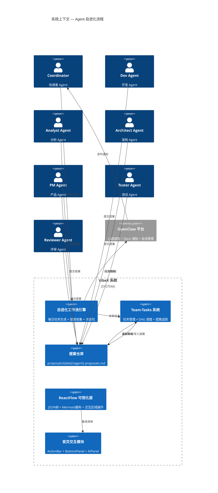
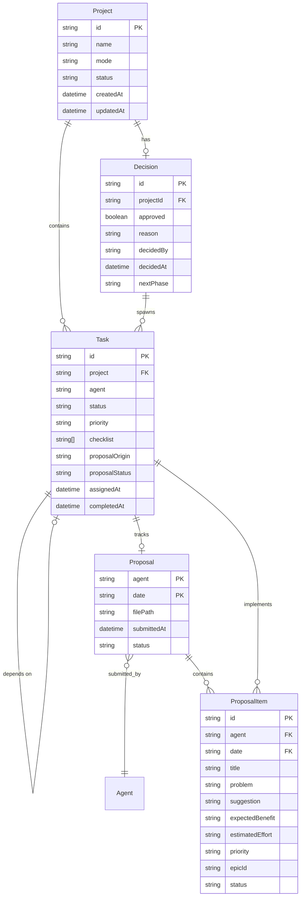

# Architecture: Agent 自进化流程 — 每日自检与改进提案收集

**项目**: agent-self-evolution-20260323
**阶段**: design-architecture
**Architect**: architect
**日期**: 2026-03-23
**状态**: ✅ 完成

---

## 1. Tech Stack

### 1.1 技术选型总览

| 层次 | 技术选型 | 版本 | 选型理由 |
|------|---------|------|---------|
| **前端框架** | Next.js (App Router) | 14.x | 现有技术栈，SSG/SSR 灵活，支持 API Routes |
| **UI 组件库** | Tailwind CSS + shadcn/ui | 3.x | 快速迭代，Design Token 统一 |
| **可视化** | ReactFlow | 11.x | 现有基础设施，支持自定义节点 |
| **状态管理** | Zustand | 4.x | 轻量，TypeScript 友好，与 ReactFlow 集成良好 |
| **后端** | Next.js API Routes + 文件系统 | — | MVP 阶段无需独立后端，文件系统足够 |
| **数据持久化** | 文件系统 (JSON) + Git | — | 保持现有模式，版本控制内建 |
| **定时任务** | cron (系统级) + OpenClaw 心跳 | — | 现有 coordinator 心跳机制复用 |
| **提案追踪** | team-tasks 扩展 (JSON) | — | 与现有 team-tasks 系统一致 |
| **测试** | Jest + React Testing Library | 29.x | 现有测试基础设施复用 |

### 1.2 技术决策

**Q: 为什么不用独立数据库？**
> MVP 阶段文件系统 + Git 已足够，且与现有 team-tasks 模式一致。提案量预计 ≤ 10/天，JSON 查询性能满足需求。数据库作为 P2 优化项。

**Q: 为什么选择 ReactFlow 而非独立 D3.js 实现？**
> 已有 ReactFlow 基础设施，生态成熟，自定义节点支持好。与现有 Next.js 项目集成成本最低。

**Q: 为什么提案追踪用 JSON 而非关系型？**
> 与 team-tasks 项目 JSON 格式保持一致，减少数据模型复杂度。Git diff 可追踪变更历史。

---

## 2. Architecture Diagram



```mermaid
C4Container
  title 容器视图 — 自进化工作流引擎

  Container(workflowEngine, "Workflow Engine", "Next.js API Routes", "任务生成 / 状态机 / DAG 执行")
  ContainerDb(taskStore, "Task Store", "team-tasks/projects/*.json", "任务持久化")
  ContainerDb(proposalStore, "Proposal Store", "proposals/{date}/*.md", "提案文件仓库")
  Container(coordCron, "Coord Cron", "heartbeat-coord", "每日定时心跳")
  Container(slackNotify, "Slack 通知", "OpenClaw Slack", "消息推送")
  Container(reactflowApp, "ReactFlow 可视化", "Next.js + ReactFlow", "JSON树/Mermaid画布")

  Container_Boundary(agents, "Agents") {
    Container(devAgent, "Dev Agent", "OpenClaw Agent")
    Container(analystAgent, "Analyst Agent", "OpenClaw Agent")
    Container(archAgent, "Architect Agent", "OpenClaw Agent")
    Container(pmAgent, "PM Agent", "OpenClaw Agent")
    Container(testerAgent, "Tester Agent", "OpenClaw Agent")
    Container(reviewerAgent, "Reviewer Agent", "OpenClaw Agent")
  }

  Rel_R(coordCron, workflowEngine, "定时触发")
  Rel(workflowEngine, taskStore, "读写任务")
  Rel(workflowEngine, proposalStore, "读取提案")
  Rel_R(workflowEngine, slackNotify, "通知")
  Rel(slackNotify, agents, "唤醒")
  Rel(agents, proposalStore, "提交")
  Rel(reactflowApp, proposalStore, "读取提案")
```

---

## 3. API Definitions

### 3.1 工作流引擎 API

#### POST /api/workflow/create-daily
创建每日自检项目，返回项目 ID。

```typescript
// Request
interface CreateDailyRequest {
  date: string;        // YYYYMMDD
}

// Response
interface CreateDailyResponse {
  projectId: string;  // agent-self-evolution-YYYYMMDD
  tasks: Task[];
  createdAt: string;  // ISO timestamp
}
```

#### GET /api/workflow/project/{projectId}
获取项目状态和所有任务。

```typescript
// Response
interface ProjectStatusResponse {
  projectId: string;
  status: 'active' | 'completed' | 'archived';
  tasks: Task[];
  proposalCount: number;
  missingAgents: string[];
  createdAt: string;
  updatedAt: string;
}
```

#### POST /api/workflow/decide/{projectId}
Coord 决策端点。

```typescript
// Request
interface DecisionRequest {
  approve: boolean;
  reason: string;
  nextPhase?: string;  // 'development' | null
}

// Response
interface DecisionResponse {
  decisionId: string;
  projectId: string;
  decidedBy: 'coord';
  approved: boolean;
  reason: string;
  nextPhase: string | null;
  tasks?: Task[];  // If approved, includes dev/test tasks
  notifiedAt: string;
}
```

### 3.2 提案管理 API

#### GET /api/proposals/{date}
获取某日所有提案摘要。

```typescript
// Response
interface ProposalsSummaryResponse {
  date: string;
  submissions: {
    agent: string;
    filePath: string;
    proposalCount: number;
    submittedAt: string;
  }[];
  missing: string[];
  totalSubmitted: number;
  totalExpected: number;
}
```

#### POST /api/proposals/validate
验证提案格式。

```typescript
// Request
interface ValidateProposalRequest {
  content: string;
  agentId: string;
  date: string;
}

// Response
interface ValidateProposalResponse {
  valid: boolean;
  errors: string[];
  warnings: string[];
  proposalCount: number;
}
```

### 3.3 提案追踪 API (Epic 4)

#### GET /api/tracking/stats
获取提案落地统计。

```typescript
// Response
interface ProposalStatsResponse {
  totalProposals: number;
  pending: number;
  implemented: number;
  rejected: number;
  closureRate: number;  // implemented / total
  byAgent: Record<string, { total: number; implemented: number; rejected: number }>;
  byProject: Record<string, ProposalStatsResponse>;
}
```

#### PATCH /api/tracking/task/{taskId}
更新任务提案状态。

```typescript
// Request
interface UpdateTaskProposalRequest {
  proposalStatus: 'pending' | 'implemented' | 'rejected';
  proposalOrigin?: string;  // Original proposal reference
}

// Response
interface UpdateTaskProposalResponse {
  taskId: string;
  proposalStatus: string;
  updatedAt: string;
}
```

### 3.4 ReactFlow 可视化 API (Epic 2)

#### POST /api/ddd/parse-tree
解析领域模型 JSON 为树结构。

```typescript
// Request
interface ParseTreeRequest {
  domainModel: DomainModelJSON;
  options?: {
    maxDepth?: number;      // default: 5
    nodeTypes?: string[];   // filter by type
    maxNodes?: number;      // default: 200
  };
}

// Response
interface ParseTreeResponse {
  nodes: TreeNode[];
  edges: TreeEdge[];
  stats: { totalNodes: number; totalEdges: number; depth: number };
}
```

#### POST /api/ddd/mermaid-to-nodes
将 Mermaid 图表转换为自定义 ReactFlow 节点。

```typescript
// Request
interface MermaidToNodesRequest {
  mermaidCode: string;
  stepId: string;
}

// Response
interface MermaidToNodesResponse {
  nodes: CustomNode[];
  edges: Edge[];
  metadata: { nodeCount: number; edgeCount: number };
}
```

---

## 4. Data Model

### 4.1 核心实体

```typescript
// Task — 任务实体
interface Task {
  id: string;                   // e.g., "analyze-requirements"
  project: string;             // e.g., "agent-self-evolution-20260323"
  stage: string;               // e.g., "phase1"
  agent: string;               // "dev" | "analyst" | "architect" | "pm" | "tester" | "reviewer"
  status: 'pending' | 'ready' | 'in-progress' | 'done' | 'blocked' | 'failed';
  priority: 'P0' | 'P1' | 'P2';
  assignedAt?: string;         // ISO timestamp
  completedAt?: string;
  checklist?: string[];        // Acceptance criteria checklist
  proposalOrigin?: string;     // For Epic 4 tracking
  proposalStatus?: 'pending' | 'implemented' | 'rejected';
  dependsOn?: string[];        // Task IDs
}

// Project — 项目实体
interface Project {
  id: string;
  name: string;
  description: string;
  mode: 'linear' | 'dag';      // Task execution mode
  status: 'active' | 'completed' | 'archived';
  stages: string[];
  createdAt: string;
  updatedAt: string;
  decision?: Decision;
}

// Proposal — 提案实体
interface Proposal {
  agent: string;
  date: string;               // YYYYMMDD
  filePath: string;
  submittedAt: string;
  proposals: ProposalItem[];
  status: 'submitted' | 'reviewed' | 'accepted' | 'rejected';
}

interface ProposalItem {
  id: string;
  title: string;
  problem: string;
  suggestion: string;
  expectedBenefit: string;
  estimatedEffort: 'S' | 'M' | 'L' | 'XL';
  priority: 'P0' | 'P1' | 'P2';
  epicId?: string;            // Links to PRD Epic
  status: 'pending' | 'accepted' | 'rejected' | 'implemented';
}

// Decision — 决策记录
interface Decision {
  id: string;
  projectId: string;
  approved: boolean;
  reason: string;
  decidedBy: string;
  decidedAt: string;
  nextPhase: string | null;
}
```

### 4.2 实体关系图



---

## 5. Module Design

### 5.1 模块划分

```
src/
├── app/
│   ├── api/
│   │   ├── workflow/
│   │   │   ├── create-daily/route.ts      # 创建每日项目
│   │   │   ├── project/[projectId]/route.ts
│   │   │   └── decide/[projectId]/route.ts  # Coord 决策
│   │   ├── proposals/
│   │   │   ├── [date]/route.ts            # 提案列表
│   │   │   └── validate/route.ts          # 提案验证
│   │   ├── tracking/
│   │   │   ├── stats/route.ts             # 提案统计
│   │   │   └── task/[taskId]/route.ts     # 任务追踪更新
│   │   └── ddd/
│   │       ├── parse-tree/route.ts        # JSON树解析
│   │       └── mermaid-to-nodes/route.ts  # Mermaid转换
│   └── (frontend)/
│       ├── ddd/
│       │   ├── page.tsx                   # DDD 建模页面
│       │   ├── components/
│       │   │   ├── JsonTreeView.tsx       # JSON 树可视化
│       │   │   ├── MermaidCanvas.tsx      # Mermaid 画布
│       │   │   └── InteractiveRegion.tsx  # 交互区域
│       │   └── hooks/
│       │       └── useDomainModel.ts
│       └── home/
│           ├── page.tsx
│           └── components/
│               ├── ActionBar.tsx          # Epic 3.1
│               ├── BottomPanel.tsx         # Epic 3.2
│               └── AIPanel.tsx            # Epic 3.3
├── lib/
│   ├── workflow/
│   │   ├── engine.ts                      # 工作流引擎
│   │   ├── state-machine.ts              # 任务状态机
│   │   └── dag-scheduler.ts               # DAG 调度
│   ├── proposals/
│   │   ├── parser.ts                     # 提案解析
│   │   ├── validator.ts                  # 提案验证
│   │   └── aggregator.ts                  # 提案汇总
│   ├── tracking/
│   │   ├── tracker.ts                    # 提案追踪
│   │   └── stats.ts                      # 统计计算
│   └── ddd/
│       ├── tree-parser.ts                # JSON 树解析
│       └── mermaid-converter.ts          # Mermaid → ReactFlow
├── store/
│   ├── workflow-store.ts                 # Zustand — 工作流状态
│   ├── proposal-store.ts                 # Zustand — 提案状态
│   └── reactflow-store.ts               # Zustand — 可视化状态
└── types/
    ├── workflow.ts
    ├── proposal.ts
    └── domain-model.ts
```

### 5.2 关键模块职责

| 模块 | 职责 | 公开 API |
|------|------|---------|
| `workflow/engine` | 项目创建、任务派发、状态推进 | `createDailyProject()`, `getProjectStatus()`, `advanceStage()` |
| `workflow/state-machine` | 任务状态转换、依赖检查 | `transition()`, `canTransition()`, `getBlockedTasks()` |
| `proposals/parser` | 解析 markdown 提案为结构化对象 | `parse()`, `extractProposals()` |
| `proposals/validator` | 验证提案格式完整性 | `validate()`, `checkRequiredFields()` |
| `tracking/tracker` | 提案来源追踪、状态更新 | `track()`, `updateStatus()`, `queryByOrigin()` |
| `ddd/tree-parser` | 领域模型 JSON → 树节点 | `parse()`, `buildTree()`, `prune()` |
| `ddd/mermaid-converter` | Mermaid → 自定义 ReactFlow 节点 | `convert()`, `buildEdges()` |

---

## 6. Performance Considerations

| 关注点 | 现状 | 优化方案 |
|-------|------|---------|
| **提案文件读写** | 每日 ≤ 6 个文件，每个 ≤ 10KB | 文件系统足够，Git diff 天然缓存 |
| **team-tasks JSON 查询** | 每次心跳全量扫描 | P2: 索引文件 (task-index.json) 按 agent/date 预建 |
| **ReactFlow 节点渲染** | ≤ 100 节点无压力 | 虚拟化: 超出 200 节点使用 `nodeExtent` 限制 + 分页加载 |
| **Mermaid 解析** | 单图 ≤ 50 节点 | 使用 `mermaid.run()` 异步渲染，避免主线程阻塞 |
| **提案统计查询** | 扫描所有已完成任务 | P2: `stats-cache.json` 每日更新，增量计算 |

**预计性能**: 
- 提案收集流程: < 2s (6 个文件并发读取)
- ReactFlow 渲染 100 节点: < 500ms
- 提案统计查询: < 100ms (P1), < 50ms (P2+ 缓存)

---

## 7. Security Considerations

- **提案文件**: 仅 OpenClaw Agent 有写权限，敏感信息扫描在提案收集时执行
- **API Routes**: 内部调用 (cron/agent)，无外部暴露，无需额外认证
- **Slack 通知**: 仅发送，不接收指令（防钓鱼）
- **Git 提交**: 提案变更通过标准 Git 流程审计

---

## 8. Trade-offs & Open Decisions

| 决策点 | 选项 A (本方案) | 选项 B | 选择理由 |
|-------|---------------|--------|---------|
| 数据存储 | 文件系统 + JSON | PostgreSQL | MVP 快速交付，与现有 team-tasks 一致 |
| 可视化层 | ReactFlow 扩展 | 自研 Canvas | 复用现有基础设施，降低开发成本 |
| 定时触发 | OpenClaw 心跳复用 | 独立 cron | 减少系统复杂度，与 coordinator 复用 |
| 提案格式 | Markdown | JSON Schema | 人类可读，与现有提案模板一致 |
| 追踪粒度 | 任务级追踪 | 提案项级追踪 | 任务级满足 P1 需求，提案项级 P2 考虑 |

---

**架构文档完成**: 2026-03-23 05:59 (Asia/Shanghai)
**下一阶段**: coord-decision — Coord 决策是否开启开发
