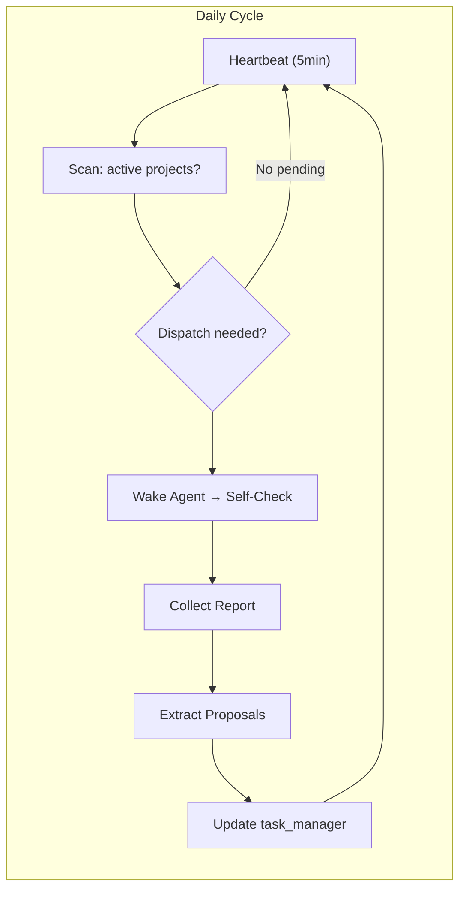

# Architecture — Agent Self-Evolution Framework
**Project**: agent-self-evolution-20260325  
**Status**: Proposed  
**Author**: architect  
**Date**: 2026-03-25

---

## 1. Tech Stack

| Component | Technology | Justification |
|-----------|-----------|---------------|
| **Scheduler** | cron + bash | Existing heartbeat infrastructure (coord-heartbeat-v8.sh); no new dependencies |
| **Report Storage** | JSON + Markdown files | Human-readable, git-versioned, no DB needed for agent-scale workloads |
| **Proposal Tracker** | task_manager.py + JSON | Tightly integrated with existing team-tasks pipeline |
| **Template Engine** | Markdown + Bash | Lightweight, no external templating library needed |
| **Metrics Aggregation** | Python3 scripts | Reuse existing log_analysis.py patterns |
| **Dashboard** | Static Markdown tables | No UI needed; coord reviews in Markdown |
| **Notifications** | openclaw message + Slack API | Existing notify-agent.py integration |

**Trade-offs**:
- ✅ No new services or infrastructure
- ✅ Reports are git-versioned and searchable
- ✅ Works with existing team-tasks pipeline
- ⚠️ No real-time dashboard — metrics are batch-calculated on demand
- ⚠️ Proposal lifecycle tracking relies on task_manager.py (already solid)

---

## 2. Architecture Diagram

```mermaid
C4Component
  title Component Diagram — Agent Self-Evolution Framework

  Person(coord, "Coord Agent", "Scheduler & Orchestrator")
  System_Boundary(scheduler, "Heartbeat Scheduler") {
    Component(cron, "cron (5min)", "Triggers heartbeat cycle")
    Component(heartbeat, "coord-heartbeat-v8.sh", "Orchestration script")
  }
  System_Boundary(agents, "Agent Layer (6 agents)") {
    Component(analyst, "Analyst", "Requirements analysis, proposals")
    Component(architect, "Architect", "Architecture design, ADRs")
    Component(dev, "Dev", "Code implementation, fixes")
    Component(pm, "PM", "PRD creation, prioritization")
    Component(tester, "Tester", "Test plans, bug reports")
    Component(reviewer, "Reviewer", "Code review, quality gates")
  }
  System_Boundary(storage, "Storage Layer") {
    ComponentDb(reports, "Self-Check Reports", "JSON + Markdown per agent per day")
    ComponentDb(proposals, "Proposal Tracker", "FEATURE_REQUESTS.md + task_manager")
    ComponentDb(learnings, "Knowledge Base", "LEARNINGS.md, MEMORY.md")
    ComponentDb(tasks, "Task Registry", "team-tasks/*.json + projects/*/tasks.json")
  }

  coord --> cron
  cron --> heartbeat
  heartbeat --> agents
  agents --> reports
  agents --> proposals
  agents --> learnings
  proposals --> tasks
  tasks --> heartbeat : status updates
```



---

## 3. API Definitions

No HTTP API — all communication via:
- **File system**: Reports written to `docs/<project>/<agent>-report-<date>.md`
- **task_manager.py CLI**: Task state transitions
- **openclaw message**: Agent wake notifications

### Internal Interfaces (Python/bash)

```python
# Report metadata schema (report.json)
class SelfCheckReport(TypedDict):
    agent: str           # analyst | architect | dev | pm | reviewer | tester | coord
    date: str            # ISO-8601: "2026-03-25"
    project: str         # "agent-self-evolution-YYYYMMDD"
    version: str         # semver: "1.0.0"
    self_assessment: SelfAssessment
    proposals: list[Proposal]
    action_items: list[ActionItem]
    status: str          # "draft" | "final"

class SelfAssessment(TypedDict):
    dimensions: list[ScoreDimension]
    overall_score: float  # 0.0-10.0

class ScoreDimension(TypedDict):
    name: str
    score: float
    max: float
    rationale: str

class Proposal(TypedDict):
    id: str              # e.g., "P1-001"
    title: str
    priority: str        # P0 | P1 | P2 | P3
    owner: str            # agent name
    status: str          # draft | submitted | reviewing | approved | implementing | completed | rejected
    created_at: str
    updated_at: str
    epic: str | None     # linked Epic ID

class ActionItem(TypedDict):
    id: str
    description: str
    owner: str
    deadline: str | None
    status: str           # pending | in_progress | completed
```

---

## 4. Data Model

### Core Entities

```
Agent
  ├── agent_id: string (unique)
  ├── role: enum (analyst, architect, dev, pm, reviewer, tester, coord)
  ├── workspace: path
  ├── self_check_template: path
  └── last_self_check: datetime

SelfCheckReport
  ├── report_id: string (agent + date)
  ├── agent: Agent FK
  ├── date: date
  ├── self_assessment: JSON
  ├── proposals: Proposal[]
  ├── action_items: ActionItem[]
  ├── output_path: path
  └── status: draft | final

Proposal
  ├── proposal_id: string (e.g., vibex-proposal-20260325-P1-001)
  ├── title: string
  ├── priority: P0-P3
  ├── owner: Agent FK
  ├── status: lifecycle enum
  ├── epic: Epic FK | null
  ├── source_report: SelfCheckReport FK
  └── metadata: JSON (rationale, constraints, acceptance criteria)

Epic
  ├── epic_id: string
  ├── title: string
  ├── priority: P0-P3
  ├── stories: Story[]
  └── status: planning | in_progress | completed
```

### File Structure

```
vibex/docs/
├── agent-self-evolution-YYYYMMDD/
│   ├── analysis.md              # Analyst output
│   ├── prd.md                   # PM output (Epic/Story breakdown)
│   ├── architecture.md          # Architect output (this file)
│   ├── IMPLEMENTATION_PLAN.md    # Implementation phases
│   ├── AGENTS.md                # Agent coordination rules
│   ├── specs/
│   │   ├── templates/           # Per-agent self-check templates
│   │   │   ├── analyst-template.md
│   │   │   ├── architect-template.md
│   │   │   ├── dev-template.md
│   │   │   ├── pm-template.md
│   │   │   ├── reviewer-template.md
│   │   │   ├── tester-template.md
│   │   │   └── coord-template.md
│   │   └── schemas/
│   │       └── report-schema.json
│   ├── reports/                  # Aggregated daily reports
│   │   └── YYYYMMDD/
│   │       ├── analyst-report-YYYYMMDD.md
│   │       ├── architect-report-YYYYMMDD.md
│   │       └── ...
│   └── proposals/
│       └── YYYYMMDD-proposals.md
```

---

## 5. Testing Strategy

### Test Framework
- **Unit**: Jest for JS/TS components; pytest/bats for shell scripts
- **Integration**: End-to-end validation via heartbeat cycle test
- **Coverage target**: > 80% for template rendering and lifecycle transitions

### Core Test Cases

#### TC-1: Self-Check Report Generation
```bash
# Given: agent workspace with valid config
# When: self-check script runs
# Then: report.json matches schema + report.md is generated
test_self_check_report_generation() {
  bash scripts/self-check.sh architect 2026-03-25
  expect_json_schema "docs/agent-self-evolution-YYYYMMDD/reports/20260325/architect-report-20260325.json"
  expect_file_exists "docs/agent-self-evolution-YYYYMMDD/reports/20260325/architect-report-20260325.md"
}
```

#### TC-2: Proposal Lifecycle Transition
```python
# Given: proposal in "draft" status
# When: agent submits proposal
# Then: status → "submitted", FEATURE_REQUESTS.md updated
def test_proposal_lifecycle_submit():
    proposal = create_draft_proposal(agent="architect", priority="P1")
    result = task_manager.update_status(proposal.id, "submitted")
    assert result.status == "submitted"
    assert "architect" in read_file("FEATURE_REQUESTS.md")
```

#### TC-3: Heartbeat Dispatch
```python
# Given: standby_count >= 3
# When: heartbeat runs
# Then: 6 agents notified, proposal collection project created
def test_heartbeat_proposal_collection():
    set_standby_count(3)
    run_heartbeat()
    assert active_projects.contains("vibex-proposals-YYYYMMDD")
    assert notifications_sent == 6
```

#### TC-4: Template Validation
```python
# Given: self-check report markdown
# When: report is validated against schema
# Then: all required fields present, scores in range
def test_template_field_completeness():
    report = parse_report("architect-report-20260325.md")
    assert report.self_assessment.dimensions.length >= 3
    assert all(0 <= d.score <= d.max for d in report.self_assessment.dimensions)
    assert report.proposals.is_array()
```

#### TC-5: Coordination Between Agents
```python
# Given: PRD is done, design-architecture is ready
# When: architect starts design
# Then: PM notified, architecture.md created within SLA
def test_agent_handoff_architect():
    mark_task_done("create-prd")
    wake_agent("architect")
    # Architect has 30-minute SLA to create architecture.md
    assert file_exists("architecture.md", max_age_minutes=30)
```

---

## 6. Non-Functional Requirements

| NFR | Target | Measurement |
|-----|--------|------------|
| **Self-check completion** | All 6 agents within 2 hours of heartbeat | task_manager status check |
| **Report availability** | Reports accessible within 5 min of completion | File timestamp |
| **Proposal capture rate** | ≥ 1 proposal per agent per cycle | Count in FEATURE_REQUESTS.md |
| **False positive rate** | < 10% of proposals rejected | Review outcome tracking |
| **System availability** | Heartbeat runs every 5 min, 99%+ uptime | Cron execution log |

---

## 7. Open Questions

| # | Question | Owner | Decision Needed By |
|---|----------|-------|-------------------|
| 1 | Should proposals auto-expire after N days in "submitted"? | coord | Before phase2 |
| 2 | Who owns the Metrics Dashboard? (coord vs analyst) | coord | Phase 1 |
| 3 | Minimum proposal count threshold before triggering epic creation? | pm | Phase 1 |
| 4 | How to handle agent sick-days (missed self-check)? | coord | Phase 1 |

---

## 8. Trade-off Summary

| Decision | Chosen | Alternatives Considered | What We Give Up |
|----------|--------|------------------------|-----------------|
| Storage | File-based (JSON/MD) | Database (SQLite/Postgres) | Real-time queries, complex aggregations |
| Scheduler | Existing cron+bash | Dedicated service | Single point of control, polling overhead |
| Dashboard | Markdown tables | Web dashboard | Real-time visualization |
| Proposal routing | task_manager pipeline | Direct agent-to-agent | Speed (one extra hop) |

---

## 9. Related Documents

- `prd.md` — Product requirements and Epic/Story breakdown
- `IMPLEMENTATION_PLAN.md` — Phased implementation roadmap
- `AGENTS.md` — Agent coordination rules and responsibilities
- `docs/architecture/vibex-simplified-flow-arch.md` — Prior workflow simplification ADR
