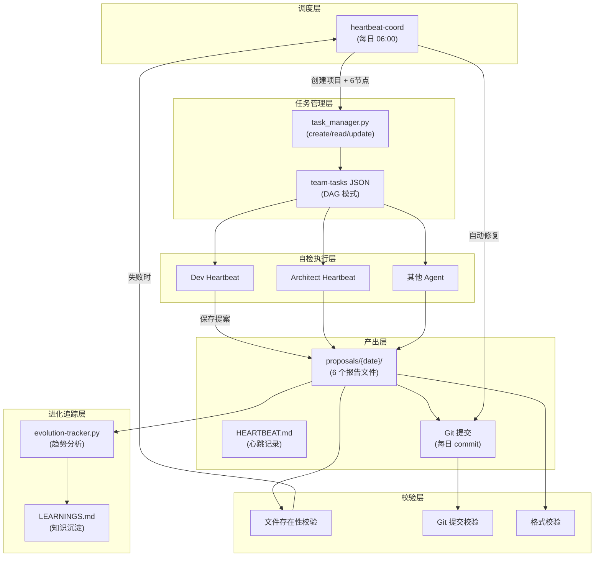

# Architecture: Agent Self-Evolution System (Daily)

**项目**: agent-self-evolution-20260326-daily
**版本**: 1.0
**架构师**: Architect Agent
**日期**: 2026-03-26
**状态**: Proposed

---

## 1. ADR: 自检触发模式

### ADR-001: 自检触发方式 — heartbeat-coord 主动创建 vs agent 被动拉取

**状态**: Accepted

**上下文**: 自检任务如何触发？heartbeat-coord 主动创建 vs 各 agent 被动拉取？

**决策**: heartbeat-coord 主动创建（推荐）

**理由**:
1. 保证每个工作日 06:00 前有任务存在
2. 可统一管理 6 个 agent 并行任务
3. 避免 agent 遗漏（当前依赖 agent 自觉）

**Trade-off**: 需要 coord 正常工作，如果 heartbeat-coord 失败则自检不会触发。

---

### ADR-002: 自检报告格式 — 固定章节模板 vs 自由格式

**状态**: Accepted

**上下文**: 自检报告格式应该固定还是自由？

**决策**: 固定章节模板（4 章节 + 红线约束）

**理由**:
1. 支持机器解析（expect() 格式验证）
2. 各 agent 产出可比，便于横向分析
3. 减少格式不一致问题

---

## 2. Tech Stack

| 技术 | 选择理由 |
|------|---------|
| Python (`task_manager.py`) | 现有任务管理 API，统一入口 |
| Bash (heartbeat scripts) | 各 agent 心跳脚本，统一入口 |
| JSON (team-tasks) | 现有任务状态存储 |
| Markdown (proposals/) | 提案文档存储 |
| SQLite (可选) | 进化指标长期存储 |

---

## 3. 架构图



---

## 4. 核心组件设计

### 4.1 heartbeat-coord 自检触发

```python
# scripts/heartbeat_coord_selfcheck.py
def create_daily_selfcheck_project(date: str) -> str:
    """创建每日自检 DAG 项目"""
    project_id = f"agent-self-evolution-{date}-daily"
    
    stages = {
        f"{agent}-self-check": {
            "agent": agent,
            "status": "ready",
            "dependsOn": [],  # 并行，无依赖
        }
        for agent in ["dev", "analyst", "architect", "pm", "tester", "reviewer"]
    }
    
    project = {
        "project": project_id,
        "goal": f"所有 agent 每日自检 {date}",
        "mode": "dag",
        "stages": stages,
    }
    
    save_project(project_id, project)
    return project_id


def heartbeat_coord():
    today = datetime.now().strftime("%Y%m%d")
    project_id = f"agent-self-evolution-{today}-daily"
    
    if not project_exists(project_id):
        create_daily_selfcheck_project(today)
        notify_all_agents(f"每日自检任务已创建: {project_id}")
    
    # 虚假完成检测
    for task_id, task in get_pending_tasks():
        if is_false_done(task):
            fix_and_notify(task_id)
```

### 4.2 task_manager.py 虚假完成检测钩子

```python
# scripts/task_manager.py

# 每个任务的必需产出物（预定义）
TASK_REQUIREMENTS = {
    "dev-self-check": [
        "{workspace}/proposals/{date}/dev-selfcheck-{date}.md",
    ],
    "architect-self-check": [
        "{workspace}/proposals/{date}/architect-selfcheck-{date}.md",
    ],
    # ... 其他 agent
}

def update_task(project_id: str, stage: str, status: str):
    if status == "done":
        # 虚假完成检测
        required = TASK_REQUIREMENTS.get(stage, [])
        for file_pattern in required:
            file_path = expand_vars(file_pattern)
            if not os.path.exists(file_path):
                raise ValueError(f"False completion detected: {file_path} not found")
        
        # Git 提交校验
        commit = get_last_commit()
        if not commit or commit.message.get("date") != today:
            raise ValueError(f"False completion detected: no git commit for today")
    
    _update_status(project_id, stage, status)


def is_false_done(task_id: str) -> bool:
    """检测虚假完成（状态 done 但文件不存在）"""
    required = TASK_REQUIREMENTS.get(task_id, [])
    for file_pattern in required:
        if not os.path.exists(expand_vars(file_pattern)):
            return True
    return False
```

### 4.3 自检报告格式验证

```python
# scripts/validate_selfcheck_report.py
def validate_report(path: str) -> tuple[bool, list[str]]:
    """验证自检报告格式"""
    errors = []
    
    with open(path) as f:
        content = f.read()
    
    # 4 个固定章节
    required_sections = [
        "今日工作统计",
        "主要活动",
        "改进建议",
        "红线约束",
    ]
    for section in required_sections:
        if section not in content:
            errors.append(f"Missing section: {section}")
    
    # 统计数据非空
    if re.search(r'\|\s*\|\s*\|', content):
        errors.append("Empty statistics table detected")
    
    # P0/P1/P2 优先级
    priorities = re.findall(r'P[012]', content)
    if not priorities:
        errors.append("No priority tags (P0/P1/P2) found")
    
    return len(errors) == 0, errors
```

### 4.4 进化追踪

```python
# scripts/evolution_tracker.py
def generate_daily_summary(date: str) -> dict:
    """生成每日自检汇总"""
    proposals_dir = f"proposals/{date}/"
    agents = ["dev", "analyst", "architect", "pm", "tester", "reviewer"]
    
    summary = {
        "date": date,
        "completed": 0,
        "p0_count": 0,
        "p1_count": 0,
        "p2_count": 0,
        "total_suggestions": 0,
    }
    
    for agent in agents:
        report_path = f"{proposals_dir}/{agent}-selfcheck-{date}.md"
        if os.path.exists(report_path):
            summary["completed"] += 1
            with open(report_path) as f:
                content = f.read()
            summary["p0_count"] += len(re.findall(r'P0', content))
            summary["p1_count"] += len(re.findall(r'P1', content))
            summary["p2_count"] += len(re.findall(r'P2', content))
    
    summary["total_suggestions"] = summary["p0_count"] + summary["p1_count"] + summary["p2_count"]
    return summary


def update_learnings(agent: str, suggestions: list[str]):
    """更新 agent 的 LEARNINGS.md"""
    learnings_path = f"workspace-{agent}/LEARNINGS.md"
    # 追加改进建议到 LEARNINGS.md
    append_to_learnings(learnings_path, agent, suggestions)
```

---

## 5. 数据流

### 5.1 自检完整生命周期

```
T-06:00  heartbeat-coord 扫描
    ↓ 检测 agent-self-evolution-20260326 不存在
    ↓ 创建 DAG 项目（6 节点并行，无依赖）
    ↓ 发送飞书通知唤醒 6 个 agent

T+0      各 agent 领取任务（并行）
    ↓ 锁定 in_progress
    ↓ 执行自检（扫描 projects/team-tasks）
    ↓ 产出报告到 proposals/YYYYMMDD/
    ↓ git add + commit
    ↓ 格式校验（expect()）
    ↓ 更新 task_manager 状态 done
    ↓ 发送通知到 coord

T+5      coord 收集提案（自动）
    ↓ 验证 6 个文件存在
    ↓ 生成每日汇总
    ↓ 更新进化指标

T+10     归档
    ↓ 任务状态 → completed
    ↓ HEARTBEAT.md 更新
```

### 5.2 虚假完成检测流程

```
task_manager.update(task, "done")
    ↓
检查文件存在性
    ↓ 失败 → 抛出 ValueError → 不更新状态
    ↓ 成功 → 检查 Git 提交
    ↓ 无今日提交 → 自动 git add + commit
    ↓ 更新状态 → done + 通知 coord
```

---

## 6. 测试策略

### 6.1 单元测试

```python
def test_validate_report_complete():
    """完整报告格式验证通过"""
    valid, errors = validate_report("test_data/valid_report.md")
    assert valid, errors

def test_validate_report_missing_section():
    """缺少章节则验证失败"""
    valid, errors = validate_report("test_data/missing_section.md")
    assert not valid
    assert any("今日工作统计" in e for e in errors)

def test_is_false_done():
    """文件不存在时检测为虚假完成"""
    assert is_false_done("architect-self-check")

def test_create_daily_project():
    """创建每日项目，6 节点并行"""
    pid = create_daily_selfcheck_project("20260326")
    stages = get_stages(pid)
    assert len(stages) == 6
    for s in stages.values():
        assert s["status"] == "ready"
        assert s["dependsOn"] == []
```

### 6.2 集成测试

```python
def test_full_selfcheck_flow():
    """完整自检流程"""
    # 1. 创建项目
    pid = create_daily_selfcheck_project("20260326")
    
    # 2. 模拟 architect 自检
    report = generate_architect_report()
    save_report(report, "proposals/20260326/architect-selfcheck-20260326.md")
    git_commit("docs: architect self-check 20260326")
    
    # 3. 验证完成
    valid, errors = validate_report("proposals/20260326/architect-selfcheck-20260326.md")
    assert valid, errors
    
    # 4. 状态更新
    update_task(pid, "architect-self-check", "done")
    assert get_status(pid, "architect-self-check") == "done"
```

---

## 7. 实施计划

| Epic | Story | 工时 | 负责人 |
|------|-------|------|--------|
| Epic 1 | S1.1 heartbeat-coord 自检触发 | 1h | Coord |
| Epic 1 | S1.2 task_manager 虚假完成检测钩子 | 1h | Dev |
| Epic 1 | S1.3 任务到期提醒 | 0.5h | Dev |
| Epic 2 | S2.1 定义通用自检报告模板 | 0.5h | PM |
| Epic 2 | S2.2 各 agent 特有指标定义 | 0.5h | 各 agent |
| Epic 2 | S2.3 格式验证脚本 | 1h | Dev |
| Epic 3 | S3.1 proposals 目录创建 | 0.5h | Dev |
| Epic 3 | S3.2 Git 提交自动化 | 0.5h | Dev |
| Epic 3 | S3.3 完整性校验 | 0.5h | Dev |
| Epic 4 | S4.1-S4.4 虚假完成检测集成 | 1h | Dev |
| Epic 5 | S5.1-S5.4 进化追踪 | 2h | Dev/Coord |

**预计总工期**: ~8h

---

## 8. 验收标准映射

| PRD 验收标准 | Architect 确认 |
|-------------|--------------|
| 自检完成率 ≥ 6/6 | ✅ DAG 并行 + 6 节点无依赖 |
| 提案收集完整率 100% | ✅ 完整性校验脚本 |
| 虚假完成发生率 0 | ✅ task_manager 钩子 + heartbeat 检测 |
| 自检报告可机读率 100% | ✅ 固定章节模板 + expect() 格式验证 |

---

## 9. 已知限制

1. **heartbeat-coord 依赖**: 如果 heartbeat-coord 未运行，自检不会触发
2. **Git 提交时间**: 各 agent 可能在不同时间提交，汇总报告需等待全部完成
3. **跨 workspace**: 提案集中在 `vibex/proposals/`，其他 workspace 的 agent 需要适配

---

*Architecture 完成时间: 2026-03-26 09:10 UTC+8*
