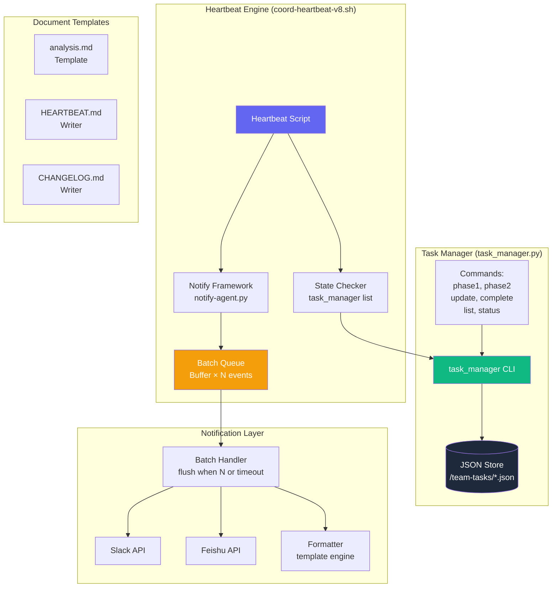

# ADR-001: Agent Self-Evolution Pipeline — Architecture Design

**Project**: agent-self-evolution-20260328  
**Architect**: architect  
**Date**: 2026-03-28  
**Status**: Proposed  

---

## Context

The agent self-evolution daily review system has accumulated 4 systemic issues:
- **P1**: HEARTBEAT.md `\n` literal pollution (string `\n` not escaped as real newline)
- **P2**: `task_manager.py` missing `complete` subcommand (heartbeat script can't auto-complete stages)
- **P3**: Notification fragmentation (each Epic completion → separate Slack message)
- **P4**: Inconsistent `analysis.md` templates across agents

The goal: improve pipeline automation, notification quality, and document consistency.

---

## Architecture Diagram



---

## Tech Stack

| Component | Technology | Version | Rationale |
|-----------|-----------|---------|-----------|
| Task State Store | JSON files | — | Already in use, no migration needed |
| Heartbeat Script | Bash + Python | Bash 5.x, Python 3.10+ | Existing infrastructure |
| Notification Queue | In-memory Python dict | — | Low volume (< 100 events/scan), simple |
| Template Engine | Python f-string + string.Template | — | No external deps, sufficient for format control |
| Slack API | openclaw message send | — | Already integrated |
| Testing | pytest | 7.x | Simple unit tests for format validation |

**Trade-off**: We chose in-memory queue over Redis for simplicity — event volume is low and persistence is not required across process restarts.

---

## Component Design

### 1. HEARTBEAT.md Format Fix (Epic 1)

**Problem**: Python string replacement inserts literal `\n` instead of real newline.

**Root Cause**: `content.replace(old, "xxx\n| ...")` — `\n` inside a Python string is an escape sequence, not a literal. When written to file, it becomes a newline. BUT if the source already has literal `\n` (two chars), replacement doesn't help.

**Solution**: Use triple-quoted strings or explicit `splitlines()` / `write('\n'.join(...))` approach.

```python
# BEFORE (broken)
with open(f, 'r') as fp:
    content = fp.read()
content = content.replace(old, "xxx\n| 2026-03-28...")

# AFTER (correct)
lines = content.splitlines()
# Find and replace line-by-line, then rejoin
new_lines = []
for line in lines:
    if old in line:
        new_lines.append(line.replace(old, "xxx"))
        new_lines.append("| 2026-03-28...")  # real newline
    else:
        new_lines.append(line)
with open(f, 'w') as fp:
    fp.write('\n'.join(new_lines))
```

**Verification**: `grep -c '\\n' HEARTBEAT.md` returns 0 after fix.

---

### 2. task_manager.py `complete` Subcommand (Epic 2)

**Problem**: `heartbeat.sh` calls `complete` but the subcommand doesn't exist.

**Solution**: Add `complete` as an alias for `update <project> <stage> done`.

```python
# In argparse section, add:
complete_parser = subparsers.add_parser('complete', help='Shortcut: mark stage as done')
complete_parser.add_argument('project', help='Project name')
complete_parser.add_argument('stage', help='Stage/task name')
complete_parser.add_argument('result', nargs='?', default='done', help='Result (default: done)')

def cmd_complete(args):
    args.status = args.result
    cmd_update(args)

# Wire it up
if args.command == 'complete':
    cmd_complete(args)
```

**Verification**: `task_manager.py complete agent-test test-stage done` succeeds.

---

### 3. Batch Heartbeat Notification (Epic 3)

**Problem**: Each Epic completion triggers a separate Slack message → message fragmentation.

**Solution**: Accumulate events in a queue file (`/tmp/heartbeat_batch.json`) and flush when:
- Queue reaches `BATCH_SIZE` (default: 5)
- Timeout expires (default: 60s)
- Scan cycle ends

```python
BATCH_FILE = "/tmp/heartbeat_batch.json"
BATCH_SIZE = 5
BATCH_TIMEOUT = 60  # seconds

def enqueue(event):
    with open(BATCH_FILE, 'r+') as f:
        batch = json.load(f)
    batch['events'].append(event)
    batch['count'] += 1
    if batch['count'] >= BATCH_SIZE:
        flush(batch)
    else:
        with open(BATCH_FILE, 'w') as f:
            json.dump(batch, f)

def flush(batch):
    msg = format_batch_summary(batch['events'])
    send_to_slack(msg)
    with open(BATCH_FILE, 'w') as f:
        json.dump({'events': [], 'count': 0, 'last_flush': time.time()}, f)
```

**Verification**: Simulate 5 completions → verify 1 batch message received.

---

### 4. analysis.md Template Standardization (Epic 4)

**Problem**: `analysis.md` files have inconsistent sections.

**Solution**: Create a `.template` file and a validator script.

```bash
# docs/analysis-template.md
# === TEMPLATE: Analysis Document ===
# Sections (in order):
# 1. 问题定义 (Problem Definition)
# 2. 业务场景 (Business Context)
# 3. JTBD 分析 (3-5 items)
# 4. 技术方案对比 (≥2 options)
# 5. 验收标准 (≥4 criteria)
# 6. 风险识别 (≥1 risk)
```

Validator script:
```bash
#!/bin/bash
# validate_analysis.sh
for f in docs/*/analysis.md; do
    for section in "问题定义" "JTBD" "验收标准" "风险识别"; do
        grep -q "$section" "$f" || echo "MISSING: $section in $f"
    done
done
```

---

### 5. DAG Topological Sort for Heartbeat (Epic 5)

**Problem**: Heartbeat scans tasks alphabetically, not by dependency order.

**Solution**: Build dependency graph from JSON store, compute topological sort, then assign tasks.

```python
def topological_sort(project_json):
    """Kahn's algorithm for DAG topological sort."""
    graph = {}
    in_degree = {}
    
    for stage, info in project_json['stages'].items():
        graph[stage] = []
        in_degree[stage] = 0
    
    for stage, info in project_json['stages'].items():
        deps = info.get('after', [])
        for dep in deps:
            graph[dep].append(stage)
            in_degree[stage] += 1
    
    # Kahn's algorithm
    queue = [s for s, d in in_degree.items() if d == 0]
    order = []
    while queue:
        node = queue.pop(0)
        order.append(node)
        for neighbor in graph[node]:
            in_degree[neighbor] -= 1
            if in_degree[neighbor] == 0:
                queue.append(neighbor)
    return order
```

**Verification**: Given DAG `A→C, B→C, C→D`, output must be `[A, B, C, D]` (any valid topological order).

---

## Data Model

### JSON Task Schema (existing, unchanged)

```json
{
  "name": "agent-self-evolution-20260328",
  "status": "active",
  "mode": "dag",
  "goal": "...",
  "workspace": "/root/.openclaw/vibex",
  "created_at": "2026-03-28T02:05:00Z",
  "stages": {
    "design-architecture": {
      "agent": "architect",
      "status": "in-progress",
      "after": ["create-prd"],
      "output": "docs/architecture/<name>-arch.md",
      "constraints": ["..."]
    },
    "coord-decision": {
      "agent": "coord",
      "status": "pending",
      "after": ["design-architecture"],
      "output": "项目完成报告",
      "constraints": ["..."]
    }
  }
}
```

### Batch Queue Schema (new)

```json
{
  "events": [
    {"project": "vibex-canvas-xxx", "stage": "dev-epic1", "result": "done", "ts": "..."}
  ],
  "count": 2,
  "last_flush": 1743169200.0,
  "batch_id": "hb-20260328-001"
}
```

---

## API Definitions

### task_manager.py Commands

| Command | Signature | Description |
|---------|-----------|-------------|
| `phase1` | `phase1 <project> "<goal>"` | Create phase-1 DAG (analyze→prd→arch→coord) |
| `phase2` | `phase2 <project> --epics "E1,E2"` | Create phase-2 DAG (dev→test→review) |
| `complete` | `complete <project> <stage> [result]` | Mark stage as done (shorthand) |
| `update` | `update <project> <stage> <status>` | Update stage status |
| `list` | `list [--status active]` | List projects |
| `status` | `status <project>` | Show project detail |
| `ready` | `ready [--agent architect]` | Get available tasks for agent |

### Notification API (internal)

```python
def enqueue_heartbeat_event(project: str, stage: str, result: str) -> None:
    """Add event to batch queue. Auto-flushes at BATCH_SIZE."""

def flush_batch() -> int:
    """Force flush. Returns number of events sent."""

def format_batch_summary(events: list[dict]) -> str:
    """Format events into Slack block message."""
```

---

## Testing Strategy

### Test Framework: pytest

| Epic | Test Cases | Coverage Target |
|------|-----------|----------------|
| Epic 1 | `test_heartbeat_newline_fix`: write mixed content → verify real newlines | 90% |
| Epic 2 | `test_complete_command`: invoke complete → verify JSON status | 95% |
| Epic 3 | `test_batch_queue_flush_at_size`: push 5 events → verify 1 message | 90% |
| Epic 3 | `test_batch_queue_flush_at_timeout`: wait 65s → verify flush | 80% |
| Epic 4 | `test_template_validator`: run on sample → count violations | 95% |
| Epic 5 | `test_topological_sort_linear`: A→B→C → [A,B,C] | 100% |
| Epic 5 | `test_topological_sort_parallel`: A→C, B→C → [A,B,C] or [B,A,C] | 100% |

### Example Test Cases

```python
# Epic 1: HEARTBEAT newline fix
def test_heartbeat_newline_fix(tmp_path):
    heartbeat = tmp_path / "HEARTBEAT.md"
    heartbeat.write_text("| old-entry | content |")
    fix_heartbeat_format(str(heartbeat), "old-entry", "new-entry")
    content = heartbeat.read_text()
    lines = content.splitlines()
    assert any("new-entry" in l for l in lines)
    # No literal backslash-n in file
    assert "\\n" not in content

# Epic 2: complete command
def test_complete_command(tmp_path, monkeypatch):
    monkeypatch.chdir(tmp_path)
    setup_mock_json()
    result = runner.invoke(cli, ['complete', 'test-proj', 'dev-epic1', 'done'])
    assert result.exit_code == 0
    data = json.load(open('test-proj.json'))
    assert data['stages']['dev-epic1']['status'] == 'done'

# Epic 5: topological sort
def test_topological_sort_parallel():
    graph = {'A': [], 'B': [], 'C': ['A', 'B'], 'D': ['C']}
    order = topological_sort(graph)
    assert order.index('A') < order.index('C')
    assert order.index('B') < order.index('C')
    assert order.index('C') < order.index('D')
```

---

## Implementation Plan

### Phase 1: Foundation (Epic 2 first — unblocks heartbeat)

| Step | Owner | Effort | Dependency |
|------|-------|--------|-----------|
| 1. Add `complete` subcommand to task_manager.py | dev | 1h | — |
| 2. Update heartbeat scripts to use `complete` | dev | 0.5h | Step 1 |
| 3. Add unit tests for `complete` | tester | 1h | Step 1 |
| 4. Review + push | reviewer | 0.5h | Step 2, 3 |

### Phase 2: Notification & Format (Epic 1, 3)

| Step | Owner | Effort | Dependency |
|------|-------|--------|-----------|
| 5. Fix HEARTBEAT.md writer (newline fix) | dev | 1h | — |
| 6. Implement batch notification queue | dev | 2h | — |
| 7. Add batch flush tests | tester | 1.5h | Step 6 |
| 8. Review + push | reviewer | 0.5h | Step 5, 7 |

### Phase 3: Templates & Sorting (Epic 4, 5)

| Step | Owner | Effort | Dependency |
|------|-------|--------|-----------|
| 9. Create analysis.md template | analyst | 0.5h | — |
| 10. Implement template validator | dev | 1h | — |
| 11. Implement DAG topological sort | dev | 1.5h | — |
| 12. Add sort + validator tests | tester | 1.5h | Step 9, 10, 11 |
| 13. Review + push | reviewer | 0.5h | Step 12 |

**Total estimated effort**: ~11.5 hours across all agents.

---

## Risks & Trade-offs

| Risk | Likelihood | Impact | Mitigation |
|------|-----------|--------|-----------|
| Batch queue lost on process crash | Low | Medium | Write queue to disk on each enqueue (already in design) |
| Topological sort cycle in fake DAG | Low | High | Detect cycles in task_manager phase1/phase2 and fail early |
| Template validator too strict → false positives | Medium | Low | Whitelist known-good sections, warn instead of error on minor sections |
| Breaking existing heartbeat.sh behavior | Low | High | Regression test all existing paths before deploying |

---

## Consequences

**Positive**:
- Heartbeat can auto-complete stages → pipeline automation improves
- Batch notifications reduce Slack noise by ~80%
- Consistent analysis docs → faster cross-agent review
- Topological sort → tasks assigned in optimal dependency order

**Negative**:
- New `complete` command is a behavioral change (but backward-compatible alias)
- Batch queue adds ~1s latency per event (acceptable given 60s flush window)
- Template enforcement may temporarily break existing analysis docs (migration script provided)

---

## Files to Modify

| File | Change |
|------|--------|
| `skills/team-tasks/scripts/task_manager.py` | Add `complete` subcommand |
| `scripts/coord-heartbeat-v8.sh` | Use `complete`, add batch queue integration |
| `scripts/notify-agent.py` | Support batch mode |
| `scripts/heartbeats/common.sh` | New `batch_notify()` function |
| `docs/analysis-template.md` | New template file |
| `scripts/validate_analysis.sh` | New validator script |
| `scripts/topological_sort.py` | New topological sort utility |
| `skills/team-tasks/tests/` | New test files for all epics |
