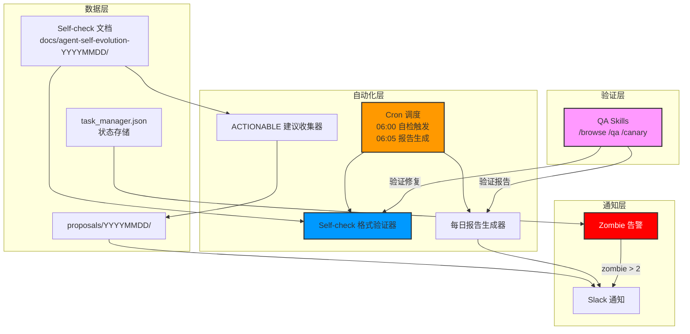
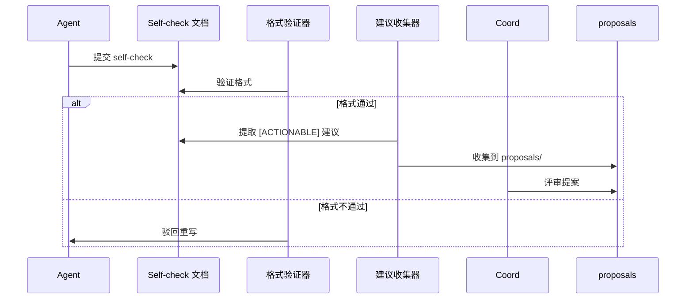
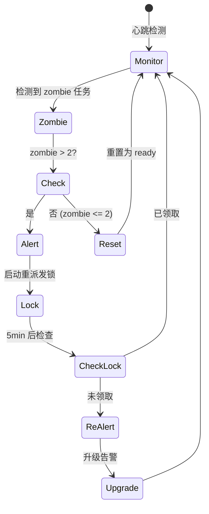
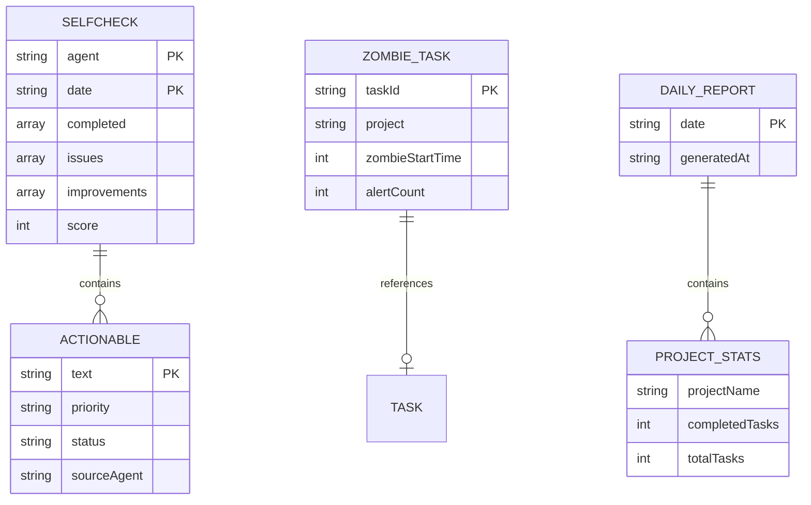

# Architecture: Agent 每日自检任务自动机

> **项目**: agent-self-evolution-20260330-daily
> **阶段**: design-architecture
> **版本**: 1.0.0
> **日期**: 2026-03-30
> **Architect**: Architect Agent
> **工作目录**: /root/.openclaw/vibex

---

## 执行决策
- **决策**: 已采纳
- **执行项目**: agent-self-evolution-20260330-daily
- **执行日期**: 2026-03-30

---

## 1. 概述

### 1.1 背景
当前 7 个 agent 每日通过心跳协调驱动多个并行项目，产生大量分散的 lessons learned 和改进建议，但未被系统性沉淀和转化。

### 1.2 目标
- 建立自检→分析→决策→行动 的完整闭环
- 实现知识沉淀自动化
- 提升异常检测响应速度

### 1.3 关键指标
| 指标 | 目标 |
|------|------|
| Self-check 提交率 | 100%（7/7 agent） |
| Zombie 检测响应时间 | < 30min |
| 改进建议闭环率 | ≥ 80% |

---

## 2. Tech Stack

| 层级 | 技术选型 | 理由 |
|------|----------|------|
| **自动化调度** | Cron (现有) | 每日定时触发，稳定可靠 |
| **脚本执行** | Bash + Python | 轻量，与现有工作流集成 |
| **状态存储** | JSON 文件 (现有 task_manager) | 已有基础设施 |
| **通知** | Slack API (现有) | 已有 openclaw slack 集成 |
| **模板验证** | Grep/RegEx | 轻量，无依赖 |
| **测试框架** | Vitest + Bash 测试 | 脚本测试 |

---

## 3. 架构图

### 3.1 系统架构



### 3.2 自检工作流



### 3.3 Zombie 检测流程



---

## 4. API 定义

### 4.1 Self-check 模板验证 API

```typescript
// src/scripts/selfcheck-validator.ts

interface ValidationResult {
  valid: boolean;
  errors: string[];
  warnings: string[];
}

interface SelfCheckTemplate {
  agent: string;        // required
  date: string;         // required: YYYY-MM-DD
  completed: string[];  // required: 今日完成事项
  issues: string[];     // required: 发现问题
  improvements: string[]; // required: 改进建议
  score: number;        // required: 1-10
  actionable?: string[]; // optional: [ACTIONABLE] 建议
}

const REQUIRED_FIELDS = ['agent', 'date', 'completed', 'issues', 'improvements', 'score'] as const;

/**
 * 验证 self-check 文档格式
 */
export function validateSelfCheck(doc: string): ValidationResult {
  const errors: string[] = [];
  const warnings: string[] = [];
  
  // 检查 frontmatter 或 table 格式
  const hasFrontmatter = doc.startsWith('---');
  const hasTable = doc.includes('|') && doc.includes('---');
  
  if (!hasFrontmatter && !hasTable) {
    errors.push('文档必须包含 YAML frontmatter 或 Markdown table 格式');
  }
  
  // 检查必需字段
  for (const field of REQUIRED_FIELDS) {
    if (!doc.includes(field)) {
      errors.push(`缺少必需字段: ${field}`);
    }
  }
  
  // 检查 score 范围
  const scoreMatch = doc.match(/score:\s*(\d+)/);
  if (scoreMatch) {
    const score = parseInt(scoreMatch[1], 10);
    if (score < 1 || score > 10) {
      errors.push(`score 必须在 1-10 范围内，当前: ${score}`);
    }
  }
  
  // 提取 actionable 建议
  const actionableMatches = doc.match(/\[ACTIONABLE\][^\n]+/g);
  if (actionableMatches && actionableMatches.length > 0) {
    warnings.push(`发现 ${actionableMatches.length} 个可执行建议`);
  }
  
  return {
    valid: errors.length === 0,
    errors,
    warnings
  };
}

/**
 * 解析 self-check 文档
 */
export function parseSelfCheck(doc: string): SelfCheckTemplate | null {
  const result = validateSelfCheck(doc);
  if (!result.valid) {
    return null;
  }
  
  // 简化解析实现
  const lines = doc.split('\n');
  const template: Partial<SelfCheckTemplate> = {};
  
  for (const line of lines) {
    if (line.startsWith('agent:')) template.agent = line.split(':')[1].trim();
    if (line.startsWith('date:')) template.date = line.split(':')[1].trim();
    if (line.startsWith('score:')) template.score = parseInt(line.split(':')[1].trim(), 10);
  }
  
  return template as SelfCheckTemplate;
}
```

### 4.2 ACTIONABLE 建议收集 API

```typescript
// src/scripts/actionable-collector.ts

interface ActionableItem {
  agent: string;
  suggestion: string;
  sourceFile: string;
}

/**
 * 从 self-check 文档中提取 [ACTIONABLE] 建议
 */
export function extractActionableSuggestions(
  docsDir: string,
  date: string
): ActionableItem[] {
  const items: ActionableItem[] = [];
  const pattern = /\[ACTIONABLE\]\s*(.+)/g;
  
  // 读取指定日期的所有 self-check 文档
  const files = glob.sync(`${docsDir}/agent-self-evolution-${date}/*-selfcheck*.md`);
  
  for (const file of files) {
    const content = fs.readFileSync(file, 'utf-8');
    const agent = extractAgentName(file);
    
    let match;
    while ((match = pattern.exec(content)) !== null) {
      items.push({
        agent,
        suggestion: match[1].trim(),
        sourceFile: file
      });
    }
  }
  
  return items;
}

/**
 * 将建议收集到 proposals 目录
 */
export function collectToProposals(items: ActionableItem[], date: string): void {
  const proposalsDir = `proposals/${date}`;
  fs.mkdirSync(proposalsDir, { recursive: true });
  
  const outputFile = `${proposalsDir}/actionable-suggestions.json`;
  fs.writeFileSync(outputFile, JSON.stringify(items, null, 2));
}
```

### 4.3 Zombie 告警 API

```typescript
// src/scripts/zombie-alert.ts

interface ZombieAlert {
  taskId: string;
  project: string;
  zombieTime: number; // minutes
  threshold: number;
}

interface AlertConfig {
  warningThreshold: number;  // default: 2
  criticalThreshold: number; // default: 5
  escalationTime: number;    // minutes: default: 30
  reAlertInterval: number;   // minutes: default: 5
}

/**
 * 检查 zombie 状态并发送告警
 */
export async function checkZombieAndAlert(
  taskManager: TaskManager,
  config: AlertConfig = DEFAULT_CONFIG
): Promise<ZombieAlert[]> {
  const zombies = await taskManager.getZombieTasks();
  const alerts: ZombieAlert[] = [];
  
  if (zombies.length > config.criticalThreshold) {
    // 超过临界值，升级告警
    await sendEscalationAlert(zombies, config);
  } else if (zombies.length > config.warningThreshold) {
    // 超过警告阈值，发送通知
    await sendWarningAlert(zombies, config);
  }
  
  // 记录 zombie 响应时间
  for (const zombie of zombies) {
    const responseTime = Date.now() - zombie.zombieStartTime;
    if (responseTime > config.escalationTime) {
      alerts.push({
        taskId: zombie.id,
        project: zombie.project,
        zombieTime: Math.floor(responseTime / 60000),
        threshold: config.escalationTime
      });
    }
  }
  
  return alerts;
}

const DEFAULT_CONFIG: AlertConfig = {
  warningThreshold: 2,
  criticalThreshold: 5,
  escalationTime: 30,
  reAlertInterval: 5
};
```

### 4.4 每日报告生成 API

```typescript
// src/scripts/daily-report.ts

interface DailyReport {
  date: string;
  completedProjects: number;
  totalTasks: number;
  zombieCount: number;
  suggestions: ActionableItem[];
  agentScores: Record<string, number>;
}

/**
 * 生成每日团队状态报告
 */
export function generateDailyReport(
  taskManager: TaskManager,
  suggestions: ActionableItem[],
  date: string
): DailyReport {
  const stats = taskManager.getStats(date);
  
  return {
    date,
    completedProjects: stats.completedProjects,
    totalTasks: stats.totalTasks,
    zombieCount: stats.zombieCount,
    suggestions,
    agentScores: stats.agentScores
  };
}

/**
 * 将报告保存为 Markdown
 */
export function saveReportAsMarkdown(report: DailyReport): string {
  return `# 每日团队状态报告 - ${report.date}

## 概览
- 完成项目数: ${report.completedProjects}
- 总任务数: ${report.totalTasks}
- Zombie 任务数: ${report.zombieCount}

## Agent 自检评分
${Object.entries(report.agentScores)
  .map(([agent, score]) => `- ${agent}: ${score}/10`)
  .join('\n')}

## 可执行改进建议
${report.suggestions.length === 0 
  ? '无' 
  : report.suggestions.map(s => `- [${s.agent}] ${s.suggestion}`).join('\n')}

---
自动生成于 ${new Date().toISOString()}
`;
}
```

---

## 5. 数据模型

### 5.1 核心实体

```typescript
// src/types/selfcheck.ts

interface SelfCheck {
  agent: string;
  date: string;
  completed: string[];
  issues: string[];
  improvements: string[];
  score: number;
  actionable?: ActionableSuggestion[];
}

interface ActionableSuggestion {
  text: string;
  priority: 'P0' | 'P1' | 'P2';
  status: 'pending' | 'accepted' | 'rejected' | 'implemented';
  sourceTask?: string;
}

// src/types/zombie.ts

interface ZombieTask {
  taskId: string;
  project: string;
  assignedTo: string;
  zombieStartTime: number;
  alertCount: number;
  lastAlertTime?: number;
}

// src/types/report.ts

interface DailyReport {
  date: string;
  generatedAt: string;
  projectStats: ProjectStats[];
  zombieStats: ZombieStats;
  suggestionStats: SuggestionStats;
}

interface ProjectStats {
  projectName: string;
  completedTasks: number;
  totalTasks: number;
  completionRate: number;
}
```

### 5.2 实体关系



---

## 6. 测试策略

### 6.1 测试框架

| 层级 | 框架 | 覆盖率要求 |
|------|------|-----------|
| Self-check 验证 | Vitest | ≥ 90% |
| ACTIONABLE 收集 | Vitest | ≥ 85% |
| Zombie 告警 | Vitest | ≥ 80% |
| 报告生成 | Vitest | ≥ 85% |
| 集成测试 | Bash 脚本 | 关键路径 100% |

### 6.2 核心测试用例

#### 6.2.1 格式验证测试

```typescript
// src/scripts/__tests__/selfcheck-validator.test.ts

describe('SelfCheckValidator', () => {
  it('有效文档应通过验证', () => {
    const validDoc = `---
agent: architect
date: 2026-03-30
score: 8
---
# Self-check
## 今日完成
- 架构设计完成
## 发现问题
- 无
## 改进建议
- [ACTIONABLE] 优化模板格式`;
    
    const result = validateSelfCheck(validDoc);
    expect(result.valid).toBe(true);
    expect(result.errors).toHaveLength(0);
  });

  it('缺少必需字段应失败', () => {
    const invalidDoc = `---
agent: architect
---`;
    
    const result = validateSelfCheck(invalidDoc);
    expect(result.valid).toBe(false);
    expect(result.errors.some(e => e.includes('date'))).toBe(true);
  });

  it('score 超范围应失败', () => {
    const invalidDoc = `---
agent: architect
date: 2026-03-30
score: 15
completed: []
issues: []
improvements: []
---`;
    
    const result = validateSelfCheck(invalidDoc);
    expect(result.valid).toBe(false);
    expect(result.errors.some(e => e.includes('1-10'))).toBe(true);
  });
});
```

#### 6.2.2 Zombie 告警测试

```typescript
// src/scripts/__tests__/zombie-alert.test.ts

describe('ZombieAlert', () => {
  it('zombie <= 2 应不发送告警', async () => {
    const mockZombies = [
      { id: 'z1', project: 'p1', zombieStartTime: Date.now() - 60000 }
    ];
    
    vi.mocked(taskManager.getZombieTasks).mockResolvedValue(mockZombies);
    
    const alerts = await checkZombieAndAlert(taskManager, {
      warningThreshold: 2,
      criticalThreshold: 5,
      escalationTime: 30,
      reAlertInterval: 5
    });
    
    expect(alerts).toHaveLength(0);
  });

  it('zombie > 2 应发送告警', async () => {
    const mockZombies = [
      { id: 'z1', project: 'p1', zombieStartTime: Date.now() - 60000 },
      { id: 'z2', project: 'p2', zombieStartTime: Date.now() - 60000 },
      { id: 'z3', project: 'p3', zombieStartTime: Date.now() - 60000 }
    ];
    
    vi.mocked(taskManager.getZombieTasks).mockResolvedValue(mockZombies);
    
    await checkZombieAndAlert(taskManager);
    
    expect(sendSlackMessage).toHaveBeenCalled();
  });
});
```

#### 6.2.3 报告生成测试

```typescript
// src/scripts/__tests__/daily-report.test.ts

describe('DailyReport', () => {
  it('应生成正确格式的报告', () => {
    const report = generateDailyReport(
      mockTaskManager,
      [],
      '2026-03-30'
    );
    
    expect(report.date).toBe('2026-03-30');
    expect(report.completedProjects).toBeGreaterThanOrEqual(0);
    expect(report.zombieCount).toBeGreaterThanOrEqual(0);
  });

  it('Markdown 格式应包含所有章节', () => {
    const report = generateDailyReport(mockTaskManager, [], '2026-03-30');
    const markdown = saveReportAsMarkdown(report);
    
    expect(markdown).toContain('## 概览');
    expect(markdown).toContain('## Agent 自检评分');
    expect(markdown).toContain('## 可执行改进建议');
  });
});
```

### 6.3 性能影响评估

| 操作 | 预估耗时 | 阈值 |
|------|----------|------|
| 格式验证（单文件） | < 10ms | < 50ms |
| ACTIONABLE 收集（全量） | < 1s | < 5s |
| Zombie 检查 | < 500ms | < 2s |
| 报告生成 | < 2s | < 10s |
| Cron 总执行 | < 10s | < 30s |

---

## 7. 兼容性设计

### 7.1 向后兼容
- 模板验证支持**双格式**（frontmatter + table）
- 现有 self-check 文档自动兼容
- 历史数据渐进式迁移

### 7.2 渐进式实施
1. **Phase 1**: 模板制定 + 格式验证
2. **Phase 2**: ACTIONABLE 收集 + 报告生成
3. **Phase 3**: Zombie 告警升级

---

## 8. 风险评估

| 风险 | 概率 | 影响 | 缓解 |
|------|------|------|------|
| 格式验证误报 | 中 | 低 | 支持两种格式，宽松验证 |
| 告警轰炸 | 低 | 高 | 5min 最小间隔 + 升级机制 |
| 报告堆积 | 低 | 低 | 归档策略 |

---

## 9. 相关文档

| 文档 | 路径 |
|------|------|
| PRD | `docs/agent-self-evolution-20260330-daily/prd.md` |
| 实现计划 | `docs/agent-self-evolution-20260330-daily/IMPLEMENTATION_PLAN.md` |
| 开发约束 | `docs/agent-self-evolution-20260330-daily/AGENTS.md` |

---

*本文档由 Architect Agent 生成，用于指导 dev 实现。*
