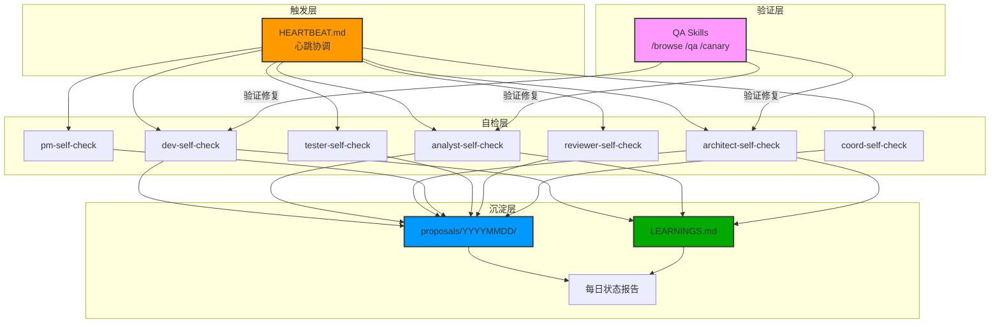
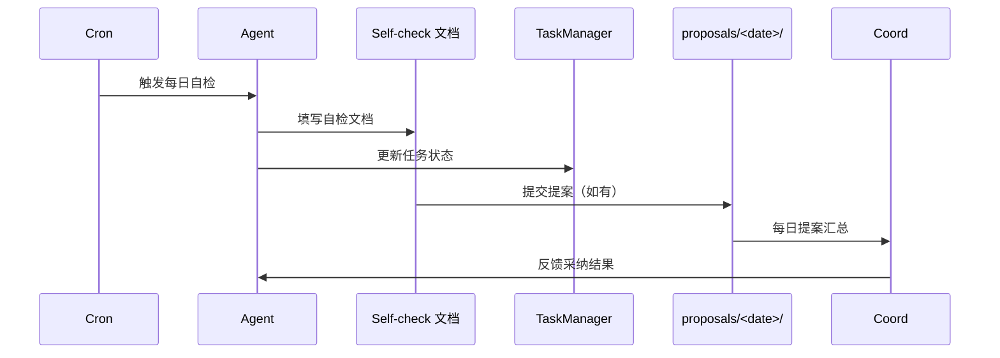
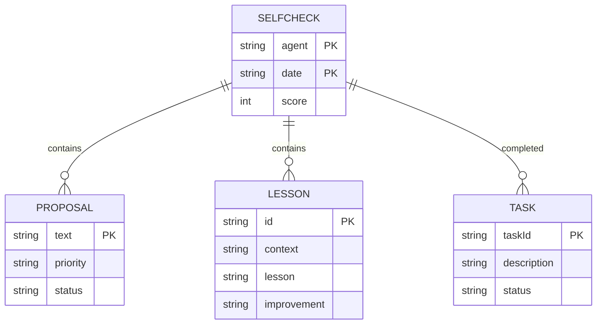

# Architecture: Agent 每日自检任务框架

> **项目**: agent-self-evolution-20260330
> **阶段**: design-architecture
> **版本**: 1.0.0
> **日期**: 2026-03-30
> **Architect**: Architect Agent
> **工作目录**: /root/.openclaw/vibex

---

## 执行决策
- **决策**: 已采纳
- **执行项目**: agent-self-evolution-20260330
- **执行日期**: 2026-03-30

---

## 1. 概述

### 1.1 背景
7 个 agent（dev、analyst、architect、pm、tester、reviewer、coord）每日通过心跳协调驱动多个并行项目，需要统一的自检任务框架确保知识沉淀和改进闭环。

### 1.2 目标
- 建立 7 个 agent 统一的每日自检任务标准
- 确保每项自检可追踪、可验收
- 将改进建议转化为可执行提案

### 1.3 关键指标
| 指标 | 目标 |
|------|------|
| 自检完成率 | 100%（7/7） |
| 提案采纳率 | ≥ 50% |
| 经验沉淀数量 | ≥ 3 条/日 |

---

## 2. Tech Stack

| 层级 | 技术选型 | 理由 |
|------|----------|------|
| **自检框架** | HEARTBEAT.md（现有） | 心跳驱动已完善 |
| **任务管理** | task_manager.py（现有） | 已有基础设施 |
| **文档存储** | Markdown + JSON | 轻量、可追溯 |
| **提案收集** | proposals/YYYYMMDD/ | 每日提案汇总 |
| **通知** | Slack（现有 openclaw） | 已有集成 |
| **测试** | Vitest | 现有项目已用 |

---

## 3. 架构图

### 3.1 系统架构



### 3.2 自检流程



---

## 4. API 定义

### 4.1 自检文档模板 API

```typescript
// src/types/self-check.ts

interface AgentSelfCheck {
  agent: string;
  date: string;
  tasksCompleted: TaskSummary[];
  qualityMetrics: QualityMetrics;
  proposals: Proposal[];
  lessonsLearned: Lesson[];
  score: number; // 1-10
}

interface TaskSummary {
  taskId: string;
  description: string;
  status: 'completed' | 'failed' | 'blocked';
}

interface QualityMetrics {
  technicalDebt?: boolean;
  interfaceCoverage?: number;
  accuracyScore?: number;
  acceptanceCriteriaFormat?: boolean;
}

interface Proposal {
  text: string;
  priority: 'P0' | 'P1' | 'P2';
  status: 'pending' | 'accepted' | 'rejected';
}

interface Lesson {
  id: string;
  context: string;
  lesson: string;
  improvement: string;
}
```

### 4.2 自检验证 API

```typescript
// src/scripts/validate-selfcheck.ts

interface ValidationResult {
  valid: boolean;
  errors: string[];
  warnings: string[];
}

/**
 * 验证自检文档完整性
 */
export function validateSelfCheck(doc: AgentSelfCheck): ValidationResult {
  const errors: string[] = [];
  const warnings: string[] = [];
  
  // 检查必需字段
  if (!doc.agent) errors.push('缺少 agent 字段');
  if (!doc.date) errors.push('缺少 date 字段');
  if (!doc.score || doc.score < 1 || doc.score > 10) {
    errors.push('score 必须在 1-10 范围内');
  }
  
  // 检查任务完成数
  if (doc.tasksCompleted.length === 0) {
    warnings.push('今日无任务完成');
  }
  
  // 检查提案
  if (doc.proposals.length === 0) {
    warnings.push('未提交改进提案');
  }
  
  return { valid: errors.length === 0, errors, warnings };
}
```

### 4.3 提案收集 API

```typescript
// src/scripts/collect-proposals.ts

interface DailyProposals {
  date: string;
  agents: string[];
  proposals: CollectedProposal[];
  summary: {
    total: number;
    byPriority: Record<string, number>;
    byAgent: Record<string, number>;
  };
}

interface CollectedProposal {
  agent: string;
  text: string;
  priority: 'P0' | 'P1' | 'P2';
  sourceFile: string;
}

/**
 * 收集指定日期的所有提案
 */
export function collectDailyProposals(
  docsDir: string,
  date: string
): DailyProposals {
  const proposals: CollectedProposal[] = [];
  const agents = new Set<string>();
  
  // 扫描所有自检文档
  const files = glob.sync(`${docsDir}/agent-self-evolution-${date}/*-selfcheck*.md`);
  
  for (const file of files) {
    const content = fs.readFileSync(file, 'utf-8');
    const agentName = extractAgentName(file);
    agents.add(agentName);
    
    // 提取提案（格式：- [PROPOSAL] xxx）
    const proposalPattern = /-\s*\[PROPOSAL\]\s*(.+)/g;
    let match;
    while ((match = proposalPattern.exec(content)) !== null) {
      proposals.push({
        agent: agentName,
        text: match[1].trim(),
        priority: guessPriority(match[1]),
        sourceFile: file
      });
    }
  }
  
  return {
    date,
    agents: Array.from(agents),
    proposals,
    summary: {
      total: proposals.length,
      byPriority: countBy(proposals, 'priority'),
      byAgent: countBy(proposals, 'agent')
    }
  };
}
```

### 4.4 经验沉淀 API

```typescript
// src/scripts/update-learnings.ts

interface LearningEntry {
  id: string;
  date: string;
  agent: string;
  context: string;
  lesson: string;
  improvement: string;
}

/**
 * 添加新经验到 LEARNINGS.md
 */
export function addLearning(entry: LearningEntry): void {
  const learningsPath = 'docs/LEARNINGS.md';
  const existing = fs.existsSync(learningsPath) 
    ? fs.readFileSync(learningsPath, 'utf-8') 
    : '# 经验沉淀\n\n';
  
  const newEntry = `\n## ${entry.id} | ${entry.date} | ${entry.agent}\n\n**情境**: ${entry.context}\n\n**经验**: ${entry.lesson}\n\n**改进**: ${entry.improvement}\n`;
  
  fs.appendFileSync(learningsPath, newEntry);
}
```

---

## 5. 数据模型

### 5.1 核心实体

```typescript
// src/types/self-check.ts

interface AgentSelfCheck {
  agent: string;           // agent 名称
  date: string;            // YYYY-MM-DD
  tasksCompleted: Task[];   // 今日完成的任务
  qualityMetrics: Metrics;  // 质量指标
  proposals: Proposal[];    // 改进提案
  lessonsLearned: Lesson[]; // 经验教训
  score: number;            // 自检评分 1-10
}

interface Task {
  taskId: string;
  description: string;
  status: 'completed' | 'failed' | 'blocked';
  blockedReason?: string;
}

interface Metrics {
  // Agent 特定指标
  [key: string]: number | boolean | undefined;
}

interface Proposal {
  text: string;
  priority: 'P0' | 'P1' | 'P2';
  status: 'pending' | 'accepted' | 'rejected';
  reason?: string;
}

interface Lesson {
  id: string;       // E001 格式
  context: string;  // 问题情境
  lesson: string;   // 经验
  improvement: string; // 改进行动
}
```

### 5.2 实体关系



---

## 6. 测试策略

### 6.1 测试框架

| 层级 | 框架 | 覆盖率要求 |
|------|------|-----------|
| 自检验证 | Vitest | ≥ 90% |
| 提案收集 | Vitest | ≥ 85% |
| 经验沉淀 | Vitest | ≥ 80% |
| 集成测试 | Bash | 关键路径 100% |

### 6.2 核心测试用例

```typescript
// src/scripts/__tests__/validate-selfcheck.test.ts

describe('SelfCheck Validation', () => {
  it('完整自检应通过验证', () => {
    const valid: AgentSelfCheck = {
      agent: 'architect',
      date: '2026-03-30',
      tasksCompleted: [{ taskId: 't1', description: 'test', status: 'completed' }],
      qualityMetrics: {},
      proposals: [{ text: '优化流程', priority: 'P1', status: 'pending' }],
      lessonsLearned: [],
      score: 8
    };
    
    const result = validateSelfCheck(valid);
    expect(result.valid).toBe(true);
  });

  it('缺少 score 应失败', () => {
    const invalid: AgentSelfCheck = {
      agent: 'architect',
      date: '2026-03-30',
      tasksCompleted: [],
      qualityMetrics: {},
      proposals: [],
      lessonsLearned: [],
      score: 0 // 无效
    };
    
    const result = validateSelfCheck(invalid);
    expect(result.valid).toBe(false);
    expect(result.errors.some(e => e.includes('1-10'))).toBe(true);
  });
});

// src/scripts/__tests__/collect-proposals.test.ts

describe('Proposal Collection', () => {
  it('应收集所有 [PROPOSAL] 标签', () => {
    const doc = `
## 改进建议
- [PROPOSAL] 优化流程
- 常规建议
- [PROPOSAL] P0 修复
    `;
    
    const proposals = extractProposals(doc);
    expect(proposals).toHaveLength(2);
    expect(proposals[0]).toContain('优化流程');
  });
});
```

### 6.3 性能影响评估

| 操作 | 预估耗时 | 阈值 |
|------|----------|------|
| 自检验证（单文件） | < 5ms | < 20ms |
| 提案收集（全量） | < 1s | < 5s |
| 经验沉淀写入 | < 10ms | < 50ms |

---

## 7. 验收标准

| Agent | 自检项 | 验收标准 |
|-------|--------|----------|
| analyst | 分析产出自检 | tasks >= 1 |
| analyst | 根因分析质量 | accuracy >= 7 |
| pm | PRD 产出自检 | tasks >= 1 |
| pm | Epic 拆分质量 | completeness >= 0.8 |
| architect | 架构设计数量 | designs >= 1 |
| architect | 接口完整性 | coverage >= 0.9 |
| dev | 代码提交数量 | commits >= 1 |
| dev | 测试覆盖率 | coverage >= 80% |
| tester | 测试用例执行 | tests >= 1 |
| tester | Bug 发现数 | bugs >= 0 |
| reviewer | 审查数量 | reviews >= 1 |
| reviewer | 问题定位准确 | accuracy >= 0.9 |
| coord | 项目协调数 | projects >= 1 |
| coord | 决策正确率 | accuracy >= 0.8 |

---

## 8. 相关文档

| 文档 | 路径 |
|------|------|
| PRD | `docs/agent-self-evolution-20260330/prd.md` |
| 实现计划 | `docs/agent-self-evolution-20260330/IMPLEMENTATION_PLAN.md` |
| 开发约束 | `docs/agent-self-evolution-20260330/AGENTS.md` |

---

*本文档由 Architect Agent 生成，用于指导各 agent 执行自检任务。*
