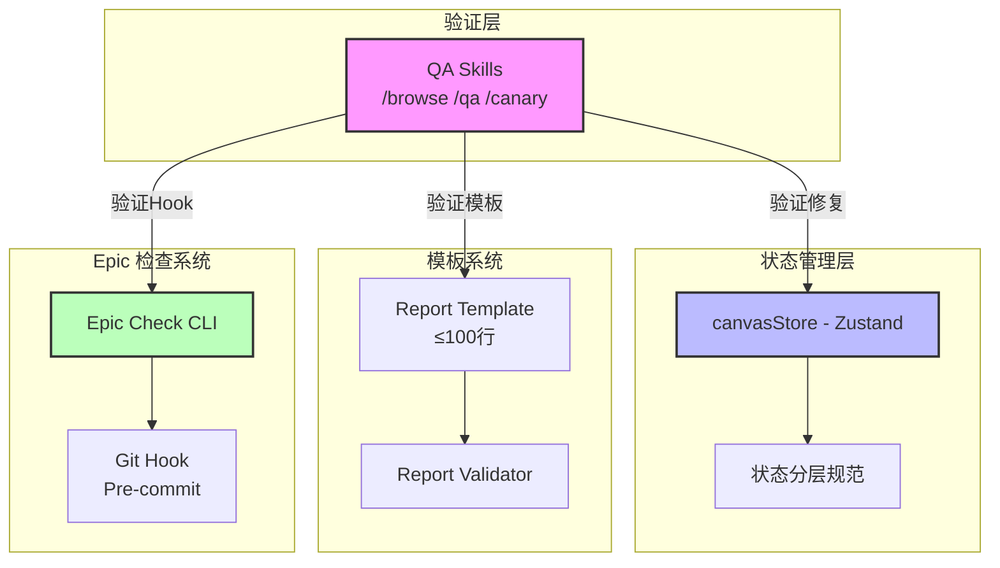
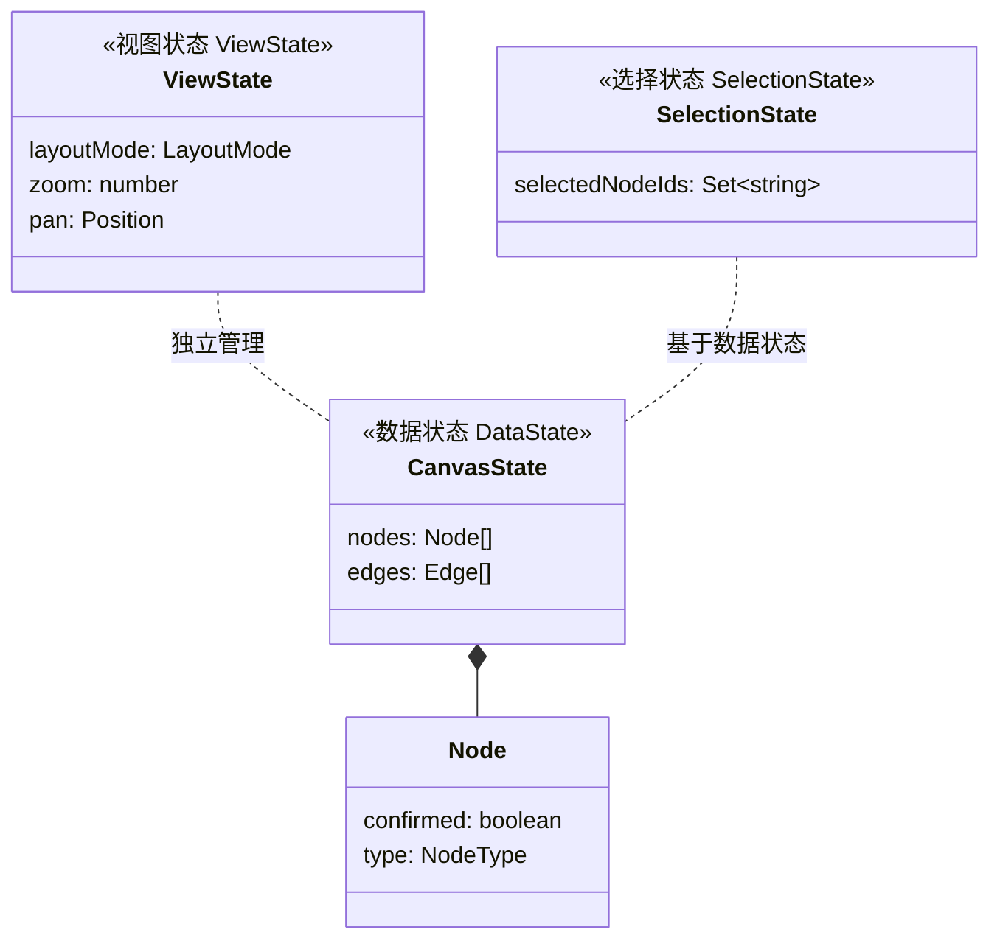

# Architecture: Agent 自我演进系统

> **项目**: agent-self-proposal-20260330  
> **阶段**: design-architecture  
> **版本**: 1.0.0  
> **日期**: 2026-03-30  
> **Architect**: Architect Agent  
> **工作目录**: /root/.openclaw/vibex

---

## 执行决策
- **决策**: 已采纳
- **执行项目**: agent-self-proposal-20260330
- **执行日期**: 2026-03-30

---

## 1. 概述

### 1.1 背景
各 Agent 通过每日自检发现工作流程中的问题，提出改进提案。当前存在三个核心问题：
1. **画布状态冲突**: `selectedNodeIds` vs `node.confirmed` 导致 checkbox/selection bug
2. **分析报告过长**: 报告 >200 行，影响阅读效率
3. **Epic 膨胀失控**: 规模不明确，缺乏自动化检查

### 1.2 目标
- 制定画布状态管理规范，消除多重状态冲突
- 优化分析报告模板（≤100 行）
- 建立 Epic 规模自动化检查机制

---

## 2. Tech Stack

| 层级 | 技术选型 | 理由 |
|------|----------|------|
| **状态管理层** | Zustand + Immer | 现有 canvasStore 已用，支持不可变更新 |
| **模板引擎** | 原生 TypeScript 模板字面量 | 轻量，无额外依赖 |
| **Pre-commit Hook** | Husky + lint-staged | 团队已有，成熟稳定 |
| **检查工具** | 自研 CLI (TypeScript) | 与现有工作流深度集成 |
| **测试框架** | Vitest + Testing Library | 现有项目已用 |
| **E2E 测试** | Playwright | 现有项目已用 |

---

## 3. 架构图

### 3.1 系统架构



### 3.2 状态分层模型



---

## 4. API 定义

### 4.1 状态管理 API

```typescript
// src/lib/canvas/state-layers.ts

/** 状态分层类型 */
export type StateLayer = 'data' | 'view' | 'selection';

/** 状态分层配置 */
export interface StateLayerConfig {
  layer: StateLayer;
  persistence: 'memory' | 'localStorage' | 'sync';
  conflictResolution: 'last-write-wins' | 'merge' | 'exclusive';
}

/**
 * 获取节点选择状态（从 SelectionState 而非 Node.confirmed）
 */
export function getNodeSelected(nodeId: string, selection: SelectionState): boolean {
  return selection.selectedNodeIds.has(nodeId);
}

/**
 * 获取节点确认状态（从 DataState）
 */
export function getNodeConfirmed(nodeId: string, data: DataState): boolean {
  return data.nodes.find(n => n.id === nodeId)?.confirmed ?? false;
}

/**
 * 验证状态一致性
 */
export function validateStateConsistency(
  selection: SelectionState,
  data: DataState
): StateConflict[] {
  const conflicts: StateConflict[] = [];
  
  for (const nodeId of selection.selectedNodeIds) {
    const node = data.nodes.find(n => n.id === nodeId);
    if (node && !node.confirmed) {
      conflicts.push({
        nodeId,
        issue: 'selected_but_not_confirmed',
        suggestion: '从 selectedNodeIds 中移除或标记 confirmed'
      });
    }
  }
  
  return conflicts;
}
```

### 4.2 模板系统 API

```typescript
// src/lib/templates/analysis-template.ts

/** 分析报告分段结构 */
export interface AnalysisReportSections {
  background: string;   // ≤10行
  findings: string;     // ≤30行
  proposal: string;     // ≤40行
  acceptance: string;   // ≤20行
}

/**
 * 验证报告行数
 */
export function validateReportLineCount(report: string): ValidationResult {
  const lines = report.split('\n').filter(l => l.trim().length > 0);
  const sectionCounts = countSectionLines(report);
  
  return {
    valid: lines.length <= 100 && Object.values(sectionCounts).every(
      (count, idx) => count <= [10, 30, 40, 20][idx]
    ),
    totalLines: lines.length,
    sectionLines: sectionCounts,
    errors: lines.length > 100 
      ? [`报告总行数 ${lines.length} 超过 100 行限制`]
      : []
  };
}

/**
 * 生成标准分析报告
 */
export function generateAnalysisReport(sections: AnalysisReportSections): string {
  return `
# 分析报告

## 背景
${sections.background}

## 发现
${sections.findings}

## 方案
${sections.proposal}

## 验收标准
${sections.acceptance}
  `.trim();
}
```

### 4.3 Epic 检查 CLI API

```typescript
// src/scripts/epic-check.ts

/** Epic 检查结果 */
export interface EpicCheckResult {
  epicId: string;
  totalPoints: number;
  storyCount: number;
  warnings: string[];
  blocked: boolean;
}

/**
 * 检查 Epic 规模
 * @param epicPath - Epic 文件路径或目录
 * @param maxPoints - 最大允许故事点（默认 16）
 */
export async function checkEpicScale(
  epicPath: string,
  maxPoints: number = 16
): Promise<EpicCheckResult> {
  const epic = await parseEpicFile(epicPath);
  const totalPoints = epic.stories.reduce((sum, s) => sum + s.points, 0);
  
  return {
    epicId: epic.id,
    totalPoints,
    storyCount: epic.stories.length,
    warnings: totalPoints > maxPoints 
      ? [`Epic 规模 ${totalPoints} 超过阈值 ${maxPoints}`]
      : [],
    blocked: totalPoints > maxPoints * 1.5 // 超过 1.5 倍才阻断
  };
}
```

---

## 5. 数据模型

### 5.1 核心实体

```typescript
// src/types/canvas-state.ts

/** 节点确认状态（数据层） */
interface NodeData {
  id: string;
  type: NodeType;
  confirmed: boolean;  // 数据状态：是否确认
  // 其他数据属性...
}

/** 选择状态（视图层） */
interface SelectionState {
  selectedNodeIds: Set<string>;  // 视图状态：选中列表
}

/** 布局状态（视图层） */
interface ViewState {
  layoutMode: 'default' | 'expand-both' | 'compact';
  zoom: number;
  pan: { x: number; y: number };
}

// src/types/epic.ts

/** Epic 实体 */
interface Epic {
  id: string;
  name: string;
  priority: 'P0' | 'P1' | 'P2';
  stories: Story[];
  totalPoints: number;
}

/** Story 实体 */
interface Story {
  id: string;
  points: number;  // 故事点
  status: 'todo' | 'in-progress' | 'done';
}
```

### 5.2 实体关系

```mermaid
erDiagram
    CANVAS ||--o{ NODE : contains
    CANVAS ||--o| VIEW_STATE : has
    CANVAS ||--o| SELECTION_STATE : has
    
    NODE {
        string id
        boolean confirmed
    }
    
    SELECTION_STATE {
        string[] selectedNodeIds
    }
    
    VIEW_STATE {
        string layoutMode
        number zoom
    }
    
    EPIC ||--o{ STORY : contains
    EPIC {
        string id PK
        string name
        string priority
    }
    
    STORY {
        string id PK
        int points
        string status
    }
```



---

## 6. 测试策略

### 6.1 测试框架

| 层级 | 框架 | 覆盖率要求 |
|------|------|-----------|
| 状态管理 | Vitest + @testing-library/react | ≥ 80% |
| 模板验证 | Vitest | ≥ 90% |
| CLI 工具 | Vitest | ≥ 85% |
| E2E | Playwright | 关键路径 100% |

### 6.2 核心测试用例

#### 6.2.1 状态冲突测试

```typescript
// src/lib/canvas/__tests__/state-layers.test.ts

describe('StateLayer 冲突检测', () => {
  it('应检测到 selectedNodeIds 与 node.confirmed 冲突', () => {
    const selection: SelectionState = {
      selectedNodeIds: new Set(['node-1', 'node-2'])
    };
    const data: DataState = {
      nodes: [
        { id: 'node-1', confirmed: false, type: 'component' },
        { id: 'node-2', confirmed: true, type: 'component' }
      ]
    };
    
    const conflicts = validateStateConsistency(selection, data);
    
    expect(conflicts).toHaveLength(1);
    expect(conflicts[0].nodeId).toBe('node-1');
    expect(conflicts[0].issue).toBe('selected_but_not_confirmed');
  });

  it('冲突解决后应无警告', () => {
    const selection: SelectionState = {
      selectedNodeIds: new Set(['node-1'])
    };
    const data: DataState = {
      nodes: [
        { id: 'node-1', confirmed: true, type: 'component' }
      ]
    };
    
    const conflicts = validateStateConsistency(selection, data);
    
    expect(conflicts).toHaveLength(0);
  });
});
```

#### 6.2.2 模板行数测试

```typescript
// src/lib/templates/__tests__/analysis-template.test.ts

describe('AnalysisReport 模板验证', () => {
  it('100行报告应通过验证', () => {
    const report = generateReport({ /* 100行内容 */ });
    const result = validateReportLineCount(report);
    
    expect(result.valid).toBe(true);
    expect(result.totalLines).toBeLessThanOrEqual(100);
  });

  it('150行报告应失败', () => {
    const report = generateReport({ /* 150行内容 */ });
    const result = validateReportLineCount(report);
    
    expect(result.valid).toBe(false);
    expect(result.errors[0]).toContain('超过 100 行限制');
  });

  it('各分段超限应报告具体位置', () => {
    const report = generateReport({ background: 15行内容 }); // 超过10行
    const result = validateReportLineCount(report);
    
    expect(result.valid).toBe(false);
    expect(result.sectionLines.background).toBeGreaterThan(10);
  });
});
```

#### 6.2.3 Epic 规模检查测试

```typescript
// src/scripts/__tests__/epic-check.test.ts

describe('EpicScaleCheck', () => {
  it('16点以内应无警告', async () => {
    const result = await checkEpicScale('epic-16points', 16);
    
    expect(result.warnings).toHaveLength(0);
    expect(result.blocked).toBe(false);
  });

  it('超过24点应阻断提交', async () => {
    const result = await checkEpicScale('epic-25points', 16);
    
    expect(result.warnings.length).toBeGreaterThan(0);
    expect(result.blocked).toBe(true);
  });

  it('17-24点应警告但不阻断', async () => {
    const result = await checkEpicScale('epic-20points', 16);
    
    expect(result.warnings.length).toBeGreaterThan(0);
    expect(result.blocked).toBe(false);
  });
});
```

### 6.3 性能影响评估

| 操作 | 当前耗时 | 预估增量 | 阈值 |
|------|----------|----------|------|
| 状态验证 | <1ms | +0.5ms | <5ms |
| 模板验证 | <1ms | +1ms | <5ms |
| Pre-commit hook | ~200ms | +100ms | <500ms |
| E2E 完整测试 | ~30s | +5s | <60s |

---

## 7. 兼容性设计

### 7.1 向后兼容
- 状态分层为**新增规范**，不修改现有 `canvasStore` 结构
- 冲突检测为**只读验证**，不拦截现有操作
- 模板系统为**可选采用**，不强制迁移

### 7.2 渐进式实施
1. **Phase 1**: 状态分层文档 + 审计工具（不改代码）
2. **Phase 2**: 冲突检测集成（只读）
3. **Phase 3**: 可选修复（开发者主动）

---

## 8. 风险评估

| 风险 | 概率 | 影响 | 缓解 |
|------|------|------|------|
| 状态验证误报 | 中 | 低 | 人工 review checklist |
| 模板采用率低 | 高 | 中 | 提示 + 模板市场 |
| Pre-commit 阻断开发 | 低 | 高 | 误报豁免机制 |

---

*本文档由 Architect Agent 生成，用于指导 dev 实现。*
