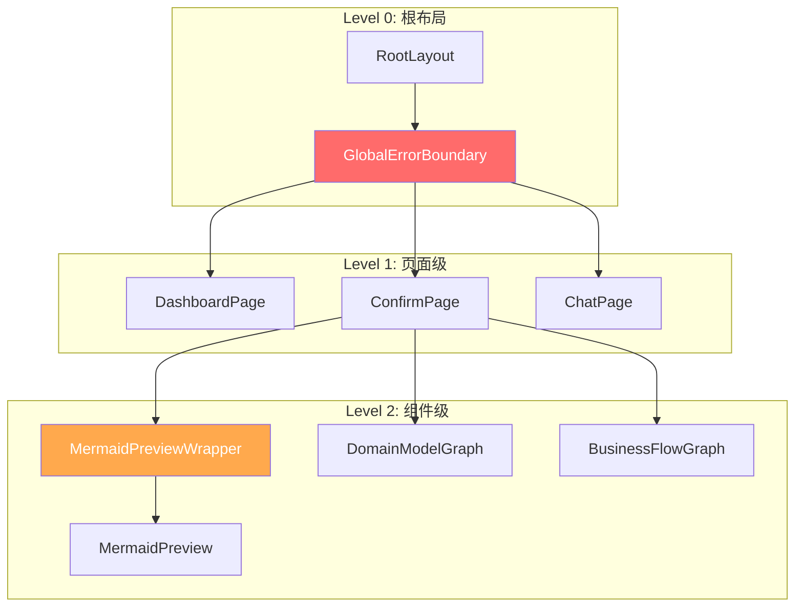
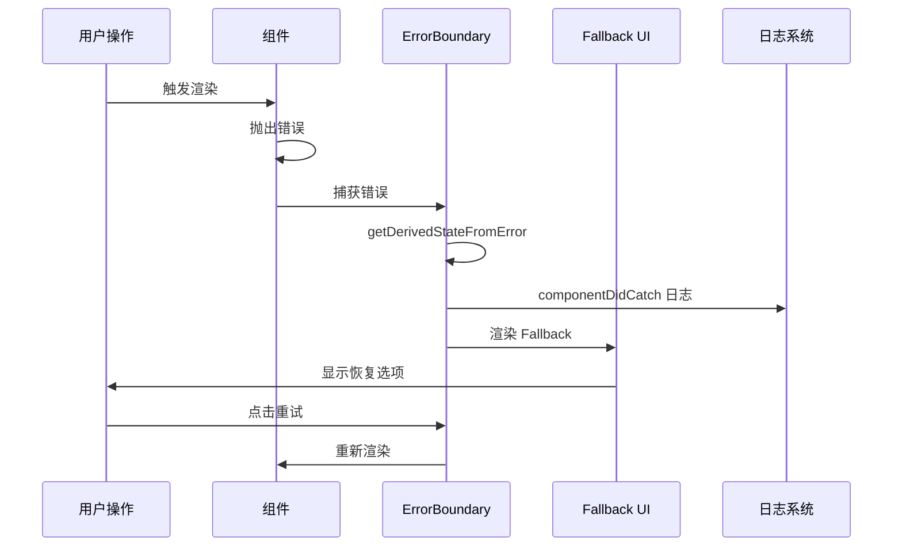
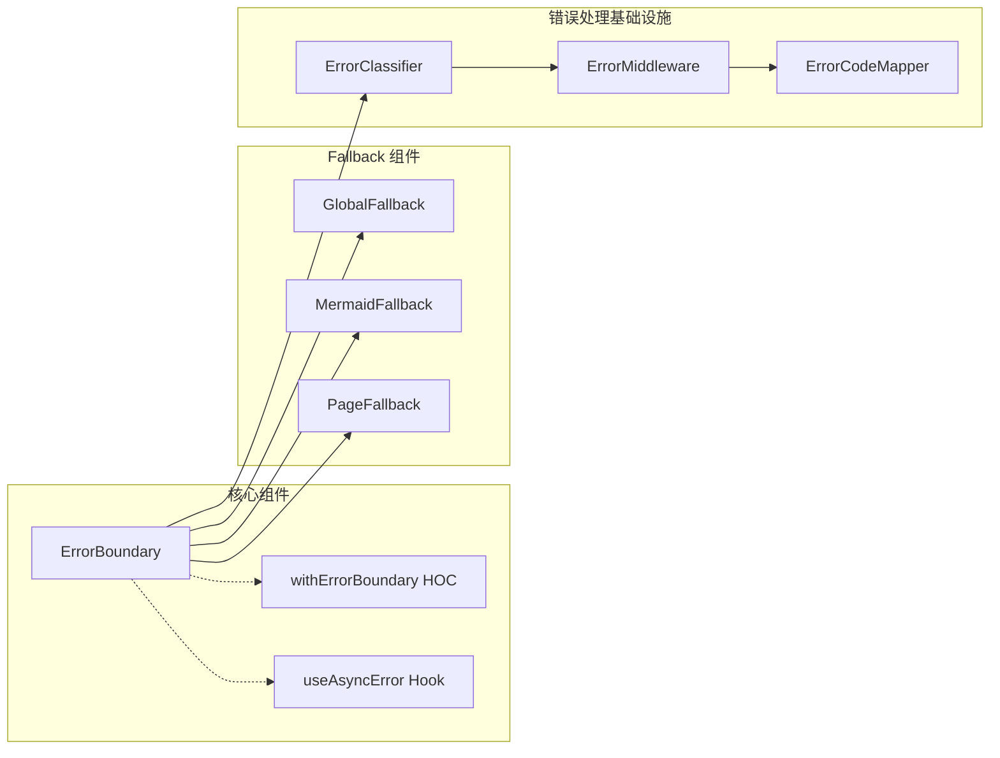

# ErrorBoundary 架构设计文档

**项目**: vibex-error-boundary  
**架构师**: Architect Agent  
**日期**: 2026-03-05  

---

## 1. 技术栈

| 技术 | 版本 | 选择理由 |
|-----|------|---------|
| React Error Boundary | 内置 | React 官方错误处理机制 |
| 类组件 | - | ErrorBoundary 必须使用类组件 |
| CSS Modules | 现有 | 复用现有样式方案 |
| TypeScript | 现有 | 类型安全 |

**复用现有实现**:
- `src/components/ui/ErrorBoundary.tsx` (99 行)
- `src/components/ui/ErrorBoundary.module.css` (120 行)

---

## 2. 架构图

### 2.1 分层部署架构



### 2.2 错误传播流程



### 2.3 组件依赖关系



---

## 3. 部署方案

### 3.1 优先级矩阵

| 优先级 | 部署位置 | 覆盖范围 | 风险等级 | 实施复杂度 |
|-------|---------|---------|---------|-----------|
| P0 | `app/layout.tsx` | 全局 | 🔴 高 | 低 |
| P1 | `MermaidPreview` | 图表渲染 | 🔴 高 | 低 |
| P2 | `app/confirm/*/page.tsx` | 确认流程 | 🟡 中 | 中 |
| P3 | 其他 Graph 组件 | 特定功能 | 🟡 中 | 中 |

### 3.2 P0: 根布局部署

```tsx
// app/layout.tsx
import { ErrorBoundary } from '@/components/ui/ErrorBoundary';

export default function RootLayout({ children }: { children: React.ReactNode }) {
  return (
    <html lang="zh-CN">
      <body>
        <ErrorBoundary>
          {children}
        </ErrorBoundary>
      </body>
    </html>
  );
}
```

### 3.3 P1: MermaidPreview 部署

```tsx
// components/ui/MermaidPreview.tsx
import { ErrorBoundary } from './ErrorBoundary';

interface MermaidErrorFallbackProps {
  code: string;
  error: Error;
  onRetry: () => void;
}

function MermaidErrorFallback({ code, error, onRetry }: MermaidErrorFallbackProps) {
  return (
    <div className={styles.errorContainer}>
      <div className={styles.errorIcon}>⚠️</div>
      <h3>图表渲染失败</h3>
      <p>无法渲染此图表，可能是语法错误。</p>
      <details>
        <summary>查看原始代码</summary>
        <pre>{code}</pre>
      </details>
      <div className={styles.errorActions}>
        <button onClick={onRetry}>重试</button>
      </div>
    </div>
  );
}

export function MermaidPreview(props: MermaidPreviewProps) {
  const [retryKey, setRetryKey] = useState(0);
  
  return (
    <ErrorBoundary
      key={retryKey}
      fallback={<MermaidErrorFallback code={props.code} error={error} onRetry={() => setRetryKey(k => k + 1)} />}
      onError={(error, errorInfo) => {
        console.error('MermaidPreview Error:', error);
        // 可选：上报错误到监控系统
      }}
    >
      <MermaidPreviewInner {...props} />
    </ErrorBoundary>
  );
}
```

### 3.4 统一导出入口

```tsx
// components/ui/index.ts
export { ErrorBoundary, withErrorBoundary, useAsyncError } from './ErrorBoundary';
export { MermaidErrorFallback } from './MermaidErrorFallback';
```

---

## 4. 数据模型

### 4.1 错误状态接口

```typescript
interface ErrorBoundaryState {
  hasError: boolean;
  error: Error | null;
  errorInfo: ErrorInfo | null;
}

interface ErrorBoundaryProps {
  children: React.ReactNode;
  fallback?: React.ReactNode | ((error: Error, retry: () => void) => React.ReactNode);
  onError?: (error: Error, errorInfo: ErrorInfo) => void;
  onRetry?: () => void;
}
```

### 4.2 错误分类模型

```typescript
enum ErrorSeverity {
  CRITICAL = 'critical',   // 应用级崩溃
  HIGH = 'high',          // 页面级崩溃
  MEDIUM = 'medium',      // 组件级崩溃
  LOW = 'low'             // 功能降级
}

interface ClassifiedError {
  severity: ErrorSeverity;
  category: string;
  message: string;
  stack?: string;
  componentStack?: string;
}
```

---

## 5. API 定义

### 5.1 ErrorBoundary 组件 API

```typescript
interface ErrorBoundaryAPI {
  // Props
  children: React.ReactNode;
  fallback?: ReactNode | FallbackRender;
  onError?: ErrorHandler;
  
  // 实例方法
  resetErrorBoundary(): void;
}

type FallbackRender = (params: {
  error: Error;
  resetErrorBoundary: () => void;
}) => React.ReactNode;

type ErrorHandler = (error: Error, info: ErrorInfo) => void;
```

### 5.2 withErrorBoundary HOC API

```typescript
function withErrorBoundary<P>(
  Component: React.ComponentType<P>,
  errorBoundaryProps?: Omit<ErrorBoundaryProps, 'children'>
): React.ComponentType<P>;
```

### 5.3 useAsyncError Hook API

```typescript
function useAsyncError(): {
  error: Error | null;
  setError: (error: Error) => void;
  resetError: () => void;
};
```

---

## 6. 测试策略

### 6.1 测试框架

| 框架 | 用途 |
|-----|------|
| Jest | 单元测试 |
| React Testing Library | 组件测试 |
| Playwright | E2E 测试 |

### 6.2 覆盖率要求

| 层级 | 覆盖率目标 |
|-----|-----------|
| 核心逻辑 | > 90% |
| 组件渲染 | > 80% |
| 边界情况 | > 70% |

### 6.3 核心测试用例

```typescript
describe('ErrorBoundary', () => {
  // TC-001: 捕获子组件渲染错误
  it('should catch rendering errors from children', () => {
    const ThrowError = () => { throw new Error('Test error'); };
    render(
      <ErrorBoundary fallback={<div>Error caught</div>}>
        <ThrowError />
      </ErrorBoundary>
    );
    expect(screen.getByText('Error caught')).toBeInTheDocument();
  });

  // TC-002: 重试功能
  it('should reset error state on retry', () => {
    const { rerender } = render(
      <ErrorBoundary>
        <ThrowOnFirstRender />
      </ErrorBoundary>
    );
    fireEvent.click(screen.getByText('重试'));
    expect(screen.queryByText('Error')).not.toBeInTheDocument();
  });

  // TC-003: 调用错误回调
  it('should call onError callback', () => {
    const onError = jest.fn();
    render(
      <ErrorBoundary onError={onError}>
        <ThrowError />
      </ErrorBoundary>
    );
    expect(onError).toHaveBeenCalledWith(
      expect.any(Error),
      expect.objectContaining({ componentStack: expect.any(String) })
    );
  });

  // TC-004: 自定义 Fallback
  it('should render custom fallback', () => {
    render(
      <ErrorBoundary fallback={<CustomErrorUI />}>
        <ThrowError />
      </ErrorBoundary>
    );
    expect(screen.getByTestId('custom-error-ui')).toBeInTheDocument();
  });

  // TC-005: 开发模式显示错误详情
  it('should show error details in development', () => {
    process.env.NODE_ENV = 'development';
    render(
      <ErrorBoundary>
        <ThrowError />
      </ErrorBoundary>
    );
    expect(screen.getByText(/Test error/)).toBeInTheDocument();
  });
});
```

### 6.4 E2E 测试场景

```typescript
// playwright/e2e/error-boundary.spec.ts
test('Mermaid 渲染错误不应导致应用崩溃', async ({ page }) => {
  await page.goto('/confirm/context');
  
  // 模拟 Mermaid 渲染错误
  await page.evaluate(() => {
    window.__simulateMermaidError = true;
  });
  
  // 验证应用仍然可用
  await expect(page.locator('text=图表渲染失败')).toBeVisible();
  await expect(page.locator('button:has-text("重试")')).toBeVisible();
  
  // 点击重试
  await page.click('button:has-text("重试")');
  await expect(page.locator('text=图表渲染失败')).not.toBeVisible();
});
```

---

## 7. 兼容性设计

### 7.1 服务端渲染兼容

```tsx
// ErrorBoundary 必须标记 'use client'
'use client';

export class ErrorBoundary extends React.Component { ... }
```

### 7.2 现有代码兼容

- **零侵入**: 不修改现有组件内部逻辑
- **包裹式**: 通过外层包裹添加保护
- **渐进式**: 可逐步添加到更多组件

### 7.3 Next.js App Router 兼容

```tsx
// layout.tsx 必须是服务端组件
// ErrorBoundary 作为 'use client' 组件可以包裹服务端组件的输出
export default function RootLayout({ children }) {
  return (
    <html>
      <body>
        <ErrorBoundary>{children}</ErrorBoundary>
      </body>
    </html>
  );
}
```

---

## 8. 监控与告警

### 8.1 错误上报

```typescript
// onError 回调中集成错误上报
<ErrorBoundary
  onError={(error, errorInfo) => {
    // 上报到监控系统 (如 Sentry)
    if (typeof window !== 'undefined' && window.__trackError) {
      window.__trackError({
        message: error.message,
        stack: error.stack,
        componentStack: errorInfo.componentStack,
        url: window.location.href,
        timestamp: new Date().toISOString(),
      });
    }
  }}
>
  {children}
</ErrorBoundary>
```

### 8.2 告警阈值

| 错误类型 | 阈值 | 告警级别 |
|---------|-----|---------|
| 全局错误 | > 5次/分钟 | 🔴 Critical |
| 组件错误 | > 10次/分钟 | 🟡 Warning |
| 单用户重复错误 | > 3次 | 🟢 Info |

---

## 9. 检查清单

### 9.1 实施检查

- [ ] 在 `app/layout.tsx` 部署全局 ErrorBoundary
- [ ] 为 `MermaidPreview` 添加组件级 ErrorBoundary
- [ ] 添加自定义 Fallback UI
- [ ] 配置错误回调 (onError)
- [ ] 验证 SSR 兼容性

### 9.2 测试检查

- [ ] 单元测试覆盖率 > 80%
- [ ] 模拟错误场景测试通过
- [ ] 重试功能测试通过
- [ ] E2E 测试通过

### 9.3 上线检查

- [ ] 开发环境验证
- [ ] 生产构建成功
- [ ] 部署后监控正常
- [ ] 无功能回归

---

## 10. 总结

### 10.1 设计原则

1. **复用现有**: 使用已有 ErrorBoundary 组件，不重复开发
2. **分层防护**: 全局 → 页面 → 组件三级保护
3. **最小侵入**: 不修改现有组件内部，仅外层包裹
4. **渐进增强**: 可逐步添加到更多位置

### 10.2 预期收益

| 收益 | 说明 |
|-----|------|
| 应用稳定性 | 渲染错误不再导致白屏 |
| 用户体验 | 提供清晰的错误恢复选项 |
| 可维护性 | 错误信息便于定位问题 |
| 监控能力 | 错误上报支持主动发现问题 |

### 10.3 风险评估

| 风险 | 可能性 | 影响 | 缓解措施 |
|-----|-------|------|---------|
| SSR 兼容问题 | 低 | 中 | 已标记 'use client' |
| 样式冲突 | 低 | 低 | 使用 CSS Module 隔离 |
| 错误信息泄露 | 中 | 中 | 仅开发模式显示详情 |

---

*文档版本: 1.0*  
*创建时间: 2026-03-05*  
*作者: Architect Agent*