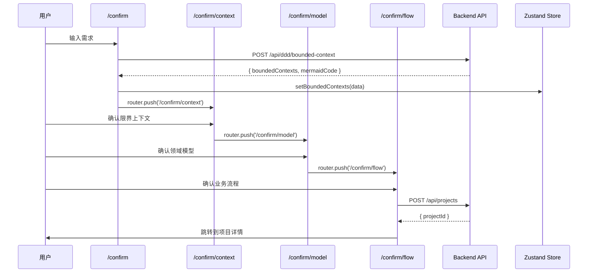

# 实现方案设计: 交互式确认流程修复 v2

**项目**: vibex-confirmation-flow-v2  
**版本**: 1.0  
**日期**: 2026-03-03  
**架构师**: Architect Agent

---

## 1. 技术栈选型

| 组件 | 技术选型 | 版本 | 理由 |
|------|---------|------|------|
| 前端框架 | Next.js | 14.x | 现有项目已使用 |
| 状态管理 | Zustand | 4.x | 现有项目已使用，轻量级 |
| UI 组件 | 自定义 + Tailwind | - | 与现有风格一致 |
| API 客户端 | fetch | - | 现有项目已使用 |
| 路由 | Next.js App Router | 14.x | 现有项目已使用 |

**复用组件**:
- `ConfirmationSteps.tsx` - 步骤指示器
- `api.ts` - API 服务函数
- `useConfirmationStore` - 确认流程状态

---

## 2. 系统架构图

```mermaid
graph TB
    subgraph 用户入口
        A[Dashboard] --> B[/confirm]
        C[/requirements/new] -.重定向.-> B
    end
    
    subgraph 确认流程
        B --> D[/confirm/context]
        D --> E[/confirm/model]
        E --> F[/confirm/flow]
        F --> G[/confirm/success]
    end
    
    subgraph API 层
        D --> H[POST /api/ddd/bounded-context]
        E --> I[POST /api/ddd/domain-model]
        F --> J[POST /api/ddd/business-flow]
    end
    
    subgraph 状态管理
        K[Zustand Store]
        D -.读写.-> K
        E -.读写.-> K
        F -.读写.-> K
    end
    
    style B fill:#90EE90
    style C fill:#FFB6C1
    style H fill:#87CEEB
    style I fill:#87CEEB
    style J fill:#87CEEB
```

---

## 3. Epic 实现方案

### Epic 1: 修复 `/requirements/new` API 调用

**修改文件**: `src/app/requirements/new/page.tsx`

**技术决策**:
- 采用方案 B：修改 `handleSubmit` 调用正确 API
- 保留页面作为备用入口

**代码修改**:

```typescript
// 第 34-57 行替换为:
const handleSubmit = async (e: React.FormEvent) => {
  e.preventDefault()
  
  if (!requirementData.content.trim()) {
    setError('请输入需求描述')
    return
  }
  
  setIsLoading(true)
  setError(null)
  
  try {
    const response = await generateBoundedContext(requirementData.content)
    
    if (response.success && response.boundedContexts) {
      // 更新 Zustand Store
      setBoundedContexts(response.boundedContexts)
      setMermaidCode(response.mermaidCode || '')
      
      // 跳转到确认流程
      router.push('/confirm/context')
    } else {
      setError('生成失败，请重试')
    }
  } catch (err) {
    console.error('API Error:', err)
    setError('网络错误，请检查连接')
  } finally {
    setIsLoading(false)
  }
}
```

**依赖**: `useConfirmationStore` 中的 `setBoundedContexts` 和 `setMermaidCode`

---

### Epic 2: 统一入口页面

**修改文件**:

| 文件 | 修改内容 |
|------|---------|
| `src/app/requirements/new/page.tsx` | 添加重定向逻辑 |
| `src/app/dashboard/page.tsx` | 更新链接 |
| `src/components/Navigation.tsx` | 更新导航链接 |

**技术决策**:
- `/requirements/new` 重定向到 `/confirm`
- Dashboard "新需求" 链接指向 `/confirm`
- 保留 `/requirements/new` 文件用于向后兼容

**代码修改**:

```typescript
// src/app/requirements/new/page.tsx - 添加重定向
'use client'

import { useEffect } from 'react'
import { useRouter } from 'next/navigation'

export default function RequirementsNewPage() {
  const router = useRouter()
  
  useEffect(() => {
    router.replace('/confirm')
  }, [router])
  
  return (
    <div className="flex items-center justify-center min-h-screen">
      <p>正在跳转到需求输入页面...</p>
    </div>
  )
}
```

```typescript
// src/app/dashboard/page.tsx - 更新链接
// 将 href="/requirements/new" 改为 href="/confirm"
<Link href="/confirm" className="...">
  新需求
</Link>
```

---

### Epic 3: `/confirm/context` 空状态处理

**修改文件**: `src/app/confirm/context/page.tsx`

**技术决策**:
- 使用 `useEffect` 检测空数据
- 显示 Toast 提示后自动跳转
- 使用 `router.replace` 避免返回

**代码修改**:

```typescript
// 在组件顶部添加
import { toast } from 'sonner'

// 在现有 useEffect 前添加
useEffect(() => {
  // 空状态检测与处理
  if (boundedContexts.length === 0 && !isLoading) {
    toast.warning('请先输入需求描述')
    // 延迟跳转，让用户看到提示
    const timer = setTimeout(() => {
      router.replace('/confirm')
    }, 1500)
    
    return () => clearTimeout(timer)
  }
}, [boundedContexts.length, isLoading, router])
```

---

### Epic 4: `/domain` 页面集成确认流程

**修改文件**: `src/app/domain/page.tsx`

**技术决策**:
- 添加步骤指示器
- 添加确认按钮
- 保持现有编辑功能

**代码修改**:

```typescript
// 添加导入
import { ConfirmationSteps } from '@/components/ui/ConfirmationSteps'
import { useConfirmationStore } from '@/stores/confirmationStore'

// 在页面布局中添加
export default function DomainPage() {
  const router = useRouter()
  const { domainModel, setDomainModel } = useConfirmationStore()
  
  const handleConfirm = () => {
    // 保存当前领域模型数据
    setDomainModel(domainModel)
    // 跳转到下一步
    router.push('/confirm/model')
  }
  
  return (
    <div className="min-h-screen">
      {/* 步骤指示器 */}
      <ConfirmationSteps currentStep={2} />
      
      {/* 现有内容 */}
      <main className="...">
        {/* ... 现有代码 ... */}
      </main>
      
      {/* 底部确认按钮 */}
      <div className="fixed bottom-0 left-0 right-0 bg-white border-t p-4">
        <div className="max-w-7xl mx-auto flex justify-end gap-4">
          <Button variant="outline" onClick={() => router.back()}>
            返回修改
          </Button>
          <Button onClick={handleConfirm}>
            确认，继续
          </Button>
        </div>
      </div>
    </div>
  )
}
```

---

### Epic 5: 步骤指示器全局集成

**修改文件**: `src/components/ui/ConfirmationSteps.tsx`

**技术决策**:
- 扩展现有组件支持点击回退
- 添加已完成步骤的可点击状态

**代码修改**:

```typescript
interface ConfirmationStepsProps {
  currentStep: number
  onStepClick?: (step: number) => void
}

export function ConfirmationSteps({ currentStep, onStepClick }: ConfirmationStepsProps) {
  const steps = [
    { number: 1, label: '需求输入', path: '/confirm' },
    { number: 2, label: '限界上下文', path: '/confirm/context' },
    { number: 3, label: '领域模型', path: '/confirm/model' },
    { number: 4, label: '业务流程', path: '/confirm/flow' },
    { number: 5, label: '完成', path: '/confirm/success' },
  ]
  
  return (
    <div className="flex items-center justify-center py-4">
      {steps.map((step, index) => {
        const isCompleted = step.number < currentStep
        const isCurrent = step.number === currentStep
        
        return (
          <div key={step.number} className="flex items-center">
            <button
              onClick={() => isCompleted && onStepClick?.(step.number)}
              disabled={!isCompleted}
              className={cn(
                "flex items-center justify-center w-10 h-10 rounded-full",
                isCompleted && "bg-green-500 text-white cursor-pointer hover:bg-green-600",
                isCurrent && "bg-blue-500 text-white",
                !isCompleted && !isCurrent && "bg-gray-200 text-gray-500"
              )}
            >
              {isCompleted ? '✓' : step.number}
            </button>
            
            <span className={cn(
              "ml-2 text-sm",
              isCurrent ? "font-semibold" : "text-gray-500"
            )}>
              {step.label}
            </span>
            
            {index < steps.length - 1 && (
              <div className="w-12 h-0.5 bg-gray-200 mx-2" />
            )}
          </div>
        )
      })}
    </div>
  )
}
```

---

## 4. 文件修改清单

| 文件路径 | Epic | 修改类型 | 风险 |
|---------|------|---------|------|
| `src/app/requirements/new/page.tsx` | E1, E2 | 重写 | 低 |
| `src/app/confirm/context/page.tsx` | E3 | 新增逻辑 | 低 |
| `src/app/domain/page.tsx` | E4 | 新增组件 | 中 |
| `src/app/dashboard/page.tsx` | E2 | 链接修改 | 低 |
| `src/components/ui/ConfirmationSteps.tsx` | E5 | 扩展功能 | 低 |

---

## 5. 数据流设计



---

## 6. 测试策略

### 单元测试

| Epic | 测试文件 | 测试用例 |
|------|---------|---------|
| E1 | `requirements-new.test.tsx` | API 调用、Loading 状态、错误处理 |
| E2 | `requirements-redirect.test.tsx` | 重定向逻辑 |
| E3 | `confirm-context-empty.test.tsx` | 空状态检测、跳转逻辑 |
| E4 | `domain-integration.test.tsx` | 步骤指示器、确认按钮 |
| E5 | `confirmation-steps.test.tsx` | 点击回退、状态显示 |

### E2E 测试

```typescript
// e2e/confirmation-flow.spec.ts
test('完整确认流程', async ({ page }) => {
  // 从 Dashboard 进入
  await page.goto('/dashboard')
  await page.click('text=新需求')
  
  // 验证进入 /confirm
  await expect(page).toHaveURL('/confirm')
  
  // 输入需求
  await page.fill('textarea', '构建一个电商系统')
  await page.click('text=开始生成')
  
  // 验证 API 调用
  await page.waitForResponse(resp => 
    resp.url().includes('/api/ddd/bounded-context')
  )
  
  // 验证跳转到 /confirm/context
  await expect(page).toHaveURL('/confirm/context')
  
  // 继续后续步骤...
})
```

---

## 7. 风险与缓解

| 风险 | 影响 | 概率 | 缓解措施 |
|------|------|------|---------|
| API 响应超时 | 用户等待 | 中 | 添加 30s 超时和重试机制 |
| 回退丢失数据 | 用户体验 | 高 | 使用 Zustand persist 中间件 |
| 旧链接失效 | SEO | 低 | 添加 301 重定向 |

---

## 8. 部署检查清单

- [ ] 所有单元测试通过
- [ ] E2E 测试通过
- [ ] `npm run build` 成功
- [ ] API 端点可访问
- [ ] 重定向正确配置

---

*文档版本: 1.0*  
*创建时间: 2026-03-03*  
*作者: Architect Agent*