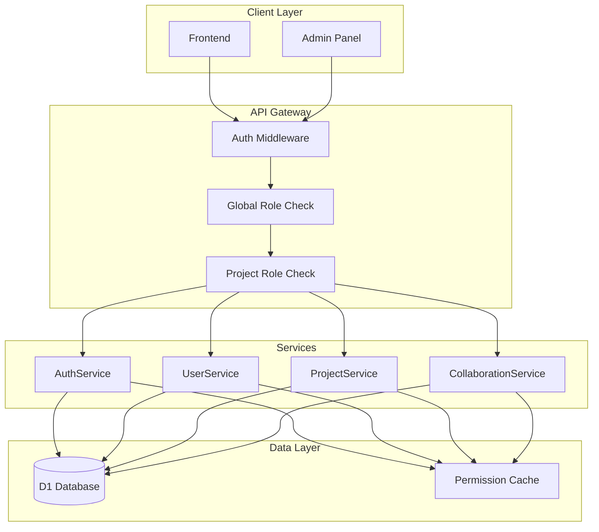
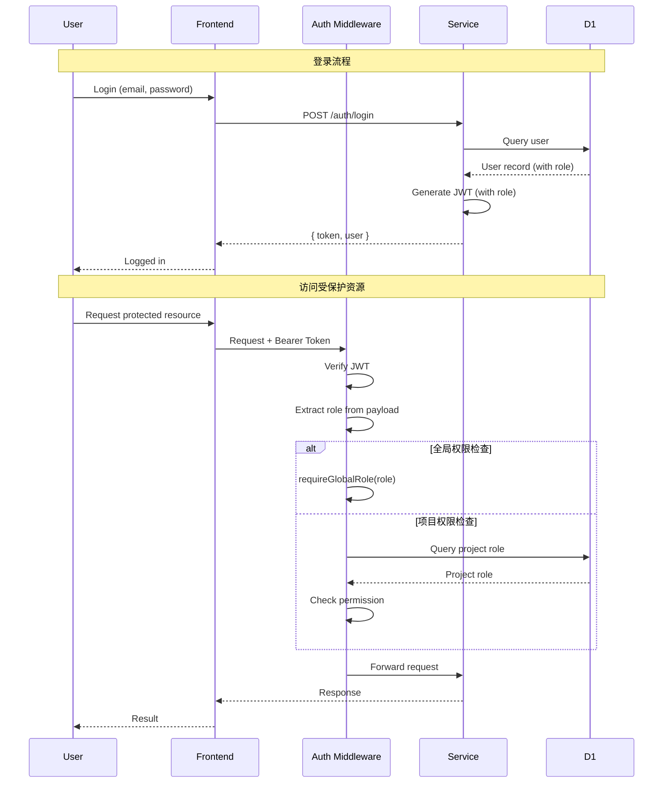
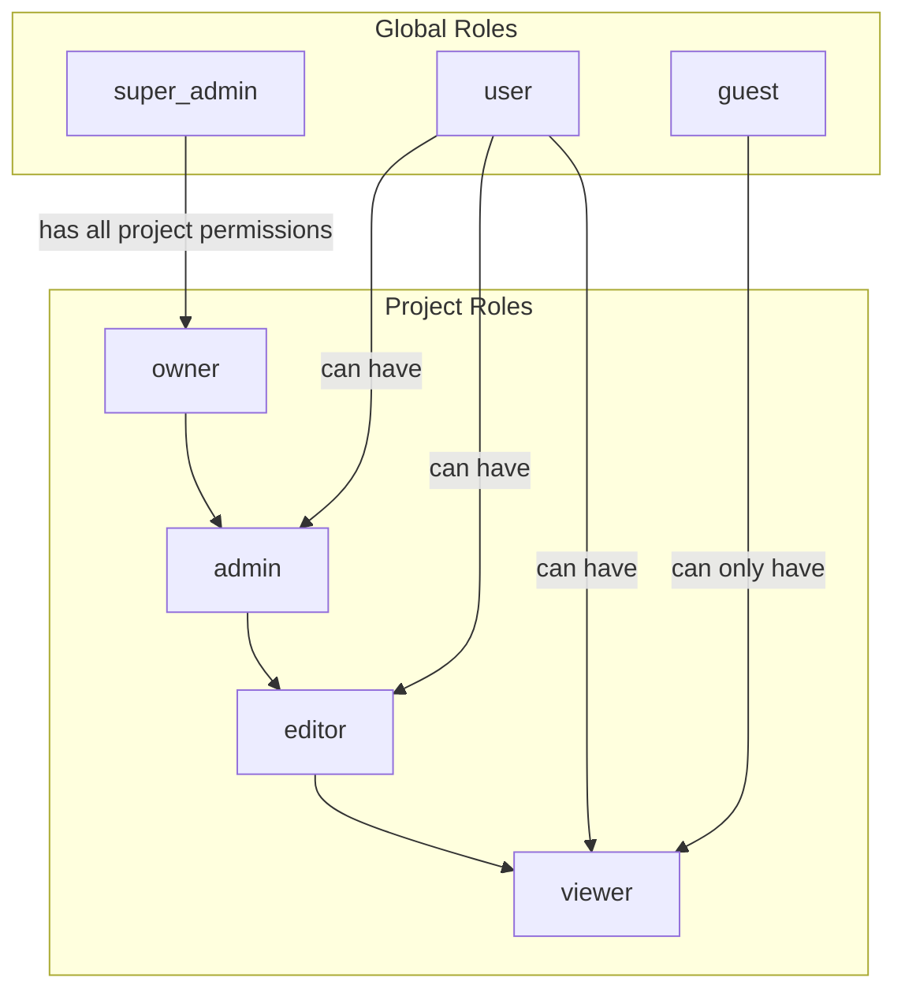
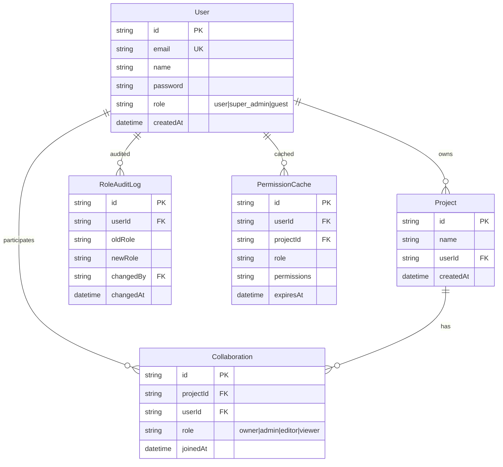

# 架构设计: RBAC 权限系统

**项目**: vibex-auth-rbac  
**版本**: 1.0  
**日期**: 2026-03-04  
**架构师**: Architect Agent  
**上游文档**: [PRD](../output/auth-role-prd.md)

---

## 1. Tech Stack (技术栈)

### 1.1 技术选型

| 组件 | 版本 | 选择理由 |
|------|------|----------|
| **认证框架** | JWT (jsonwebtoken 9.0) | 现有方案，扩展 Payload |
| **数据库** | Cloudflare D1 | 现有数据库，添加 role 字段 |
| **中间件** | Hono Middleware | 复用现有框架 |
| **权限模型** | RBAC | 标准 Role-Based Access Control |

### 1.2 ADR 决策记录

#### ADR-001: 两级角色体系

**决策**: 实现全局角色 + 项目角色的两级体系

**理由**:
- **全局角色**: 控制系统级权限（如管理后台）
- **项目角色**: 控制项目级权限（已存在的协作系统）
- 分离关注点，避免权限膨胀

**角色定义**:

| 层级 | 角色 | 权限 |
|------|------|------|
| **全局** | `super_admin` | 管理所有用户、项目、系统配置 |
| **全局** | `user` | 创建项目、管理自己的项目 |
| **全局** | `guest` | 只读访问公开项目 |
| **项目** | `owner` | 项目所有者，所有权限 |
| **项目** | `admin` | 项目管理，可邀请成员 |
| **项目** | `editor` | 编辑内容，不可删除 |
| **项目** | `viewer` | 只读访问 |

#### ADR-002: JWT Token 扩展方案

**决策**: 在 JWT Payload 中添加 `role` 字段，保持向后兼容

**理由**:
- 无需额外查询即可判断全局权限
- 简单直接，符合现有架构
- 向后兼容：旧 Token 无 role 字段时默认为 `user`

#### ADR-003: 权限检查中间件分层

**决策**: 实现 `requireGlobalRole` 和 `requireProjectRole` 两层中间件

**理由**:
- 分离全局和项目权限检查
- 可组合使用
- 易于测试和维护

---

## 2. Architecture Diagram (架构图)

### 2.1 权限系统架构



### 2.2 认证授权流程



### 2.3 权限继承关系



---

## 3. API Definitions (接口设计)

### 3.1 认证 API 扩展

#### POST /api/auth/login (扩展)

```typescript
// Response (扩展)
interface LoginResponse {
  token: string;
  user: {
    id: string;
    email: string;
    name: string;
    role: GlobalRole;  // 新增
  };
}
```

#### GET /api/auth/me (新增)

```typescript
// Response
interface MeResponse {
  user: {
    id: string;
    email: string;
    name: string;
    role: GlobalRole;
    createdAt: string;
  };
}
```

### 3.2 用户管理 API (管理员)

#### GET /api/admin/users

```typescript
// Request
interface GetUsersRequest {
  page?: number;
  limit?: number;
  role?: GlobalRole;
  search?: string;
}

// Response
interface GetUsersResponse {
  users: Array<{
    id: string;
    email: string;
    name: string;
    role: GlobalRole;
    createdAt: string;
    projectCount: number;
  }>;
  total: number;
  page: number;
  limit: number;
}
```

#### PATCH /api/admin/users/:id/role

```typescript
// Request
interface UpdateUserRoleRequest {
  role: GlobalRole;
}

// Response
interface UpdateUserRoleResponse {
  user: {
    id: string;
    role: GlobalRole;
  };
}
```

### 3.3 权限检查中间件

```typescript
// 使用示例
app.get('/admin/users', 
  requireAuth(),
  requireGlobalRole('super_admin'),
  getUsersHandler
);

app.delete('/projects/:id',
  requireAuth(),
  requireProjectRole('owner', 'admin'),
  deleteProjectHandler
);
```

---

## 4. Data Model (数据模型)

### 4.1 数据库 Schema 变更

```sql
-- Migration: 0006_user_role.sql

-- 1. 添加全局角色字段
ALTER TABLE User ADD COLUMN role TEXT DEFAULT 'user' CHECK (
  role IN ('super_admin', 'user', 'guest')
);

-- 2. 创建索引
CREATE INDEX idx_user_role ON User(role);

-- 3. 设置现有用户默认角色
UPDATE User SET role = 'user' WHERE role IS NULL;

-- 4. 创建角色变更审计表
CREATE TABLE IF NOT EXISTS RoleAuditLog (
  id TEXT PRIMARY KEY,
  userId TEXT NOT NULL,
  oldRole TEXT,
  newRole TEXT NOT NULL,
  changedBy TEXT NOT NULL,
  changedAt TEXT DEFAULT (datetime('now')),
  reason TEXT,
  FOREIGN KEY (userId) REFERENCES User(id),
  FOREIGN KEY (changedBy) REFERENCES User(id)
);

-- 5. 创建权限缓存表
CREATE TABLE IF NOT EXISTS PermissionCache (
  id TEXT PRIMARY KEY,
  userId TEXT NOT NULL,
  projectId TEXT NOT NULL,
  role TEXT NOT NULL,
  permissions TEXT,  -- JSON array
  cachedAt TEXT DEFAULT (datetime('now')),
  expiresAt TEXT NOT NULL,
  FOREIGN KEY (userId) REFERENCES User(id),
  FOREIGN KEY (projectId) REFERENCES Project(id),
  UNIQUE(userId, projectId)
);

CREATE INDEX idx_permission_cache_user ON PermissionCache(userId);
CREATE INDEX idx_permission_cache_expires ON PermissionCache(expiresAt);
```

### 4.2 类型定义

```typescript
// vibex-backend/src/lib/auth.ts

/**
 * 全局用户角色
 */
export type GlobalRole = 'super_admin' | 'user' | 'guest';

/**
 * 项目协作者角色
 */
export type ProjectRole = 'owner' | 'admin' | 'editor' | 'viewer';

/**
 * JWT Payload (扩展)
 */
export interface JWTPayload {
  userId: string;
  email: string;
  role: GlobalRole;  // 新增
  iat: number;
  exp: number;
}

/**
 * 全局角色权限
 */
export const GLOBAL_PERMISSIONS: Record<GlobalRole, string[]> = {
  super_admin: [
    'manage_all_users',
    'manage_all_projects',
    'view_admin_panel',
    'manage_system_settings',
    'view_audit_logs',
  ],
  user: [
    'create_project',
    'manage_own_projects',
    'invite_collaborators',
  ],
  guest: [
    'view_public_projects',
  ],
};

/**
 * 项目角色权限
 */
export const PROJECT_PERMISSIONS: Record<ProjectRole, string[]> = {
  owner: ['read', 'write', 'delete', 'manage', 'invite', 'transfer_ownership'],
  admin: ['read', 'write', 'delete', 'manage', 'invite'],
  editor: ['read', 'write', 'invite'],
  viewer: ['read'],
};
```

### 4.3 ER 图



---

## 5. Core Implementation (核心实现)

### 5.1 Auth 模块扩展

```typescript
// vibex-backend/src/lib/auth.ts

import { sign, verify } from 'jsonwebtoken';
import type { Context, Next } from 'hono';

const JWT_SECRET = process.env.JWT_SECRET || 'your-secret-key';

/**
 * 扩展的 JWT Payload
 */
export interface JWTPayload {
  userId: string;
  email: string;
  role: GlobalRole;
  iat: number;
  exp: number;
}

/**
 * 生成 JWT Token (扩展)
 */
export function generateToken(user: { id: string; email: string; role: GlobalRole }): string {
  const payload: JWTPayload = {
    userId: user.id,
    email: user.email,
    role: user.role,
    iat: Math.floor(Date.now() / 1000),
    exp: Math.floor(Date.now() / 1000) + 7 * 24 * 60 * 60, // 7 days
  };
  
  return sign(payload, JWT_SECRET);
}

/**
 * 验证 JWT Token
 */
export function verifyToken(token: string): JWTPayload | null {
  try {
    return verify(token, JWT_SECRET) as JWTPayload;
  } catch {
    return null;
  }
}

/**
 * 认证中间件
 */
export async function requireAuth(c: Context, next: Next): Promise<Response | void> {
  const authHeader = c.req.header('Authorization');
  
  if (!authHeader?.startsWith('Bearer ')) {
    return c.json({ success: false, error: 'Authentication required' }, 401);
  }
  
  const token = authHeader.slice(7);
  const payload = verifyToken(token);
  
  if (!payload) {
    return c.json({ success: false, error: 'Invalid or expired token' }, 401);
  }
  
  // 向后兼容：无 role 字段时默认为 user
  if (!payload.role) {
    payload.role = 'user';
  }
  
  c.set('user', payload);
  await next();
}

/**
 * 全局角色检查中间件
 */
export function requireGlobalRole(requiredRole: GlobalRole) {
  const roleHierarchy: Record<GlobalRole, number> = {
    super_admin: 3,
    user: 2,
    guest: 1,
  };
  
  return async (c: Context, next: Next): Promise<Response | void> => {
    const user = c.get('user') as JWTPayload | undefined;
    
    if (!user) {
      return c.json({ success: false, error: 'Authentication required' }, 401);
    }
    
    const userLevel = roleHierarchy[user.role] || 0;
    const requiredLevel = roleHierarchy[requiredRole] || 0;
    
    if (userLevel < requiredLevel) {
      return c.json({ 
        success: false, 
        error: 'Insufficient permissions',
        required: requiredRole,
        current: user.role,
      }, 403);
    }
    
    await next();
  };
}

/**
 * 项目角色检查中间件
 */
export function requireProjectRole(...allowedRoles: ProjectRole[]) {
  return async (c: Context, next: Next): Promise<Response | void> => {
    const user = c.get('user') as JWTPayload | undefined;
    const projectId = c.req.param('projectId') || c.req.query('projectId');
    
    if (!user) {
      return c.json({ success: false, error: 'Authentication required' }, 401);
    }
    
    if (!projectId) {
      return c.json({ success: false, error: 'Project ID required' }, 400);
    }
    
    // 查询用户在项目中的角色
    const collaboration = await c.env.DB.prepare(
      'SELECT role FROM Collaboration WHERE projectId = ? AND userId = ?'
    ).bind(projectId, user.userId).first();
    
    if (!collaboration) {
      // 检查是否是 super_admin
      if (user.role === 'super_admin') {
        await next();
        return;
      }
      
      return c.json({ success: false, error: 'Access denied to this project' }, 403);
    }
    
    if (!allowedRoles.includes(collaboration.role as ProjectRole)) {
      return c.json({ 
        success: false, 
        error: 'Insufficient project permissions',
        required: allowedRoles,
        current: collaboration.role,
      }, 403);
    }
    
    await next();
  };
}

/**
 * 权限检查辅助函数
 */
export function hasPermission(role: ProjectRole, permission: string): boolean {
  return PROJECT_PERMISSIONS[role]?.includes(permission) ?? false;
}

export function hasGlobalPermission(role: GlobalRole, permission: string): boolean {
  return GLOBAL_PERMISSIONS[role]?.includes(permission) ?? false;
}
```

### 5.2 登录接口修改

```typescript
// vibex-backend/src/routes/auth/login.ts

import { generateToken } from '@/lib/auth';

app.post('/login', async (c) => {
  const { email, password } = await c.req.json();
  
  // 查询用户（包含 role）
  const user = await c.env.DB.prepare(
    'SELECT id, email, name, password, role FROM User WHERE email = ?'
  ).bind(email).first();
  
  if (!user || !(await verifyPassword(password, user.password))) {
    return c.json({ success: false, error: 'Invalid credentials' }, 401);
  }
  
  // 生成 Token（包含 role）
  const token = generateToken({
    id: user.id,
    email: user.email,
    role: user.role || 'user',  // 默认角色
  });
  
  return c.json({
    success: true,
    token,
    user: {
      id: user.id,
      email: user.email,
      name: user.name,
      role: user.role || 'user',
    },
  });
});
```

### 5.3 用户管理 API

```typescript
// vibex-backend/src/routes/admin/users.ts

import { requireAuth, requireGlobalRole } from '@/lib/auth';

const app = new Hono();

// 获取用户列表（仅管理员）
app.get('/', requireAuth(), requireGlobalRole('super_admin'), async (c) => {
  const { page = 1, limit = 20, role, search } = c.req.query();
  
  let query = 'SELECT id, email, name, role, createdAt FROM User WHERE 1=1';
  const params: any[] = [];
  
  if (role) {
    query += ' AND role = ?';
    params.push(role);
  }
  
  if (search) {
    query += ' AND (email LIKE ? OR name LIKE ?)';
    params.push(`%${search}%`, `%${search}%`);
  }
  
  query += ' ORDER BY createdAt DESC LIMIT ? OFFSET ?';
  params.push(limit, (page - 1) * limit);
  
  const users = await c.env.DB.prepare(query).bind(...params).all();
  
  return c.json({ users: users.results, page, limit });
});

// 更新用户角色（仅管理员）
app.patch('/:id/role', requireAuth(), requireGlobalRole('super_admin'), async (c) => {
  const targetUserId = c.req.param('id');
  const { role, reason } = await c.req.json();
  const currentUser = c.get('user');
  
  // 验证角色
  if (!['super_admin', 'user', 'guest'].includes(role)) {
    return c.json({ success: false, error: 'Invalid role' }, 400);
  }
  
  // 不能修改自己的角色
  if (targetUserId === currentUser.userId) {
    return c.json({ success: false, error: 'Cannot modify your own role' }, 400);
  }
  
  // 获取旧角色
  const oldUser = await c.env.DB.prepare(
    'SELECT role FROM User WHERE id = ?'
  ).bind(targetUserId).first();
  
  // 更新角色
  await c.env.DB.prepare(
    'UPDATE User SET role = ? WHERE id = ?'
  ).bind(role, targetUserId).run();
  
  // 记录审计日志
  await c.env.DB.prepare(
    'INSERT INTO RoleAuditLog (id, userId, oldRole, newRole, changedBy, reason) VALUES (?, ?, ?, ?, ?, ?)'
  ).bind(
    generateId(), targetUserId, oldUser?.role, role, currentUser.userId, reason
  ).run();
  
  return c.json({ 
    success: true, 
    user: { id: targetUserId, role } 
  });
});

export default app;
```

---

## 6. Testing Strategy (测试策略)

### 6.1 测试用例

```typescript
// __tests__/auth/rbac.test.ts

describe('RBAC System', () => {
  describe('Global Role Check', () => {
    it('should allow super_admin to access admin API', async () => {
      const token = generateToken({ id: '1', email: 'admin@test.com', role: 'super_admin' });
      
      const res = await request(app)
        .get('/admin/users')
        .set('Authorization', `Bearer ${token}`);
      
      expect(res.status).toBe(200);
    });
    
    it('should deny user role from admin API', async () => {
      const token = generateToken({ id: '2', email: 'user@test.com', role: 'user' });
      
      const res = await request(app)
        .get('/admin/users')
        .set('Authorization', `Bearer ${token}`);
      
      expect(res.status).toBe(403);
      expect(res.body.error).toContain('Insufficient permissions');
    });
    
    it('should handle legacy tokens without role', async () => {
      // 旧 Token 没有 role 字段
      const legacyPayload = { userId: '3', email: 'old@test.com', iat: 1, exp: 9999999999 };
      const token = sign(legacyPayload, JWT_SECRET);
      
      const res = await request(app)
        .get('/projects')
        .set('Authorization', `Bearer ${token}`);
      
      // 应该默认为 user 角色，可以访问
      expect(res.status).toBe(200);
    });
  });
  
  describe('Project Role Check', () => {
    it('should allow owner to delete project', async () => {
      // 设置项目角色为 owner
      await seedCollaboration('proj-1', 'user-1', 'owner');
      
      const token = generateToken({ id: 'user-1', email: 'test@test.com', role: 'user' });
      
      const res = await request(app)
        .delete('/projects/proj-1')
        .set('Authorization', `Bearer ${token}`);
      
      expect(res.status).toBe(200);
    });
    
    it('should deny viewer from deleting project', async () => {
      await seedCollaboration('proj-2', 'user-2', 'viewer');
      
      const token = generateToken({ id: 'user-2', email: 'test@test.com', role: 'user' });
      
      const res = await request(app)
        .delete('/projects/proj-2')
        .set('Authorization', `Bearer ${token}`);
      
      expect(res.status).toBe(403);
    });
    
    it('should allow super_admin to access any project', async () => {
      // 项目没有该用户的协作者记录
      const token = generateToken({ id: 'admin-1', email: 'admin@test.com', role: 'super_admin' });
      
      const res = await request(app)
        .get('/projects/proj-3')
        .set('Authorization', `Bearer ${token}`);
      
      expect(res.status).toBe(200);
    });
  });
  
  describe('Role Update', () => {
    it('should log role changes to audit table', async () => {
      const adminToken = generateToken({ id: 'admin', email: 'admin@test.com', role: 'super_admin' });
      
      await request(app)
        .patch('/admin/users/user-3/role')
        .set('Authorization', `Bearer ${adminToken}`)
        .send({ role: 'guest', reason: 'Violation of terms' });
      
      const auditLog = await db.prepare(
        'SELECT * FROM RoleAuditLog WHERE userId = ?'
      ).bind('user-3').first();
      
      expect(auditLog.oldRole).toBe('user');
      expect(auditLog.newRole).toBe('guest');
      expect(auditLog.reason).toBe('Violation of terms');
    });
  });
});
```

---

## 7. Migration Plan (迁移计划)

### 7.1 迁移步骤

1. **创建迁移文件**
   ```bash
   # 创建迁移
   echo "-- Migration: Add role to User table" > migrations/0006_user_role.sql
   ```

2. **执行迁移**
   ```bash
   # 本地开发
   npx wrangler d1 execute vibex-db --local --file=migrations/0006_user_role.sql
   
   # 生产环境
   npx wrangler d1 execute vibex-db --remote --file=migrations/0006_user_role.sql
   ```

3. **更新代码**
   - 修改 `auth.ts` 添加 role 到 JWT
   - 修改 login/register 接口
   - 添加权限中间件

4. **测试验证**
   - 单元测试
   - 集成测试
   - E2E 测试

### 7.2 向后兼容策略

| 场景 | 处理方式 |
|------|---------|
| 旧 Token 无 role 字段 | 默认为 `user` 角色 |
| 现有用户无 role | 数据库默认值 `user` |
| 旧 API 无权限检查 | 保持原有行为，逐步添加 |

### 7.3 回滚方案

```sql
-- 回滚迁移
ALTER TABLE User DROP COLUMN role;
DROP TABLE IF EXISTS RoleAuditLog;
DROP TABLE IF EXISTS PermissionCache;
```

---

## 8. File Structure (文件结构)

```
vibex-backend/
├── migrations/
│   └── 0006_user_role.sql          # 新增
├── src/
│   ├── lib/
│   │   └── auth.ts                  # 修改：添加 role 支持
│   └── routes/
│       ├── auth/
│       │   ├── login.ts             # 修改：返回 role
│       │   ├── register.ts          # 修改：设置默认 role
│       │   └── me.ts                # 新增：获取当前用户
│       └── admin/
│           └── users.ts             # 新增：用户管理
└── __tests__/
    └── auth/
        └── rbac.test.ts             # 新增：权限测试
```

---

## 9. 实施里程碑

### Phase 1: 数据库迁移 (P0) - 0.5天

- [ ] 创建迁移文件
- [ ] 执行迁移
- [ ] 验证数据库结构

### Phase 2: 认证模块扩展 (P0) - 1天

- [ ] 扩展 JWTPayload 类型
- [ ] 修改 generateToken 函数
- [ ] 实现 requireGlobalRole 中间件
- [ ] 实现 requireProjectRole 中间件
- [ ] 修改 login/register 接口

### Phase 3: 管理功能 (P1) - 0.5天

- [ ] 实现用户列表 API
- [ ] 实现角色更新 API
- [ ] 实现审计日志

### Phase 4: 测试与文档 (P1) - 0.5天

- [ ] 单元测试
- [ ] 集成测试
- [ ] API 文档更新

**总计**: 约 2.5 天

---

*文档版本: 1.0*  
*创建时间: 2026-03-04*  
*作者: Architect Agent*