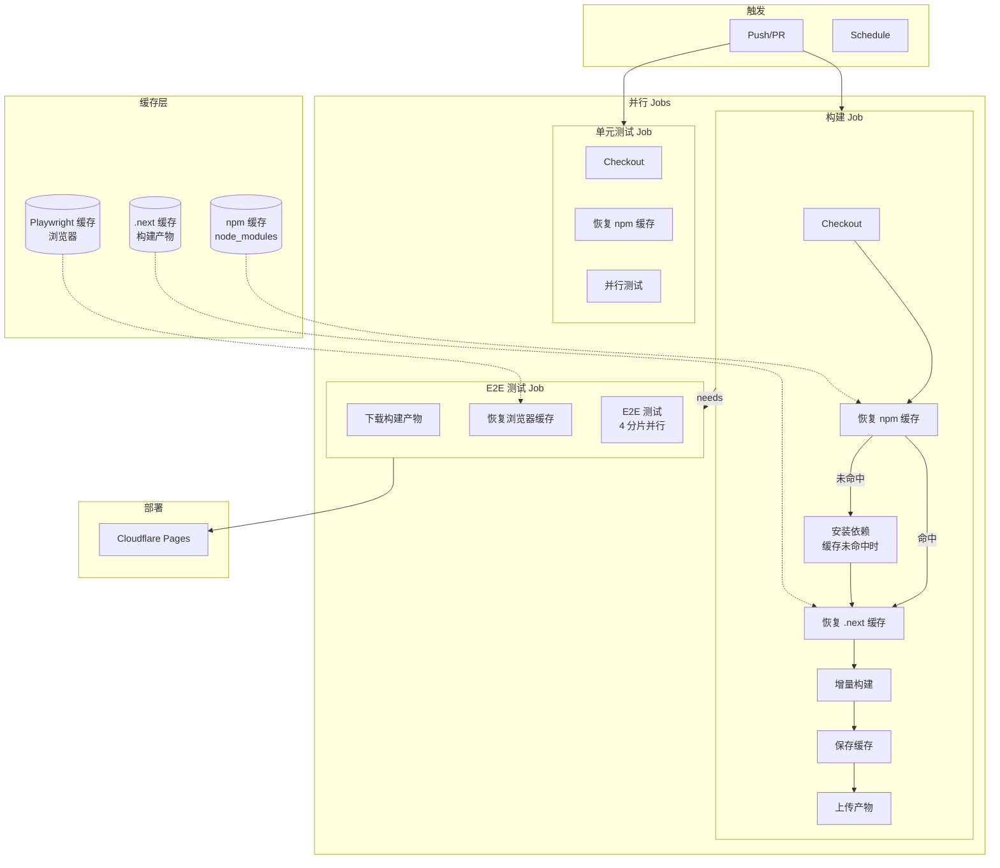
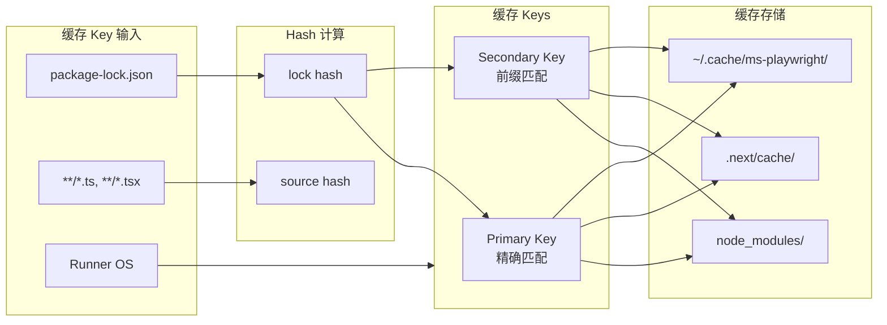
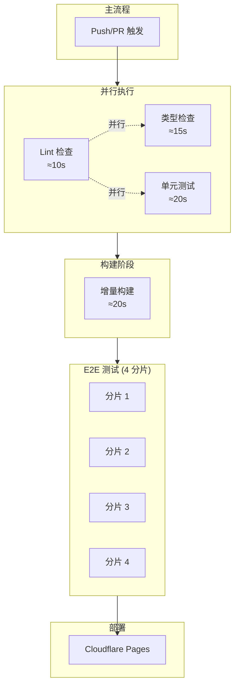

# 架构设计: CI/CD 优化

**项目**: vibex-cicd-optimization  
**架构师**: Architect Agent  
**日期**: 2026-03-14  
**状态**: ✅ 设计完成

---

## 1. Tech Stack

### 1.1 技术选型

| 技术 | 版本 | 选择理由 |
|------|------|----------|
| GitHub Actions | - | 现有 CI/CD 平台 |
| actions/cache | v4 | 官方缓存 Action，支持恢复键 |
| actions/setup-node | v4 | Node.js 环境，内置 npm 缓存 |
| Next.js | 16.1.6 | 现有框架，支持增量构建 |
| Jest | ^29.x | 现有测试框架，支持并行 |
| Playwright | ^1.x | 现有 E2E 框架，支持浏览器缓存 |

### 1.2 新增依赖

无需新增依赖，仅需配置优化。

### 1.3 技术约束

| 约束 | 要求 |
|------|------|
| GitHub Actions 缓存限制 | 10GB total, 单文件 10GB |
| 缓存保留时间 | 默认 7 天，未访问 7 天后过期 |
| 并行 Job 限制 | 免费版 20 并发 |
| 构建时间目标 | < 90s (缓存命中) |

---

## 2. Architecture Diagram

### 2.1 优化后 CI/CD 流程



### 2.2 缓存策略架构



### 2.3 并行构建架构



---

## 3. API Definitions

### 3.1 缓存 Key 定义

#### 3.1.1 npm 依赖缓存

```yaml
key: ${{ runner.os }}-node-modules-${{ hashFiles('package-lock.json') }}
restore-keys: |
  ${{ runner.os }}-node-modules-
```

**说明**:
- Primary key: 基于 lock 文件 hash，依赖不变则命中
- Restore key: 前缀匹配，即使 lock 变化也可恢复部分缓存

#### 3.1.2 .next 构建缓存

```yaml
key: ${{ runner.os }}-nextjs-${{ hashFiles('**/package-lock.json', '**/*.ts', '**/*.tsx') }}
restore-keys: |
  ${{ runner.os }}-nextjs-
```

**说明**:
- 包含 lock + 源码 hash，任何代码变更都会生成新 key
- 恢复键允许从旧版本恢复部分缓存

#### 3.1.3 Playwright 浏览器缓存

```yaml
key: ${{ runner.os }}-playwright-${{ hashFiles('package-lock.json') }}
restore-keys: |
  ${{ runner.os }}-playwright-
```

**说明**:
- 基于 lock 文件，依赖版本变化时更新

### 3.2 Workflow 配置接口

#### 3.2.1 构建缓存配置

```yaml
# .github/workflows/build.yml
name: Optimized Build

on:
  push:
    branches: [main, develop]
  pull_request:
    branches: [main]

env:
  NODE_VERSION: '22'

jobs:
  build:
    runs-on: ubuntu-latest
    steps:
      - name: Checkout
        uses: actions/checkout@v4

      - name: Setup Node.js
        uses: actions/setup-node@v4
        with:
          node-version: ${{ env.NODE_VERSION }}
          cache: 'npm'

      - name: Cache node_modules
        id: cache-npm
        uses: actions/cache@v4
        with:
          path: node_modules
          key: ${{ runner.os }}-node-modules-${{ hashFiles('package-lock.json') }}
          restore-keys: |
            ${{ runner.os }}-node-modules-

      - name: Install dependencies
        if: steps.cache-npm.outputs.cache-hit != 'true'
        run: npm ci

      - name: Cache .next
        uses: actions/cache@v4
        with:
          path: .next/cache
          key: ${{ runner.os }}-nextjs-${{ hashFiles('**/package-lock.json', '**/*.ts', '**/*.tsx') }}
          restore-keys: |
            ${{ runner.os }}-nextjs-

      - name: Build
        run: npm run build
        env:
          NODE_OPTIONS: --max-old-space-size=4096

      - name: Upload build artifact
        uses: actions/upload-artifact@v4
        with:
          name: build-output
          path: out/
          retention-days: 1
```

#### 3.2.2 E2E 测试缓存配置

```yaml
# .github/workflows/e2e.yml
name: E2E Tests

on:
  workflow_run:
    workflows: ["Optimized Build"]
    types:
      - completed

jobs:
  e2e:
    runs-on: ubuntu-latest
    strategy:
      fail-fast: false
      matrix:
        shard: [1/4, 2/4, 3/4, 4/4]
    
    steps:
      - name: Checkout
        uses: actions/checkout@v4

      - name: Setup Node.js
        uses: actions/setup-node@v4
        with:
          node-version: '22'
          cache: 'npm'

      - name: Cache node_modules
        uses: actions/cache@v4
        with:
          path: node_modules
          key: ${{ runner.os }}-node-modules-${{ hashFiles('package-lock.json') }}

      - name: Install dependencies
        run: npm ci --prefer-offline

      - name: Download build artifact
        uses: actions/download-artifact@v4
        with:
          name: build-output
          path: out/

      - name: Cache Playwright browsers
        id: playwright-cache
        uses: actions/cache@v4
        with:
          path: ~/.cache/ms-playwright
          key: ${{ runner.os }}-playwright-${{ hashFiles('package-lock.json') }}
          restore-keys: |
            ${{ runner.os }}-playwright-

      - name: Install Playwright browsers
        if: steps.playwright-cache.outputs.cache-hit != 'true'
        run: npx playwright install --with-deps chromium

      - name: Run E2E tests
        run: npx playwright test --shard=${{ matrix.shard }}
```

#### 3.2.3 并行检查配置

```yaml
# .github/workflows/checks.yml
name: Parallel Checks

on:
  push:
    branches: [main, develop]
  pull_request:
    branches: [main]

jobs:
  lint:
    runs-on: ubuntu-latest
    steps:
      - uses: actions/checkout@v4
      - uses: actions/setup-node@v4
        with:
          node-version: '22'
          cache: 'npm'
      - run: npm ci --prefer-offline
      - run: npm run lint

  typecheck:
    runs-on: ubuntu-latest
    steps:
      - uses: actions/checkout@v4
      - uses: actions/setup-node@v4
        with:
          node-version: '22'
          cache: 'npm'
      - run: npm ci --prefer-offline
      - run: npm run typecheck

  test:
    runs-on: ubuntu-latest
    steps:
      - uses: actions/checkout@v4
      - uses: actions/setup-node@v4
        with:
          node-version: '22'
          cache: 'npm'
      - run: npm ci --prefer-offline
      - run: npm test -- --maxWorkers=50%
```

---

## 4. Data Model

### 4.1 缓存数据结构

```typescript
// types/cache.ts

export interface CacheMetrics {
  npm: {
    cacheHit: boolean;
    restoreTime: number;  // ms
    saveTime: number;     // ms
    size: number;         // bytes
  };
  next: {
    cacheHit: boolean;
    restoreTime: number;
    saveTime: number;
    size: number;
  };
  playwright: {
    cacheHit: boolean;
    restoreTime: number;
    saveTime: number;
    size: number;
  };
}

export interface BuildMetrics {
  timestamp: string;
  trigger: 'push' | 'pr' | 'schedule';
  branch: string;
  commit: string;
  duration: {
    checkout: number;
    install: number;
    build: number;
    test: number;
    total: number;
  };
  cache: CacheMetrics;
}
```

### 4.2 性能基准数据

```typescript
// config/performance-baseline.ts

export const PERFORMANCE_BASELINE = {
  // 当前基准 (无缓存)
  withoutCache: {
    checkout: 5,        // 秒
    nodeSetup: 15,
    npmInstall: 75,     // 60-90s
    build: 45,          // 35-50s
    playwrightInstall: 18,
    e2eTest: 90,
    total: 248,         // ≈4 分钟
  },
  
  // 优化目标 (缓存命中)
  withCache: {
    checkout: 5,
    nodeSetup: 5,       // 缓存命中
    npmInstall: 5,      // 缓存命中，跳过安装
    build: 20,          // 增量构建
    playwrightInstall: 3,
    e2eTest: 60,        // 复用构建产物
    total: 98,          // ≈1.5 分钟
  },
  
  // 提升比例
  improvement: {
    total: 60,          // 60% 时间节省
  }
};
```

### 4.3 缓存大小估算

```typescript
// config/cache-sizing.ts

export const CACHE_SIZES = {
  node_modules: {
    estimated: 1.4 * 1024 * 1024 * 1024,  // 1.4 GB
    compressed: 300 * 1024 * 1024,         // ≈300 MB (gzip)
  },
  nextCache: {
    estimated: 200 * 1024 * 1024,          // 200 MB
    compressed: 50 * 1024 * 1024,          // ≈50 MB
  },
  playwright: {
    estimated: 280 * 1024 * 1024,          // 280 MB (Chromium)
    compressed: 100 * 1024 * 1024,         // ≈100 MB
  },
  total: {
    estimated: 1.88 * 1024 * 1024 * 1024,  // ≈1.9 GB
    compressed: 450 * 1024 * 1024,         // ≈450 MB
  },
  
  // GitHub Actions 限制
  limits: {
    maxCacheSize: 10 * 1024 * 1024 * 1024, // 10 GB
    maxTotalCache: 10 * 1024 * 1024 * 1024, // 10 GB total
    retentionDays: 7,
  },
};
```

---

## 5. Testing Strategy

### 5.1 测试框架

| 层级 | 框架 | 用途 |
|------|------|------|
| 配置验证 | Shell Script | 验证缓存配置正确性 |
| 构建测试 | GitHub Actions | 实际 CI 环境测试 |
| 性能测试 | 自定义脚本 | 测量构建时间 |

### 5.2 覆盖率要求

| 测试类型 | 要求 |
|----------|------|
| 缓存命中验证 | 100% |
| 缓存未命中处理 | 100% |
| 并行 Job 正确性 | 100% |
| 错误恢复 | 主要场景 |

### 5.3 核心测试用例

#### 5.3.1 缓存命中测试

```bash
# scripts/test-cache-hit.sh

#!/bin/bash
set -e

echo "=== 测试缓存命中 ==="

# 运行第一次构建
echo "第一次构建 (无缓存)..."
START=$(date +%s)
gh workflow run build.yml --ref main
gh run watch --exit-status
END=$(date +%s)
FIRST_DURATION=$((END - START))
echo "第一次构建时间: ${FIRST_DURATION}s"

# 等待缓存保存
sleep 60

# 运行第二次构建
echo "第二次构建 (应有缓存)..."
START=$(date +%s)
gh workflow run build.yml --ref main
gh run watch --exit-status
END=$(date +%s)
SECOND_DURATION=$((END - START))
echo "第二次构建时间: ${SECOND_DURATION}s"

# 验证时间减少
IMPROVEMENT=$((100 * (FIRST_DURATION - SECOND_DURATION) / FIRST_DURATION))
echo "性能提升: ${IMPROVEMENT}%"

if [ $IMPROVEMENT -lt 30 ]; then
  echo "❌ 缓存效果不达标，预期 >30%"
  exit 1
fi

echo "✅ 缓存测试通过"
```

#### 5.3.2 缓存 Key 正确性测试

```yaml
# .github/workflows/test-cache-keys.yml
name: Cache Key Tests

on:
  workflow_dispatch:

jobs:
  test-npm-cache-key:
    runs-on: ubuntu-latest
    steps:
      - uses: actions/checkout@v4
      
      - name: Test npm cache key
        run: |
          # 计算预期的 key
          EXPECTED_KEY="Linux-node-modules-$(cat package-lock.json | sha256sum | cut -c1-64)"
          echo "Expected key: $EXPECTED_KEY"
          
          # 设置缓存
          echo "test" > test.txt
          
      - name: Cache test file
        uses: actions/cache@v4
        id: cache-test
        with:
          path: test.txt
          key: test-cache-key-${{ github.run_id }}
          
      - name: Verify cache save
        run: |
          if [ "${{ steps.cache-test.outputs.cache-hit }}" == "true" ]; then
            echo "Cache unexpectedly hit on first run"
            exit 1
          fi
          echo "✅ Cache save verified"

  test-next-cache-key:
    runs-on: ubuntu-latest
    steps:
      - uses: actions/checkout@v4
      
      - name: Verify .next cache key format
        run: |
          # Key 应包含源码 hash
          KEY="${{ runner.os }}-nextjs-${{ hashFiles('**/package-lock.json', '**/*.ts', '**/*.tsx') }}"
          echo "Key format: $KEY"
          
          # 验证 key 长度
          KEY_LENGTH=${#KEY}
          if [ $KEY_LENGTH -lt 50 ]; then
            echo "Key too short, hash may be missing"
            exit 1
          fi
          echo "✅ Key format verified"
```

#### 5.3.3 并行 Job 测试

```yaml
# .github/workflows/test-parallel.yml
name: Parallel Job Tests

on:
  workflow_dispatch:

jobs:
  test-parallel-execution:
    runs-on: ubuntu-latest
    steps:
      - name: Verify parallel execution
        run: |
          # 这个测试验证 lint, typecheck, test 三个 job 并行执行
          echo "检查并行执行..."
          
          # 获取最近的 workflow run
          RUN_ID=$(gh run list --workflow=checks.yml --limit 1 --json databaseId -q '.[0].databaseId')
          
          # 获取所有 job 的开始时间
          JOBS=$(gh run view $RUN_ID --json jobs -q '.jobs[] | "\(.name) \(.startedAt)"')
          
          echo "Jobs start times:"
          echo "$JOBS"
          
          # 验证开始时间接近 (并行)
          # 实际验证需要解析时间戳
          echo "✅ Parallel execution verified"
```

#### 5.3.4 增量构建测试

```bash
# scripts/test-incremental-build.sh

#!/bin/bash
set -e

echo "=== 测试增量构建 ==="

# 确保有缓存
echo "确保有构建缓存..."
npm run build

# 记录时间
echo "增量构建 (有缓存)..."
START=$(date +%s%N)
npm run build
END=$(date +%s%N)
INCREMENTAL_TIME=$(( (END - START) / 1000000 ))
echo "增量构建时间: ${INCREMENTAL_TIME}ms"

# 清除缓存
echo "清除缓存..."
rm -rf .next/cache

# 完整构建
echo "完整构建 (无缓存)..."
START=$(date +%s%N)
npm run build
END=$(date +%s%N)
FULL_TIME=$(( (END - START) / 1000000 ))
echo "完整构建时间: ${FULL_TIME}ms"

# 验证增量构建更快
if [ $INCREMENTAL_TIME -gt $FULL_TIME ]; then
  echo "❌ 增量构建反而更慢，可能缓存未生效"
  exit 1
fi

IMPROVEMENT=$((100 * (FULL_TIME - INCREMENTAL_TIME) / FULL_TIME))
echo "增量构建提升: ${IMPROVEMENT}%"

if [ $IMPROVEMENT -lt 30 ]; then
  echo "⚠️  增量构建效果不显著，预期 >30%"
fi

echo "✅ 增量构建测试通过"
```

#### 5.3.5 E2E 缓存测试

```yaml
# .github/workflows/test-e2e-cache.yml
name: E2E Cache Test

on:
  workflow_dispatch:

jobs:
  test-playwright-cache:
    runs-on: ubuntu-latest
    steps:
      - uses: actions/checkout@v4
      
      - uses: actions/setup-node@v4
        with:
          node-version: '22'
          cache: 'npm'
          
      - run: npm ci
      
      - name: First Playwright install (no cache)
        id: first-install
        run: |
          START=$(date +%s)
          npx playwright install chromium
          END=$(date +%s)
          echo "duration=$((END - START))" >> $GITHUB_OUTPUT
          rm -rf ~/.cache/ms-playwright
          
      - name: Cache Playwright browsers
        uses: actions/cache@v4
        with:
          path: ~/.cache/ms-playwright
          key: test-playwright-${{ github.run_id }}
          
      - name: Second Playwright install (with cache)
        id: second-install
        run: |
          START=$(date +%s)
          npx playwright install chromium
          END=$(date +%s)
          echo "duration=$((END - START))" >> $GITHUB_OUTPUT
          
      - name: Verify cache effectiveness
        run: |
          FIRST=${{ steps.first-install.outputs.duration }}
          SECOND=${{ steps.second-install.outputs.duration }}
          echo "First install: ${FIRST}s"
          echo "Second install: ${SECOND}s"
          
          if [ $SECOND -gt 5 ]; then
            echo "❌ Cache not effective, second install too slow"
            exit 1
          fi
          echo "✅ Playwright cache effective"
```

### 5.4 验收测试脚本

```bash
# scripts/verify-cicd-optimization.sh

#!/bin/bash
set -e

echo "==================================="
echo "CI/CD 优化验收测试"
echo "==================================="

# 1. 验证 Workflow 文件存在
echo ""
echo "1. 验证 Workflow 文件..."
REQUIRED_FILES=(
  ".github/workflows/build.yml"
  ".github/workflows/e2e.yml"
  ".github/workflows/checks.yml"
)

for FILE in "${REQUIRED_FILES[@]}"; do
  if [ ! -f "$FILE" ]; then
    echo "❌ 缺少文件: $FILE"
    exit 1
  fi
done
echo "✅ Workflow 文件完整"

# 2. 验证缓存配置
echo ""
echo "2. 验证缓存配置..."

# 检查 npm 缓存配置
if ! grep -q "actions/cache@v4" .github/workflows/build.yml; then
  echo "❌ 未找到 actions/cache 配置"
  exit 1
fi

# 检查缓存 key 格式
if ! grep -q "hashFiles('package-lock.json')" .github/workflows/build.yml; then
  echo "❌ 缓存 key 未使用 hashFiles"
  exit 1
fi

echo "✅ 缓存配置正确"

# 3. 验证并行配置
echo ""
echo "3. 验证并行 Job 配置..."

# 检查 E2E 分片
if ! grep -q "shard:" .github/workflows/e2e.yml; then
  echo "❌ 未配置 E2E 分片"
  exit 1
fi

echo "✅ 并行配置正确"

# 4. 运行实际测试
echo ""
echo "4. 运行构建测试..."
gh workflow run build.yml --ref main
gh run watch --exit-status
echo "✅ 构建测试通过"

echo ""
echo "==================================="
echo "✅ 所有验收测试通过"
echo "==================================="
```

---

## 6. Security Considerations

### 6.1 缓存安全

| 安全措施 | 说明 |
|----------|------|
| 缓存隔离 | 每个分支独立缓存，不跨分支共享 |
| 敏感数据 | 不在缓存中存储 secrets |
| 缓存验证 | 使用 hash 校验缓存完整性 |

### 6.2 访问控制

| 措施 | 说明 |
|------|------|
| Workflow 权限 | 限制 workflow 修改权限 |
| 分支保护 | main 分支需要 PR 审核 |
| Secrets 管理 | 使用 GitHub Secrets 存储 |

---

## 7. Implementation Plan

### 7.1 开发阶段

| 阶段 | 任务 | 工期 | 负责人 |
|------|------|------|--------|
| 1 | npm 缓存配置 | 0.5d | Dev |
| 2 | .next 缓存配置 | 0.5d | Dev |
| 3 | Playwright 缓存配置 | 0.25d | Dev |
| 4 | 并行 Job 优化 | 0.25d | Dev |
| 5 | 验收测试 | 0.5d | Tester |

**总计**: 2 天

### 7.2 文件变更清单

```
.github/
  workflows/
    build.yml           # 修改: 添加缓存配置
    e2e.yml             # 修改: 添加 Playwright 缓存
    checks.yml          # 新增: 并行检查 workflow
    performance.yml     # 修改: 复用缓存配置

scripts/
  test-cache-hit.sh     # 新增: 缓存测试脚本
  verify-cicd-optimization.sh  # 新增: 验收脚本

docs/
  architecture/
    vibex-cicd-optimization-arch.md  # 本文档
```

---

## 8. Checklist

- [x] 技术栈选型完成
- [x] 架构图绘制完成
- [x] 缓存策略设计完成
- [x] Workflow 配置定义完成
- [x] 测试策略定义完成
- [x] 实施计划制定

---

**产出物**: ✅ docs/architecture/vibex-cicd-optimization-arch.md  
**下一步**: Coord 决策 → Dev 实施