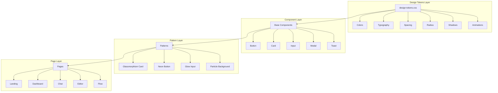
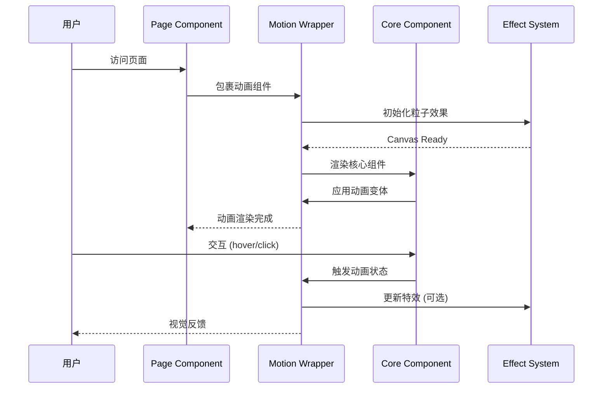
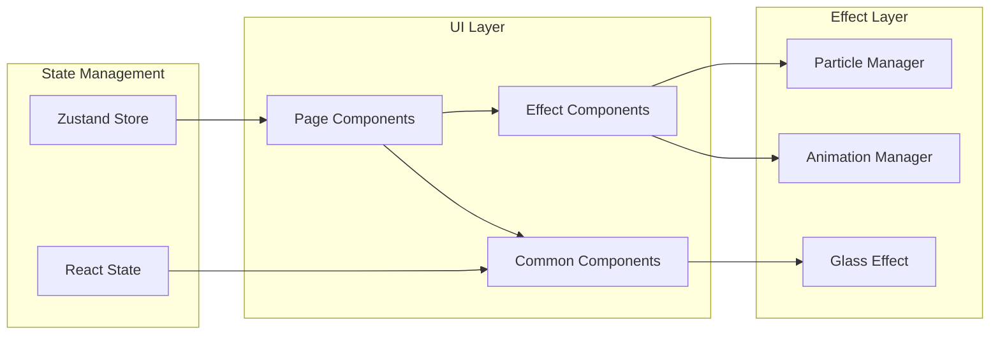
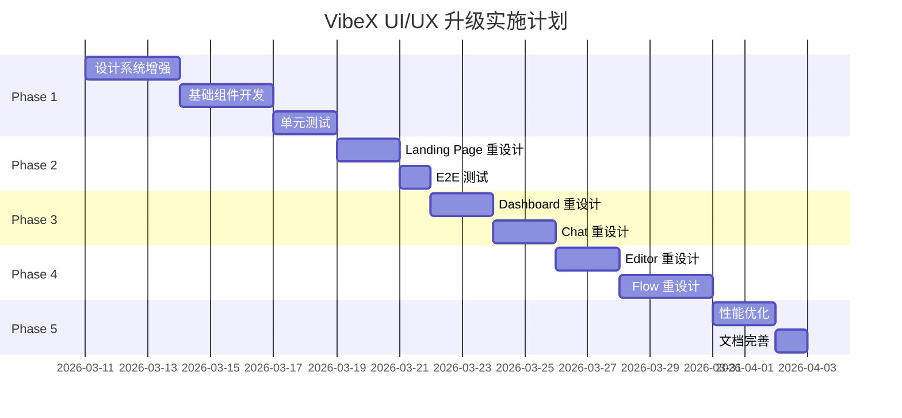

# VibeX UI/UX 升级架构设计文档

**项目**: vibex-frontend  
**架构师**: Architect Agent  
**日期**: 2026-03-10  

---

## 1. 技术栈

### 1.1 核心框架

| 技术 | 版本 | 选择理由 |
|-----|------|---------|
| Next.js | 16.1.6 | 现有项目基础，App Router 支持 |
| React | 19.2.3 | 最新版本，支持并发渲染、Suspense |
| TypeScript | 5.x | 类型安全，现有项目已采用 |
| CSS Modules | 现有 | 样式隔离，复用现有方案 |

### 1.2 动画与视觉效果

| 技术 | 版本 | 选择理由 |
|-----|------|---------|
| Framer Motion | ^11.x | React 生态最佳动画库，支持手势、布局动画 |
| TSParticles | ^3.x | 粒子动画背景，支持高性能 Canvas 渲染 |
| CSS Variables | 原生 | 已有设计系统基础，无需额外依赖 |

### 1.3 新增依赖

```json
{
  "dependencies": {
    "framer-motion": "^11.15.0",
    "@tsparticles/react": "^3.0.0",
    "@tsparticles/slim": "^3.7.0",
    "tsparticles": "^3.7.0"
  }
}
```

### 1.4 技术约束

- **包体积增量**: ≤ 100KB (gzip 后)
- **性能目标**: LCP ≤ 2.0s, FPS ≥ 60
- **兼容性**: 现代浏览器 (Chrome 90+, Firefox 90+, Safari 15+)
- **降级方案**: 简化动效开关，低端设备禁用粒子效果

---

## 2. 架构图

### 2.1 设计系统层次结构



### 2.2 组件交互流程



### 2.3 数据流架构



---

## 3. 组件 API 定义

### 3.1 GlassCard 组件

```typescript
interface GlassCardProps {
  // 内容
  children: React.ReactNode;
  
  // 样式变体
  variant?: 'default' | 'elevated' | 'bordered';
  
  // 发光效果
  glow?: 'none' | 'cyan' | 'purple' | 'pink';
  glowIntensity?: 'low' | 'medium' | 'high';
  
  // 动画
  animated?: boolean;
  hoverLift?: boolean;
  
  // 布局
  padding?: 'sm' | 'md' | 'lg';
  borderRadius?: 'md' | 'lg' | 'xl';
  
  // 交互
  onClick?: () => void;
  className?: string;
}

// 使用示例
<GlassCard 
  variant="elevated" 
  glow="cyan" 
  hoverLift
>
  <h2>Card Title</h2>
  <p>Card content</p>
</GlassCard>
```

### 3.2 NeonButton 组件

```typescript
interface NeonButtonProps {
  // 内容
  children: React.ReactNode;
  
  // 样式变体
  variant?: 'primary' | 'secondary' | 'ghost';
  size?: 'sm' | 'md' | 'lg';
  
  // 发光效果
  neonColor?: 'cyan' | 'purple' | 'pink' | 'green';
  neonIntensity?: 'low' | 'medium' | 'high';
  
  // 动画
  pulseOnHover?: boolean;
  rippleOnClick?: boolean;
  
  // 状态
  loading?: boolean;
  disabled?: boolean;
  
  // 事件
  onClick?: (e: React.MouseEvent) => void;
  
  // 导航
  href?: string;
  
  className?: string;
}

// 使用示例
<NeonButton 
  variant="primary" 
  neonColor="cyan"
  pulseOnHover
  onClick={handleSubmit}
>
  开始创建
</NeonButton>
```

### 3.3 ParticleBackground 组件

```typescript
interface ParticleBackgroundProps {
  // 粒子配置
  particleCount?: number;        // 默认 50
  particleSize?: number;         // 默认 2
  particleColor?: string;        // 默认 '#00ffff'
  
  // 连线配置
  lineLinked?: boolean;          // 默认 true
  lineDistance?: number;         // 默认 150
  
  // 交互
  interactive?: boolean;         // 鼠标交互
  repulse?: boolean;             // 排斥效果
  
  // 性能
  fpsLimit?: number;             // 默认 60
  detectRetina?: boolean;        // 默认 true
  
  // 动画
  moveSpeed?: number;            // 默认 1
  direction?: 'none' | 'top' | 'right' | 'bottom' | 'left';
  
  className?: string;
}

// 使用示例
<ParticleBackground 
  particleCount={80}
  particleColor="#00ffff"
  interactive
  fpsLimit={60}
/>
```

### 3.4 GlowInput 组件

```typescript
interface GlowInputProps extends React.InputHTMLAttributes<HTMLInputElement> {
  // 发光效果
  glowColor?: 'cyan' | 'purple' | 'pink' | 'green';
  
  // 标签
  label?: string;
  
  // 图标
  leftIcon?: React.ReactNode;
  rightIcon?: React.ReactNode;
  
  // 状态
  error?: string;
  success?: boolean;
  
  // 动画
  animated?: boolean;
  
  className?: string;
}

// 使用示例
<GlowInput 
  label="项目名称"
  placeholder="输入项目名称..."
  glowColor="cyan"
  leftIcon={<SearchIcon />}
/>
```

### 3.5 AnimatedPageTransition 组件

```typescript
interface AnimatedPageTransitionProps {
  children: React.ReactNode;
  
  // 动画类型
  animation?: 'fade' | 'slideUp' | 'slideLeft' | 'scale';
  
  // 动画配置
  duration?: number;             // 默认 0.3s
  delay?: number;                // 默认 0
  easing?: 'easeOut' | 'easeInOut' | 'spring';
  
  // 交错动画
  stagger?: boolean;
  staggerDelay?: number;         // 默认 0.1s
  
  className?: string;
}

// 使用示例
<AnimatedPageTransition animation="slideUp" stagger>
  <Header />
  <MainContent />
  <Footer />
</AnimatedPageTransition>
```

---

## 4. 数据模型

### 4.1 设计 Token 模型

```typescript
// 色彩系统
interface ColorTokens {
  primary: string;              // #00ffff
  primaryHover: string;         // #00e5e5
  primaryMuted: string;         // rgba(0, 255, 255, 0.15)
  primaryGlow: string;          // rgba(0, 255, 255, 0.5)
  
  accent: string;               // #8b5cf6
  accentHover: string;          // #7c3aed
  
  pink: string;                 // #ff00ff
  green: string;                // #00ff88
  
  bgPrimary: string;            // #0a0a0f
  bgSecondary: string;          // #12121a
  bgTertiary: string;           // #1a1a24
  bgGlass: string;              // rgba(18, 18, 26, 0.7)
  
  textPrimary: string;          // #f0f0f5
  textSecondary: string;        // #a0a0b0
  textMuted: string;            // #606070
  
  border: string;               // rgba(255, 255, 255, 0.08)
  borderHover: string;         // rgba(255, 255, 255, 0.15)
}

// 动画配置
interface AnimationTokens {
  durations: {
    instant: 0;
    fast: 100;
    normal: 200;
    slow: 300;
    slower: 500;
  };
  
  easings: {
    easeOutExpo: 'cubic-bezier(0.16, 1, 0.3, 1)';
    easeOutQuart: 'cubic-bezier(0.25, 1, 0.5, 1)';
    easeSpring: 'cubic-bezier(0.34, 1.56, 0.64, 1)';
  };
}

// 发光效果配置
interface GlowEffect {
  color: 'cyan' | 'purple' | 'pink' | 'green';
  intensity: 'low' | 'medium' | 'high';
  blur: number;
  spread: number;
}
```

### 4.2 动画状态模型

```typescript
// 组件动画状态
interface AnimationState {
  isAnimating: boolean;
  currentVariant: 'initial' | 'animate' | 'hover' | 'tap' | 'exit';
  progress: number;
}

// Framer Motion 变体
interface MotionVariants {
  initial: Variant;
  animate: Variant;
  hover?: Variant;
  tap?: Variant;
  exit?: Variant;
}

interface Variant {
  opacity?: number;
  scale?: number;
  x?: number;
  y?: number;
  rotate?: number;
  transition?: Transition;
}

// 粒子系统配置
interface ParticleConfig {
  background: {
    color: { value: string };
  };
  fpsLimit: number;
  particles: {
    number: { value: number };
    color: { value: string };
    size: { value: number };
    links: {
      enable: boolean;
      distance: number;
      color: string;
    };
    move: {
      enable: boolean;
      speed: number;
      direction: 'none' | 'top' | 'right';
    };
    interactivity: {
      events: {
        onHover: { enable: boolean; mode: string };
        onClick: { enable: boolean; mode: string };
      };
    };
  };
}
```

### 4.3 性能监控模型

```typescript
// 性能指标
interface PerformanceMetrics {
  // 加载性能
  LCP: number;                  // Largest Contentful Paint
  FID: number;                  // First Input Delay
  CLS: number;                  // Cumulative Layout Shift
  
  // 运行时性能
  FPS: number;                  // 当前帧率
  animationDroppedFrames: number;
  
  // 包体积
  bundleSize: number;           // KB
  gzippedSize: number;          // KB
}

// 性能阈值
interface PerformanceThreshold {
  LCP: { warning: 2500; error: 4000 };  // ms
  FID: { warning: 100; error: 300 };     // ms
  CLS: { warning: 0.1; error: 0.25 };
  FPS: { warning: 55; error: 30 };
  bundleSize: { warning: 80; error: 100 }; // KB
}
```

---

## 5. 测试策略

### 5.1 测试框架

| 框架 | 用途 | 覆盖率目标 |
|-----|------|-----------|
| Jest | 单元测试 | > 80% |
| React Testing Library | 组件测试 | > 80% |
| Playwright | E2E 测试 | 核心流程 100% |
| Lighthouse | 性能测试 | CI 集成 |

### 5.2 核心测试用例

#### 5.2.1 GlassCard 组件测试

```typescript
describe('GlassCard', () => {
  // TC-GC-001: 默认渲染
  it('should render children correctly', () => {
    render(<GlassCard>Content</GlassCard>);
    expect(screen.getByText('Content')).toBeInTheDocument();
  });

  // TC-GC-002: 发光效果
  it('should apply glow effect when specified', () => {
    const { container } = render(
      <GlassCard glow="cyan" glowIntensity="high">Content</GlassCard>
    );
    expect(container.firstChild).toHaveStyle({
      boxShadow: expect.stringContaining('rgba(0, 255, 255'),
    });
  });

  // TC-GC-003: 悬停提升
  it('should lift on hover when hoverLift is true', async () => {
    const { container } = render(
      <GlassCard hoverLift>Content</GlassCard>
    );
    fireEvent.mouseEnter(container.firstChild!);
    expect(container.firstChild).toHaveStyle({
      transform: 'translateY(-4px)',
    });
  });

  // TC-GC-004: 可访问性
  it('should be accessible', () => {
    const { container } = render(<GlassCard>Content</GlassCard>);
    expect(container.firstChild).toBeVisible();
  });
});
```

#### 5.2.2 NeonButton 组件测试

```typescript
describe('NeonButton', () => {
  // TC-NB-001: 点击事件
  it('should call onClick when clicked', () => {
    const handleClick = jest.fn();
    render(<NeonButton onClick={handleClick}>Click</NeonButton>);
    fireEvent.click(screen.getByRole('button'));
    expect(handleClick).toHaveBeenCalledTimes(1);
  });

  // TC-NB-002: 加载状态
  it('should show loading state', () => {
    render(<NeonButton loading>Submit</NeonButton>);
    expect(screen.getByRole('button')).toBeDisabled();
    expect(screen.getByTestId('loading-spinner')).toBeInTheDocument();
  });

  // TC-NB-003: 禁用状态
  it('should be disabled when disabled prop is true', () => {
    render(<NeonButton disabled>Disabled</NeonButton>);
    expect(screen.getByRole('button')).toBeDisabled();
  });

  // TC-NB-004: 霓虹发光
  it('should apply neon glow effect', () => {
    const { container } = render(
      <NeonButton neonColor="cyan" neonIntensity="high">Glow</NeonButton>
    );
    expect(container.firstChild).toHaveStyle({
      boxShadow: expect.stringContaining('rgba(0, 255, 255'),
    });
  });

  // TC-NB-005: 链接模式
  it('should render as link when href is provided', () => {
    render(<NeonButton href="/dashboard">Navigate</NeonButton>);
    expect(screen.getByRole('link')).toHaveAttribute('href', '/dashboard');
  });
});
```

#### 5.2.3 ParticleBackground 组件测试

```typescript
describe('ParticleBackground', () => {
  // TC-PB-001: 渲染粒子
  it('should render particle canvas', async () => {
    render(<ParticleBackground />);
    await waitFor(() => {
      expect(screen.getByTestId('particles-container')).toBeInTheDocument();
    });
  });

  // TC-PB-002: 配置传递
  it('should pass config to particles', async () => {
    render(<ParticleBackground particleCount={100} particleColor="#ff00ff" />);
    // 验证配置已应用
    await waitFor(() => {
      const container = screen.getByTestId('particles-container');
      expect(container).toBeInTheDocument();
    });
  });

  // TC-PB-003: 性能限制
  it('should respect fpsLimit', async () => {
    const { container } = render(<ParticleBackground fpsLimit={30} />);
    // 验证帧率限制
    await waitFor(() => {
      expect(container.querySelector('canvas')).toBeInTheDocument();
    });
  });
});
```

#### 5.2.4 性能测试

```typescript
describe('Performance', () => {
  // TC-PF-001: 包体积
  it('should not exceed bundle size limit', async () => {
    const stats = await getBundleStats();
    expect(stats.gzipped).toBeLessThan(100); // KB
  });

  // TC-PF-002: 动画帧率
  it('should maintain 60fps during animations', async () => {
    const fps = await measureAnimationFPS(() => {
      // 执行动画
      triggerAnimation();
    });
    expect(fps).toBeGreaterThanOrEqual(55);
  });

  // TC-PF-003: 初始加载
  it('should load within LCP threshold', async () => {
    const lcp = await measureLCP('/');
    expect(lcp).toBeLessThan(2000); // ms
  });
});
```

### 5.3 E2E 测试场景

```typescript
// playwright/e2e/ui-ux.spec.ts

test.describe('VibeX UI/UX 升级', () => {
  // TC-E2E-001: Landing Page 视觉效果
  test('Landing Page 应显示粒子动画和霓虹效果', async ({ page }) => {
    await page.goto('/landing');
    
    // 验证粒子背景
    await expect(page.locator('[data-testid="particles-container"]')).toBeVisible();
    
    // 验证霓虹标题
    const title = page.locator('h1');
    await expect(title).toHaveCSS('text-shadow', /rgba\(0, 255, 255/);
    
    // 验证 CTA 按钮玻璃态效果
    const ctaButton = page.locator('button:has-text("开始")');
    await expect(ctaButton).toHaveCSS('backdrop-filter', /blur/);
  });

  // TC-E2E-002: Dashboard 卡片动效
  test('Dashboard 卡片应有悬停提升效果', async ({ page }) => {
    await page.goto('/dashboard');
    
    const card = page.locator('[data-testid="project-card"]').first();
    await card.hover();
    
    // 验证悬停样式
    await expect(card).toHaveCSS('transform', /translateY/);
    await expect(card).toHaveCSS('box-shadow', /rgba\(0, 255, 255/);
  });

  // TC-E2E-003: Chat 消息动画
  test('Chat 消息应有淡入动画', async ({ page }) => {
    await page.goto('/chat');
    
    // 发送消息
    await page.fill('input[placeholder*="输入"]', '测试消息');
    await page.press('input[placeholder*="输入"]', 'Enter');
    
    // 验证消息动画
    const message = page.locator('[data-testid="chat-message"]').last();
    await expect(message).toBeVisible();
    
    // 验证动画完成
    await page.waitForTimeout(300);
    await expect(message).toHaveCSS('opacity', '1');
  });

  // TC-E2E-004: 性能指标
  test('页面性能应在阈值内', async ({ page }) => {
    const metrics = await page.measure({
      page: '/dashboard',
      metrics: ['LCP', 'FID', 'CLS'],
    });
    
    expect(metrics.LCP).toBeLessThan(2000);
    expect(metrics.FID).toBeLessThan(100);
    expect(metrics.CLS).toBeLessThan(0.1);
  });

  // TC-E2E-005: 简化动效模式
  test('简化动效模式应禁用粒子效果', async ({ page }) => {
    // 设置简化动效
    await page.addInitScript(() => {
      localStorage.setItem('simplify-animations', 'true');
    });
    
    await page.goto('/landing');
    
    // 验证粒子效果已禁用
    await expect(page.locator('[data-testid="particles-container"]')).not.toBeVisible();
  });
});
```

### 5.4 视觉回归测试

```typescript
// playwright/visual/ui-visual.spec.ts

test.describe('视觉回归测试', () => {
  // TC-VR-001: Landing Page 快照
  test('Landing Page 视觉一致性', async ({ page }) => {
    await page.goto('/landing');
    await page.waitForLoadState('networkidle');
    
    await expect(page).toHaveScreenshot('landing-page.png', {
      maxDiffPixels: 100,
      threshold: 0.2,
    });
  });

  // TC-VR-002: Dashboard 快照
  test('Dashboard 视觉一致性', async ({ page }) => {
    await page.goto('/dashboard');
    await page.waitForLoadState('networkidle');
    
    await expect(page).toHaveScreenshot('dashboard.png', {
      maxDiffPixels: 100,
      threshold: 0.2,
    });
  });

  // TC-VR-003: 暗色主题一致性
  test('暗色主题应保持一致性', async ({ page }) => {
    await page.goto('/dashboard');
    
    // 验证背景色
    const bgColor = await page.evaluate(() => 
      getComputedStyle(document.body).backgroundColor
    );
    expect(bgColor).toMatch(/rgb\(10,\s*10,\s*15\)/); // #0a0a0f
  });
});
```

---

## 6. 实施计划

### 6.1 阶段划分



### 6.2 风险与缓解

| 风险 | 可能性 | 影响 | 缓解措施 |
|-----|-------|------|---------|
| 动画性能影响低端设备 | 高 | 高 | 提供简化动效开关 |
| Framer Motion 包体积过大 | 中 | 中 | 使用 Tree Shaking，按需导入 |
| 粒子效果卡顿 | 中 | 高 | 限制粒子数量，降级到 CSS 动画 |
| 深色主题对比度问题 | 低 | 中 | 遵循 WCAG AA 标准，测试验证 |
| 浏览器兼容性 | 低 | 中 | CSS 回退方案，Feature Detection |

---

## 7. 文件结构

```
src/
├── styles/
│   ├── design-tokens.css      # 已有，增强
│   ├── animations.css          # 已有，增强
│   └── utilities.css           # 工具类
│
├── components/
│   ├── ui/
│   │   ├── GlassCard/
│   │   │   ├── GlassCard.tsx
│   │   │   ├── GlassCard.module.css
│   │   │   └── GlassCard.test.tsx
│   │   ├── NeonButton/
│   │   │   ├── NeonButton.tsx
│   │   │   ├── NeonButton.module.css
│   │   │   └── NeonButton.test.tsx
│   │   ├── GlowInput/
│   │   │   ├── GlowInput.tsx
│   │   │   ├── GlowInput.module.css
│   │   │   └── GlowInput.test.tsx
│   │   └── index.ts
│   │
│   └── effects/
│       ├── ParticleBackground/
│       │   ├── ParticleBackground.tsx
│       │   ├── ParticleBackground.test.tsx
│       │   └── particles.config.ts
│       ├── AnimatedPageTransition/
│       │   ├── AnimatedPageTransition.tsx
│       │   └── AnimatedPageTransition.test.tsx
│       └── index.ts
│
├── hooks/
│   ├── useAnimation.ts         # 动画 Hook
│   ├── usePerformance.ts       # 性能监控 Hook
│   └── useReducedMotion.ts     # 简化动效 Hook
│
└── lib/
    ├── performance/
    │   ├── metrics.ts          # 性能指标收集
    │   └── threshold.ts        # 阈值配置
    └── animations/
        ├── variants.ts         # Framer Motion 变体
        └── presets.ts          # 预设动画
```

---

## 8. 检查清单

### 8.1 设计系统

- [ ] 增强 design-tokens.css (霓虹色、发光效果)
- [ ] 增强 animations.css (新动画变体)
- [ ] 创建 utilities.css 工具类

### 8.2 基础组件

- [ ] GlassCard 组件 + 测试
- [ ] NeonButton 组件 + 测试
- [ ] GlowInput 组件 + 测试

### 8.3 效果组件

- [ ] ParticleBackground 组件 + 测试
- [ ] AnimatedPageTransition 组件 + 测试

### 8.4 页面重设计

- [ ] Landing Page 粒子背景 + 霓虹标题
- [ ] Dashboard 玻璃态卡片 + 悬停效果
- [ ] Chat 消息动画 + 打字机效果
- [ ] Editor 组件发光边框
- [ ] Flow 节点脉冲动画

### 8.5 性能优化

- [ ] 包体积检查 (< 100KB)
- [ ] 动画帧率测试 (≥ 60fps)
- [ ] LCP 测试 (< 2.0s)
- [ ] 简化动效开关实现

### 8.6 测试覆盖

- [ ] 单元测试覆盖率 > 80%
- [ ] E2E 测试核心流程
- [ ] 视觉回归测试
- [ ] 性能测试 CI 集成

---

## 9. 验收标准

| 指标 | 目标值 | 验证方式 |
|-----|-------|---------|
| LCP | ≤ 2.0s | Lighthouse CI |
| FPS | ≥ 60 | DevTools Performance |
| 包体积增量 | ≤ 100KB | Bundle Analyzer |
| 单元测试覆盖率 | > 80% | Jest Coverage |
| E2E 测试通过率 | 100% | Playwright |
| WCAG AA 合规 | 通过 | axe-core |

---

*文档版本: 1.0*  
*创建时间: 2026-03-10*  
*作者: Architect Agent*