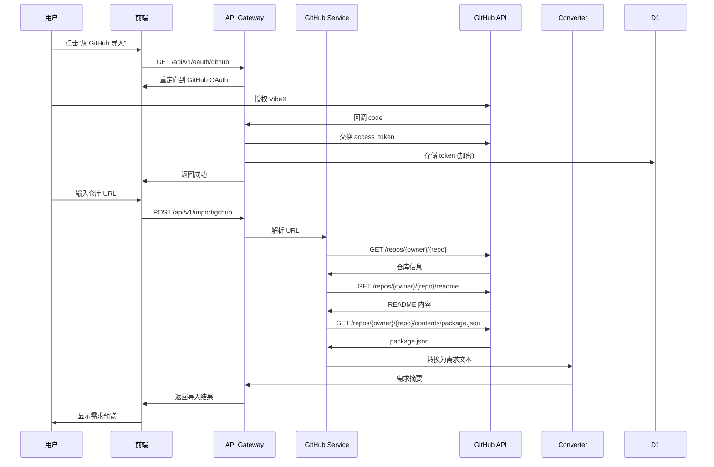
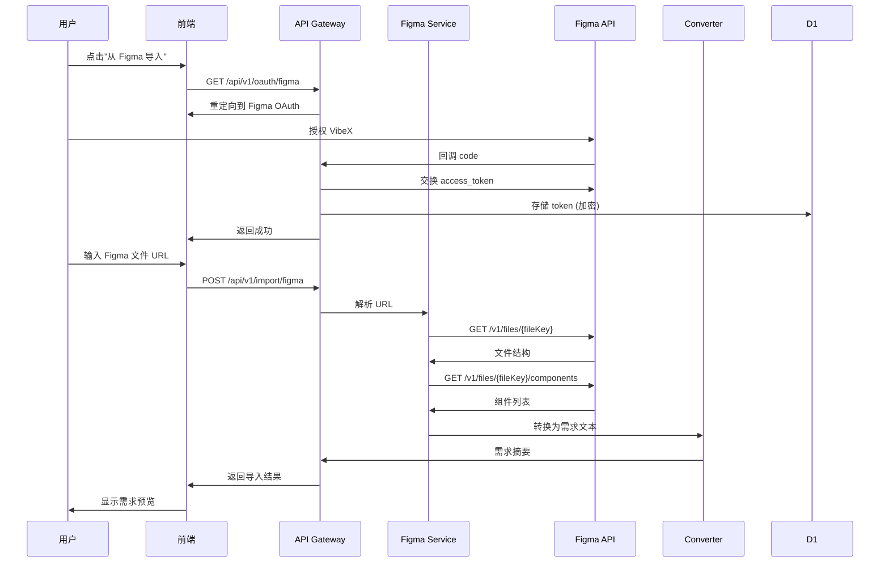
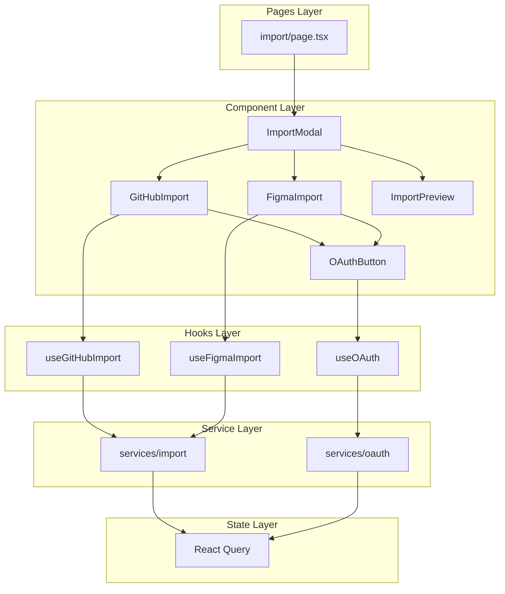
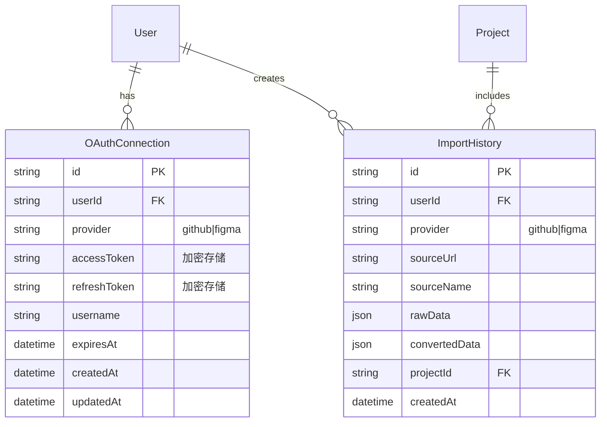

# 架构设计: GitHub/Figma 一键导入功能

**项目**: vibex-github-figma-import  
**架构师**: Architect Agent  
**日期**: 2026-03-14  
**状态**: ✅ 设计完成

---

## 1. Tech Stack

### 1.1 技术选型

| 技术 | 版本 | 选择理由 |
|------|------|----------|
| Next.js | 16.1.6 | 现有项目基础，API Routes 支持 |
| React | 19.2.3 | 现有版本，并发渲染支持 |
| TypeScript | 5.x | 类型安全，现有项目已采用 |
| React Query | ^5.x | 现有数据获取方案，缓存管理 |
| Zod | ^3.x | 运行时类型验证，API 响应校验 |
| Octokit | ^20.x | GitHub API 官方 SDK，类型完善 |
| figma-js | ^1.x | Figma API 封装，简化调用 |

### 1.2 新增依赖

```json
{
  "dependencies": {
    "@octokit/rest": "^20.0.0",
    "figma-js": "^1.16.0"
  },
  "devDependencies": {
    "@types/node": "^20.x"
  }
}
```

### 1.3 技术约束

| 约束 | 要求 |
|------|------|
| Bundle 增量 | ≤ 50KB (gzip) |
| API 响应时间 | GitHub < 3s, Figma < 5s |
| 并发支持 | 100 用户/分钟 |
| 兼容性 | Chrome 90+, Firefox 90+, Safari 15+ |

---

## 2. Architecture Diagram

### 2.1 系统架构

```mermaid
flowchart TB
    subgraph Client["前端 Client"]
        UI[Import UI]
        Store[React Query Cache]
    end

    subgraph API["API Layer"]
        Gateway[API Gateway]
        
        subgraph ImportAPI["Import API"]
            GH[/api/v1/import/github]
            FG[/api/v1/import/figma]
            OAuth[/api/v1/oauth/*]
        end
    end

    subgraph Services["Service Layer"]
        GitHubService[GitHub Service]
        FigmaService[Figma Service]
        OAuthService[OAuth Service]
        ConverterService[Converter Service]
    end

    subgraph External["External APIs"]
        GitHubAPI[GitHub REST API]
        FigmaAPI[Figma REST API]
    end

    subgraph Storage["Storage"]
        KV[(KV Store<br/>OAuth Tokens)]
        D1[(D1 Database<br/>Import History)]
    end

    UI --> Store
    Store --> Gateway
    Gateway --> GH
    Gateway --> FG
    Gateway --> OAuth
    
    GH --> GitHubService
    FG --> FigmaService
    OAuth --> OAuthService
    
    GitHubService --> GitHubAPI
    FigmaService --> FigmaAPI
    
    OAuthService --> KV
    GitHubService --> D1
    FigmaService --> D1
    
    GitHubService --> ConverterService
    FigmaService --> ConverterService
```

### 2.2 GitHub 导入流程



### 2.3 Figma 导入流程



### 2.4 组件架构



---

## 3. API Definitions

### 3.1 OAuth API

#### 3.1.1 GitHub OAuth 发起

```
GET /api/v1/oauth/github
```

**Response:**
```typescript
{
  success: true,
  data: {
    authUrl: string  // GitHub OAuth 授权页面 URL
  }
}
```

#### 3.1.2 GitHub OAuth 回调

```
GET /api/v1/oauth/github/callback?code={code}
```

**Response:**
```typescript
{
  success: true,
  data: {
    connected: boolean,
    username?: string  // GitHub 用户名
  }
}
```

#### 3.1.3 Figma OAuth 发起

```
GET /api/v1/oauth/figma
```

**Response:**
```typescript
{
  success: true,
  data: {
    authUrl: string  // Figma OAuth 授权页面 URL
  }
}
```

#### 3.1.4 Figma OAuth 回调

```
GET /api/v1/oauth/figma/callback?code={code}
```

**Response:**
```typescript
{
  success: true,
  data: {
    connected: boolean,
    username?: string  // Figma 用户名
  }
}
```

#### 3.1.5 检查 OAuth 状态

```
GET /api/v1/oauth/status
```

**Response:**
```typescript
{
  success: true,
  data: {
    github: {
      connected: boolean,
      username?: string
    },
    figma: {
      connected: boolean,
      username?: string
    }
  }
}
```

### 3.2 GitHub Import API

#### 3.2.1 解析 GitHub URL

```
POST /api/v1/import/github/parse
```

**Request:**
```typescript
{
  url: string  // GitHub 仓库 URL
}
```

**Response:**
```typescript
{
  success: true,
  data: {
    owner: string,
    repo: string,
    isValid: boolean,
    isPrivate: boolean
  }
}
```

#### 3.2.2 获取仓库信息

```
POST /api/v1/import/github/repo
```

**Request:**
```typescript
{
  owner: string,
  repo: string
}
```

**Response:**
```typescript
{
  success: true,
  data: {
    name: string,
    fullName: string,
    description: string,
    language: string,
    stars: number,
    forks: number,
    topics: string[],
    defaultBranch: string
  }
}
```

#### 3.2.3 导入 GitHub 仓库

```
POST /api/v1/import/github
```

**Request:**
```typescript
{
  owner: string,
  repo: string,
  options?: {
    includeReadme?: boolean,      // default: true
    includePackageJson?: boolean, // default: true
    includeTree?: boolean         // default: false
  }
}
```

**Response:**
```typescript
{
  success: true,
  data: {
    repo: {
      name: string,
      fullName: string,
      description: string,
      language: string,
      url: string
    },
    readme: {
      content: string,
      extracted: string  // AI 提取的关键信息
    },
    packageJson: {
      dependencies: Record<string, string>,
      devDependencies: Record<string, string>,
      scripts: Record<string, string>
    },
    tree?: {
      structure: string  // ASCII 树形结构
    },
    requirement: {
      title: string,
      description: string,
      techStack: string[],
      features: string[]
    }
  }
}
```

### 3.3 Figma Import API

#### 3.3.1 解析 Figma URL

```
POST /api/v1/import/figma/parse
```

**Request:**
```typescript
{
  url: string  // Figma 文件 URL
}
```

**Response:**
```typescript
{
  success: true,
  data: {
    fileKey: string,
    nodeId?: string,
    isValid: boolean
  }
}
```

#### 3.3.2 获取 Figma 文件信息

```
POST /api/v1/import/figma/file
```

**Request:**
```typescript
{
  fileKey: string
}
```

**Response:**
```typescript
{
  success: true,
  data: {
    name: string,
    lastModified: string,
    thumbnailUrl: string,
    pages: {
      id: string,
      name: string,
      childrenCount: number
    }[]
  }
}
```

#### 3.3.3 导入 Figma 文件

```
POST /api/v1/import/figma
```

**Request:**
```typescript
{
  fileKey: string,
  options?: {
    pageIds?: string[],      // 指定页面，默认全部
    includeComponents?: boolean, // default: true
    includeStyles?: boolean  // default: true
  }
}
```

**Response:**
```typescript
{
  success: true,
  data: {
    file: {
      name: string,
      url: string,
      thumbnailUrl: string
    },
    pages: {
      id: string,
      name: string,
      frameCount: number
    }[],
    components: {
      id: string,
      name: string,
      type: string,
      description?: string
    }[],
    styles: {
      colors: {
        name: string,
        value: string
      }[],
      typography: {
        name: string,
        fontFamily: string,
        fontSize: number,
        fontWeight: number
      }[]
    },
    requirement: {
      title: string,
      description: string,
      pages: string[],
      components: string[],
      designTokens: string[]
    }
  }
}
```

### 3.4 转换 API

#### 3.4.1 预览需求转换

```
POST /api/v1/import/preview
```

**Request:**
```typescript
{
  source: 'github' | 'figma',
  data: object  // 导入数据
}
```

**Response:**
```typescript
{
  success: true,
  data: {
    requirement: string,  // 生成的需求文本
    confidence: number    // AI 置信度 0-1
  }
}
```

---

## 4. Data Model

### 4.1 实体关系图



### 4.2 Prisma Schema

```prisma
model OAuthConnection {
  id           String   @id @default(uuid())
  userId       String
  user         User     @relation(fields: [userId], references: [id])
  provider     String   // "github" | "figma"
  accessToken  String   // 加密存储
  refreshToken String?  // 加密存储
  username     String?
  expiresAt    DateTime?
  createdAt    DateTime @default(now())
  updatedAt    DateTime @updatedAt

  @@unique([userId, provider])
}

model ImportHistory {
  id            String   @id @default(uuid())
  userId        String
  user          User     @relation(fields: [userId], references: [id])
  provider      String   // "github" | "figma"
  sourceUrl     String
  sourceName    String
  rawData       String   // JSON
  convertedData String?  // JSON
  projectId     String?
  createdAt     DateTime @default(now())

  project       Project? @relation(fields: [projectId], references: [id])
}

// 更新 User 模型
model User {
  // ... existing fields ...
  oauthConnections OAuthConnection[]
  importHistories  ImportHistory[]
}

// 更新 Project 模型
model Project {
  // ... existing fields ...
  importHistories  ImportHistory[]
}
```

### 4.3 前端状态模型

```typescript
// types/import.ts

export interface ImportState {
  github: {
    connected: boolean;
    username?: string;
    loading: boolean;
    error?: string;
  };
  figma: {
    connected: boolean;
    username?: string;
    loading: boolean;
    error?: string;
  };
  activeImport: {
    type: 'github' | 'figma';
    status: 'idle' | 'parsing' | 'fetching' | 'converting' | 'preview' | 'error';
    progress: number;
    error?: string;
  } | null;
}

export interface GitHubImportResult {
  repo: {
    name: string;
    fullName: string;
    description: string;
    language: string;
    url: string;
  };
  readme: {
    content: string;
    extracted: string;
  };
  packageJson?: {
    dependencies: Record<string, string>;
    devDependencies: Record<string, string>;
    scripts: Record<string, string>;
  };
  requirement: {
    title: string;
    description: string;
    techStack: string[];
    features: string[];
  };
}

export interface FigmaImportResult {
  file: {
    name: string;
    url: string;
    thumbnailUrl: string;
  };
  pages: Array<{
    id: string;
    name: string;
    frameCount: number;
  }>;
  components: Array<{
    id: string;
    name: string;
    type: string;
    description?: string;
  }>;
  styles: {
    colors: Array<{ name: string; value: string }>;
    typography: Array<{
      name: string;
      fontFamily: string;
      fontSize: number;
      fontWeight: number;
    }>;
  };
  requirement: {
    title: string;
    description: string;
    pages: string[];
    components: string[];
    designTokens: string[];
  };
}
```

---

## 5. Testing Strategy

### 5.1 测试框架

| 层级 | 框架 | 用途 |
|------|------|------|
| 单元测试 | Vitest | Service 函数、Utility 函数 |
| 组件测试 | Vitest + React Testing Library | UI 组件交互 |
| API 测试 | Vitest + MSW | API 端点模拟 |
| E2E 测试 | Playwright | 完整用户流程 |

### 5.2 覆盖率要求

| 层级 | 目标 |
|------|------|
| 语句覆盖率 | ≥ 80% |
| 分支覆盖率 | ≥ 70% |
| 函数覆盖率 | ≥ 85% |

### 5.3 核心测试用例

#### 5.3.1 GitHub 导入测试

```typescript
// __tests__/services/github-import.test.ts

describe('GitHub Import Service', () => {
  describe('parseGitHubUrl', () => {
    it('should parse valid GitHub URL', () => {
      const result = parseGitHubUrl('https://github.com/owner/repo');
      expect(result).toEqual({ owner: 'owner', repo: 'repo', isValid: true });
    });

    it('should reject invalid URL', () => {
      const result = parseGitHubUrl('https://invalid.com/repo');
      expect(result.isValid).toBe(false);
    });
  });

  describe('fetchRepoInfo', () => {
    it('should fetch repo info successfully', async () => {
      // MSW mock
      const result = await fetchRepoInfo('owner', 'repo');
      expect(result.name).toBe('repo');
      expect(result.language).toBeDefined();
    });

    it('should handle private repo', async () => {
      await expect(fetchRepoInfo('private', 'repo'))
        .rejects.toThrow('Repository not accessible');
    });
  });

  describe('convertToRequirement', () => {
    it('should generate requirement from repo data', async () => {
      const repoData = mockRepoData();
      const result = await convertToRequirement(repoData);
      expect(result.title).toBeDefined();
      expect(result.techStack.length).toBeGreaterThan(0);
    });
  });
});
```

#### 5.3.2 Figma 导入测试

```typescript
// __tests__/services/figma-import.test.ts

describe('Figma Import Service', () => {
  describe('parseFigmaUrl', () => {
    it('should parse valid Figma file URL', () => {
      const result = parseFigmaUrl('https://www.figma.com/file/abc123/Design');
      expect(result).toEqual({ fileKey: 'abc123', isValid: true });
    });

    it('should parse Figma URL with node ID', () => {
      const result = parseFigmaUrl('https://www.figma.com/file/abc123/Design?node-id=1:2');
      expect(result.nodeId).toBe('1:2');
    });
  });

  describe('fetchFileInfo', () => {
    it('should fetch file structure', async () => {
      const result = await fetchFileInfo('abc123');
      expect(result.name).toBeDefined();
      expect(result.pages.length).toBeGreaterThan(0);
    });
  });

  describe('extractStyles', () => {
    it('should extract color styles', () => {
      const fileData = mockFigmaFile();
      const colors = extractColors(fileData);
      expect(colors.length).toBeGreaterThan(0);
      expect(colors[0]).toHaveProperty('name', 'value');
    });
  });
});
```

#### 5.3.3 OAuth 流程测试

```typescript
// __tests__/services/oauth.test.ts

describe('OAuth Service', () => {
  describe('GitHub OAuth', () => {
    it('should generate valid auth URL', () => {
      const url = generateGitHubAuthUrl();
      expect(url).toContain('github.com/login/oauth/authorize');
      expect(url).toContain('client_id=');
      expect(url).toContain('scope=');
    });

    it('should exchange code for token', async () => {
      const result = await exchangeGitHubCode('valid_code');
      expect(result.accessToken).toBeDefined();
    });
  });

  describe('Figma OAuth', () => {
    it('should generate valid auth URL', () => {
      const url = generateFigmaAuthUrl();
      expect(url).toContain('figma.com/oauth');
      expect(url).toContain('client_id=');
    });
  });

  describe('Token Storage', () => {
    it('should encrypt token before storage', async () => {
      const token = 'sensitive_token';
      const encrypted = await encryptToken(token);
      expect(encrypted).not.toBe(token);
    });
  });
});
```

#### 5.3.4 API 端点测试

```typescript
// __tests__/api/import/github.test.ts

describe('POST /api/v1/import/github', () => {
  it('should return 401 without authentication', async () => {
    const res = await fetch('/api/v1/import/github', {
      method: 'POST',
      body: JSON.stringify({ owner: 'test', repo: 'repo' })
    });
    expect(res.status).toBe(401);
  });

  it('should import public repo', async () => {
    // Mock authentication
    const res = await fetch('/api/v1/import/github', {
      method: 'POST',
      headers: { Authorization: 'Bearer token' },
      body: JSON.stringify({ owner: 'vercel', repo: 'next.js' })
    });
    
    expect(res.status).toBe(200);
    const data = await res.json();
    expect(data.success).toBe(true);
    expect(data.data.repo.name).toBe('next.js');
  });

  it('should handle rate limit', async () => {
    // Simulate rate limit scenario
    const res = await fetch('/api/v1/import/github', {
      method: 'POST',
      headers: { Authorization: 'Bearer token' },
      body: JSON.stringify({ owner: 'rate', repo: 'limited' })
    });
    
    expect(res.status).toBe(429);
  });
});
```

#### 5.3.5 E2E 测试

```typescript
// e2e/import.spec.ts

test('GitHub import flow', async ({ page }) => {
  await page.goto('/');
  
  // 点击导入按钮
  await page.click('[data-testid="import-button"]');
  
  // 选择 GitHub
  await page.click('[data-testid="github-import"]');
  
  // 授权 GitHub
  await page.click('[data-testid="github-oauth"]');
  // Mock OAuth callback
  
  // 输入仓库 URL
  await page.fill('[data-testid="repo-url-input"]', 'https://github.com/vercel/next.js');
  await page.click('[data-testid="import-submit"]');
  
  // 等待导入完成
  await page.waitForSelector('[data-testid="import-preview"]');
  
  // 验证预览内容
  await expect(page.locator('[data-testid="requirement-title"]')).toContainText('next.js');
  
  // 确认导入
  await page.click('[data-testid="confirm-import"]');
  
  // 验证跳转到需求页面
  await expect(page).toHaveURL(/\/confirm\?projectId=/);
});

test('Figma import flow', async ({ page }) => {
  await page.goto('/');
  
  await page.click('[data-testid="import-button"]');
  await page.click('[data-testid="figma-import"]');
  
  // 授权 Figma
  await page.click('[data-testid="figma-oauth"]');
  
  // 输入 Figma URL
  await page.fill('[data-testid="figma-url-input"]', 'https://www.figma.com/file/abc123/Design');
  await page.click('[data-testid="import-submit"]');
  
  // 等待导入完成
  await page.waitForSelector('[data-testid="import-preview"]');
  
  // 验证页面列表
  await expect(page.locator('[data-testid="pages-list"]')).toBeVisible();
});
```

### 5.4 Mock 策略

```typescript
// mocks/handlers/github.ts

import { http, HttpResponse } from 'msw';

export const githubHandlers = [
  http.get('https://api.github.com/repos/:owner/:repo', ({ params }) => {
    return HttpResponse.json({
      name: params.repo,
      full_name: `${params.owner}/${params.repo}`,
      description: 'Mock repository',
      language: 'TypeScript',
      stargazers_count: 1000,
      topics: ['react', 'nextjs'],
    });
  }),
  
  http.get('https://api.github.com/repos/:owner/:repo/readme', () => {
    return HttpResponse.json({
      content: Buffer.from('# Mock README\n\nThis is a mock project.').toString('base64'),
    });
  }),
];
```

---

## 6. Security Considerations

### 6.1 OAuth Token 安全

| 安全措施 | 说明 |
|----------|------|
| 加密存储 | 使用 AES-256-GCM 加密 access_token |
| 最小权限 | GitHub: `read:org, repo`；Figma: `file_read` |
| Token 过期 | 设置合理的过期时间，支持刷新 |
| 审计日志 | 记录所有 Token 操作 |

### 6.2 API 安全

| 安全措施 | 说明 |
|----------|------|
| 速率限制 | 每用户 10 次/分钟 |
| 输入验证 | URL 格式验证，防止 SSRF |
| 错误隐藏 | 不暴露敏感错误信息 |

---

## 7. Implementation Plan

### 7.1 开发阶段

| 阶段 | 任务 | 工期 | 负责人 |
|------|------|------|--------|
| 1 | OAuth 基础设施 | 1d | Dev |
| 2 | GitHub 导入 MVP | 1.5d | Dev |
| 3 | Figma 导入 MVP | 1.5d | Dev |
| 4 | 需求转换 | 1d | Dev |
| 5 | UI 集成 | 1d | Dev |
| 6 | 测试 | 0.5d | Tester |

**总计**: 6.5 天

### 7.2 文件结构

```
services/
  import/
    github.ts          # GitHub 导入服务
    figma.ts           # Figma 导入服务
    converter.ts       # 需求转换服务
  oauth/
    github.ts          # GitHub OAuth
    figma.ts           # Figma OAuth
    storage.ts         # Token 存储

app/api/v1/
  oauth/
    github/
      route.ts         # OAuth 发起
      callback/
        route.ts       # OAuth 回调
    figma/
      route.ts
      callback/
        route.ts
    status/
      route.ts         # OAuth 状态
  import/
    github/
      route.ts         # GitHub 导入
      parse/
        route.ts       # URL 解析
      repo/
        route.ts       # 仓库信息
    figma/
      route.ts         # Figma 导入
      parse/
        route.ts
      file/
        route.ts
    preview/
      route.ts         # 需求预览

components/
  import/
    ImportModal.tsx
    GitHubImport.tsx
    FigmaImport.tsx
    ImportPreview.tsx
    OAuthButton.tsx

hooks/
  useGitHubImport.ts
  useFigmaImport.ts
  useOAuth.ts

types/
  import.ts
  oauth.ts
```

---

## 8. Checklist

- [x] 技术栈选型完成
- [x] 架构图绘制完成
- [x] API 接口定义完成
- [x] 数据模型设计完成
- [x] 测试策略定义完成
- [x] 安全考虑完善
- [x] 实施计划制定

---

**产出物**: ✅ docs/architecture/vibex-github-figma-import-arch.md  
**下一步**: Coord 决策 → Dev 开发