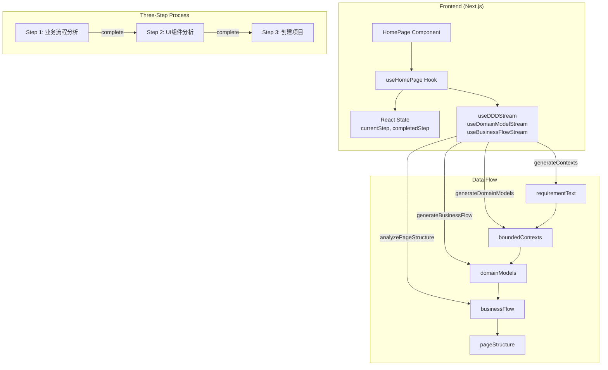

# Architecture: vibex-homepage-flow-verify

**Project**: vibex-homepage-flow-verify  
**Agent**: architect  
**Date**: 2026-03-18  
**Version**: 1.0

---

## 1. Tech Stack

| Layer | Technology | Version | Rationale |
|-------|------------|---------|------------|
| Frontend Framework | Next.js | 14.x | App Router, Server Components |
| UI Library | React | 18.x | hooks-based state management |
| State Management | Zustand | 3.x | Lightweight, TypeScript-friendly |
| Testing | Jest + Playwright | Jest 29.x / Playwright 1.40 | Unit + E2E coverage |
| Styling | CSS Modules | - | Scoped styling |
| Mock Data | Internal | - | No external dependencies |

---

## 2. Architecture Diagram



---

## 3. API Definitions

### 3.1 Core Hook Functions

```typescript
// useHomePage.ts - Public API

interface UseHomePageReturn {
  // State
  currentStep: number;           // 1-3
  completedStep: number;         // 0-3
  requirementText: string;
  boundedContexts: BoundedContext[];
  domainModels: DomainModel[];
  businessFlow: BusinessFlow | null;
  pageStructure: PageStructure | null;
  isGenerating: boolean;

  // Actions
  setCurrentStep: (step: number) => void;
  setRequirementText: (text: string) => void;
  generateContexts: (text: string) => void;
  generateDomainModels: (text: string, contexts: BoundedContext[]) => void;
  generateBusinessFlow: (models: DomainModel[], requirementText?: string) => void;
  analyzePageStructure: () => void;
  setCurrentStep: (step: number) => void;
  setCompletedStep: (step: number) => void;
}
```

### 3.2 Step Constants

```typescript
// HomePage.tsx - Inlined STEPS
const STEPS: Step[] = [
  { id: 1, label: '业务流程分析', description: '分析业务流程' },
  { id: 2, label: 'UI组件分析', description: '生成UI组件树' },
  { id: 3, label: '创建项目', description: '生成项目代码' },
];
```

---

## 4. Data Model

### 4.1 Core Entities

```typescript
interface Step {
  id: number;
  label: string;
  description: string;
}

interface BoundedContext {
  id: string;
  name: string;
  description: string;
  entities: DomainEntity[];
}

interface DomainModel {
  id: string;
  contextId: string;
  name: string;
  properties: Property[];
}

interface BusinessFlow {
  id: string;
  steps: FlowStep[];
  mermaidCode: string;
}

interface PageStructure {
  id: string;
  name: string;
  pages: Page[];
  routes: Route[];
}

interface Page {
  id: string;
  name: string;
  path: string;
  components: string[];
}

interface Route {
  path: string;
  pageId: string;
}
```

### 4.2 State Flow

```
requirementText (Step 1 input)
    ↓ generateContexts()
boundedContexts + contextMermaidCode
    ↓ generateDomainModels()
domainModels + modelMermaidCode
    ↓ generateBusinessFlow()
businessFlow + flowMermaidCode
    ↓ analyzePageStructure()
pageStructure (Step 2 complete → Step 3)
```

---

## 5. Testing Strategy

### 5.1 Test Framework

| Type | Framework | Coverage Target |
|------|-----------|------------------|
| Unit | Jest | > 80% |
| E2E | Playwright | Critical paths |

### 5.2 Core Test Cases

```typescript
// Unit Tests: useHomePageState.test.ts

describe('Three-Step Flow State', () => {
  it('should initialize at step 1', () => {
    const { result } = renderHook(() => useHomePageState());
    expect(result.current.currentStep).toBe(1);
  });

  it('should advance to step 2 after completing step 1', () => {
    const { result } = renderHook(() => useHomePage());
    act(() => {
      result.current.generateContexts('test requirement');
    });
    // Wait for SSE completion
    await waitFor(() => {
      expect(result.current.currentStep).toBe(2);
    });
  });

  it('should complete step 2 and advance to step 3', async () => {
    const { result } = renderHook(() => useHomePage());
    
    // Simulate step 1 completion
    act(() => {
      result.current.setCompletedStep(1);
      result.current.setCurrentStep(2);
    });
    
    // Execute step 2 action
    act(() => {
      result.current.analyzePageStructure();
    });
    
    await waitFor(() => {
      expect(result.current.currentStep).toBe(3);
    });
  });
});
```

### 5.3 E2E Test Scenarios

```typescript
// e2e/three-step-flow.spec.ts

import { test, expect } from '@playwright/test';

test('complete three-step flow', async ({ page }) => {
  await page.goto('/');
  
  // Step 1: 业务流程分析
  await expect(page.locator('text=业务流程分析')).toBeVisible();
  await page.fill('textarea', 'Test requirement');
  await page.click('button:has-text("业务流程分析")');
  
  // Verify auto-advance to Step 2
  await expect(page.locator('text=UI组件分析')).toBeVisible({ timeout: 10000 });
  
  // Step 2: UI组件分析
  await page.click('button:has-text("UI组件分析")');
  
  // Verify auto-advance to Step 3
  await expect(page.locator('text=创建项目')).toBeVisible({ timeout: 10000 });
  
  // Step 3: 创建项目
  await page.click('button:has-text("创建项目")');
});
```

---

## 6. Known Issues & Fixes Required

| Issue | Severity | Fix |
|-------|----------|-----|
| constants/homepage.ts still has 5 steps | High | Sync to 3 steps |
| Auto-jump from Step 1→2 via `generateBusinessFlow` | Medium | Verify useEffect logic |
| Data persistence across steps | Medium | Verify state holds between steps |
| `createProject` callback empty | Medium | Implement or mock |

---

## 7. File Locations

| File | Purpose |
|------|---------|
| `src/components/homepage/HomePage.tsx` | Main component with 3-step STEPS |
| `src/components/homepage/hooks/useHomePage.ts` | Core business logic |
| `src/components/homepage/hooks/useHomePageState.ts` | Basic state management |
| `src/constants/homepage.ts` | Constants (needs update) |
| `src/hooks/useDDDStream.ts` | SSE stream for contexts |
| `src/hooks/useDomainModelStream.ts` | SSE stream for models |
| `src/hooks/useBusinessFlowStream.ts` | SSE stream for flows |

---

## 8. Verification Commands

```bash
# Run unit tests
cd vibex-fronted && npm test -- --testPathPattern=useHomePageState

# Run E2E tests
cd vibex-fronted && npx playwright test tests/e2e/three-step-flow.spec.ts

# Build verification
cd vibex-fronted && npm run build
```

---

*Generated by Architect Agent*
