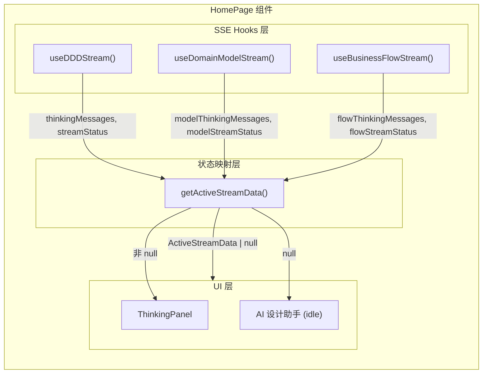
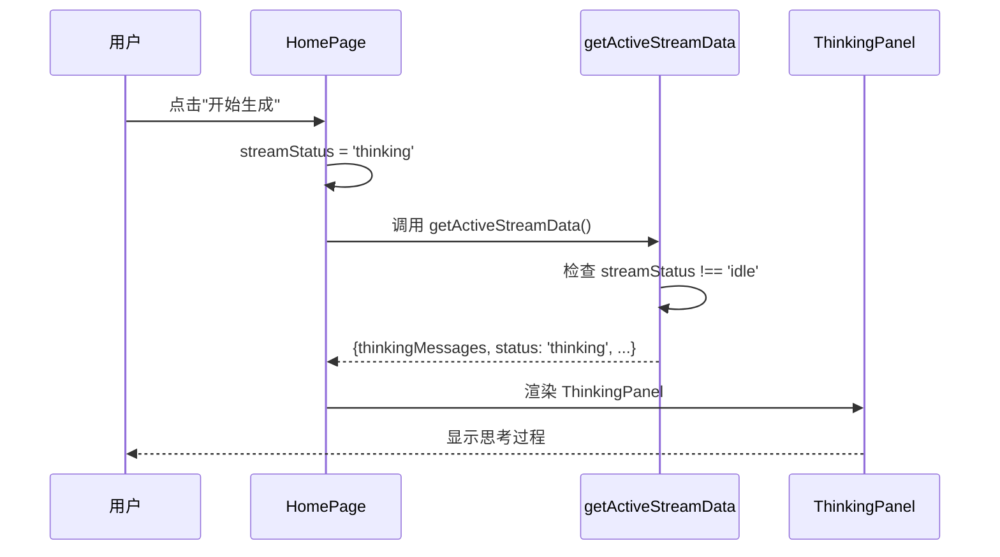
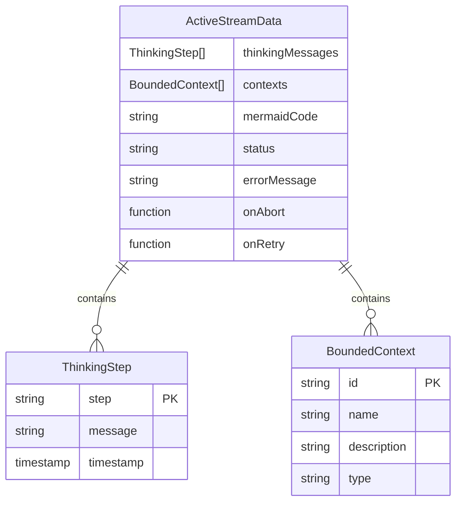

# 架构设计: vibex-homepage-thinking-panel-fix

**项目**: vibex-homepage-thinking-panel-fix  
**架构师**: Architect Agent  
**日期**: 2026-03-16  
**状态**: ✅ 设计完成

---

## 1. 技术栈

| 技术 | 版本 | 选择理由 |
|------|------|----------|
| React | 18.x | 现有项目基础 |
| TypeScript | 5.x | 类型安全 |
| Zustand | 4.x | 状态管理 |
| SSE | 原生 | 流式数据传输 |

---

## 2. 架构图



### 2.1 状态选择流程



---

## 3. 核心接口定义

### 3.1 ActiveStreamData 接口

```typescript
interface ActiveStreamData {
  // 思考消息数组
  thinkingMessages: ThinkingStep[];
  
  // 限界上下文（仅限界上下文生成时有值）
  contexts?: BoundedContext[];
  
  // Mermaid 代码
  mermaidCode: string;
  
  // 流状态
  status: 'idle' | 'thinking' | 'done' | 'error';
  
  // 错误信息
  errorMessage: string | null;
  
  // 中止回调
  onAbort: () => void;
  
  // 重试回调
  onRetry: () => void;
}
```

### 3.2 getActiveStreamData 函数签名

```typescript
function getActiveStreamData(
  // 限界上下文数据
  contextData: { 
    messages: ThinkingStep[]; 
    contexts: BoundedContext[]; 
    mermaid: string; 
    status: string; 
    error: string | null; 
    abort: () => void 
  },
  // 领域模型数据
  modelData: { 
    messages: ThinkingStep[]; 
    mermaid: string; 
    status: string; 
    error: string | null; 
    abort: () => void 
  },
  // 业务流程数据
  flowData: { 
    messages: ThinkingStep[]; 
    mermaid: string; 
    status: string; 
    error: string | null; 
    abort: () => void 
  }
): ActiveStreamData | null;
```

### 3.3 ThinkingPanel Props

```typescript
interface ThinkingPanelProps {
  thinkingMessages: ThinkingStep[];
  contexts?: BoundedContext[];
  mermaidCode: string;
  status: DDDStreamStatus;
  errorMessage: string | null;
  onAbort?: () => void;
  onRetry?: () => void;
  onUseDefault?: () => void;
}
```

---

## 4. 数据模型

### 4.1 实体关系



### 4.2 状态枚举

```typescript
type DDDStreamStatus = 'idle' | 'thinking' | 'done' | 'error';

type ContextType = 'core' | 'supporting' | 'generic' | 'external';

interface ThinkingStep {
  step: 'analyzing' | 'identifying-core' | 'calling-ai';
  message: string;
  timestamp?: number;
}
```

---

## 5. 实现方案

### 5.1 核心逻辑：getActiveStreamData

```typescript
/**
 * 获取当前活跃的 SSE 流数据
 * 基于实际 SSE 状态而非 currentStep 选择消息
 * 优先级: 限界上下文 > 领域模型 > 业务流程
 */
function getActiveStreamData(
  contextData: ContextStreamData,
  modelData: ModelStreamData,
  flowData: FlowStreamData
): ActiveStreamData | null {
  // 优先级 1: 限界上下文生成
  if (contextData.status !== 'idle') {
    return {
      thinkingMessages: contextData.messages,
      contexts: contextData.contexts,
      mermaidCode: contextData.mermaid,
      status: contextData.status,
      errorMessage: contextData.error,
      onAbort: contextData.abort,
      onRetry: () => {}, // 由组件设置
    };
  }

  // 优先级 2: 领域模型生成
  if (modelData.status !== 'idle') {
    return {
      thinkingMessages: modelData.messages,
      contexts: undefined,
      mermaidCode: modelData.mermaid,
      status: modelData.status,
      errorMessage: modelData.error,
      onAbort: modelData.abort,
      onRetry: () => {},
    };
  }

  // 优先级 3: 业务流程生成
  if (flowData.status !== 'idle') {
    return {
      thinkingMessages: flowData.messages,
      contexts: undefined,
      mermaidCode: flowData.mermaid,
      status: flowData.status,
      errorMessage: flowData.error,
      onAbort: flowData.abort,
      onRetry: () => {},
    };
  }

  // 所有状态为 idle
  return null;
}
```

### 5.2 组件使用方式

```tsx
// 在 HomePage.tsx 中
const activeStream = getActiveStreamData(
  { 
    messages: thinkingMessages, 
    contexts: streamContexts, 
    mermaid: streamMermaidCode, 
    status: streamStatus, 
    error: streamError, 
    abort: abortContexts 
  },
  { 
    messages: modelThinkingMessages, 
    mermaid: streamModelMermaidCode, 
    status: modelStreamStatus, 
    error: modelStreamError, 
    abort: abortModels 
  },
  { 
    messages: flowThinkingMessages, 
    mermaid: streamFlowMermaidCode, 
    status: flowStreamStatus, 
    error: flowStreamError, 
    abort: abortFlow 
  }
);

// 条件渲染
{activeStream ? (
  <ThinkingPanel
    thinkingMessages={activeStream.thinkingMessages}
    contexts={activeStream.contexts}
    mermaidCode={activeStream.mermaidCode}
    status={activeStream.status}
    errorMessage={activeStream.errorMessage}
    onAbort={activeStream.onAbort}
    onRetry={() => {
      // 根据错误状态选择重试函数
      if (streamStatus === 'error') handleGenerate();
      else if (modelStreamStatus === 'error') handleGenerateDomainModel();
      else if (flowStreamStatus === 'error') handleGenerateBusinessFlow();
    }}
    onUseDefault={handleGenerate}
  />
) : (
  <div className={styles.aiHeader}>
    <div className={styles.aiAvatar}>🤖</div>
    <div>
      <div className={styles.aiTitle}>AI 设计助手</div>
      <div className={styles.aiSubtitle}>随时为你解答</div>
    </div>
  </div>
)}
```

---

## 6. 测试策略

### 6.1 单元测试

**框架**: Jest + React Testing Library

**覆盖率要求**: > 80%

```typescript
describe('getActiveStreamData', () => {
  it('限界上下文生成时返回正确的数据', () => {
    const result = getActiveStreamData(
      { messages: [{step: 'analyzing', message: 'test'}], status: 'thinking', ... },
      { messages: [], status: 'idle', ... },
      { messages: [], status: 'idle', ... }
    );
    
    expect(result).not.toBeNull();
    expect(result?.status).toBe('thinking');
    expect(result?.thinkingMessages).toHaveLength(1);
  });

  it('领域模型生成时返回正确的数据', () => {
    const result = getActiveStreamData(
      { messages: [], status: 'idle', ... },
      { messages: [{step: 'analyzing', message: 'model'}], status: 'thinking', ... },
      { messages: [], status: 'idle', ... }
    );
    
    expect(result).not.toBeNull();
    expect(result?.contexts).toBeUndefined();
  });

  it('所有 idle 时返回 null', () => {
    const result = getActiveStreamData(
      { messages: [], status: 'idle', ... },
      { messages: [], status: 'idle', ... },
      { messages: [], status: 'idle', ... }
    );
    
    expect(result).toBeNull();
  });

  it('优先级正确：限界上下文 > 领域模型 > 业务流程', () => {
    const result = getActiveStreamData(
      { messages: [{step: 'a'}], status: 'thinking', ... },
      { messages: [{step: 'b'}], status: 'thinking', ... },
      { messages: [{step: 'c'}], status: 'thinking', ... }
    );
    
    // 应该返回限界上下文数据
    expect(result?.thinkingMessages[0].step).toBe('a');
  });
});
```

### 6.2 集成测试

```typescript
describe('HomePage ThinkingPanel Integration', () => {
  it('点击"开始生成"后显示正确的思考过程', async () => {
    render(<HomePage />);
    
    // 输入需求
    fireEvent.change(screen.getByPlaceholderText(/描述你的产品需求/), {
      target: { value: '测试需求' }
    });
    
    // 点击生成
    fireEvent.click(screen.getByText('开始生成'));
    
    // 验证 ThinkingPanel 显示
    await waitFor(() => {
      expect(screen.getByText('AI 思考过程')).toBeInTheDocument();
    });
  });
});
```

### 6.3 手动测试清单

| ID | 场景 | 操作 | 预期结果 | 状态 |
|----|------|------|----------|------|
| TP-001 | 限界上下文生成 | 输入需求 → 点击"开始生成" | 右侧面板显示思考过程 | ⬜ |
| TP-002 | 领域模型生成 | 完成步骤2 → 点击"生成领域模型" | 显示领域模型思考过程 | ⬜ |
| TP-003 | 业务流程生成 | 完成步骤3 → 点击"生成业务流程" | 显示业务流程思考过程 | ⬜ |
| TP-004 | 中止功能 | 生成中点击"停止" | 停止生成，状态更新 | ⬜ |
| TP-005 | 错误处理 | 模拟错误场景 | 显示错误信息和重试按钮 | ⬜ |

---

## 7. 约束与边界

### 7.1 红线约束

| 约束 | 说明 |
|------|------|
| 不修改 ThinkingPanel 组件 | 保持现有组件接口不变 |
| 不修改 SSE Hooks | 保持现有流式逻辑不变 |
| 保持 Step 2/3 功能正常 | 确保领域模型和业务流程生成不受影响 |

### 7.2 扩展点

1. **新增 SSE 流**：在 `getActiveStreamData` 中添加新的优先级分支
2. **状态持久化**：可扩展支持跨页面状态恢复
3. **多流并发**：当前设计假设单流运行，可扩展支持并发

---

## 8. 影响评估

### 8.1 代码变更范围

| 文件 | 变更类型 | 影响程度 |
|------|----------|----------|
| `src/components/homepage/HomePage.tsx` | 新增函数、修改渲染逻辑 | 中 |
| `src/components/ui/ThinkingPanel.tsx` | 无变更 | 无 |

### 8.2 性能影响

| 项目 | 影响 | 说明 |
|------|------|------|
| 渲染性能 | 无影响 | 纯函数计算，开销可忽略 |
| 内存占用 | 无影响 | 无新增状态存储 |
| 网络请求 | 无影响 | 不改变 SSE 请求逻辑 |

---

## 9. 实现状态

### 9.1 当前实现确认

✅ **已实现**：`getActiveStreamData` 函数已存在于 `HomePage.tsx` 中

```typescript
// 文件位置: src/components/homepage/HomePage.tsx
// 行数: 约 102-150 行
```

### 9.2 验证结果

| 检查项 | 状态 | 说明 |
|--------|------|------|
| 函数存在 | ✅ | getActiveStreamData 已实现 |
| 优先级正确 | ✅ | CTX > MODEL > FLOW |
| 接口完整 | ✅ | 返回 ActiveStreamData 或 null |
| 组件集成 | ✅ | ThinkingPanel 正确使用 |

---

## 10. 下一步

1. **开发验证**: 确认代码实现与设计一致
2. **测试执行**: 运行单元测试和手动测试
3. **代码审查**: Reviewer 审核实现质量

---

**产出物**: `/root/.openclaw/vibex/docs/architecture/vibex-homepage-thinking-panel-fix-arch.md`