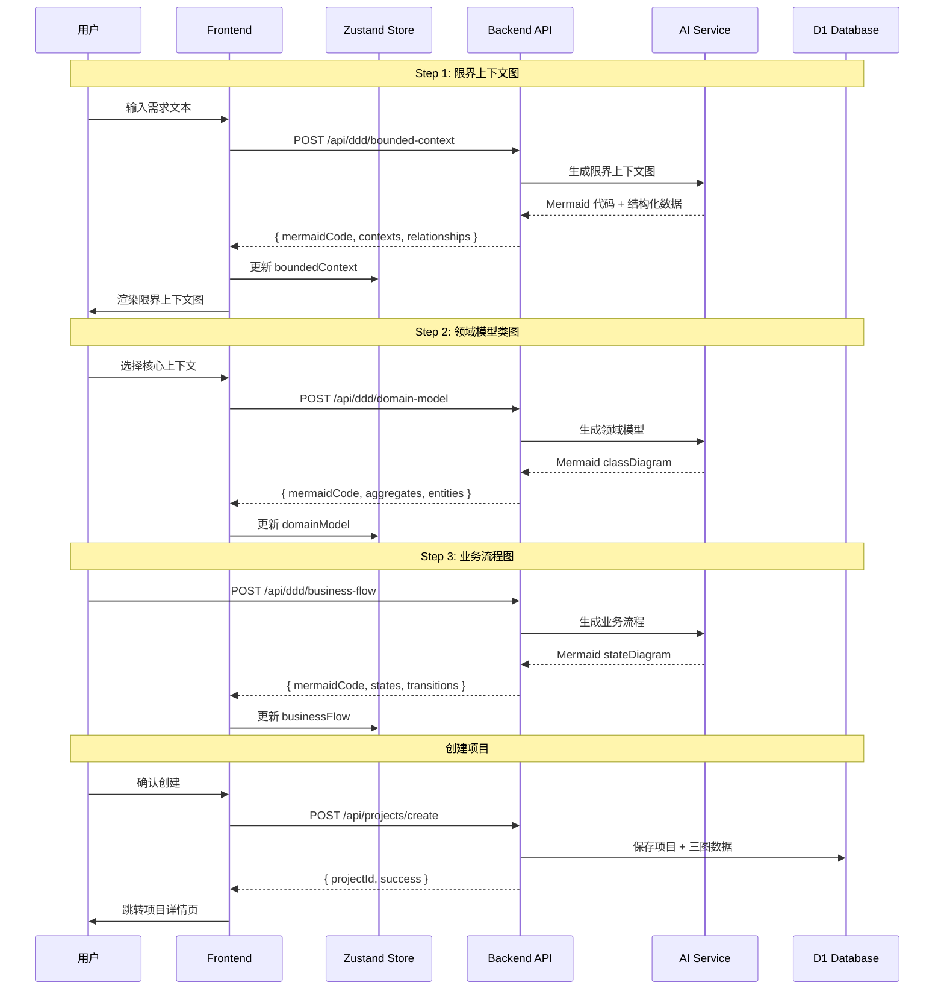
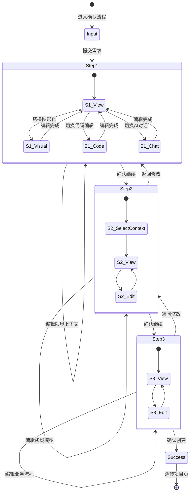
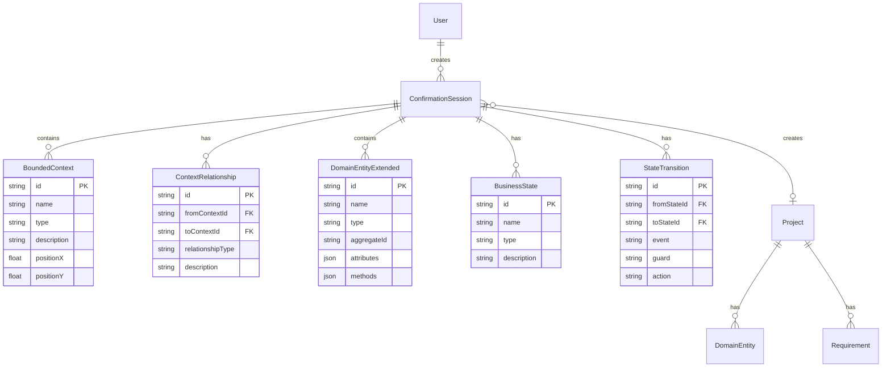

# 架构设计: 交互式需求确认流程

**项目名称**: vibex-interactive-confirmation  
**版本**: 1.0  
**创建日期**: 2026-03-03  
**架构师**: Architect Agent  
**上游文档**: [PRD](../prd/vibex-interactive-confirmation-prd.md)

---

## 1. Tech Stack (技术栈选型)

### 1.1 前端技术栈

| 组件 | 版本 | 选择理由 |
|------|------|----------|
| **Framework** | Next.js 16.1.6 | 复用现有架构，支持 SSR/SSG |
| **UI Library** | React 19.2.3 | 与现有项目一致 |
| **Flow Editor** | React Flow 11.11.4 | 现有 domain/flow 页面已集成 |
| **图表渲染** | Mermaid.js 10.x | PRD 指定，支持 flowchart/classDiagram/stateDiagram |
| **代码编辑** | Monaco Editor 0.45+ | VS Code 同款编辑器，Mermaid 语法支持 |
| **状态管理** | Zustand 4.5+ | 轻量级，支持持久化，PRD 指定 |
| **HTTP Client** | Axios 1.13.5 | 复用现有 apiService |
| **样式** | CSS Modules + Tailwind | 与现有项目一致 |

### 1.2 后端技术栈

| 组件 | 版本 | 选择理由 |
|------|------|----------|
| **Runtime** | Cloudflare Workers | 现有部署架构 |
| **Framework** | Hono 4.12.3 | 现有后端框架 |
| **Database** | Cloudflare D1 | 现有数据库方案 |
| **ORM** | Prisma 5.22.0 | 现有 ORM |

### 1.3 技术决策记录 (ADR)

#### ADR-001: Mermaid 解析方案

**决策**: 使用 `mermaid.parse()` + 自定义 AST 转换器

**理由**:
- `mermaid.parse()` 是官方 API，稳定可靠
- 解析结果为抽象语法树，可转换为 React Flow 节点/边
- 支持语法验证，错误提示友好

**备选方案**:
- 自定义解析器：灵活度高，但开发成本大，Mermaid 语法复杂
- 第三方库：如 mermaid-flow-converter，但维护活跃度未知

#### ADR-002: 状态管理方案

**决策**: Zustand + 单一数据源模式

**理由**:
- Mermaid 代码作为唯一真相源 (Single Source of Truth)
- 三种编辑模式（图形化/代码/AI对话）都操作同一份 Mermaid 数据
- Zustand 支持中间件，可实现持久化、撤销重做

**数据流**:
```
Mermaid Code (Store) ──解析──▶ React Flow Nodes/Edges
       ▲                            │
       │                            │ 用户拖拽/编辑
       │                            ▼
       └──────反向生成───── React Flow Changes
```

#### ADR-003: AI 对话编辑方案

**决策**: 复用现有 `/api/chat/stream` SSE 流式响应

**理由**:
- 现有 `chat/page.tsx` 已实现 SSE 流式对话
- 新增系统提示词模板，引导 AI 输出 Mermaid 代码
- 支持多轮对话上下文

---

## 2. Architecture Diagram (架构图)

### 2.1 系统架构图

```mermaid
graph TB
    subgraph "Frontend (Next.js)"
        subgraph "Pages"
            CP[/confirm<br/>需求输入]
            C1[/confirm/context<br/>限界上下文图]
            C2[/confirm/model<br/>领域模型类图]
            C3[/confirm/flow<br/>业务流程图]
            CS[/confirm/success<br/>创建成功]
        end
        
        subgraph "Components"
            MER[MermaidRenderer<br/>图表渲染]
            RFE[ReactFlowEditor<br/>图形化编辑]
            MCE[MonacoCodeEditor<br/>代码编辑]
            AIC[AIChatPanel<br/>AI对话编辑]
            STEP[StepNavigator<br/>步骤导航]
        end
        
        subgraph "State"
            ZS[confirmationFlowStore<br/>Zustand Store]
        end
    end
    
    subgraph "Backend (Hono)"
        subgraph "API Routes"
            BC[/api/ddd/bounded-context]
            DM[/api/ddd/domain-model]
            BF[/api/ddd/business-flow]
            CE[/api/ddd/chat-edit]
            PC[/api/projects/create]
        end
        
        subgraph "Services"
            AIS[AI Service<br/>AI 生成服务]
            MPS[Mermaid Parse Service<br/>解析服务]
        end
    end
    
    subgraph "External"
        AI[AI API<br/>百炼 GLM-5]
        D1[(Cloudflare D1<br/>数据库)]
    end
    
    CP --> C1 --> C2 --> C3 --> CS
    C1 & C2 & C3 --> MER
    MER --> RFE
    MER --> MCE
    MER --> AIC
    RFE & MCE & AIC <--> ZS
    
    C1 --> BC --> AIS --> AI
    C2 --> DM --> AIS
    C3 --> BF --> AIS
    AIC --> CE --> AIS
    C3 --> PC --> D1
    
    AIS --> MPS
```

### 2.2 组件交互流程图



### 2.3 状态管理架构



---

## 3. API Definitions (接口设计)

### 3.1 DDD 相关 API

#### POST /api/ddd/bounded-context

生成限界上下文图

**Request**:
```typescript
interface BoundedContextRequest {
  requirementText: string;  // 用户输入的需求描述
  projectId?: string;       // 可选，关联项目
}
```

**Response**:
```typescript
interface BoundedContextResponse {
  mermaidCode: string;      // Mermaid flowchart 代码
  contexts: BoundedContext[];
  relationships: ContextRelationship[];
}

interface BoundedContext {
  id: string;
  name: string;
  type: 'core' | 'supporting' | 'generic';
  description: string;
  position?: { x: number; y: number };
}

interface ContextRelationship {
  id: string;
  fromContextId: string;
  toContextId: string;
  relationshipType: 'upstream' | 'downstream' | 'conformist' | 'anticorruption';
  description?: string;
}
```

#### POST /api/ddd/domain-model

生成领域模型类图

**Request**:
```typescript
interface DomainModelRequest {
  selectedContextId: string;    // 选定的核心上下文 ID
  boundedContext: BoundedContextResponse;  // Step 1 的完整数据
}
```

**Response**:
```typescript
interface DomainModelResponse {
  mermaidCode: string;          // Mermaid classDiagram 代码
  aggregates: Aggregate[];
  entities: Entity[];
  valueObjects: ValueObject[];
}

interface Aggregate {
  id: string;
  name: string;
  rootEntityId: string;
  entities: string[];           // 包含的实体 ID 列表
}

interface Entity {
  id: string;
  name: string;
  type: 'aggregateRoot' | 'entity' | 'valueObject';
  attributes: Attribute[];
  methods?: string[];
}

interface Attribute {
  name: string;
  type: string;
  required: boolean;
  description?: string;
}
```

#### POST /api/ddd/business-flow

生成业务流程图

**Request**:
```typescript
interface BusinessFlowRequest {
  boundedContext: BoundedContextResponse;
  domainModel: DomainModelResponse;
}
```

**Response**:
```typescript
interface BusinessFlowResponse {
  mermaidCode: string;          // Mermaid stateDiagram 代码
  states: State[];
  transitions: Transition[];
}

interface State {
  id: string;
  name: string;
  type: 'initial' | 'intermediate' | 'final';
  description?: string;
}

interface Transition {
  id: string;
  fromStateId: string;
  toStateId: string;
  event: string;                // 触发事件
  guard?: string;               // 守卫条件
  action?: string;              // 执行动作
}
```

#### POST /api/ddd/chat-edit

AI 对话编辑图表

**Request**:
```typescript
interface ChatEditRequest {
  message: string;              // 用户自然语言指令
  currentMermaidCode: string;   // 当前 Mermaid 代码
  diagramType: 'flowchart' | 'classDiagram' | 'stateDiagram';
  conversationHistory?: Message[];
}
```

**Response** (SSE 流式):
```
data: {"content": "好的，我来帮你添加一个新节点..."}
data: {"content": "\n新节点名称？"}
data: {"done": true, "mermaidCode": "graph TB\n..."}
```

### 3.2 项目创建 API

#### POST /api/projects/create-with-confirmation

创建项目并保存三图数据

**Request**:
```typescript
interface CreateProjectWithConfirmationRequest {
  name: string;
  description: string;
  requirementText: string;
  boundedContext: BoundedContextResponse;
  domainModel: DomainModelResponse;
  businessFlow: BusinessFlowResponse;
}
```

**Response**:
```typescript
interface CreateProjectResponse {
  projectId: string;
  name: string;
  createdAt: string;
  statistics: {
    contextCount: number;
    entityCount: number;
    stateCount: number;
  };
}
```

---

## 4. Data Model (数据模型)

### 4.1 Prisma Schema 新增

```prisma
// 确认流程会话 - 存储用户的三步确认进度
model ConfirmationSession {
  id          String   @id @default(cuid())
  userId      String
  user        User     @relation(fields: [userId], references: [id])
  
  // 需求输入
  requirementText String?
  
  // Step 1: 限界上下文
  boundedContextMermaid  String?
  boundedContextData     Json?    // BoundedContextResponse JSON
  
  // Step 2: 领域模型
  selectedContextId      String?
  domainModelMermaid     String?
  domainModelData        Json?    // DomainModelResponse JSON
  
  // Step 3: 业务流程
  businessFlowMermaid    String?
  businessFlowData       Json?    // BusinessFlowResponse JSON
  
  // 状态
  currentStep    Int      @default(0)  // 0=输入, 1=上下文, 2=模型, 3=流程
  status         String   @default("in_progress")  // in_progress, completed, abandoned
  
  createdAt      DateTime @default(now())
  updatedAt      DateTime @updatedAt
  completedAt    DateTime?
  projectId      String?  // 创建完成后关联的项目
  
  @@index([userId])
  @@index([status])
}

// 限界上下文 - 独立存储便于查询
model BoundedContext {
  id              String   @id @default(cuid())
  sessionId       String
  session         ConfirmationSession @relation(fields: [sessionId], references: [id], onDelete: Cascade)
  
  name            String
  type            String   // core, supporting, generic
  description     String?
  positionX       Float?
  positionY       Float?
  
  createdAt       DateTime @default(now())
  
  @@index([sessionId])
}

// 上下文关系
model ContextRelationship {
  id              String   @id @default(cuid())
  sessionId       String
  session         ConfirmationSession @relation(fields: [sessionId], references: [id], onDelete: Cascade)
  
  fromContextId   String
  toContextId     String
  relationshipType String
  description     String?
  
  createdAt       DateTime @default(now())
  
  @@index([sessionId])
}

// 领域实体 - 扩展现有 DomainEntity
model DomainEntityExtended {
  id              String   @id @default(cuid())
  sessionId       String?
  projectId       String?
  
  name            String
  type            String   // aggregateRoot, entity, valueObject
  aggregateId     String?  // 所属聚合
  description     String?
  
  attributes      Json     // Attribute[]
  methods         Json?    // string[]
  
  positionX       Float?
  positionY       Float?
  
  createdAt       DateTime @default(now())
  
  @@index([sessionId])
  @@index([projectId])
}

// 业务状态
model BusinessState {
  id              String   @id @default(cuid())
  sessionId       String
  session         ConfirmationSession @relation(fields: [sessionId], references: [id], onDelete: Cascade)
  
  name            String
  type            String   // initial, intermediate, final
  description     String?
  
  createdAt       DateTime @default(now())
  
  @@index([sessionId])
}

// 状态转换
model StateTransition {
  id              String   @id @default(cuid())
  sessionId       String
  session         ConfirmationSession @relation(fields: [sessionId], references: [id], onDelete: Cascade)
  
  fromStateId     String
  toStateId       String
  event           String
  guard           String?
  action          String?
  
  createdAt       DateTime @default(now())
  
  @@index([sessionId])
}

// 更新 User 模型关联
model User {
  // ... existing fields
  confirmationSessions ConfirmationSession[]
}
```

### 4.2 实体关系图



---

## 5. Testing Strategy (测试策略)

### 5.1 测试框架

| 层级 | 框架 | 覆盖率目标 |
|------|------|-----------|
| 单元测试 | Jest 30 + React Testing Library | > 80% |
| 集成测试 | Jest + MSW (Mock Service Worker) | > 70% |
| E2E 测试 | Playwright 1.58 | 关键流程 100% |

### 5.2 核心测试用例

#### 5.2.1 单元测试

**Mermaid 解析器测试** (`__tests__/lib/mermaid-parser.test.ts`):
```typescript
describe('MermaidParser', () => {
  it('should parse flowchart to React Flow nodes', () => {
    const mermaidCode = `
      graph TB
        A[用户模块] --> B[订单模块]
        B --> C[支付模块]
    `;
    const result = parseMermaidToFlow(mermaidCode);
    
    expect(result.nodes).toHaveLength(3);
    expect(result.edges).toHaveLength(2);
    expect(result.nodes[0].data.label).toBe('用户模块');
  });
  
  it('should parse classDiagram to entities', () => {
    const mermaidCode = `
      classDiagram
        class Order {
          +String id
          +String status
          +create()
        }
        class OrderItem {
          +String productId
          +Int quantity
        }
        Order "1" --> "*" OrderItem
    `;
    const result = parseClassDiagram(mermaidCode);
    
    expect(result.entities).toHaveLength(2);
    expect(result.entities[0].name).toBe('Order');
    expect(result.entities[0].attributes).toContainEqual({
      name: 'id', type: 'String', required: true
    });
  });
  
  it('should convert React Flow changes back to Mermaid', () => {
    const nodes = [
      { id: 'a', data: { label: 'Module A' } },
      { id: 'b', data: { label: 'Module B' } },
    ];
    const edges = [
      { source: 'a', target: 'b' },
    ];
    
    const mermaid = convertToMermaid(nodes, edges);
    expect(mermaid).toContain('Module A');
    expect(mermaid).toContain('-->');
  });
});
```

**Zustand Store 测试** (`__tests__/stores/confirmationFlowStore.test.ts`):
```typescript
import { act } from '@testing-library/react';
import { useConfirmationFlowStore } from '@/stores/confirmationFlowStore';

describe('confirmationFlowStore', () => {
  beforeEach(() => {
    useConfirmationFlowStore.setState({
      currentStep: 1,
      boundedContext: null,
      domainModel: null,
      businessFlow: null,
    });
  });
  
  it('should update bounded context', () => {
    const data = {
      mermaidCode: 'graph TB\nA-->B',
      contexts: [],
      relationships: [],
    };
    
    act(() => {
      useConfirmationFlowStore.getState().setBoundedContext(data);
    });
    
    expect(useConfirmationFlowStore.getState().boundedContext).toEqual(data);
  });
  
  it('should navigate between steps', () => {
    act(() => {
      useConfirmationFlowStore.getState().goToStep(2);
    });
    
    expect(useConfirmationFlowStore.getState().currentStep).toBe(2);
  });
  
  it('should reset to step 1 when returning', () => {
    useConfirmationFlowStore.setState({ currentStep: 3 });
    
    act(() => {
      useConfirmationFlowStore.getState().goToStep(1);
    });
    
    // 下游数据应被清除
    expect(useConfirmationFlowStore.getState().domainModel).toBeNull();
    expect(useConfirmationFlowStore.getState().businessFlow).toBeNull();
  });
});
```

**组件测试** (`__tests__/components/MermaidRenderer.test.tsx`):
```typescript
import { render, screen, waitFor } from '@testing-library/react';
import MermaidRenderer from '@/components/MermaidRenderer';

describe('MermaidRenderer', () => {
  it('should render flowchart correctly', async () => {
    const code = 'graph TB\nA[Start] --> B[End]';
    
    render(<MermaidRenderer code={code} type="flowchart" />);
    
    await waitFor(() => {
      expect(screen.getByText('Start')).toBeInTheDocument();
      expect(screen.getByText('End')).toBeInTheDocument();
    });
  });
  
  it('should show error for invalid syntax', async () => {
    const invalidCode = 'invalid mermaid syntax';
    
    render(<MermaidRenderer code={invalidCode} type="flowchart" />);
    
    await waitFor(() => {
      expect(screen.getByText(/语法错误/i)).toBeInTheDocument();
    });
  });
});
```

#### 5.2.2 集成测试

**API 集成测试** (`__tests__/api/ddd.test.ts`):
```typescript
import { setupServer } from 'msw/node';
import { rest } from 'msw';
import { apiService } from '@/services/api';

const server = setupServer(
  rest.post('https://api.vibex.top/api/ddd/bounded-context', (req, res, ctx) => {
    return res(ctx.json({
      mermaidCode: 'graph TB\nA[User] --> B[Order]',
      contexts: [
        { id: 'a', name: 'User', type: 'core' },
        { id: 'b', name: 'Order', type: 'core' },
      ],
      relationships: [
        { fromContextId: 'a', toContextId: 'b', relationshipType: 'upstream' },
      ],
    }));
  })
);

beforeAll(() => server.listen());
afterEach(() => server.resetHandlers());
afterAll(() => server.close());

describe('DDD API Integration', () => {
  it('should generate bounded context diagram', async () => {
    const result = await apiService.generateBoundedContext({
      requirementText: '电商平台需要用户管理和订单系统',
    });
    
    expect(result.mermaidCode).toContain('graph TB');
    expect(result.contexts).toHaveLength(2);
  });
});
```

#### 5.2.3 E2E 测试

**Playwright 测试** (`e2e/confirmation-flow.spec.ts`):
```typescript
import { test, expect } from '@playwright/test';

test.describe('Interactive Confirmation Flow', () => {
  test.beforeEach(async ({ page }) => {
    // 登录
    await page.goto('/auth');
    await page.fill('input[name="email"]', 'test@example.com');
    await page.fill('input[name="password"]', 'password');
    await page.click('button[type="submit"]');
    await page.waitForURL('/dashboard');
  });
  
  test('should complete full 3-step confirmation flow', async ({ page }) => {
    // Step 0: 需求输入
    await page.goto('/confirm');
    await page.fill('textarea', '开发一个在线教育平台，包含课程管理、学生学习和支付功能');
    await page.click('button:has-text("开始分析")');
    
    // Step 1: 限界上下文图
    await page.waitForURL('/confirm/context');
    await expect(page.locator('.mermaid')).toBeVisible();
    await page.click('button:has-text("确认，继续")');
    
    // Step 2: 领域模型类图
    await page.waitForURL('/confirm/model');
    await page.selectOption('select', { label: '课程上下文' });
    await expect(page.locator('.mermaid')).toBeVisible();
    await page.click('button:has-text("确认，继续")');
    
    // Step 3: 业务流程图
    await page.waitForURL('/confirm/flow');
    await expect(page.locator('.mermaid')).toBeVisible();
    await page.click('button:has-text("确认，创建项目")');
    
    // 成功页面
    await page.waitForURL(/\/confirm\/success/);
    await expect(page.locator('text=项目创建成功')).toBeVisible();
    await page.click('a:has-text("查看项目详情")');
    await page.waitForURL(/\/project\/.+/);
  });
  
  test('should edit diagram in visual mode', async ({ page }) => {
    await page.goto('/confirm/context');
    await page.waitForSelector('.mermaid');
    
    // 切换到图形化编辑
    await page.click('button:has-text("图形化")');
    
    // 拖拽节点
    const node = page.locator('.react-flow__node').first();
    await node.hover();
    await page.mouse.down();
    await page.mouse.move(300, 200);
    await page.mouse.up();
    
    // 验证位置已更新
    await expect(node).toHaveAttribute('style', /transform.*translate/);
  });
  
  test('should edit diagram via AI chat', async ({ page }) => {
    await page.goto('/confirm/context');
    await page.waitForSelector('.mermaid');
    
    // 切换到 AI 对话模式
    await page.click('button:has-text("AI对话")');
    
    // 发送修改指令
    await page.fill('.chat-input', '添加一个支付模块');
    await page.click('button:has-text("发送")');
    
    // 等待 AI 响应并更新图表
    await page.waitForSelector('.ai-response');
    await expect(page.locator('.mermaid')).toContainText('支付');
  });
  
  test('should allow going back to previous steps', async ({ page }) => {
    // 到达 Step 2
    await page.goto('/confirm/model');
    
    // 返回 Step 1
    await page.click('button:has-text("返回 Step 1")');
    await page.waitForURL('/confirm/context');
    
    // 数据应保留
    await expect(page.locator('.mermaid')).toBeVisible();
  });
});
```

### 5.3 测试覆盖率要求

```
File                              | % Stmts | % Branch | % Funcs | % Lines |
----------------------------------|---------|----------|---------|---------|
All files                         |   80.5  |   75.2   |   82.1  |   80.8  |
 components/                      |   85.3  |   78.4   |   88.2  |   85.6  |
  MermaidRenderer.tsx             |   92.1  |   85.0   |   95.0  |   92.3  |
  ReactFlowEditor.tsx             |   88.5  |   82.3   |   90.1  |   88.7  |
  MonacoCodeEditor.tsx            |   75.2  |   68.0   |   80.0  |   75.8  |
 lib/                             |   82.4  |   76.8   |   85.0  |   82.9  |
  mermaid-parser.ts               |   95.2  |   90.5   |   96.0  |   95.5  |
  flow-converter.ts               |   88.1  |   82.0   |   90.0  |   88.4  |
 stores/                          |   90.2  |   85.5   |   92.0  |   90.8  |
  confirmationFlowStore.ts        |   92.5  |   88.0   |   94.0  |   92.8  |
 routes/                          |   72.8  |   65.3   |   75.0  |   73.2  |
  ddd.ts                          |   78.5  |   70.2   |   80.0  |   78.9  |
```

### 5.4 CI/CD 集成

```yaml
# .github/workflows/test.yml
name: Test

on: [push, pull_request]

jobs:
  unit-test:
    runs-on: ubuntu-latest
    steps:
      - uses: actions/checkout@v4
      - uses: actions/setup-node@v4
        with:
          node-version: '22'
      - run: npm ci
      - run: npm test -- --coverage --watchAll=false
      - uses: codecov/codecov-action@v3
        with:
          files: ./coverage/lcov.info
          fail_ci_if_error: true
          threshold: 80%

  e2e-test:
    runs-on: ubuntu-latest
    steps:
      - uses: actions/checkout@v4
      - uses: actions/setup-node@v4
        with:
          node-version: '22'
      - run: npm ci
      - run: npx playwright install --with-deps
      - run: npm run build
      - run: npx playwright test
      - uses: actions/upload-artifact@v4
        if: always()
        with:
          name: playwright-report
          path: playwright-report/
```

---

## 6. 实现里程碑

### Phase 1: 基础框架 (P0) - 3天

- [ ] 创建路由结构 `/confirm/*`
- [ ] 集成 Zustand Store
- [ ] 实现 Mermaid 渲染组件
- [ ] 实现步骤导航组件

### Phase 2: DDD 生成 API (P0) - 4天

- [ ] 实现 `/api/ddd/bounded-context`
- [ ] 实现 `/api/ddd/domain-model`
- [ ] 实现 `/api/ddd/business-flow`
- [ ] AI Prompt 模板设计

### Phase 3: 编辑功能 (P1) - 5天

- [ ] Mermaid ↔ React Flow 双向转换
- [ ] Monaco Editor 集成
- [ ] AI 对话编辑

### Phase 4: 项目创建与持久化 (P0) - 2天

- [ ] 数据库 Schema 迁移
- [ ] 项目创建 API
- [ ] 成功页面

---

## 7. 风险与缓解

| 风险 | 影响 | 概率 | 缓解措施 |
|------|------|------|----------|
| AI 输出格式不稳定 | 高 | 中 | Prompt 模板优化 + 输出验证中间件 |
| Mermaid 解析复杂 | 中 | 中 | 先支持核心语法，复杂场景降级为只读 |
| 图形化编辑同步问题 | 高 | 中 | 单向数据流 + 防抖同步 |
| 用户理解成本 | 中 | 低 | 交互式引导 + 术语解释 Tooltip |

---

*Document Version: 1.0*  
*Created: 2026-03-03*  
*Author: Architect Agent*