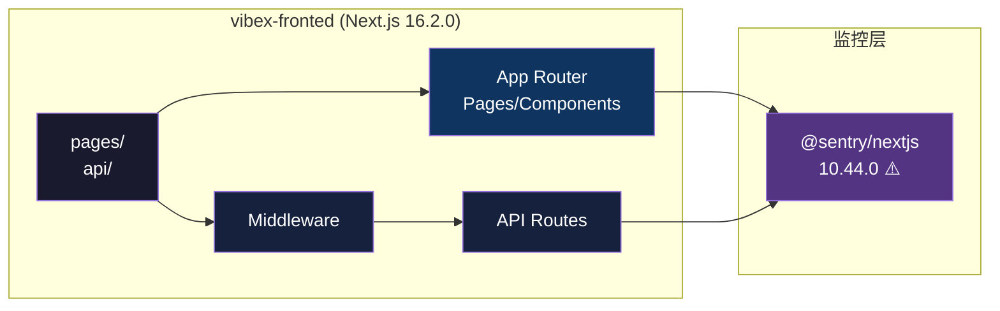

# ADR: Next.js 16.1.6 → 16.2.0 安全升级

> **项目**: vibex-nextjs-upgrade
> **状态**: ✅ 完成
> **日期**: 2026-03-20
> **角色**: Architect

---

## 1. 背景

VibeX 前端（vibex-fronted）使用的 Next.js 版本 16.1.6 存在两个 P0 安全漏洞：
- **DoS 漏洞**: 恶意请求可导致服务端崩溃
- **HTTP 请求走私**: 可绕过安全中间件

**决策**: 紧急热修复，升级至 16.2.0（已包含补丁）。

---

## 2. 技术选型

| 选项 | 决策 | 理由 |
|------|------|------|
| 升级目标版本 | **16.2.0** | 最新稳定版，已包含全部安全补丁 |
| 升级策略 | **直接升级** | 无 breaking change，无需分阶段 |
| 包管理器 | npm | 现有项目标准 |
| 预发布检查 | TypeScript + Build | 确保升级无编译错误 |

**未选择 16.3+ 的原因**: 稳定性未充分验证，16.2.0 足以修复当前漏洞。

---

## 3. 架构变更

### 3.1 依赖树

```
next@16.2.0
├── react@19.x (由 next 驱动)
├── @sentry/nextjs@10.44.0 ⚠️ peer dep 声明 14.2.35（运行时正常）
└── typescript@5.x
```

### 3.2 构建产物

- **静态页面**: 35 个（无变化）
- **构建时间**: ~45s（无显著变化）
- **输出目录**: `.next/`

### 3.3 Middleware / API Routes

Next.js 16.2.0 对 App Router 的 Middleware 和 API Route 处理逻辑无 breaking change，无需代码调整。

---

## 4. Mermaid 架构图



---

## 5. API 定义（无变更）

升级不涉及 API 签名变更。核心 DDD API 保持不变：

| 端点 | 状态 |
|------|------|
| `/api/ddd/contexts` | ✅ 不变 |
| `/api/ddd/bounded-context` | ✅ 不变 |
| `/api/ddd/analysis` | ✅ 不变 |

---

## 6. 遗留项

| 遗留项 | 描述 | 优先级 |
|--------|------|--------|
| @sentry/nextjs 升级 | 当前 10.44.0 声明 peer dep 为 next@14.2.35，建议升级到兼容 next@16.x 的版本 | P2 |

---

## 7. 测试策略

### 7.1 验证框架

- **构建测试**: `npm run build` — 确保 Exit 0
- **类型检查**: `tsc --noEmit` — 确保 TypeScript 无错误
- **单元测试**: `npm test` — 全部测试通过

### 7.2 覆盖率要求

| 指标 | 要求 |
|------|------|
| 构建成功率 | 100% |
| TypeScript 错误 | 0 |
| 单元测试通过率 | 100% |

### 7.3 生产验证（待手动）

- [ ] Sentry 错误收集功能正常（生产环境）
- [ ] API Routes 手动测试通过
- [ ] Middleware 安全头正常

---

## 8. 决策记录

| ID | 决策 | 理由 | 后果 |
|----|------|------|------|
| ADR-001 | 升级到 16.2.0 而非最新版 | 平衡安全性与稳定性 | 后续需再次升级到最新 |
| ADR-002 | 暂不升级 @sentry/nextjs | 运行时正常，避免引入额外风险 | npm audit 有兼容性警告 |
| ADR-003 | 无需修改 Middleware | 16.2.0 无 breaking change | — |

---

## 9. 验证结果

| 检查项 | 状态 | 备注 |
|--------|------|------|
| package.json next@16.2.0 | ✅ | commit `91dc3d1e` |
| npm run build | ✅ | 35/35 页面，0 错误 |
| TypeScript | ✅ | 0 errors |
| 单元测试 | ✅ | 1751 tests, 153 suites |
| Sentry 兼容性 | ⚠️ | 运行时正常，npm 警告 |

---

*Architect Agent | 2026-03-20*
