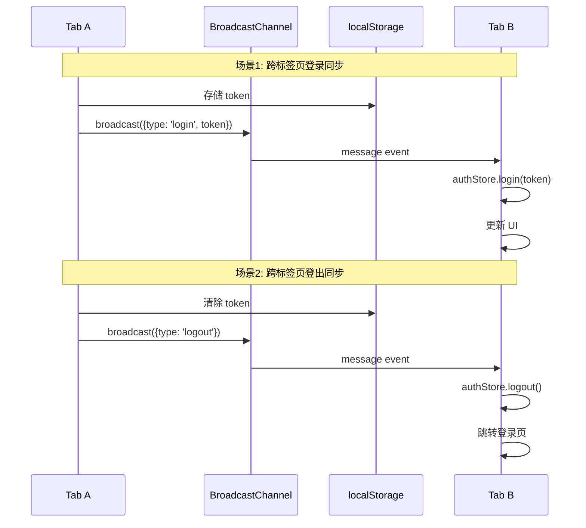
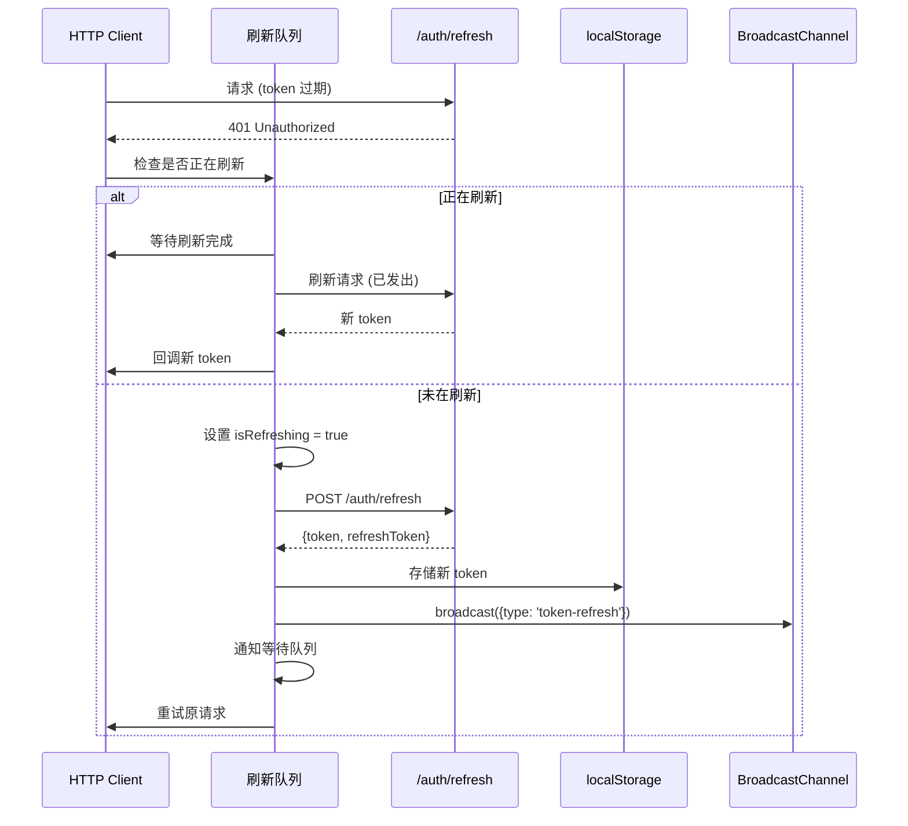
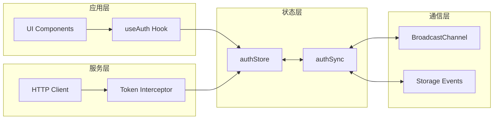
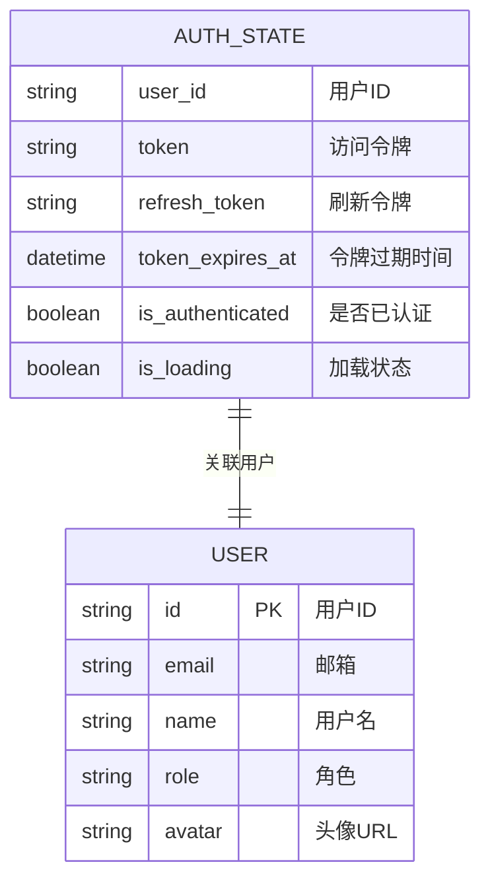
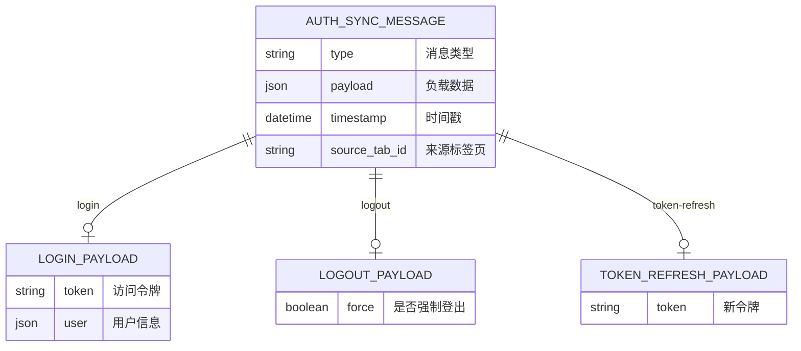

# 认证状态同步架构设计文档

**项目**: vibex-auth-state-sync  
**版本**: v1.0  
**日期**: 2026-03-15  
**作者**: Architect Agent

---

## ⚠️ Coord Decision

**决策日期**: 2026-03-15 14:53  
**决策者**: Coord Agent

**状态**: 🟡 DEFERRED (延后实施)

**理由**:
1. **紧急问题已修复**: commit f9183bb 已修复登录状态未同步问题
2. **增强功能优先级**: 跨标签页同步属于 P2 增强，非紧急需求
3. **资源优先级**: 当前无其他 P0 任务时再考虑实施

**后续建议**:
- 用户如有跨标签页同步需求，可重新激活此项目
- 架构设计已完成，可直接进入开发阶段

---

## 1. Tech Stack (技术栈选型)

### 1.1 核心技术栈

| 组件 | 选型 | 版本 | 理由 |
|------|------|------|------|
| **状态管理** | Zustand | 现有 | 单一数据源，支持 persist 中间件 |
| **跨标签页通信** | BroadcastChannel API | 原生 | 浏览器原生支持，95%+ 兼容性 |
| **降级方案** | Storage Events | 原生 | 兼容旧浏览器的 fallback |
| **HTTP 客户端** | Axios | 现有 | 支持拦截器，已有 retry 机制 |
| **Token 刷新** | 拦截器 + 刷新队列 | 新增 | 无感知刷新，队列防止并发 |

### 1.2 技术选型对比

**BroadcastChannel vs 其他方案**:

| 方案 | 跨标签页 | 跨设备 | 复杂度 | 兼容性 | 结论 |
|------|----------|--------|--------|--------|------|
| BroadcastChannel | ✅ | ❌ | 低 | 95%+ | ✅ 推荐 |
| SharedWorker | ✅ | ❌ | 中 | 90% | ⚠️ 复杂 |
| WebSocket | ✅ | ✅ | 高 | 99% | ❌ 过度设计 |
| localStorage Events | ✅ | ❌ | 低 | 100% | ✅ 降级方案 |

**结论**: 采用 **BroadcastChannel 为主 + Storage Events 降级** 的混合方案。

---

## 2. Architecture Diagram (架构图)

### 2.1 整体架构

```mermaid
graph TB
    subgraph "浏览器 Tab A"
        SA[authStore A]
        CA[client.ts A]
        CHA[Channel A]
    end

    subgraph "浏览器 Tab B"
        SB[authStore B]
        CB[client.ts B]
        CHB[Channel B]
    end

    subgraph "跨标签页通信层"
        BC[BroadcastChannel]
        SE[Storage Events]
    end

    subgraph "后端服务"
        API[Auth API]
        REFRESH[/auth/refresh]
    end

    subgraph "持久化层"
        LS[(localStorage)]
    end

    SA <--> LS
    SB <--> LS
    CHA <--> BC
    CHB <--> BC
    BC -.->|fallback| SE
    SE <--> LS

    CA -->|401| REFRESH
    CB -->|401| REFRESH
    REFRESH -->|new token| LS

    SA -->|login/logout| CHA
    CHA -->|broadcast| CHB
    CHB -->|sync| SB
```

### 2.2 认证状态同步流程



### 2.3 Token 刷新流程



### 2.4 模块架构



---

## 3. API Definitions (接口定义)

### 3.1 authSync 模块接口

```typescript
// src/stores/authSync.ts

import type { User } from './authStore';

/**
 * 认证同步消息类型
 */
export interface AuthSyncMessage {
  type: 'login' | 'logout' | 'token-refresh' | 'user-update';
  payload?: {
    token?: string;
    user?: User;
  };
  timestamp: number;
  sourceTabId: string;
}

/**
 * 认证同步配置
 */
export interface AuthSyncConfig {
  channelName?: string;
  enableStorageFallback?: boolean;
  onLogin?: (token: string, user: User) => void;
  onLogout?: () => void;
  onTokenRefresh?: (token: string) => void;
}

/**
 * 初始化认证同步
 * @param config 同步配置
 */
export function initAuthSync(config?: AuthSyncConfig): () => void;

/**
 * 广播认证状态变化
 * @param message 同步消息
 */
export function broadcastAuthChange(message: Omit<AuthSyncMessage, 'timestamp' | 'sourceTabId'>): void;

/**
 * 订阅认证状态变化
 * @param callback 消息回调
 * @returns 取消订阅函数
 */
export function subscribeToAuthSync(callback: (message: AuthSyncMessage) => void): () => void;

/**
 * 获取当前标签页 ID
 */
export function getTabId(): string;
```

### 3.2 Token 刷新接口

```typescript
// src/services/auth/tokenRefresh.ts

/**
 * Token 刷新结果
 */
export interface TokenRefreshResult {
  success: boolean;
  token?: string;
  refreshToken?: string;
  expiresIn?: number;
  error?: Error;
}

/**
 * Token 刷新队列项
 */
export interface RefreshQueueItem {
  resolve: (token: string) => void;
  reject: (error: Error) => void;
}

/**
 * 刷新 Token
 * @returns 刷新结果
 */
export async function refreshAuthToken(): Promise<TokenRefreshResult>;

/**
 * 添加到刷新队列
 * @returns Promise 等待新 token
 */
export function waitForTokenRefresh(): Promise<string>;

/**
 * 检查是否正在刷新
 */
export function isTokenRefreshing(): boolean;

/**
 * 清除刷新状态
 */
export function clearRefreshState(): void;
```

### 3.3 增强的 HTTP 客户端接口

```typescript
// src/services/api/client.ts (扩展)

/**
 * 拦截器配置
 */
export interface InterceptorConfig {
  enableTokenRefresh?: boolean;
  maxRefreshRetries?: number;
  onRefreshFailed?: () => void;
}

/**
 * 配置认证拦截器
 * @param instance Axios 实例
 * @param config 拦截器配置
 */
export function configureAuthInterceptor(
  instance: AxiosInstance,
  config?: InterceptorConfig
): void;

/**
 * 重试请求
 * @param originalRequest 原始请求配置
 * @param newToken 新 token
 */
export function retryRequest(
  originalRequest: InternalAxiosRequestConfig,
  newToken: string
): Promise<AxiosResponse>;
```

### 3.4 后端 API 依赖

```typescript
// 需要后端提供的 API

/**
 * POST /api/v1/auth/refresh
 * 刷新访问令牌
 */
interface RefreshTokenRequest {
  refreshToken: string;
}

interface RefreshTokenResponse {
  success: boolean;
  token: string;          // 新的访问令牌
  refreshToken: string;   // 新的刷新令牌
  expiresIn: number;      // 过期时间（秒）
}

/**
 * POST /api/v1/auth/logout
 * 登出（可选：使 refresh token 失效）
 */
interface LogoutRequest {
  refreshToken?: string;
}

interface LogoutResponse {
  success: boolean;
}
```

---

## 4. Data Model (数据模型)

### 4.1 认证状态模型



### 4.2 localStorage 存储模型

```typescript
// localStorage 键值结构

interface AuthStorageSchema {
  // 主认证存储（Zustand persist）
  'vibex-auth-storage': {
    state: {
      user: User | null;
      token: string | null;
      isAuthenticated: boolean;
      isLoading: boolean;
    };
    version: number;
  };

  // 兼容旧系统的 token 存储
  'auth_token': string;  // JWT token

  // 刷新令牌（可选，取决于后端实现）
  'refresh_token': string;

  // 同步事件时间戳（用于 storage events 降级）
  'auth_sync_event': string;  // ISO timestamp

  // 标签页标识
  'vibex-tab-id': string;  // UUID
}
```

### 4.3 同步消息模型



---

## 5. Implementation Details (实现细节)

### 5.1 authSync.ts 核心实现

```typescript
// src/stores/authSync.ts

import type { User } from './authStore';

const DEFAULT_CHANNEL_NAME = 'vibex-auth-sync';
const TAB_ID_KEY = 'vibex-tab-id';

export interface AuthSyncMessage {
  type: 'login' | 'logout' | 'token-refresh' | 'user-update';
  payload?: {
    token?: string;
    user?: User;
  };
  timestamp: number;
  sourceTabId: string;
}

export interface AuthSyncConfig {
  channelName?: string;
  enableStorageFallback?: boolean;
  onLogin?: (token: string, user: User) => void;
  onLogout?: () => void;
  onTokenRefresh?: (token: string) => void;
}

let channel: BroadcastChannel | null = null;
let tabId: string | null = null;
let subscriptions: Set<(message: AuthSyncMessage) => void> = new Set();

/**
 * 获取或创建标签页 ID
 */
export function getTabId(): string {
  if (!tabId) {
    tabId = sessionStorage.getItem(TAB_ID_KEY) || 
      `tab-${Date.now()}-${Math.random().toString(36).slice(2)}`;
    sessionStorage.setItem(TAB_ID_KEY, tabId);
  }
  return tabId;
}

/**
 * 初始化认证同步
 */
export function initAuthSync(config?: AuthSyncConfig): () => void {
  const channelName = config?.channelName || DEFAULT_CHANNEL_NAME;

  // 创建 BroadcastChannel
  if (typeof BroadcastChannel !== 'undefined') {
    channel = new BroadcastChannel(channelName);
    channel.onmessage = (event) => {
      const message = event.data as AuthSyncMessage;
      // 忽略自己发出的消息
      if (message.sourceTabId === getTabId()) return;
      
      // 处理消息
      handleMessage(message, config);
      
      // 通知订阅者
      subscriptions.forEach(cb => cb(message));
    };
  }

  // Storage Events 降级方案
  if (config?.enableStorageFallback !== false) {
    window.addEventListener('storage', handleStorageEvent);
  }

  // 返回清理函数
  return () => {
    channel?.close();
    channel = null;
    window.removeEventListener('storage', handleStorageEvent);
    subscriptions.clear();
  };
}

/**
 * 处理同步消息
 */
function handleMessage(message: AuthSyncMessage, config?: AuthSyncConfig): void {
  const { useAuthStore } = require('./authStore');
  const store = useAuthStore.getState();

  switch (message.type) {
    case 'login':
      if (message.payload?.token && message.payload?.user) {
        store.login(message.payload.token, message.payload.user);
        config?.onLogin?.(message.payload.token, message.payload.user);
      }
      break;

    case 'logout':
      store.logout();
      config?.onLogout?.();
      break;

    case 'token-refresh':
      if (message.payload?.token) {
        store.setToken(message.payload.token);
        config?.onTokenRefresh?.(message.payload.token);
      }
      break;

    case 'user-update':
      if (message.payload?.user) {
        store.setUser(message.payload.user);
      }
      break;
  }
}

/**
 * 处理 Storage 事件（降级方案）
 */
function handleStorageEvent(event: StorageEvent): void {
  if (event.key === 'auth_sync_event') {
    // 触发重新同步
    const { useAuthStore } = require('./authStore');
    useAuthStore.getState().syncFromStorage();
  }
}

/**
 * 广播认证状态变化
 */
export function broadcastAuthChange(
  message: Omit<AuthSyncMessage, 'timestamp' | 'sourceTabId'>
): void {
  const fullMessage: AuthSyncMessage = {
    ...message,
    timestamp: Date.now(),
    sourceTabId: getTabId(),
  };

  channel?.postMessage(fullMessage);

  // 触发 storage 事件（降级方案）
  localStorage.setItem('auth_sync_event', Date.now().toString());
}

/**
 * 订阅认证状态变化
 */
export function subscribeToAuthSync(
  callback: (message: AuthSyncMessage) => void
): () => void {
  subscriptions.add(callback);
  return () => subscriptions.delete(callback);
}
```

### 5.2 Token 刷新拦截器实现

```typescript
// src/services/auth/tokenRefresh.ts

import axios from 'axios';
import { getApiUrl } from '@/lib/api-config';

let isRefreshing = false;
let refreshQueue: Array<{
  resolve: (token: string) => void;
  reject: (error: Error) => void;
}> = [];

export interface TokenRefreshResult {
  success: boolean;
  token?: string;
  refreshToken?: string;
  expiresIn?: number;
  error?: Error;
}

/**
 * 刷新 Token
 */
export async function refreshAuthToken(): Promise<TokenRefreshResult> {
  const refreshToken = localStorage.getItem('refresh_token');
  
  if (!refreshToken) {
    return { success: false, error: new Error('No refresh token') };
  }

  try {
    const response = await axios.post(getApiUrl('/api/v1/auth/refresh'), {
      refreshToken,
    });

    const { token, refreshToken: newRefreshToken, expiresIn } = response.data;
    
    // 存储新 token
    localStorage.setItem('auth_token', token);
    if (newRefreshToken) {
      localStorage.setItem('refresh_token', newRefreshToken);
    }

    return { success: true, token, refreshToken: newRefreshToken, expiresIn };
  } catch (error) {
    return { success: false, error: error as Error };
  }
}

/**
 * 等待 Token 刷新完成
 */
export function waitForTokenRefresh(): Promise<string> {
  return new Promise((resolve, reject) => {
    refreshQueue.push({ resolve, reject });
  });
}

/**
 * 处理 Token 刷新
 */
export async function handleTokenRefresh(): Promise<string | null> {
  if (isRefreshing) {
    return waitForTokenRefresh();
  }

  isRefreshing = true;
  const result = await refreshAuthToken();
  isRefreshing = false;

  if (result.success && result.token) {
    // 通知等待队列
    refreshQueue.forEach(item => item.resolve(result.token!));
    refreshQueue = [];

    // 广播到其他标签页
    const { broadcastAuthChange } = require('@/stores/authSync');
    broadcastAuthChange({
      type: 'token-refresh',
      payload: { token: result.token },
    });

    return result.token;
  } else {
    // 刷新失败，清空队列并登出
    refreshQueue.forEach(item => item.reject(result.error!));
    refreshQueue = [];

    // 执行登出
    const { useAuthStore } = require('@/stores/authStore');
    useAuthStore.getState().logout();

    return null;
  }
}

export function isTokenRefreshing(): boolean {
  return isRefreshing;
}

export function clearRefreshState(): void {
  isRefreshing = false;
  refreshQueue = [];
}
```

### 5.3 增强的 HTTP 客户端

```typescript
// src/services/api/client.ts (修改响应拦截器)

import { handleTokenRefresh } from '@/services/auth/tokenRefresh';

// 响应拦截器 - 支持 Token 刷新
instance.interceptors.response.use(
  (response: AxiosResponse) => response,
  async (error: AxiosError) => {
    const originalRequest = error.config as InternalAxiosRequestConfig & { _retry?: boolean };

    // 401 且未重试过
    if (error.response?.status === 401 && !originalRequest._retry) {
      originalRequest._retry = true;

      // 尝试刷新 Token
      const newToken = await handleTokenRefresh();

      if (newToken) {
        // 用新 token 重试请求
        originalRequest.headers.Authorization = `Bearer ${newToken}`;
        return instance(originalRequest);
      }

      // 刷新失败，清除状态
      localStorage.removeItem('auth_token');
      localStorage.removeItem('refresh_token');
      
      // 广播登出
      const { broadcastAuthChange } = require('@/stores/authSync');
      broadcastAuthChange({ type: 'logout' });
    }

    return Promise.reject(transformError(error));
  }
);
```

### 5.4 authStore 增强

```typescript
// src/stores/authStore.ts (修改)

import { broadcastAuthChange } from './authSync';

// 修改 login 方法
login: (token: string, user: User) => {
  set({ token, user, isAuthenticated: true, isLoading: false });
  
  // 广播登录事件
  broadcastAuthChange({
    type: 'login',
    payload: { token, user },
  });
},

// 修改 logout 方法
logout: () => {
  if (typeof window !== 'undefined') {
    localStorage.removeItem('auth_token');
    localStorage.removeItem('refresh_token');
    localStorage.removeItem('user_id');
    localStorage.removeItem('user_role');
  }
  set({ token: null, user: null, isAuthenticated: false, isLoading: false });
  
  // 广播登出事件
  broadcastAuthChange({ type: 'logout' });
},
```

---

## 6. Testing Strategy (测试策略)

### 6.1 测试框架

| 测试类型 | 框架 | 工具 |
|----------|------|------|
| 单元测试 | Jest 30.2 | React Testing Library |
| 集成测试 | Jest + MSW | Mock Service Worker |
| E2E 测试 | Playwright | 多标签页场景 |

### 6.2 核心测试用例

#### 6.2.1 跨标签页同步测试

```typescript
// __tests__/stores/authSync.test.ts

import { initAuthSync, broadcastAuthChange, subscribeToAuthSync } from '@/stores/authSync';

describe('AuthSync', () => {
  beforeEach(() => {
    // Mock BroadcastChannel
    global.BroadcastChannel = jest.fn().mockImplementation((name: string) => ({
      name,
      postMessage: jest.fn(),
      close: jest.fn(),
      onmessage: null,
    }));
  });

  describe('initAuthSync', () => {
    it('should create BroadcastChannel with correct name', () => {
      const cleanup = initAuthSync();
      expect(global.BroadcastChannel).toHaveBeenCalledWith('vibex-auth-sync');
      cleanup();
    });

    it('should call onLogin callback when receiving login message', () => {
      const onLogin = jest.fn();
      const cleanup = initAuthSync({ onLogin });
      
      // 模拟收到消息
      const channel = (global.BroadcastChannel as jest.Mock).mock.results[0].value;
      channel.onmessage({
        data: {
          type: 'login',
          payload: { token: 'test-token', user: { id: '1', email: 'test@test.com' } },
          sourceTabId: 'other-tab',
        },
      });

      expect(onLogin).toHaveBeenCalledWith('test-token', { id: '1', email: 'test@test.com' });
      cleanup();
    });
  });

  describe('broadcastAuthChange', () => {
    it('should post message to channel', () => {
      const cleanup = initAuthSync();
      broadcastAuthChange({ type: 'logout' });
      
      const channel = (global.BroadcastChannel as jest.Mock).mock.results[0].value;
      expect(channel.postMessage).toHaveBeenCalledWith(
        expect.objectContaining({ type: 'logout' })
      );
      cleanup();
    });
  });
});
```

#### 6.2.2 Token 刷新测试

```typescript
// __tests__/services/auth/tokenRefresh.test.ts

import { refreshAuthToken, handleTokenRefresh } from '@/services/auth/tokenRefresh';
import axios from 'axios';
import { getApiUrl } from '@/lib/api-config';

jest.mock('axios');
jest.mock('@/lib/api-config', () => ({
  getApiUrl: jest.fn((path) => `http://api.test.com${path}`),
}));

describe('TokenRefresh', () => {
  beforeEach(() => {
    localStorage.clear();
    jest.clearAllMocks();
  });

  describe('refreshAuthToken', () => {
    it('should return error when no refresh token', async () => {
      const result = await refreshAuthToken();
      expect(result.success).toBe(false);
      expect(result.error?.message).toBe('No refresh token');
    });

    it('should refresh token successfully', async () => {
      localStorage.setItem('refresh_token', 'old-refresh-token');
      
      (axios.post as jest.Mock).mockResolvedValue({
        data: {
          token: 'new-access-token',
          refreshToken: 'new-refresh-token',
          expiresIn: 3600,
        },
      });

      const result = await refreshAuthToken();

      expect(result.success).toBe(true);
      expect(result.token).toBe('new-access-token');
      expect(localStorage.getItem('auth_token')).toBe('new-access-token');
    });

    it('should handle refresh failure', async () => {
      localStorage.setItem('refresh_token', 'invalid-refresh-token');
      
      (axios.post as jest.Mock).mockRejectedValue(new Error('Invalid refresh token'));

      const result = await refreshAuthToken();

      expect(result.success).toBe(false);
      expect(result.error).toBeInstanceOf(Error);
    });
  });

  describe('handleTokenRefresh', () => {
    it('should queue concurrent refresh requests', async () => {
      localStorage.setItem('refresh_token', 'refresh-token');
      
      (axios.post as jest.Mock).mockImplementation(() => 
        new Promise(resolve => setTimeout(() => resolve({
          data: { token: 'new-token', expiresIn: 3600 },
        }), 100))
      );

      // 同时发起多个刷新请求
      const [result1, result2, result3] = await Promise.all([
        handleTokenRefresh(),
        handleTokenRefresh(),
        handleTokenRefresh(),
      ]);

      // 应该只调用一次 API
      expect(axios.post).toHaveBeenCalledTimes(1);
      expect(result1).toBe('new-token');
      expect(result2).toBe('new-token');
      expect(result3).toBe('new-token');
    });
  });
});
```

#### 6.2.3 E2E 多标签页测试

```typescript
// e2e/auth-sync.spec.ts

import { test, expect } from '@playwright/test';

test.describe('Auth Sync', () => {
  test('should sync login across tabs', async ({ browser }) => {
    // 创建两个浏览器上下文
    const context1 = await browser.newContext();
    const context2 = await browser.newContext();

    const page1 = await context1.newPage();
    const page2 = await context2.newPage();

    // Tab 1 和 Tab 2 都打开首页
    await page1.goto('/login');
    await page2.goto('/');

    // Tab 2 初始状态应该是未登录
    await expect(page2.getByText('登录')).toBeVisible();

    // Tab 1 登录
    await page1.fill('input[name="email"]', 'test@test.com');
    await page1.fill('input[name="password"]', 'password');
    await page1.click('button[type="submit"]');

    // 等待登录成功
    await expect(page1).toHaveURL(/.*dashboard/);

    // Tab 2 应该自动变为登录状态
    await page2.reload();
    await expect(page2.getByText('test@test.com')).toBeVisible();

    await context1.close();
    await context2.close();
  });

  test('should sync logout across tabs', async ({ browser }) => {
    const context = await browser.newContext();
    
    // 先登录
    const loginPage = await context.newPage();
    await loginPage.goto('/login');
    await loginPage.fill('input[name="email"]', 'test@test.com');
    await loginPage.fill('input[name="password"]', 'password');
    await loginPage.click('button[type="submit"]');
    await expect(loginPage).toHaveURL(/.*dashboard/);

    // 打开两个标签页
    const page1 = await context.newPage();
    const page2 = await context.newPage();
    await page1.goto('/dashboard');
    await page2.goto('/dashboard');

    // Tab 1 登出
    await page1.click('[data-testid="logout-button"]');

    // Tab 2 应该被重定向到登录页
    await expect(page2).toHaveURL(/.*login/);

    await context.close();
  });
});
```

### 6.3 测试覆盖率目标

| 模块 | 目标覆盖率 |
|------|-----------|
| authSync.ts | 90% |
| tokenRefresh.ts | 85% |
| authStore.ts | 80% |
| client.ts (拦截器) | 75% |

---

## 7. Implementation Roadmap (实施路线图)

### Phase 1: 跨标签页同步 (2 天)

| 步骤 | 工时 | 产出物 |
|------|------|--------|
| 1.1 创建 authSync 模块 | 4h | src/stores/authSync.ts |
| 1.2 集成到 authStore | 2h | authStore.ts 修改 |
| 1.3 单元测试 | 3h | __tests__/stores/authSync.test.ts |
| 1.4 集成测试 | 3h | E2E 多标签页测试 |

### Phase 2: Token 刷新机制 (2 天)

| 步骤 | 工时 | 产出物 |
|------|------|--------|
| 2.1 创建 tokenRefresh 模块 | 3h | src/services/auth/tokenRefresh.ts |
| 2.2 增强拦截器 | 3h | client.ts 修改 |
| 2.3 单元测试 | 3h | __tests__/services/auth/tokenRefresh.test.ts |
| 2.4 集成测试 | 3h | E2E Token 过期场景测试 |

### Phase 3: 测试与验收 (1 天)

| 步骤 | 工时 | 内容 |
|------|------|------|
| 3.1 覆盖率检查 | 2h | 确保覆盖率达标 |
| 3.2 E2E 测试完善 | 3h | 完整多标签页场景 |
| 3.3 文档更新 | 1h | 更新 README |
| 3.4 验收演示 | 2h | 功能验收 |

**总工期**: 5 人日

---

## 8. 风险评估

| 风险 | 等级 | 缓解措施 |
|------|------|----------|
| 后端无 `/auth/refresh` API | 🔴 高 | **阻塞项**：需先确认后端支持 |
| BroadcastChannel 兼容性 | 🟢 低 | Storage Events 降级 |
| Token 刷新竞态条件 | 🟡 中 | 刷新队列 + 锁机制 |
| 刷新 Token 存储 XSS 风险 | 🟡 中 | 考虑 httpOnly Cookie |
| 多标签页状态冲突 | 🟡 中 | 使用 tabId 区分来源 |

### 后端依赖确认清单

- [ ] `/api/v1/auth/refresh` API 是否存在？
- [ ] 返回格式是否包含 `token`, `refreshToken`, `expiresIn`？
- [ ] 是否有 session 管理接口？

---

## 9. Acceptance Criteria (验收标准)

### 9.1 功能验收

- [ ] **跨标签页登录同步**: Tab A 登录后，Tab B 自动变为登录状态
- [ ] **跨标签页登出同步**: Tab A 登出后，Tab B 自动跳转登录页
- [ ] **Token 过期自动刷新**: 401 时自动刷新 token，请求重试成功
- [ ] **刷新失败处理**: Token 刷新失败时正确登出并跳转

### 9.2 性能验收

| 指标 | 目标值 |
|------|--------|
| 跨标签页同步延迟 | < 100ms |
| Token 刷新请求耗时 | < 500ms |
| 页面加载 auth 初始化 | < 50ms |

### 9.3 兼容性验收

| 浏览器 | 版本 | 测试项 |
|--------|------|--------|
| Chrome | 90+ | 全功能 |
| Firefox | 88+ | 全功能 |
| Safari | 15+ | BroadcastChannel 支持 |
| Edge | 90+ | 全功能 |

### 9.4 验证命令

```bash
# 运行单元测试
npm test -- --testPathPattern="authSync|tokenRefresh"

# 运行 E2E 测试
npm run test:e2e -- --grep "Auth Sync"

# 检查覆盖率
npm run test:coverage
```

---

**产出物**: `docs/vibex-auth-state-sync/architecture.md`  
**作者**: Architect Agent  
**日期**: 2026-03-15