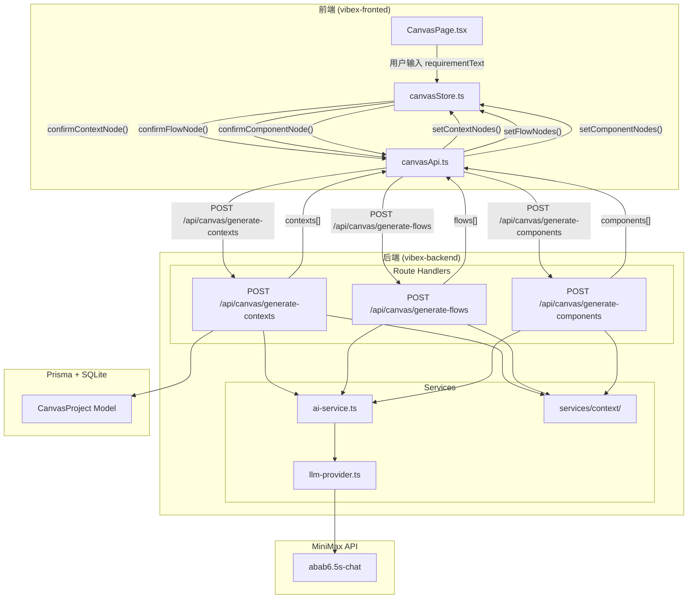

# Architecture: VibeX 三树画布后端对接

**项目**: vibex-backend-integration-20260325
**版本**: 1.0
**架构师**: Architect Agent
**日期**: 2026-03-25
**状态**: Proposed

---

## 1. 执行摘要

在现有 DDD 服务层 (`services/context/`) 基础上，新增 3 个 REST API 端点打通前端三树画布与后端 AI 生成链路，实现从用户输入需求文本到生成完整三树数据的端到端闭环。

---

## 2. ADR: 方案选择

### ADR-001: API 分阶段设计 vs 单次调用

**状态**: Accepted

**上下文**: 前端三树画布需要在用户确认每个阶段后触发生成，但目前只有 mock 数据。

**决策**: 采用分阶段 3-API 方案（推荐方案 A）

**理由**:
1. 符合 Checkpoint 机制 — 用户逐级确认后再生成下一步
2. 错误隔离 — 某一步失败不影响其他步骤
3. 复用现有 DDD 服务层

**后果**:
- 每次确认都触发网络请求（有延迟）
- 需要前端处理 loading 状态

---

## 3. Tech Stack

| 技术 | 版本 | 选择理由 |
|------|------|---------|
| Next.js Route Handlers | App Router | 复用现有 API 路由约定 |
| TypeScript | 5.x | 与前端类型共享 |
| Prisma | 5.x | 已有 CanvasProject 模型 |
| MiniMax API | MiniMax2.5-highspeed（已配置）| 复用现有 services/ai-service.ts |
| Zustand | latest | 现有前端状态管理 |

---

## 4. 架构图



---

## 5. API 定义

### 5.1 POST /api/canvas/generate-contexts

**文件**: `src/app/api/canvas/generate-contexts/route.ts`

**输入**:
```typescript
interface GenerateContextsInput {
  requirementText: string;  // 用户输入的需求文本
  sessionId?: string;       // 可选，用于会话追踪
}
```

**输出**:
```typescript
interface GenerateContextsOutput {
  contexts: BoundedContext[];
  confidence: number;       // 0-1，生成置信度
  sessionId: string;        // 用于后续请求关联
  totalPages?: number;      // 分页：总页数
  error?: string;           // 失败时返回友好错误
}
```

**BoundedContext 类型**:
```typescript
interface BoundedContext {
  id: string;
  name: string;             // 如 "用户管理"
  description: string;
  type: 'core' | 'supporting' | 'generic' | 'external';
}
```

**错误处理**:
- 400: 缺少 requirementText
- 408: MiniMax API 超时（10s）
- 500: AI 解析失败

---

### 5.2 POST /api/canvas/generate-flows

**文件**: `src/app/api/canvas/generate-flows/route.ts`

**输入**:
```typescript
interface GenerateFlowsInput {
  contexts: BoundedContext[];  // 用户确认后的上下文
  sessionId: string;
  page?: number;               // 分页：页码，默认 1
  pageSize?: number;           // 分页：每页数量，默认按领域分页（一域一页）
}
```

**输出**:
```typescript
interface GenerateFlowsOutput {
  flows: BusinessFlow[];
  confidence: number;
  totalPages?: number;      // 分页：总页数
  error?: string;
}
```

**BusinessFlow 类型**:
```typescript
interface BusinessFlow {
  id: string;
  name: string;             // 如 "用户注册流程"
  contextId: string;         // 所属上下文 ID
  steps: FlowStep[];
}

interface FlowStep {
  stepId: string;
  name: string;             // 如 "填写注册表单"
  actor: string;            // 如 "用户"
  description?: string;
  order: number;
}
```

---

### 5.3 POST /api/canvas/generate-components

**文件**: `src/app/api/canvas/generate-components/route.ts`

**输入**:
```typescript
interface GenerateComponentsInput {
  contexts: BoundedContext[];
  flows: BusinessFlow[];
  sessionId: string;
}
```

**输出**:
```typescript
interface GenerateComponentsOutput {
  components: Component[];
  confidence: number;
  error?: string;
}
```

**Component 类型**:
```typescript
interface Component {
  nodeId: string;
  flowId: string;
  name: string;             // 如 "注册表单"
  type: ComponentType;      // 'page' | 'form' | 'list' | 'detail' | 'modal'
  props: Record<string, unknown>;
  api: ComponentApi;
  previewUrl?: string;
}

type ComponentType = 'page' | 'form' | 'list' | 'detail' | 'modal';

interface ComponentApi {
  method: 'GET' | 'POST';
  path: string;
  params: string[];
}
```

---

## 6. 数据模型

### 6.1 后端 DDD 类型（已有）

```typescript
// services/context/types.ts — 已有
interface StructuredContext {
  requirementText: string;
  boundedContexts: BoundedContext[];
  domainModels: DomainModel[];
  businessFlow: BusinessFlow | null;
}

interface BoundedContext {
  id: string;
  name: string;
  description: string;
  type: 'core' | 'supporting' | 'generic' | 'external';
}
```

### 6.2 前端类型（已有）

```typescript
// lib/canvas/types.ts — 已有
interface BoundedContextNode {
  nodeId: string;
  name: string;
  description: string;
  type: BoundedContextNode['type'];
  confirmed: boolean;
  status: NodeStatus;
}

interface BusinessFlowNode {
  nodeId: string;
  contextId: string;
  name: string;
  steps: FlowStep[];
  confirmed: boolean;
  status: NodeStatus;
}

interface ComponentNode {
  nodeId: string;
  flowId: string;
  name: string;
  type: ComponentType;
  props: Record<string, unknown>;
  api: ComponentApi;
  confirmed: boolean;
  status: NodeStatus;
}
```

### 6.3 类型映射

| 后端类型 | 前端类型 | 转换逻辑 |
|----------|----------|----------|
| `BoundedContext` | `BoundedContextNode` | `id → nodeId`, `confirmed: false`, `status: 'generating'` |
| `BusinessFlow` | `BusinessFlowNode` | `id → nodeId`, 展平 steps, `confirmed: false` |
| `Component` | `ComponentNode` | `id → nodeId`, `confirmed: false` |

---

## 7. 前端集成

### 7.1 canvasApi.ts 扩展

新增 3 个方法到 `lib/canvas/api/canvasApi.ts`:

```typescript
export const canvasApi = {
  // ... 现有方法 ...

  generateContexts: async (data: { requirementText: string }): Promise<GenerateContextsOutput> => {
    const res = await fetch(`${API_BASE}/generate-contexts`, {
      method: 'POST',
      headers: { 'Content-Type': 'application/json' },
      body: JSON.stringify(data),
    });
    if (!res.ok) throw new Error((await res.json()).error ?? `HTTP ${res.status}`);
    return res.json();
  },

  generateFlows: async (data: { contexts: BoundedContext[]; sessionId: string }): Promise<GenerateFlowsOutput> => {
    const res = await fetch(`${API_BASE}/generate-flows`, {
      method: 'POST',
      headers: { 'Content-Type': 'application/json' },
      body: JSON.stringify(data),
    });
    if (!res.ok) throw new Error((await res.json()).error ?? `HTTP ${res.status}`);
    return res.json();
  },

  generateComponents: async (data: { contexts: BoundedContext[]; flows: BusinessFlow[]; sessionId: string }): Promise<GenerateComponentsOutput> => {
    const res = await fetch(`${API_BASE}/generate-components`, {
      method: 'POST',
      headers: { 'Content-Type': 'application/json' },
      body: JSON.stringify(data),
    });
    if (!res.ok) throw new Error((await res.json()).error ?? `HTTP ${res.status}`);
    return res.json();
  },
};
```

### 7.2 canvasStore.ts 改动

**改动点 1**: `startCanvas(requirementText)` 触发 API 调用

```typescript
startCanvas: async (requirementText: string) => {
  set({ phase: 'context', requirementText, isLoading: true });
  try {
    const { contexts, sessionId } = await canvasApi.generateContexts({ requirementText });
    const nodes: BoundedContextNode[] = contexts.map((ctx, i) => ({
      nodeId: `ctx-${i}-${Date.now()}`,
      name: ctx.name,
      description: ctx.description,
      type: ctx.type,
      confirmed: false,
      status: 'generating' as NodeStatus,
      children: [],
    }));
    set({ contextNodes: nodes, sessionId, isLoading: false, error: null });
  } catch (err) {
    set({ isLoading: false, error: (err as Error).message });
    // toast.error((err as Error).message)
  }
},
```

**改动点 2**: `confirmContextNode()` 触发流程生成

```typescript
confirmAllContexts: async () => {
  const { contextNodes, sessionId } = get();
  if (!this.cascadeManager.areAllConfirmed(contextNodes)) return;
  set({ isLoading: true, phase: 'flow' });
  try {
    const { flows } = await canvasApi.generateFlows({ contexts: contextNodes, sessionId });
    const flowNodes: BusinessFlowNode[] = flows.map((f, i) => ({
      nodeId: `flow-${i}-${Date.now()}`,
      contextId: f.contextId,
      name: f.name,
      steps: f.steps.map((s, j) => ({
        stepId: `step-${i}-${j}`,
        name: s.name,
        actor: s.actor,
        description: s.description,
        order: s.order,
        confirmed: false,
        status: 'generating' as NodeStatus,
      })),
      confirmed: false,
      status: 'generating' as NodeStatus,
      children: [],
    }));
    set({ flowNodes, isLoading: false, error: null });
  } catch (err) {
    set({ isLoading: false, error: (err as Error).message });
  }
},
```

**改动点 3**: `confirmAllFlows()` 触发组件生成（类似结构）

---

## 8. 测试策略

### 8.1 测试框架

- **单元测试**: Jest — API 路由逻辑、服务层
- **E2E 测试**: Playwright — 完整三树生成流程
- **回归测试**: Playwright — ProjectBar 现有流程不受影响

### 8.2 覆盖率目标

| 层级 | 覆盖率目标 |
|------|-----------|
| API Routes | > 85% |
| 服务层 | > 80% |
| 前端 store 逻辑 | > 75% |

### 8.3 核心测试用例

**API 层（Jest）**:
```typescript
describe('POST /api/canvas/generate-contexts', () => {
  it('returns contexts array when requirementText is valid', async () => {
    const res = await POST(request, { requirementText: '做一个医生预约系统' });
    expect(res.status).toBe(200);
    expect((await res.json()).contexts.length).toBeGreaterThan(0);
  });

  it('returns 400 when requirementText is missing', async () => {
    const res = await POST(request, {});
    expect(res.status).toBe(400);
  });

  it('returns error field on AI timeout', async () => {
    // mock MiniMax timeout
    const res = await POST(request, { requirementText: 'test' });
    expect(res.status).toBe(200);
    expect((await res.json()).error).toBeDefined();
  });
});
```

**E2E 层（Playwright）**:
```typescript
test('完整三树生成流程', async ({ page }) => {
  await page.goto('/canvas');
  await page.fill('[data-testid=requirement-input]', '我想做一个在线医生预约系统');
  await page.click('[data-testid=start-canvas-btn]');
  
  // 等待上下文树出现
  await expect(page.locator('[data-testid=context-tree]')).toBeVisible();
  const contexts = await page.locator('[data-testid=context-node]').count();
  expect(contexts).toBeGreaterThan(0);
  
  // 确认所有上下文
  for (const ctx of contexts) {
    await ctx.click();
    await page.click('[data-testid=confirm-btn]');
  }
  
  // 验证流程树出现
  await expect(page.locator('[data-testid=flow-tree]')).toBeVisible();
});
```

---

## 9. 实施计划

| Epic | 内容 | 负责人 | 工作量 |
|------|------|--------|--------|
| Epic 1 | 后端 API 实现（S1.1-S1.4） | Dev | ~6h |
| Epic 2 | 前端集成（S2.1-S2.4） | Dev | ~4h |
| Epic 3 | 测试与回归（S3.1-S3.3） | Tester | ~3h |

**PR 批次**:
1. **PR #1**: 后端 3 个 API 端点 + MiniMax 调用
2. **PR #2**: 前端 canvasApi 扩展 + store 改动
3. **PR #3**: Playwright E2E 测试 + 回归测试

---

## 10. Open Questions（已确认）

> 确认人: Alex Yu | 确认时间: 2026-03-25 21:00

| # | 问题 | 决策 | 优先级 | 状态 |
|---|------|------|--------|------|
| 1 | AI 模型选择 | 使用 MiniMax2.5-highspeed（已配置） | P0 | ✅ 已确认 |
| 2 | 生成失败策略 | 提示出错重试，3次失败后记录日志、标记待人工处理 | P0 | ✅ 已确认 |
| 3 | 节点数量上限/分页策略 | 多域时每个用户勾选的域一个流程图确认；组件按流程图一一对应；上下文单图确认，后续流程/组件按领域分页 | P1 | ✅ 已确认（Alex） |

### 详细说明

**OQ-2 生成失败策略（已确认）**:
- 单次生成失败 → 提示用户错误信息，提供重试按钮
- 重试次数上限: 3 次
- 3 次均失败 → 记录 error log（nodeId, context, timestamp, error message），前端标记该节点为  状态，UI 显示"需人工处理"标识
- 不会降级为空树（避免静默失败）

**OQ-3 分页策略（已确认，Alex 决策）**:
- 限界上下文: 每个用户勾选的域 → 单独一张图确认（单域单图）
- 业务流程: 按领域/上下文分页，每个流程图对应一个上下文
- 组件树: 按流程图一一对应，每个流程节点对应一个组件树页面
- API 设计支持分页参数: `page`, `pageSize`
| 4 | 中间状态是否持久化到 Prisma CanvasProject？ | P2 | 🟢 可延期 |

---

*Architecture 完成时间: 2026-03-25 20:38 UTC+8*
