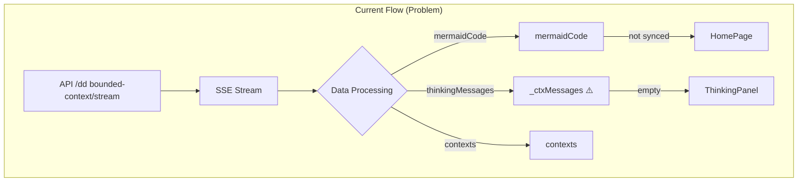
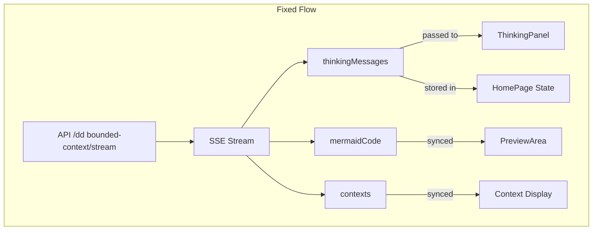
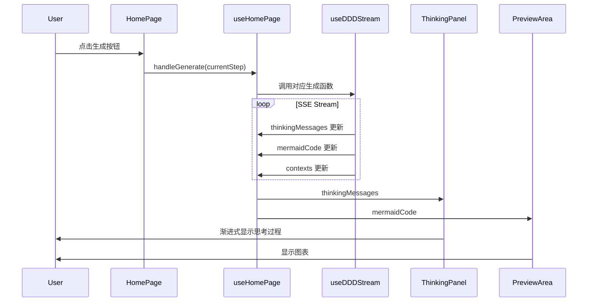

# 限界上下文渲染和进度条问题修复架构设计

**项目**: vibex-bounded-context-rendering-issues  
**架构师**: Architect Agent  
**日期**: 2026-03-17  
**状态**: ✅ 设计完成

---

## 一、技术栈

| 技术 | 版本 | 用途 |
|------|------|------|
| React | 18.x | UI 框架 |
| TypeScript | 5.x | 类型安全 |
| Zustand | 4.x | 状态管理 |
| SSE | - | 流式数据传输 |

---

## 二、问题分析

### 2.1 问题总览

| ID | 问题 | 根因 | 优先级 |
|----|------|------|--------|
| P0-1 | 限界上下文渲染不显示 | `streamMermaidCode` 未正确同步 | P0 |
| P0-2 | 流程按钮无变化 | `handleRequirementSubmit` 未区分步骤 | P0 |
| P0-3 | AI思考不渐进 | `thinkingMessages` 被丢弃 | P0 |

### 2.2 数据流问题



---

## 三、架构设计

### 3.1 修复后数据流



### 3.2 组件交互



---

## 四、修复方案

### 4.1 F1: 限界上下文渲染修复

**问题**: `streamMermaidCode` 状态未正确同步到预览区域

**修复代码** (`useHomePage.ts`):

```typescript
// 修复: 确保 mermaidCode 正确同步
const currentMermaidCode = useMemo(() => {
  switch (currentStep) {
    case 2:
      return contextMermaidCode || streamMermaidCode;  // 添加 streamMermaidCode
    case 3:
      return modelMermaidCode;
    case 4:
      return flowMermaidCode;
    default:
      return '';
  }
}, [currentStep, contextMermaidCode, streamMermaidCode, modelMermaidCode, flowMermaidCode]);
```

**或者更简单的修复**:

```typescript
// 直接使用 streamMermaidCode
useEffect(() => {
  if (streamStatus === 'done' && streamMermaidCode) {
    setContextMermaidCode(streamMermaidCode);
  }
}, [streamStatus, streamMermaidCode]);
```

### 4.2 F2: 流程按钮步骤区分

**问题**: 按钮回调未根据步骤区分操作

**修复代码** (`HomePage.tsx`):

```typescript
// 修复: 根据 currentStep 调用不同的生成函数
const handleGenerate = useCallback(() => {
  if (!requirementText.trim()) return;
  
  switch (currentStep) {
    case 1:
      // 步骤1: 生成限界上下文
      generateContexts(requirementText);
      break;
    case 2:
      // 步骤2: 生成领域模型
      generateDomainModels(requirementText, boundedContexts);
      break;
    case 3:
      // 步骤3: 生成业务流程
      generateBusinessFlow(domainModels);
      break;
    case 4:
      // 步骤4: 创建项目
      createProject();
      break;
    default:
      break;
  }
}, [currentStep, requirementText, boundedContexts, domainModels, generateContexts, generateDomainModels, generateBusinessFlow, createProject]);

// 按钮文字根据步骤变化
const buttonText = {
  1: '🚀 开始生成',
  2: '🚀 生成领域模型',
  3: '🚀 生成业务流程',
  4: '🚀 创建项目'
}[currentStep];
```

### 4.3 F3: 渐进式思考过程

**问题**: `thinkingMessages` 被解构为 `_ctxMessages`（未使用）

**修复代码** (`useHomePage.ts`):

```typescript
// 1. 添加 thinkingMessages 状态
const [thinkingMessages, setThinkingMessages] = useState<ThinkingStep[]>([]);

// 2. 在 useDDDStream 解构中保留 thinkingMessages
const {
  thinkingMessages: ctxMessages,  // 移除下划线前缀
  contexts: streamContexts,
  mermaidCode: streamMermaidCode,
  status: streamStatus,
  error: streamError,
} = useDDDStream();

// 3. 同步 thinkingMessages 状态
useEffect(() => {
  if (ctxMessages && ctxMessages.length > 0) {
    setThinkingMessages(ctxMessages);
  }
}, [ctxMessages]);

// 4. 返回 thinkingMessages
return {
  // ... 其他返回值
  thinkingMessages,
  streamStatus,
  streamError,
};
```

**修复代码** (`HomePage.tsx`):

```typescript
// 传递 thinkingMessages 给 ThinkingPanel
<ThinkingPanel
  thinkingMessages={thinkingMessages}
  status={streamStatus === 'streaming' ? 'thinking' : streamStatus === 'done' ? 'complete' : 'idle'}
  errorMessage={streamError}
/>
```

---

## 五、API 接口

### 5.1 useHomePage 返回值扩展

```typescript
interface HomePageState {
  // 现有
  currentStep: number;
  boundedContexts: BoundedContext[];
  domainModels: DomainModel[];
  // ...
  
  // 新增: 思考过程相关
  thinkingMessages: ThinkingStep[];
  streamStatus: DDDStreamStatus;
  streamError: Error | null;
}
```

### 5.2 ThinkingPanel Props

```typescript
interface ThinkingPanelProps {
  thinkingMessages: ThinkingStep[];
  status: 'idle' | 'thinking' | 'complete' | 'error';
  errorMessage?: string | null;
}
```

---

## 六、测试策略

### 6.1 单元测试

| 测试项 | 方法 | 预期结果 |
|--------|------|----------|
| thinkingMessages 同步 | 模拟 SSE 数据 | 状态正确更新 |
| 按钮回调区分步骤 | 模拟点击 | 调用正确的生成函数 |
| mermaidCode 同步 | 模拟 stream 完成 | 预览正确显示 |

### 6.2 集成测试

```typescript
describe('HomePage 流程测试', () => {
  it('步骤1: 生成限界上下文', async () => {
    // 1. 输入需求
    // 2. 点击生成按钮
    // 3. 等待 SSE 完成
    // 4. 验证: thinkingMessages 有内容
    // 5. 验证: PreviewArea 显示图表
  });
  
  it('步骤2: 生成领域模型', async () => {
    // 1. 进入步骤2
    // 2. 点击生成按钮
    // 3. 验证: 调用 generateDomainModels
  });
  
  it('渐进式思考显示', async () => {
    // 1. 开始生成
    // 2. 验证: ThinkingPanel 实时显示思考步骤
  });
});
```

### 6.3 验证命令

```bash
# 验证 thinkingMessages 传递
grep -n "thinkingMessages" src/components/homepage/hooks/useHomePage.ts

# 验证按钮回调
grep -n "switch.*currentStep" src/components/homepage/HomePage.tsx

# 验证 mermaidCode 同步
grep -n "streamMermaidCode" src/components/homepage/hooks/useHomePage.ts
```

---

## 七、验收标准

| ID | 验收标准 | 验证方法 |
|----|----------|----------|
| ARCH-001 | thinkingMessages 从 useDDDStream 传递到 HomePage | 代码检查 |
| ARCH-002 | ThinkingPanel 接收非空 thinkingMessages | 组件测试 |
| ARCH-003 | handleGenerate 根据 currentStep 调用不同函数 | 单元测试 |
| ARCH-004 | streamMermaidCode 同步到预览区域 | 功能测试 |

---

## 八、产出物清单

| 文件 | 位置 | 改动类型 |
|------|------|----------|
| useHomePage.ts | `src/components/homepage/hooks/useHomePage.ts` | 新增 thinkingMessages |
| HomePage.tsx | `src/components/homepage/HomePage.tsx` | 修复按钮/传递 props |
| 架构文档 | `docs/vibex-bounded-context-rendering-issues/architecture.md` | ✅ 本文档 |

---

**完成时间**: 2026-03-17 21:32  
**架构师**: Architect Agent