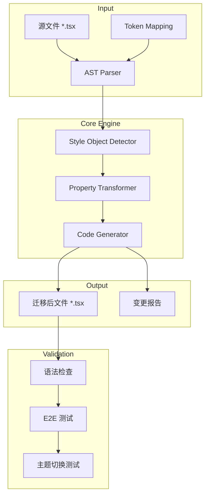
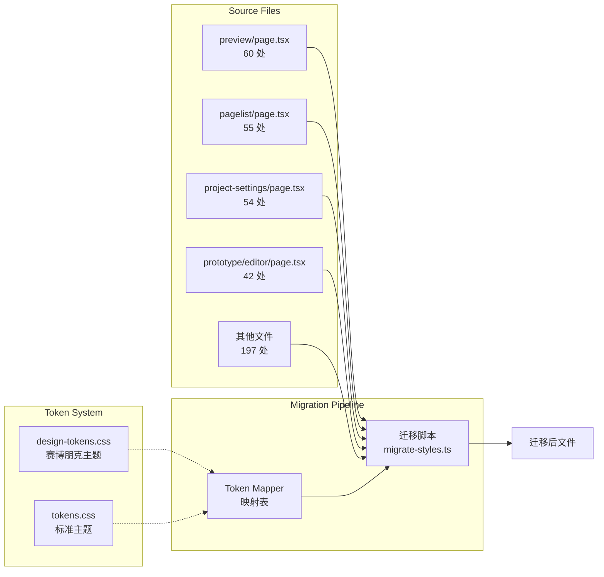
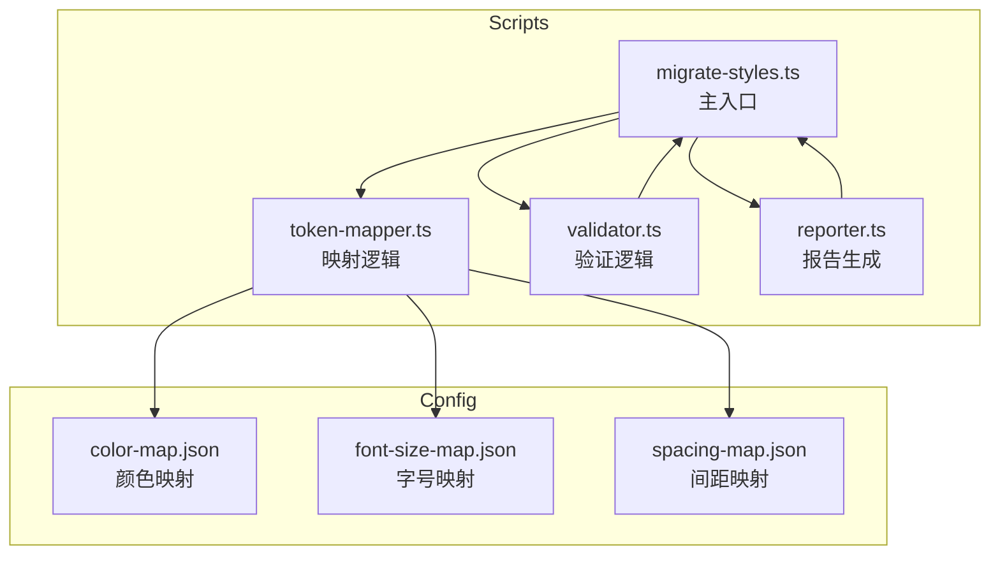

# CSS Tokens 迁移架构设计

> **项目**: css-tokens-migration  
> **架构师**: Architect Agent  
> **日期**: 2026-03-10  
> **上游**: PM (prd.md) / Analyst (analysis.md)  
> **下游**: Developer / Tester / Reviewer

---

## 1. 技术栈

### 1.1 核心技术选型

| 技术 | 版本 | 选型理由 |
|------|------|----------|
| TypeScript | ^5.0 | AST 解析需要类型安全，项目已使用 |
| ts-morph | ^21.0 | TypeScript AST 操作库，API 友好，支持增量修改 |
| Node.js | ^18.0 | 运行时环境 |
| Jest | ^30.0 | 单元测试框架，项目已配置 |
| Playwright | ^1.58 | E2E 测试框架，项目已配置 |

### 1.2 技术决策

#### 决策 1: ts-morph vs babel vs recast

| 方案 | 优点 | 缺点 | 结论 |
|------|------|------|------|
| ts-morph | 类型安全、保留格式、增量修改 | 包体积较大 | ✅ 推荐 |
| babel | 生态成熟、插件丰富 | 配置复杂、格式化需额外处理 | ❌ |
| recast | 保留格式好 | AST 不如 ts-morph 直观 | ❌ 备选 |

**理由**: ts-morph 提供最直观的 TypeScript AST 操作 API，支持增量修改且保留原始格式，最适合此迁移场景。

#### 决策 2: 迁移策略

**渐进式迁移** - 按文件优先级分批处理：

1. **Phase 1**: 高风险文件（>40 处）- 4 个文件，211 处
2. **Phase 2**: 中风险文件（15-30 处）- 3 个文件，66 处
3. **Phase 3**: 低风险文件（<15 处）- 剩余文件，131 处

---

## 2. 架构图

### 2.1 系统架构



### 2.2 数据流架构



### 2.3 模块依赖关系



---

## 3. 接口定义

### 3.1 核心 API

#### TokenMapper - Token 映射器

```typescript
// src/scripts/css-migration/token-mapper.ts

interface TokenMapping {
  /** 原始值，如 '#64748b' */
  original: string;
  /** 目标 Token，如 'var(--color-text-secondary)' */
  token: string;
  /** 语义描述 */
  semantic: string;
  /** 置信度 0-1，用于人工审核阈值 */
  confidence: number;
}

interface TokenMapperConfig {
  /** 颜色映射表 */
  colorMap: Map<string, TokenMapping>;
  /** 字号映射表 */
  fontSizeMap: Map<string, TokenMapping>;
  /** 间距映射表 */
  spacingMap: Map<string, TokenMapping>;
}

class TokenMapper {
  constructor(config: TokenMapperConfig);
  
  /**
   * 映射颜色值到 Token
   * @param value - 原始颜色值，支持 hex、rgb、rgba、颜色名
   * @returns TokenMapping 或 null（未找到映射）
   */
  mapColor(value: string): TokenMapping | null;
  
  /**
   * 映射字号值到 Token
   * @param value - 原始字号值，如 '14px'
   * @returns TokenMapping 或 null
   */
  mapFontSize(value: string): TokenMapping | null;
  
  /**
   * 映射间距值到 Token
   * @param value - 原始间距值，如 '16px'
   * @returns TokenMapping 或 null
   */
  mapSpacing(value: string): TokenMapping | null;
}
```

#### StyleTransformer - 样式转换器

```typescript
// src/scripts/css-migration/style-transformer.ts

import { SourceFile, ObjectLiteralExpression } from 'ts-morph';

interface TransformResult {
  /** 是否有变更 */
  changed: boolean;
  /** 变更数量 */
  changeCount: number;
  /** 未映射的值（需人工处理） */
  unmapped: Array<{
    property: string;
    value: string;
    line: number;
  }>;
}

interface TransformOptions {
  /** 是否保留原文件格式 */
  preserveFormatting: boolean;
  /** 置信度阈值，低于此值标记为需人工审核 */
  confidenceThreshold: number;
  /** 是否 dry-run（不实际写入） */
  dryRun: boolean;
}

class StyleTransformer {
  constructor(tokenMapper: TokenMapper);
  
  /**
   * 转换单个文件
   * @param filePath - 文件路径
   * @param options - 转换选项
   * @returns 转换结果
   */
  transformFile(filePath: string, options?: TransformOptions): Promise<TransformResult>;
  
  /**
   * 批量转换文件
   * @param filePaths - 文件路径数组
   * @param options - 转换选项
   * @returns 文件路径到结果的映射
   */
  transformFiles(filePaths: string[], options?: TransformOptions): Promise<Map<string, TransformResult>>;
  
  /**
   * 转换单个 style 对象
   * @param styleObj - AST 中的 style 对象
   * @returns 转换后的 style 对象
   */
  private transformStyleObject(styleObj: ObjectLiteralExpression): TransformResult;
}
```

#### MigrationRunner - 迁移执行器

```typescript
// src/scripts/css-migration/migration-runner.ts

interface MigrationConfig {
  /** 源文件目录 */
  sourceDir: string;
  /** 文件匹配模式 */
  filePattern: string;
  /** 输出报告路径 */
  reportPath: string;
  /** 是否备份原文件 */
  backup: boolean;
  /** 转换选项 */
  transformOptions: TransformOptions;
}

interface MigrationReport {
  /** 执行时间 */
  timestamp: string;
  /** 总文件数 */
  totalFiles: number;
  /** 成功迁移文件数 */
  successCount: number;
  /** 失败文件数 */
  failCount: number;
  /** 总变更数 */
  totalChanges: number;
  /** 需人工处理的项 */
  manualReview: Array<{
    file: string;
    line: number;
    property: string;
    value: string;
  }>;
}

class MigrationRunner {
  constructor(config: MigrationConfig);
  
  /**
   * 执行迁移
   * @returns 迁移报告
   */
  run(): Promise<MigrationReport>;
  
  /**
   * 生成迁移报告
   * @param results - 转换结果
   */
  generateReport(results: Map<string, TransformResult>): MigrationReport;
}
```

### 3.2 验证 API

```typescript
// src/scripts/css-migration/validator.ts

interface ValidationResult {
  /** 是否通过 */
  passed: boolean;
  /** 错误列表 */
  errors: Array<{
    file: string;
    line: number;
    message: string;
  }>;
  /** 统计信息 */
  stats: {
    inlineStylesRemaining: number;
    hardcodedColorsRemaining: number;
    hardcodedFontSizesRemaining: number;
  };
}

class Validator {
  /**
   * 验证迁移结果
   * @param sourceDir - 源文件目录
   * @returns 验证结果
   */
  validate(sourceDir: string): Promise<ValidationResult>;
  
  /**
   * 检查内联样式数量
   */
  private countInlineStyles(sourceDir: string): Promise<number>;
  
  /**
   * 检查硬编码颜色数量
   */
  private countHardcodedColors(sourceDir: string): Promise<number>;
  
  /**
   * 检查硬编码字号数量
   */
  private countHardcodedFontSizes(sourceDir: string): Promise<number>;
}
```

---

## 4. 数据模型

### 4.1 Token 映射数据结构

```typescript
// config/color-map.json
{
  "mappings": [
    {
      "original": "#64748b",
      "token": "var(--color-text-secondary)",
      "semantic": "次要文本",
      "confidence": 1.0
    },
    {
      "original": "#94a3b8",
      "token": "var(--color-text-tertiary)",
      "semantic": "三级文本",
      "confidence": 1.0
    },
    {
      "original": "#6b7280",
      "token": "var(--color-text-secondary)",
      "semantic": "次要文本",
      "confidence": 0.9
    },
    {
      "original": "#fff",
      "token": "var(--color-text-inverse)",
      "semantic": "反色文本",
      "confidence": 1.0
    },
    {
      "original": "white",
      "token": "var(--color-text-inverse)",
      "semantic": "反色文本",
      "confidence": 1.0
    },
    {
      "original": "#e2e8f0",
      "token": "var(--color-border)",
      "semantic": "边框",
      "confidence": 1.0
    },
    {
      "original": "#10b981",
      "token": "var(--color-success)",
      "semantic": "成功",
      "confidence": 1.0
    },
    {
      "original": "#3b82f6",
      "token": "var(--color-primary)",
      "semantic": "主色",
      "confidence": 1.0
    },
    {
      "original": "#0070f3",
      "token": "var(--color-primary)",
      "semantic": "主色",
      "confidence": 0.95
    },
    {
      "original": "#f59e0b",
      "token": "var(--color-warning)",
      "semantic": "警告",
      "confidence": 1.0
    }
  ]
}

// config/font-size-map.json
{
  "mappings": [
    {
      "original": "12px",
      "token": "var(--font-size-xs)",
      "confidence": 1.0
    },
    {
      "original": "13px",
      "token": "var(--font-size-sm)",
      "note": "统一为 14px",
      "confidence": 0.8
    },
    {
      "original": "14px",
      "token": "var(--font-size-sm)",
      "confidence": 1.0
    },
    {
      "original": "16px",
      "token": "var(--font-size-base)",
      "confidence": 1.0
    },
    {
      "original": "18px",
      "token": "var(--font-size-lg)",
      "confidence": 1.0
    },
    {
      "original": "20px",
      "token": "var(--font-size-xl)",
      "confidence": 1.0
    },
    {
      "original": "24px",
      "token": "var(--font-size-2xl)",
      "confidence": 1.0
    }
  ]
}

// config/spacing-map.json
{
  "mappings": [
    {
      "original": "4px",
      "token": "var(--spacing-1)",
      "confidence": 1.0
    },
    {
      "original": "8px",
      "token": "var(--spacing-2)",
      "confidence": 1.0
    },
    {
      "original": "12px",
      "token": "var(--spacing-3)",
      "confidence": 1.0
    },
    {
      "original": "16px",
      "token": "var(--spacing-4)",
      "confidence": 1.0
    },
    {
      "original": "24px",
      "token": "var(--spacing-6)",
      "confidence": 1.0
    },
    {
      "original": "32px",
      "token": "var(--spacing-8)",
      "confidence": 1.0
    }
  ]
}
```

### 4.2 AST 节点模型

```typescript
// 目标 AST 模式
// 
// 源代码:
// <div style={{ color: '#64748b', fontSize: '14px' }}>
//
// AST 结构 (简化):
// JsxAttribute
//   └─ name: 'style'
//   └─ initializer: JsxExpression
//        └─ expression: ObjectLiteralExpression
//             ├─ PropertyAssignment (color)
//             │    └─ StringLiteral ('#64748b')
//             └─ PropertyAssignment (fontSize)
//                  └─ StringLiteral ('14px')
//
// 迁移后:
// <div style={{ color: 'var(--color-text-secondary)', fontSize: 'var(--font-size-sm)' }}>
```

---

## 5. 测试策略

### 5.1 测试框架

| 层级 | 框架 | 覆盖目标 |
|------|------|----------|
| 单元测试 | Jest | Token 映射、AST 转换逻辑 |
| 集成测试 | Jest | 端到端迁移流程 |
| E2E 测试 | Playwright | 视觉回归、主题切换 |

### 5.2 测试覆盖率要求

| 模块 | 覆盖率要求 |
|------|-----------|
| TokenMapper | > 90% |
| StyleTransformer | > 85% |
| Validator | > 80% |
| 整体 | > 80% |

### 5.3 核心测试用例

#### 单元测试

```typescript
// __tests__/token-mapper.test.ts

describe('TokenMapper', () => {
  let mapper: TokenMapper;

  beforeEach(() => {
    mapper = new TokenMapper(defaultConfig);
  });

  describe('mapColor', () => {
    it('should map hex color to token', () => {
      const result = mapper.mapColor('#64748b');
      expect(result).toEqual({
        original: '#64748b',
        token: 'var(--color-text-secondary)',
        semantic: '次要文本',
        confidence: 1.0
      });
    });

    it('should handle case-insensitive hex', () => {
      const result = mapper.mapColor('#64748B');
      expect(result?.token).toBe('var(--color-text-secondary)');
    });

    it('should map named color to token', () => {
      const result = mapper.mapColor('white');
      expect(result?.token).toBe('var(--color-text-inverse)');
    });

    it('should return null for unmapped color', () => {
      const result = mapper.mapColor('#custom42');
      expect(result).toBeNull();
    });
  });

  describe('mapFontSize', () => {
    it('should map font size to token', () => {
      expect(mapper.mapFontSize('14px')?.token).toBe('var(--font-size-sm)');
      expect(mapper.mapFontSize('16px')?.token).toBe('var(--font-size-base)');
      expect(mapper.mapFontSize('24px')?.token).toBe('var(--font-size-2xl)');
    });
  });
});

// __tests__/style-transformer.test.ts

describe('StyleTransformer', () => {
  it('should transform inline style object', async () => {
    const source = `
      const Component = () => (
        <div style={{ color: '#64748b', fontSize: '14px' }}>Test</div>
      );
    `;
    
    const result = await transformer.transformSource(source);
    
    expect(result.changed).toBe(true);
    expect(result.changeCount).toBe(2);
    expect(result.code).toContain('var(--color-text-secondary)');
    expect(result.code).toContain('var(--font-size-sm)');
  });

  it('should handle dynamic styles (skip)', async () => {
    const source = `
      const Component = ({ color }) => (
        <div style={{ color }}>Test</div>
      );
    `;
    
    const result = await transformer.transformSource(source);
    
    expect(result.unmapped).toHaveLength(1);
  });

  it('should preserve file formatting', async () => {
    const source = `
      const Component = () => (
        <div
          style={{
            color: '#64748b',
            fontSize: '14px',
          }}
        >
          Test
        </div>
      );
    `;
    
    const result = await transformer.transformSource(source);
    
    // 验证格式保持
    expect(result.code).toMatch(/color: ['"]var\(--color-text-secondary\)['"],\s*fontSize:/);
  });
});
```

#### 集成测试

```typescript
// __tests__/integration/migration.test.ts

describe('Migration Integration', () => {
  const testDir = './test-fixtures';
  
  beforeAll(() => {
    // 准备测试文件
    fs.writeFileSync(`${testDir}/test.tsx`, `
      export default function Test() {
        return (
          <div style={{ color: '#64748b', fontSize: '14px' }}>
            Test
          </div>
        );
      }
    `);
  });

  afterAll(() => {
    // 清理测试文件
    fs.rmSync(testDir, { recursive: true });
  });

  it('should migrate all inline styles', async () => {
    const runner = new MigrationRunner({
      sourceDir: testDir,
      filePattern: '**/*.tsx',
      reportPath: `${testDir}/report.json`,
      backup: true,
      transformOptions: {
        preserveFormatting: true,
        confidenceThreshold: 0.8,
        dryRun: false
      }
    });

    const report = await runner.run();

    expect(report.totalFiles).toBe(1);
    expect(report.successCount).toBe(1);
    expect(report.totalChanges).toBe(2);
    expect(report.manualReview).toHaveLength(0);
  });

  it('should pass validation after migration', async () => {
    const validator = new Validator();
    const result = await validator.validate(testDir);

    expect(result.passed).toBe(true);
    expect(result.stats.inlineStylesRemaining).toBe(0);
    expect(result.stats.hardcodedColorsRemaining).toBe(0);
  });
});
```

#### E2E 测试

```typescript
// e2e/css-tokens.spec.ts

import { test, expect } from '@playwright/test';

test.describe('CSS Tokens Migration', () => {
  test.beforeEach(async ({ page }) => {
    await page.goto('/');
  });

  test('should apply correct text colors', async ({ page }) => {
    // 检查次要文本颜色
    const secondaryText = page.locator('[data-testid="secondary-text"]');
    const color = await secondaryText.evaluate(
      (el) => getComputedStyle(el).color
    );
    
    // 应该是 CSS 变量解析后的颜色值
    expect(color).not.toBe('rgb(100, 116, 139)'); // #64748b
  });

  test('should support theme switching', async ({ page }) => {
    // 切换到暗色主题
    await page.click('[data-testid="theme-toggle"]');
    await page.waitForSelector('[data-theme="dark"]');
    
    // 检查背景色变化
    const body = page.locator('body');
    const bgColor = await body.evaluate(
      (el) => getComputedStyle(el).backgroundColor
    );
    
    expect(bgColor).not.toBe('rgb(255, 255, 255)');
    
    // 切换回亮色主题
    await page.click('[data-testid="theme-toggle"]');
    await page.waitForSelector('[data-theme="light"]');
  });

  test('visual regression - preview page', async ({ page }) => {
    await page.goto('/preview');
    await expect(page).toHaveScreenshot('preview-page.png', {
      maxDiffPixels: 100
    });
  });

  test('visual regression - settings page', async ({ page }) => {
    await page.goto('/project-settings');
    await expect(page).toHaveScreenshot('settings-page.png', {
      maxDiffPixels: 100
    });
  });
});
```

### 5.4 验证命令

```bash
# 1. 运行单元测试
pnpm test -- --coverage --testPathPattern=css-migration

# 2. 验证无内联样式
test $(grep -rn "style={{" src --include="*.tsx" | wc -l) -eq 0

# 3. 验证无硬编码颜色
test $(grep -ohE "color:\s*['\"]#[0-9a-fA-F]{3,6}['\"]" src -r --include="*.tsx" | wc -l) -eq 0

# 4. 验证无硬编码字号
test $(grep -ohE "fontSize:\s*['\"][0-9]+px['\"]" src -r --include="*.tsx" | wc -l) -eq 0

# 5. E2E 测试
pnpm test:e2e -- --grep "CSS Tokens"

# 6. 构建验证
pnpm build
```

---

## 6. 文件结构

```
vibex-fronted/
├── src/
│   └── styles/
│       ├── design-tokens.css    # 赛博朋克主题
│       ├── tokens.css           # 标准主题
│       └── ThemeProvider.tsx    # 主题切换
├── scripts/
│   └── css-migration/
│       ├── index.ts             # 入口
│       ├── token-mapper.ts      # Token 映射
│       ├── style-transformer.ts # 样式转换
│       ├── migration-runner.ts  # 迁移执行
│       ├── validator.ts         # 验证逻辑
│       └── reporter.ts          # 报告生成
├── config/
│   ├── color-map.json           # 颜色映射
│   ├── font-size-map.json       # 字号映射
│   └── spacing-map.json         # 间距映射
├── __tests__/
│   ├── token-mapper.test.ts
│   ├── style-transformer.test.ts
│   └── integration/
│       └── migration.test.ts
└── e2e/
    └── css-tokens.spec.ts
```

---

## 7. 实施风险与缓解

| 风险 | 概率 | 影响 | 缓解措施 |
|------|------|------|---------|
| AST 解析失败 | 低 | 高 | 异常捕获 + 手动处理列表 |
| 动态样式丢失 | 中 | 高 | 跳过动态值 + 人工审核列表 |
| 视觉回归 | 中 | 中 | 截图对比测试 |
| 格式丢失 | 低 | 中 | ts-morph preserveFormatting |
| 主题切换异常 | 低 | 高 | E2E 测试覆盖 |

---

## 8. 验收清单

- [ ] 408 处内联样式迁移完成
- [ ] 颜色硬编码清零
- [ ] 字号硬编码清零
- [ ] 主题切换正常
- [ ] E2E 测试通过
- [ ] 构建成功
- [ ] 无视觉回归

---

**验证**: `test -f docs/css-tokens-migration/architecture.md`