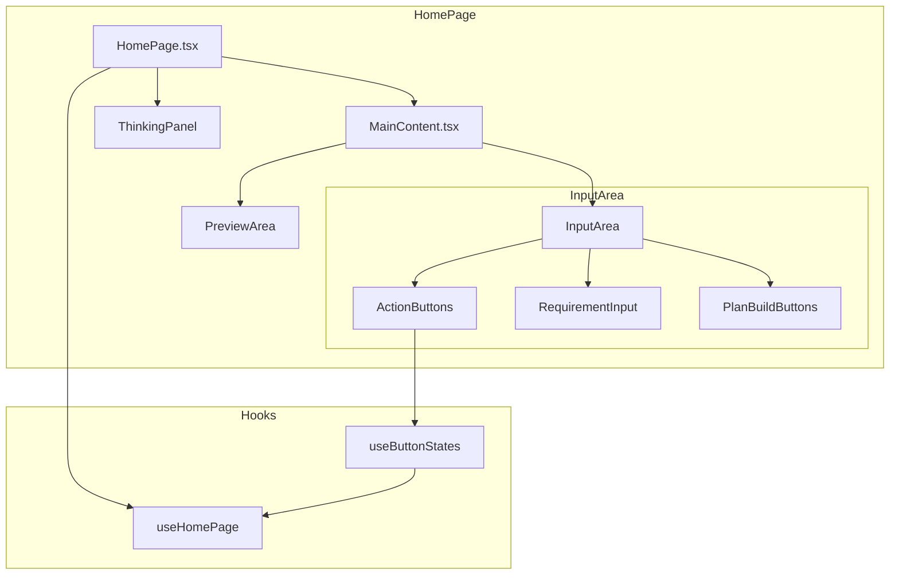
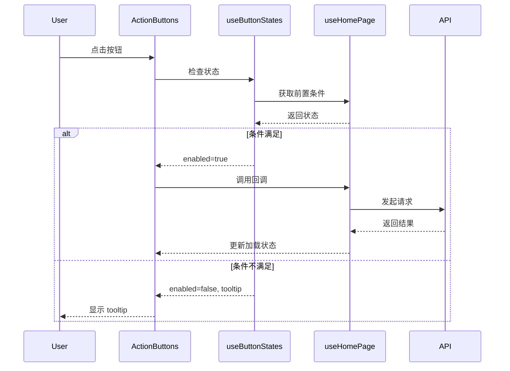
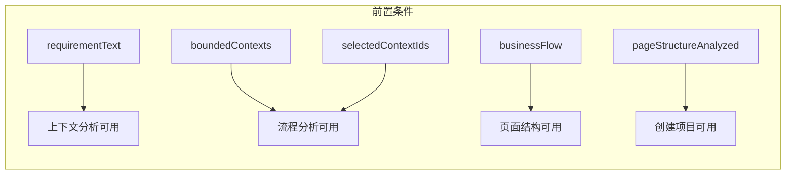

# 架构设计：按钮拆分方案

**项目**: vibex-button-split
**架构师**: Architect Agent
**日期**: 2026-03-17
**版本**: 1.0

---

## 1. 技术栈

| 技术 | 版本 | 选择理由 |
|------|------|----------|
| React | 18.x | 现有项目基础，Hooks 模式成熟 |
| TypeScript | 5.x | 类型安全，现有项目已使用 |
| CSS Modules | - | 现有样式方案，保持一致性 |
| Jest + RTL | 29.x | 现有测试框架，覆盖率 >80% |

---

## 2. 架构图

### 2.1 组件层级结构



### 2.2 数据流



### 2.3 状态依赖关系



---

## 3. 模块设计

### 3.1 ActionButtons 组件

**路径**: `src/components/homepage/InputArea/ActionButtons.tsx`

```typescript
interface ActionButtonsProps {
  // 状态
  buttonStates: ButtonStates;
  
  // 回调
  onGenerateContexts: () => void;
  onGenerateFlow: () => void;
  onAnalyzePageStructure: () => void;
  onCreateProject: () => void;
  
  // 加载状态
  isGenerating: boolean;
  currentGeneratingButton?: ButtonType;
}

type ButtonType = 'context' | 'flow' | 'page' | 'project';

interface ButtonStates {
  context: ButtonState;
  flow: ButtonState;
  page: ButtonState;
  project: ButtonState;
}

interface ButtonState {
  enabled: boolean;
  tooltip?: string;
}
```

**职责**:
- 渲染 4 个独立按钮
- 显示加载状态
- 禁用时显示 tooltip
- 样式与现有设计一致

### 3.2 useButtonStates Hook

**路径**: `src/components/homepage/hooks/useButtonStates.ts`

```typescript
interface UseButtonStatesParams {
  requirementText: string;
  boundedContexts: BoundedContext[];
  selectedContextIds: Set<string>;
  businessFlow: BusinessFlow | null;
  pageStructureAnalyzed: boolean;
}

interface UseButtonStatesReturn {
  buttonStates: ButtonStates;
  getButtonState: (type: ButtonType) => ButtonState;
}

export function useButtonStates(params: UseButtonStatesParams): UseButtonStatesReturn;
```

**计算逻辑**:

| 按钮 | 启用条件 | 禁用提示 |
|------|----------|----------|
| 上下文分析 | `requirementText.trim().length > 0` | "请先输入需求描述" |
| 流程分析 | `boundedContexts.length > 0 && selectedContextIds.size > 0` | "请先完成上下文分析并选择上下文" |
| 页面结构 | `businessFlow !== null` | "请先完成流程分析" |
| 创建项目 | `pageStructureAnalyzed === true` | "请先完成页面结构分析" |

### 3.3 useHomePage 扩展

**新增状态**:

```typescript
// 在 useHomePage.ts 中添加
const [pageStructureAnalyzed, setPageStructureAnalyzed] = useState(false);
const [pageStructure, setPageStructure] = useState<PageStructure | null>(null);
```

**新增方法**:

```typescript
const analyzePageStructure = useCallback(() => {
  if (!businessFlow) return;
  
  // TODO: 调用页面结构分析 API (可先 Mock)
  setPageStructureAnalyzed(true);
  setCompletedStep(4);
  setCurrentStep(5);
}, [businessFlow]);
```

---

## 4. 接口定义

### 4.1 PageStructure 类型

**路径**: `src/types/homepage.ts`

```typescript
/** 页面结构 */
export interface PageStructure {
  id: string;
  name: string;
  pages: PageDefinition[];
  routes: RouteDefinition[];
}

export interface PageDefinition {
  id: string;
  name: string;
  path: string;
  components: string[];
}

export interface RouteDefinition {
  path: string;
  pageId: string;
  layout?: string;
}
```

### 4.2 ActionButtons Props 接口

```typescript
export interface ActionButtonsProps {
  /** 按钮状态 */
  buttonStates: ButtonStates;
  
  /** 上下文分析回调 */
  onGenerateContexts: () => void;
  /** 流程分析回调 */
  onGenerateFlow: () => void;
  /** 页面结构分析回调 */
  onAnalyzePageStructure: () => void;
  /** 创建项目回调 */
  onCreateProject: () => void;
  
  /** 是否正在生成 */
  isGenerating: boolean;
  /** 当前正在生成的按钮 */
  currentGeneratingButton?: 'context' | 'flow' | 'page' | 'project';
  
  /** 自定义类名 */
  className?: string;
}
```

### 4.3 useButtonStates 接口

```typescript
export interface UseButtonStatesParams {
  requirementText: string;
  boundedContexts: BoundedContext[];
  selectedContextIds: Set<string>;
  businessFlow: BusinessFlow | null;
  pageStructureAnalyzed: boolean;
}

export interface UseButtonStatesReturn {
  /** 所有按钮状态 */
  buttonStates: ButtonStates;
  /** 获取单个按钮状态 */
  getButtonState: (type: ButtonType) => ButtonState;
}
```

---

## 5. 文件结构

```
src/components/homepage/
├── InputArea/
│   ├── InputArea.tsx          # 修改：集成 ActionButtons
│   ├── InputArea.module.css   # 保持不变
│   ├── ActionButtons.tsx      # 新增
│   ├── ActionButtons.module.css # 新增
│   └── ActionButtons.test.tsx # 新增
│
├── hooks/
│   ├── useHomePage.ts         # 扩展：添加 pageStructure 状态
│   ├── useButtonStates.ts     # 新增
│   └── useButtonStates.test.ts # 新增
│
└── types.ts                    # 扩展：添加 PageStructure 类型

src/types/
└── homepage.ts                 # 扩展：添加相关类型定义
```

---

## 6. 测试策略

### 6.1 单元测试

| 模块 | 测试文件 | 覆盖目标 |
|------|----------|----------|
| ActionButtons | `ActionButtons.test.tsx` | >85% |
| useButtonStates | `useButtonStates.test.ts` | >90% |

### 6.2 测试用例

#### ActionButtons 组件测试

```typescript
describe('ActionButtons', () => {
  // F1.1: 4个按钮正确渲染
  it('should render 4 buttons', () => {
    render(<ActionButtons {...defaultProps} />);
    expect(screen.getAllByRole('button')).toHaveLength(4);
  });

  // F1.2: 按钮放置正确
  it('should have buttons with correct labels', () => {
    render(<ActionButtons {...defaultProps} />);
    expect(screen.getByText('上下文分析')).toBeInTheDocument();
    expect(screen.getByText('流程分析')).toBeInTheDocument();
    expect(screen.getByText('页面结构')).toBeInTheDocument();
    expect(screen.getByText('创建项目')).toBeInTheDocument();
  });

  // F2.1: 禁用状态测试
  it('should disable context button when no requirement text', () => {
    render(<ActionButtons {...defaultProps} buttonStates={{
      ...defaultButtonStates,
      context: { enabled: false, tooltip: '请先输入需求' }
    }} />);
    expect(screen.getByText('上下文分析')).toBeDisabled();
  });

  // F2.5: tooltip 显示测试
  it('should show tooltip on hover when disabled', async () => {
    render(<ActionButtons {...defaultProps} />);
    // 测试 tooltip 行为
  });

  // F3.1-F3.4: 点击事件测试
  it('should call onGenerateContexts when context button clicked', () => {
    const onGenerateContexts = jest.fn();
    render(<ActionButtons {...defaultProps} onGenerateContexts={onGenerateContexts} />);
    fireEvent.click(screen.getByText('上下文分析'));
    expect(onGenerateContexts).toHaveBeenCalled();
  });

  // F5.1: 加载状态测试
  it('should show loading icon when generating', () => {
    render(<ActionButtons {...defaultProps} isGenerating={true} currentGeneratingButton="context" />);
    expect(screen.getByTestId('loading-icon')).toBeInTheDocument();
  });
});
```

#### useButtonStates Hook 测试

```typescript
describe('useButtonStates', () => {
  // 上下文分析按钮状态
  it('should enable context button when requirementText exists', () => {
    const { result } = renderHook(() => useButtonStates({
      requirementText: 'test requirement',
      boundedContexts: [],
      selectedContextIds: new Set(),
      businessFlow: null,
      pageStructureAnalyzed: false,
    }));
    expect(result.current.buttonStates.context.enabled).toBe(true);
  });

  it('should disable context button when requirementText is empty', () => {
    const { result } = renderHook(() => useButtonStates({
      requirementText: '',
      boundedContexts: [],
      selectedContextIds: new Set(),
      businessFlow: null,
      pageStructureAnalyzed: false,
    }));
    expect(result.current.buttonStates.context.enabled).toBe(false);
    expect(result.current.buttonStates.context.tooltip).toBe('请先输入需求描述');
  });

  // 流程分析按钮状态
  it('should enable flow button when contexts exist and selected', () => {
    const { result } = renderHook(() => useButtonStates({
      requirementText: 'test',
      boundedContexts: [{ id: '1', name: 'ctx' } as BoundedContext],
      selectedContextIds: new Set(['1']),
      businessFlow: null,
      pageStructureAnalyzed: false,
    }));
    expect(result.current.buttonStates.flow.enabled).toBe(true);
  });

  // 页面结构按钮状态
  it('should enable page button when businessFlow exists', () => {
    const { result } = renderHook(() => useButtonStates({
      requirementText: 'test',
      boundedContexts: [{ id: '1', name: 'ctx' } as BoundedContext],
      selectedContextIds: new Set(['1']),
      businessFlow: { id: '1', name: 'flow' } as BusinessFlow,
      pageStructureAnalyzed: false,
    }));
    expect(result.current.buttonStates.page.enabled).toBe(true);
  });

  // 创建项目按钮状态
  it('should enable project button when pageStructureAnalyzed is true', () => {
    const { result } = renderHook(() => useButtonStates({
      requirementText: 'test',
      boundedContexts: [],
      selectedContextIds: new Set(),
      businessFlow: null,
      pageStructureAnalyzed: true,
    }));
    expect(result.current.buttonStates.project.enabled).toBe(true);
  });
});
```

### 6.3 集成测试

```typescript
describe('InputArea with ActionButtons', () => {
  it('should render ActionButtons in new layout mode', () => {
    render(<InputArea currentStep={1} requirementText="test" onRequirementChange={jest.fn()} />);
    expect(screen.getByText('上下文分析')).toBeInTheDocument();
  });

  it('should pass correct state to ActionButtons', () => {
    // 测试状态传递
  });
});
```

---

## 7. 风险评估

| 风险 | 影响 | 概率 | 缓解措施 |
|------|------|------|----------|
| 页面结构分析 API 不存在 | 高 | 高 | 先实现 Mock，后续接入真实 API |
| 按钮状态计算复杂度 | 中 | 低 | 抽取为独立 hook，增加单元测试 |
| 现有功能回归 | 高 | 低 | 保持现有测试通过，新增测试覆盖 |
| 用户习惯改变 | 低 | 中 | 保留原"一键生成"逻辑，可在 settings 中切换 |

---

## 8. 性能影响

| 项目 | 影响 | 说明 |
|------|------|------|
| 组件渲染 | 无影响 | 新增组件独立渲染，不影响现有组件 |
| 状态计算 | 微小增加 | useButtonStates 仅计算 4 个布尔值 |
| API 调用 | 无影响 | 仅调用现有 API，无新增网络请求 |
| 包体积 | +5KB | 新增组件和 hook 代码 |

---

## 9. 实现顺序

1. **E-001**: 创建 `useButtonStates` hook + 单元测试
2. **E-002**: 创建 `ActionButtons` 组件 + CSS + 单元测试
3. **E-003**: 扩展 `useHomePage` hook，添加 pageStructure 状态
4. **E-004**: 修改 `InputArea` 组件，集成 ActionButtons
5. **E-005**: 集成测试，验证功能完整性

---

## 10. 验收检查清单

### 架构设计完成标准

- [x] 架构图使用 Mermaid 格式
- [x] 接口定义完整
- [x] 测试策略明确，覆盖率 >80%
- [x] 风险评估完整
- [x] 兼容现有架构

### Dev 实现检查清单

- [ ] `useButtonStates` hook 创建完成
- [ ] `ActionButtons` 组件创建完成
- [ ] `useHomePage` 扩展完成
- [ ] `InputArea` 修改完成
- [ ] 单元测试覆盖率 >80%
- [ ] 现有测试全部通过

---

*架构设计完成时间: 2026-03-17 18:52*
*架构师: Architect Agent*