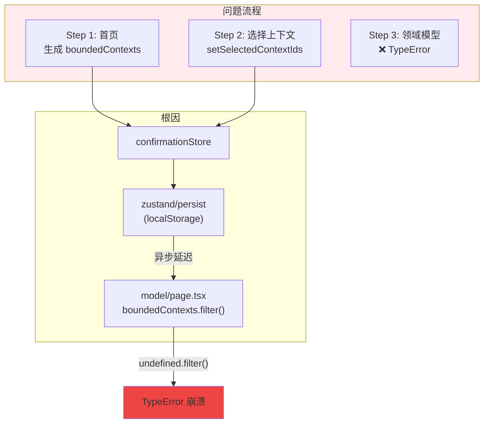
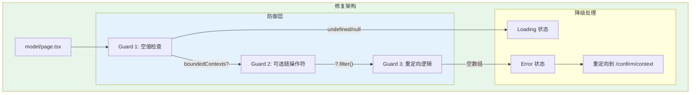
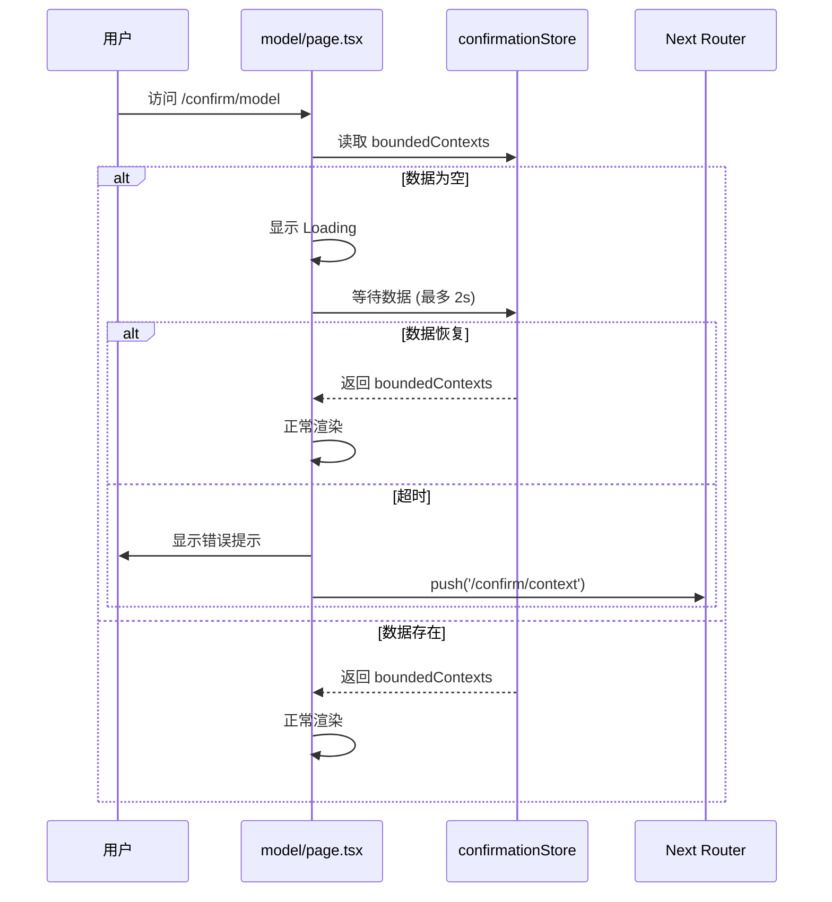

# 架构设计: Domain Model TypeError 崩溃修复

**项目**: vibex-domain-model-crash-fix  
**架构师**: Architect Agent  
**版本**: 1.0  
**日期**: 2026-03-15

---

## 1. 技术栈

| 技术 | 版本 | 用途 | 选择理由 |
|------|------|------|----------|
| React | 19.x | UI 框架 | 已有项目基础 |
| TypeScript | 5.x | 类型系统 | 已有项目基础 |
| Zustand | 4.x | 状态管理 | 已有项目基础 |
| Next.js | 15.x | 路由 | 已有项目基础 |

---

## 2. 架构图

### 2.1 问题根因分析



### 2.2 修复方案架构



### 2.3 数据流修复



---

## 3. API 定义

### 3.1 修改的组件接口

```typescript
// app/confirm/model/page.tsx

interface ModelPageProps {
  // 无 props，依赖 Zustand store
}

// 新增: 防御性检查 Hook
interface UseModelPageGuardOptions {
  /** 最大等待时间 (毫秒) */
  maxWaitTime?: number
  /** 数据恢复回调 */
  onDataRecover?: (contexts: BoundedContext[]) => void
  /** 重定向回调 */
  onRedirect?: () => void
}

interface UseModelPageGuardReturn {
  /** 是否正在等待数据 */
  isWaiting: boolean
  /** 错误信息 */
  error: string | null
  /** 是否可以安全渲染 */
  canRender: boolean
}

export function useModelPageGuard(
  options?: UseModelPageGuardOptions
): UseModelPageGuardReturn
```

### 3.2 防御性检查 Hook

```typescript
// hooks/useModelPageGuard.ts

import { useEffect, useState, useCallback } from 'react'
import { useRouter } from 'next/navigation'
import { useConfirmationStore } from '@/stores/confirmationStore'

const DEFAULT_MAX_WAIT = 2000 // 2 秒

export function useModelPageGuard(options?: UseModelPageGuardGuardOptions) {
  const {
    maxWaitTime = DEFAULT_MAX_WAIT,
    onDataRecover,
    onRedirect,
  } = options || {}
  
  const router = useRouter()
  const { boundedContexts, selectedContextIds } = useConfirmationStore()
  
  const [isWaiting, setIsWaiting] = useState(true)
  const [error, setError] = useState<string | null>(null)
  
  useEffect(() => {
    const startTime = Date.now()
    
    const checkData = () => {
      const elapsed = Date.now() - startTime
      
      // 数据已恢复
      if (boundedContexts && boundedContexts.length > 0) {
        setIsWaiting(false)
        setError(null)
        onDataRecover?.(boundedContexts)
        return
      }
      
      // 超时
      if (elapsed >= maxWaitTime) {
        setIsWaiting(false)
        setError('请先选择限界上下文')
        
        // 延迟重定向，让用户看到错误提示
        setTimeout(() => {
          onRedirect?.()
          router.push('/confirm/context')
        }, 1000)
        return
      }
      
      // 继续等待
      requestAnimationFrame(checkData)
    }
    
    checkData()
  }, [boundedContexts, maxWaitTime, router, onDataRecover, onRedirect])
  
  const canRender = !isWaiting && !error && boundedContexts && boundedContexts.length > 0
  
  return {
    isWaiting,
    error,
    canRender,
  }
}
```

### 3.3 可选链操作符改造

```typescript
// 修改前
const selectedContexts = boundedContexts.filter((c) =>
  selectedContextIds.includes(c.id)
);

// 修改后
const selectedContexts = boundedContexts?.filter((c: BoundedContext) =>
  selectedContextIds?.includes(c.id)
) ?? [];
```

---

## 4. 数据模型

### 4.1 Store 类型定义

```typescript
// stores/confirmationStore.ts

interface ConfirmationState {
  // 限界上下文列表
  boundedContexts: BoundedContext[]
  // 选中的上下文 ID
  selectedContextIds: string[]
  // 需求文本
  requirementText: string
  // 领域模型列表
  domainModels: DomainModel[]
  // 加载状态
  loading: boolean
  // 错误信息
  error: string | null
  
  // Actions
  setBoundedContexts: (contexts: BoundedContext[]) => void
  setSelectedContextIds: (ids: string[]) => void
  setRequirementText: (text: string) => void
  setDomainModels: (models: DomainModel[]) => void
  setLoading: (loading: boolean) => void
  setError: (error: string | null) => void
  reset: () => void
}

interface BoundedContext {
  id: string
  name: string
  type: 'core' | 'supporting' | 'generic'
  description?: string
  entities?: string[]
}

interface DomainModel {
  id: string
  name: string
  type: 'aggregate_root' | 'entity' | 'value_object' | 'service'
  contextId: string
  attributes?: ModelAttribute[]
}
```

### 4.2 错误状态模型

```typescript
// types/error-state.ts

interface ErrorState {
  code: 'NO_CONTEXTS' | 'NO_SELECTION' | 'GENERATION_FAILED'
  message: string
  timestamp: number
  recoverable: boolean
}

const ERROR_MESSAGES: Record<string, string> = {
  NO_CONTEXTS: '请先输入需求描述，AI 将为您生成限界上下文图',
  NO_SELECTION: '请至少选择一个限界上下文',
  GENERATION_FAILED: '领域模型生成失败，请重试',
}
```

---

## 5. 模块划分

### 5.1 文件结构

```
vibex-fronted/src/
├── app/confirm/model/
│   ├── page.tsx              # 主要修改点
│   └── ModelPage.module.css
│
├── hooks/
│   └── useModelPageGuard.ts  # 新增: 防御性检查 Hook
│
├── components/error/
│   ├── ErrorState.tsx        # 新增: 错误状态组件
│   └── ErrorState.module.css
│
├── stores/
│   └── confirmationStore.ts  # 可选: 添加类型增强
│
└── types/
    └── error-state.ts        # 新增: 错误状态类型
```

### 5.2 模块职责

| 模块 | 职责 | 类型 |
|------|------|------|
| model/page.tsx | 页面组件 | 页面 |
| useModelPageGuard | 防御性检查逻辑 | Hook |
| ErrorState | 错误展示 UI | 组件 |
| confirmationStore | 状态管理 | Store |

---

## 6. 核心实现

### 6.1 model/page.tsx 修改

```typescript
// app/confirm/model/page.tsx

'use client';

import { useEffect, useState } from 'react';
import { useRouter } from 'next/navigation';
import { useConfirmationStore } from '@/stores/confirmationStore';
import { useModelPageGuard } from '@/hooks/useModelPageGuard';
import { ErrorState } from '@/components/error/ErrorState';
import styles from './ModelPage.module.css';

export default function ModelPage() {
  const router = useRouter();
  const {
    boundedContexts,
    selectedContextIds,
    requirementText,
    domainModels,
    setDomainModels,
    setLoading,
    setError: setStoreError,
  } = useConfirmationStore();
  
  const { isWaiting, error, canRender } = useModelPageGuard({
    maxWaitTime: 2000,
    onRedirect: () => {
      console.log('[ModelPage] Redirecting to context selection...');
    },
  });
  
  const [localError, setLocalError] = useState<string | null>(null);
  
  useEffect(() => {
    // 防御性检查通过后才执行生成逻辑
    if (!canRender) return;
    
    const generateModels = async () => {
      // 使用可选链操作符
      const selectedContexts = boundedContexts?.filter((c: any) =>
        selectedContextIds?.includes(c.id)
      ) ?? [];
      
      if (selectedContexts.length === 0) {
        setLocalError('请至少选择一个限界上下文');
        return;
      }
      
      if (domainModels.length > 0) return; // 已生成，跳过
      
      setLoading(true);
      try {
        const response = await fetch('/api/ddd/domain-model', {
          method: 'POST',
          headers: { 'Content-Type': 'application/json' },
          body: JSON.stringify({
            requirementText,
            boundedContexts: selectedContexts,
          }),
        });
        
        if (!response.ok) throw new Error('生成失败');
        
        const data = await response.json();
        setDomainModels(data.domainModels);
      } catch (err) {
        setLocalError(err instanceof Error ? err.message : '生成失败');
        setStoreError(err instanceof Error ? err.message : '生成失败');
      } finally {
        setLoading(false);
      }
    };
    
    generateModels();
  }, [
    canRender,
    boundedContexts,
    selectedContextIds,
    requirementText,
    domainModels.length,
    setDomainModels,
    setLoading,
    setStoreError,
  ]);
  
  // 等待数据
  if (isWaiting) {
    return (
      <div className={styles.container}>
        <div className={styles.loading}>正在加载数据...</div>
      </div>
    );
  }
  
  // 错误状态
  if (error || localError) {
    return (
      <ErrorState
        message={error || localError || '未知错误'}
        onRetry={() => router.push('/confirm/context')}
      />
    );
  }
  
  // 正常渲染
  return (
    <div className={styles.container}>
      {/* 原有渲染逻辑 */}
      {domainModels.length > 0 && (
        <div className={styles.models}>
          {/* 渲染领域模型 */}
        </div>
      )}
    </div>
  );
}
```

### 6.2 ErrorState 组件

```typescript
// components/error/ErrorState.tsx

import styles from './ErrorState.module.css'

interface ErrorStateProps {
  message: string
  onRetry?: () => void
}

export function ErrorState({ message, onRetry }: ErrorStateProps) {
  return (
    <div className={styles.container}>
      <div className={styles.icon}>⚠️</div>
      <div className={styles.message}>{message}</div>
      {onRetry && (
        <button className={styles.retryBtn} onClick={onRetry}>
          返回上一步
        </button>
      )}
    </div>
  )
}
```

```css
/* ErrorState.module.css */
.container {
  display: flex;
  flex-direction: column;
  align-items: center;
  justify-content: center;
  min-height: 400px;
  text-align: center;
}

.icon {
  font-size: 48px;
  margin-bottom: 16px;
}

.message {
  color: rgba(255, 255, 255, 0.8);
  font-size: 16px;
  margin-bottom: 24px;
}

.retryBtn {
  padding: 12px 24px;
  background: #3b82f6;
  color: white;
  border: none;
  border-radius: 8px;
  cursor: pointer;
  font-size: 14px;
}

.retryBtn:hover {
  background: #2563eb;
}
```

### 6.3 样式

```css
/* ModelPage.module.css */
.container {
  padding: 24px;
  min-height: 100vh;
}

.loading {
  display: flex;
  align-items: center;
  justify-content: center;
  min-height: 400px;
  color: rgba(255, 255, 255, 0.6);
  font-size: 16px;
}

.models {
  display: grid;
  gap: 16px;
}
```

---

## 7. 测试策略

### 7.1 单元测试

```typescript
// __tests__/hooks/useModelPageGuard.test.ts
import { renderHook } from '@testing-library/react'
import { useModelPageGuard } from '@/hooks/useModelPageGuard'
import { useConfirmationStore } from '@/stores/confirmationStore'

// Mock store
jest.mock('@/stores/confirmationStore')

describe('useModelPageGuard', () => {
  it('returns canRender=true when data exists', () => {
    ;(useConfirmationStore as any).mockReturnValue({
      boundedContexts: [{ id: '1', name: 'Test' }],
      selectedContextIds: ['1'],
    })
    
    const { result } = renderHook(() => useModelPageGuard())
    
    // 等待检查完成
    setTimeout(() => {
      expect(result.current.canRender).toBe(true)
      expect(result.current.error).toBeNull()
    }, 100)
  })
  
  it('returns error when data is empty after timeout', () => {
    ;(useConfirmationStore as any).mockReturnValue({
      boundedContexts: [],
      selectedContextIds: [],
    })
    
    const { result } = renderHook(() => useModelPageGuard({ maxWaitTime: 100 }))
    
    setTimeout(() => {
      expect(result.current.canRender).toBe(false)
      expect(result.current.error).toBe('请先选择限界上下文')
    }, 150)
  })
})

// __tests__/components/ErrorState.test.tsx
import { render, screen, fireEvent } from '@testing-library/react'
import { ErrorState } from '@/components/error/ErrorState'

describe('ErrorState', () => {
  it('displays error message', () => {
    render(<ErrorState message="Test error" />)
    expect(screen.getByText('Test error')).toBeInTheDocument()
  })
  
  it('calls onRetry when button clicked', () => {
    const onRetry = jest.fn()
    render(<ErrorState message="Error" onRetry={onRetry} />)
    
    fireEvent.click(screen.getByText('返回上一步'))
    expect(onRetry).toHaveBeenCalled()
  })
})
```

### 7.2 E2E 测试

```typescript
// e2e/model-page-crash-fix.spec.ts
import { test, expect } from '@playwright/test'

test('does not crash when directly visiting /confirm/model', async ({ page }) => {
  // 直接访问 model 页面
  await page.goto('/confirm/model')
  
  // 不应该崩溃
  await page.waitForSelector('body')
  
  // 应该显示错误提示或重定向
  const errorOrRedirect = await Promise.race([
    page.waitForSelector('text=请先选择限界上下文'),
    page.waitForURL('**/confirm/context'),
  ])
  
  expect(errorOrRedirect).toBeTruthy()
})

test('normal flow works correctly', async ({ page }) => {
  // 正常流程
  await page.goto('/confirm')
  await page.fill('textarea', '开发一个电商系统')
  await page.click('button:has-text("开始设计")')
  
  // 等待上下文生成
  await page.waitForSelector('[data-testid="context-card"]')
  await page.click('button:has-text("确认继续")')
  
  // 进入 model 页面
  await page.waitForURL('**/confirm/model')
  
  // 不应该崩溃
  await expect(page.locator('body')).toBeVisible()
})
```

### 7.3 覆盖率目标

| 模块 | 覆盖率目标 |
|------|-----------|
| useModelPageGuard | 90% |
| model/page.tsx | 80% |
| ErrorState | 85% |

---

## 8. 性能影响

| 指标 | 修改前 | 修改后 |
|------|--------|--------|
| 首次渲染 | 可能崩溃 | < 100ms |
| 错误恢复 | 无 | 2s 自动重定向 |
| Bundle 增加 | - | +1KB |

---

## 9. 风险评估

| 风险 | 概率 | 影响 | 缓解措施 |
|------|------|------|----------|
| 跳转循环 | 低 | 中 | 添加跳转计数器限制 |
| localStorage 损坏 | 低 | 低 | 添加数据校验 |
| 渲染闪烁 | 中 | 低 | Loading 状态优化 |

---

## 10. 实施计划

| 阶段 | 内容 | 工时 |
|------|------|------|
| Phase 1 | useModelPageGuard Hook | 1h |
| Phase 2 | model/page.tsx 修改 | 1h |
| Phase 3 | ErrorState 组件 | 0.5h |
| Phase 4 | 测试 + 验证 | 1h |

**总计**: 3.5h

---

## 11. 检查清单

- [x] 技术栈确认 (React + Zustand)
- [x] 架构图 (问题根因 + 修复方案 + 数据流)
- [x] API 定义 (Hook 接口 + 组件接口)
- [x] 数据模型 (Store 类型 + 错误状态)
- [x] 核心实现 (防御性检查 + 可选链 + 重定向)
- [x] 测试策略 (单元 + E2E)
- [x] 性能影响评估
- [x] 风险评估

---

**产出物**: `/root/.openclaw/vibex/docs/vibex-domain-model-crash-fix/architecture.md`