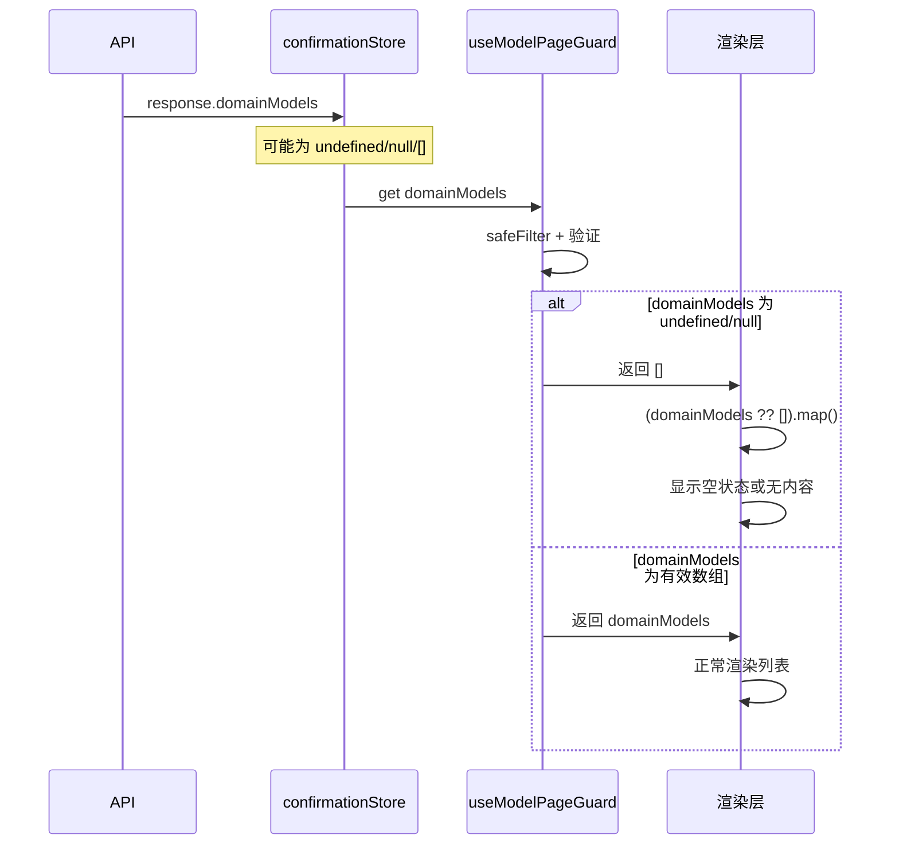
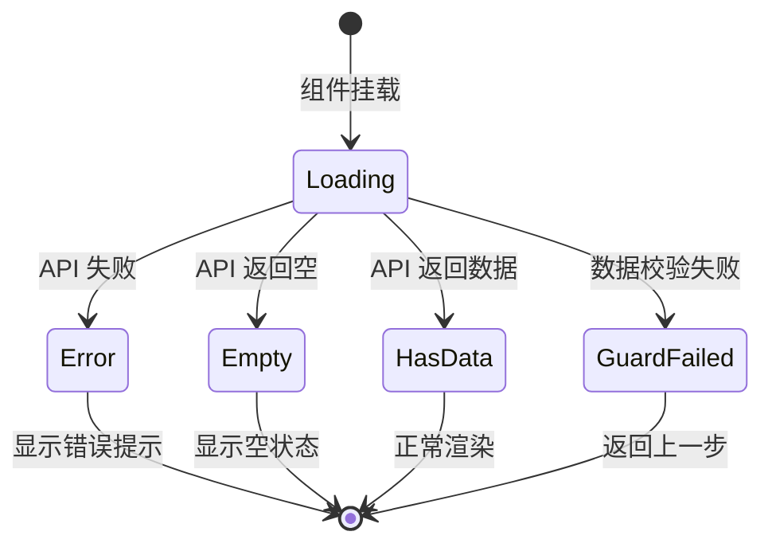
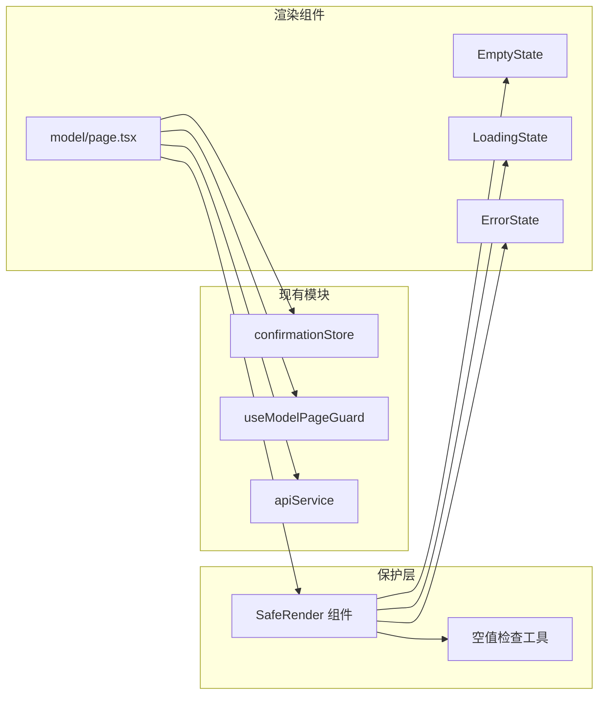
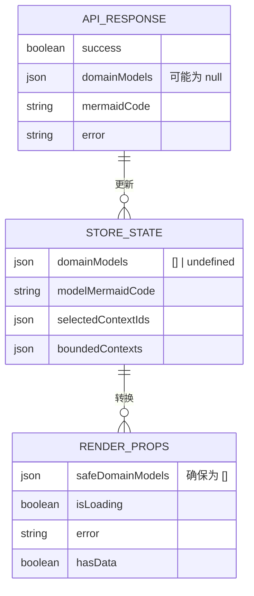

# 领域模型渲染报错修复架构设计文档

**项目**: vibex-domain-model-crash  
**版本**: v1.0  
**日期**: 2026-03-15  
**作者**: Architect Agent

---

## 1. Tech Stack (技术栈选型)

### 1.1 核心技术栈

| 组件 | 选型 | 版本 | 理由 |
|------|------|------|------|
| **空值保护** | 空值合并运算符 `??` | ES2020 | React 原生支持，简洁高效 |
| **条件渲染** | React Conditional Rendering | 18+ | 原生能力 |
| **状态管理** | Zustand | 现有 | 保持一致性 |
| **Hook 防护** | useModelPageGuard | 已实现 | 复用现有防护 |

### 1.2 技术选型对比

| 方案 | 优点 | 缺点 | 推荐度 |
|------|------|------|--------|
| `?? []` 空值合并 | 简洁、性能好 | 仅处理 undefined/null | ⭐⭐⭐⭐⭐ |
| Optional chaining `?.` | 链式调用安全 | 不适合 .map() | ⭐⭐⭐ |
| 默认参数 | 函数级别保护 | 需修改多处 | ⭐⭐ |
| 类型守卫 | TypeScript 安全 | 运行时无保护 | ⭐⭐⭐ |

**结论**: 采用 **空值合并 `?? []` + 条件渲染** 组合方案。

---

## 2. Architecture Diagram (架构图)

### 2.1 整体架构

```mermaid
graph TB
    subgraph "数据流"
        API[API Response]
        STORE[confirmationStore]
        GUARD[useModelPageGuard]
    end

    subgraph "渲染保护层"
        NULLISH[空值合并 ?? []]
        CONDITIONAL[条件渲染]
        ERRORBOUNDARY[Error Boundary]
    end

    subgraph "UI 层"
        LOADING[加载状态]
        EMPTY[空状态提示]
        CONTENT[正常内容]
        ERROR[错误提示]
    end

    API --> |domainModels| STORE
    STORE --> |domainModels| GUARD
    GUARD --> |safeDomainModels| NULLISH
    NULLISH --> CONDITIONAL

    CONDITIONAL --> |loading=true| LOADING
    CONDITIONAL --> |error| ERROR
    CONDITIONAL --> |empty| EMPTY
    CONDITIONAL --> |has data| CONTENT

    ERRORBOUNDARY --> |catch error| ERROR
```

### 2.2 空值保护流程



### 2.3 状态机设计



### 2.4 模块依赖关系



---

## 3. API Definitions (接口定义)

### 3.1 SafeRender 组件接口

```typescript
// components/SafeRender.tsx

export interface SafeRenderProps<T> {
  /** 数据源 */
  data: T[] | undefined | null;
  /** 渲染每个项目的函数 */
  renderItem: (item: T, index: number) => React.ReactNode;
  /** 空状态渲染 */
  renderEmpty?: () => React.ReactNode;
  /** 加载状态 */
  loading?: boolean;
  /** 加载状态渲染 */
  renderLoading?: () => React.ReactNode;
  /** 错误信息 */
  error?: string | null;
  /** 错误状态渲染 */
  renderError?: (error: string) => React.ReactNode;
  /** 列表容器类名 */
  className?: string;
  /** 列表容器元素 */
  as?: 'div' | 'ul' | 'section';
  /** 每个项目的 key 提取器 */
  keyExtractor: (item: T) => string;
}

/**
 * 安全渲染列表组件
 * 提供空值保护、加载状态、错误处理
 */
export function SafeRender<T>({
  data,
  renderItem,
  renderEmpty,
  loading,
  renderLoading,
  error,
  renderError,
  className,
  as = 'div',
  keyExtractor,
}: SafeRenderProps<T>): JSX.Element | null;
```

### 3.2 空值检查工具

```typescript
// lib/nullSafety.ts

/**
 * 确保返回数组
 */
export function ensureArray<T>(value: T[] | undefined | null): T[];

/**
 * 安全 map 操作
 */
export function safeMap<T, R>(
  array: T[] | undefined | null,
  mapper: (item: T, index: number) => R
): R[];

/**
 * 检查是否为空数组或空值
 */
export function isEmptyArray(value: unknown): boolean;

/**
 * 安全访问嵌套属性
 */
export function safeGet<T>(
  obj: unknown,
  path: string,
  defaultValue: T
): T;
```

### 3.3 状态类型定义

```typescript
// types/domainModel.ts

export interface DomainModel {
  id: string;
  name: string;
  type: 'aggregate_root' | 'entity' | 'value_object';
  properties: DomainProperty[];
  methods?: DomainMethod[];
  relationships?: DomainRelationship[];
}

export interface DomainProperty {
  name: string;
  type: string;
  required?: boolean;
}

export interface DomainMethod {
  name: string;
  returnType: string;
  parameters?: { name: string; type: string }[];
}

export interface DomainRelationship {
  target: string;
  type: 'association' | 'composition' | 'aggregation';
}

/**
 * API 响应类型
 */
export interface DomainModelResponse {
  success: boolean;
  domainModels: DomainModel[] | null;  // 可能为 null
  mermaidCode?: string;
  error?: string;
}
```

---

## 4. Data Model (数据模型)

### 4.1 状态数据流



### 4.2 错误状态模型

```typescript
// types/errorState.ts

export type ErrorState = 
  | { type: 'none' }
  | { type: 'loading' }
  | { type: 'api_error'; message: string }
  | { type: 'validation_error'; field: string; message: string }
  | { type: 'empty_data'; message: string }
  | { type: 'guard_failed'; redirect: string };

export interface RenderState {
  status: 'idle' | 'loading' | 'success' | 'error' | 'empty';
  data: DomainModel[];
  error: string | null;
}
```

---

## 5. Implementation Details (实现细节)

### 5.1 空值安全工具实现

```typescript
// lib/nullSafety.ts

/**
 * 确保返回数组
 * @param value 可能是 undefined/null 的数组
 * @returns 确保返回数组
 */
export function ensureArray<T>(value: T[] | undefined | null): T[] {
  if (value === undefined || value === null) {
    return [];
  }
  return Array.isArray(value) ? value : [];
}

/**
 * 安全 map 操作
 * @param array 可能是空的数组
 * @param mapper 映射函数
 * @returns 映射结果数组
 */
export function safeMap<T, R>(
  array: T[] | undefined | null,
  mapper: (item: T, index: number) => R
): R[] {
  return ensureArray(array).map(mapper);
}

/**
 * 检查是否为空数组或空值
 */
export function isEmptyArray(value: unknown): boolean {
  if (value === undefined || value === null) return true;
  if (Array.isArray(value)) return value.length === 0;
  return true;
}

/**
 * 安全访问嵌套属性
 */
export function safeGet<T>(
  obj: unknown,
  path: string,
  defaultValue: T
): T {
  const keys = path.split('.');
  let current: unknown = obj;

  for (const key of keys) {
    if (current === undefined || current === null) {
      return defaultValue;
    }
    current = (current as Record<string, unknown>)[key];
  }

  return current !== undefined && current !== null ? (current as T) : defaultValue;
}
```

### 5.2 SafeRender 组件实现

```typescript
// components/SafeRender.tsx

'use client';

import React from 'react';
import { ensureArray } from '@/lib/nullSafety';

interface SafeRenderProps<T> {
  data: T[] | undefined | null;
  renderItem: (item: T, index: number) => React.ReactNode;
  renderEmpty?: () => React.ReactNode;
  loading?: boolean;
  renderLoading?: () => React.ReactNode;
  error?: string | null;
  renderError?: (error: string) => React.ReactNode;
  className?: string;
  as?: 'div' | 'ul' | 'section';
  keyExtractor: (item: T) => string;
}

/**
 * 默认空状态组件
 */
function DefaultEmptyState() {
  return (
    <div className="text-center text-gray-500 py-8">
      <p>暂无数据</p>
    </div>
  );
}

/**
 * 默认加载状态组件
 */
function DefaultLoadingState() {
  return (
    <div className="text-center text-gray-400 py-8">
      <p>加载中...</p>
    </div>
  );
}

/**
 * 默认错误状态组件
 */
function DefaultErrorState({ error }: { error: string }) {
  return (
    <div className="text-center text-red-500 py-8">
      <p>⚠️ {error}</p>
    </div>
  );
}

/**
 * 安全渲染列表组件
 * 提供空值保护、加载状态、错误处理
 */
export function SafeRender<T>({
  data,
  renderItem,
  renderEmpty,
  loading,
  renderLoading,
  error,
  renderError,
  className,
  as: Container = 'div',
  keyExtractor,
}: SafeRenderProps<T>): JSX.Element {
  // 加载状态
  if (loading) {
    return (
      <>{renderLoading ? renderLoading() : <DefaultLoadingState />}</>
    );
  }

  // 错误状态
  if (error) {
    return (
      <>{renderError ? renderError(error) : <DefaultErrorState error={error} />}</>
    );
  }

  // 确保数据是数组
  const safeData = ensureArray(data);

  // 空状态
  if (safeData.length === 0) {
    return (
      <>{renderEmpty ? renderEmpty() : <DefaultEmptyState />}</>
    );
  }

  // 正常渲染
  return (
    <Container className={className}>
      {safeData.map((item, index) => (
        <React.Fragment key={keyExtractor(item)}>
          {renderItem(item, index)}
        </React.Fragment>
      ))}
    </Container>
  );
}
```

### 5.3 页面组件改进

```typescript
// src/app/confirm/model/page.tsx (关键修改)

import { SafeRender } from '@/components/SafeRender';
import { ensureArray } from '@/lib/nullSafety';

export default function ModelPage() {
  // ... 现有代码 ...

  // 安全获取 domainModels
  const safeDomainModels = ensureArray(domainModels);

  return (
    <div className={styles.container}>
      {/* ... 其他内容 ... */}

      <div className={styles.modelList}>
        <h3 className={styles.sectionTitle}>领域模型详情</h3>
        
        <SafeRender
          data={domainModels}
          keyExtractor={(model) => model.id}
          loading={loading}
          renderLoading={() => (
            <div className={styles.loading}>
              <p>⏳ 正在加载领域模型...</p>
            </div>
          )}
          error={error}
          renderError={(err) => (
            <div className={styles.error}>
              <p>⚠️ {err}</p>
            </div>
          )}
          renderEmpty={() => (
            <div className={styles.emptyState}>
              <p>暂无领域模型数据</p>
              <p className={styles.hint}>请确认已正确选择限界上下文</p>
            </div>
          )}
          className={styles.modelGrid}
          renderItem={(model) => (
            <div key={model.id} className={styles.modelCard}>
              {/* 模型卡片内容 */}
              <div className={styles.modelHeader}>
                <span
                  className={styles.modelType}
                  style={{ backgroundColor: typeColors[model.type] }}
                >
                  {typeLabels[model.type]}
                </span>
              </div>
              <h4 className={styles.modelName}>{model.name}</h4>
              {/* ... 属性列表 ... */}
            </div>
          )}
        />
      </div>

      {/* ... 其他内容 ... */}
    </div>
  );
}
```

### 5.4 Store 改进

```typescript
// src/stores/confirmationStore.ts (关键修改)

interface ConfirmationState {
  // ... 其他状态 ...
  
  // 确保默认值是空数组
  domainModels: DomainModel[];
  modelMermaidCode: string;
  
  // ... actions ...
  
  // 安全设置 domainModels
  setDomainModels: (models: DomainModel[] | null | undefined) => void;
}

export const useConfirmationStore = create<ConfirmationState>()(
  persist(
    (set, get) => ({
      // 初始值确保是空数组
      domainModels: [],
      modelMermaidCode: '',
      
      // 安全设置
      setDomainModels: (models) => {
        set({
          domainModels: Array.isArray(models) ? models : [],
        });
      },
      
      // 清空时确保是空数组
      clearDomainModels: () => {
        set({ domainModels: [] });
      },
      
      // ... 其他 actions ...
    }),
    {
      name: 'confirmation-flow-storage',
      storage: createJSONStorage(() => localStorage),
      // 添加版本迁移
      version: 1,
      migrate: (persisted, version) => {
        if (version === 0) {
          // 旧版本可能 domainModels 为 undefined
          return {
            ...persisted,
            domainModels: persisted?.domainModels ?? [],
          };
        }
        return persisted;
      },
    }
  )
);
```

---

## 6. Testing Strategy (测试策略)

### 6.1 测试框架

| 测试类型 | 框架 | 工具 |
|----------|------|------|
| 单元测试 | Jest 30.2 | @testing-library/react |
| 组件测试 | Jest | @testing-library/react |
| E2E 测试 | Playwright | - |

### 6.2 核心测试用例

#### 6.2.1 空值安全工具测试

```typescript
// __tests__/lib/nullSafety.test.ts

import { ensureArray, safeMap, isEmptyArray } from '@/lib/nullSafety';

describe('nullSafety', () => {
  describe('ensureArray', () => {
    it('should return empty array for undefined', () => {
      expect(ensureArray(undefined)).toEqual([]);
    });

    it('should return empty array for null', () => {
      expect(ensureArray(null)).toEqual([]);
    });

    it('should return the array for valid array', () => {
      expect(ensureArray([1, 2, 3])).toEqual([1, 2, 3]);
    });

    it('should return empty array for non-array', () => {
      expect(ensureArray({} as any)).toEqual([]);
    });
  });

  describe('safeMap', () => {
    it('should map over valid array', () => {
      const result = safeMap([1, 2, 3], (x) => x * 2);
      expect(result).toEqual([2, 4, 6]);
    });

    it('should return empty array for undefined', () => {
      const result = safeMap(undefined, (x: number) => x * 2);
      expect(result).toEqual([]);
    });

    it('should return empty array for null', () => {
      const result = safeMap(null, (x: number) => x * 2);
      expect(result).toEqual([]);
    });
  });

  describe('isEmptyArray', () => {
    it('should return true for undefined', () => {
      expect(isEmptyArray(undefined)).toBe(true);
    });

    it('should return true for null', () => {
      expect(isEmptyArray(null)).toBe(true);
    });

    it('should return true for empty array', () => {
      expect(isEmptyArray([])).toBe(true);
    });

    it('should return false for non-empty array', () => {
      expect(isEmptyArray([1])).toBe(false);
    });
  });
});
```

#### 6.2.2 SafeRender 组件测试

```typescript
// __tests__/components/SafeRender.test.tsx

import { render, screen } from '@testing-library/react';
import { SafeRender } from '@/components/SafeRender';

interface TestItem {
  id: string;
  name: string;
}

describe('SafeRender', () => {
  const items: TestItem[] = [
    { id: '1', name: 'Item 1' },
    { id: '2', name: 'Item 2' },
  ];

  it('should render items when data is valid', () => {
    render(
      <SafeRender
        data={items}
        keyExtractor={(item) => item.id}
        renderItem={(item) => <div>{item.name}</div>}
      />
    );

    expect(screen.getByText('Item 1')).toBeInTheDocument();
    expect(screen.getByText('Item 2')).toBeInTheDocument();
  });

  it('should show empty state when data is empty', () => {
    render(
      <SafeRender
        data={[]}
        keyExtractor={(item) => item.id}
        renderItem={(item) => <div>{item.name}</div>}
        renderEmpty={() => <div>暂无数据</div>}
      />
    );

    expect(screen.getByText('暂无数据')).toBeInTheDocument();
  });

  it('should handle undefined data', () => {
    render(
      <SafeRender
        data={undefined}
        keyExtractor={(item) => item.id}
        renderItem={(item) => <div>{item.name}</div>}
        renderEmpty={() => <div>暂无数据</div>}
      />
    );

    expect(screen.getByText('暂无数据')).toBeInTheDocument();
  });

  it('should handle null data', () => {
    render(
      <SafeRender
        data={null}
        keyExtractor={(item) => item.id}
        renderItem={(item) => <div>{item.name}</div>}
        renderEmpty={() => <div>暂无数据</div>}
      />
    );

    expect(screen.getByText('暂无数据')).toBeInTheDocument();
  });

  it('should show loading state', () => {
    render(
      <SafeRender
        data={items}
        keyExtractor={(item) => item.id}
        renderItem={(item) => <div>{item.name}</div>}
        loading={true}
        renderLoading={() => <div>加载中...</div>}
      />
    );

    expect(screen.getByText('加载中...')).toBeInTheDocument();
    expect(screen.queryByText('Item 1')).not.toBeInTheDocument();
  });

  it('should show error state', () => {
    render(
      <SafeRender
        data={items}
        keyExtractor={(item) => item.id}
        renderItem={(item) => <div>{item.name}</div>}
        error="加载失败"
        renderError={(err) => <div>错误: {err}</div>}
      />
    );

    expect(screen.getByText('错误: 加载失败')).toBeInTheDocument();
  });
});
```

#### 6.2.3 页面渲染测试

```typescript
// __tests__/app/confirm/model/page.test.tsx

import { render, screen, waitFor } from '@testing-library/react';
import userEvent from '@testing-library/user-event';
import ModelPage from '@/app/confirm/model/page';
import { useConfirmationStore } from '@/stores/confirmationStore';
import { useModelPageGuard } from '@/hooks/useModelPageGuard';

// Mock hooks
jest.mock('@/stores/confirmationStore');
jest.mock('@/hooks/useModelPageGuard');
jest.mock('next/navigation', () => ({
  useRouter: () => ({
    push: jest.fn(),
  }),
}));

describe('ModelPage', () => {
  beforeEach(() => {
    jest.clearAllMocks();
  });

  it('should not crash when domainModels is undefined', async () => {
    (useModelPageGuard as jest.Mock).mockReturnValue({
      canProceed: true,
      checkAndProceed: () => true,
      redirectIfInvalid: jest.fn(),
      hasError: false,
      errorMessage: null,
      isLoading: false,
      boundedContexts: [],
      selectedContextIds: [],
    });

    (useConfirmationStore as jest.Mock).mockReturnValue({
      selectedContextIds: [],
      boundedContexts: [],
      domainModels: undefined, // 关键测试点
      modelMermaidCode: '',
      setDomainModels: jest.fn(),
      setModelMermaidCode: jest.fn(),
      goToNextStep: jest.fn(),
      goToPreviousStep: jest.fn(),
      currentStep: 3,
      requirementText: '',
    });

    // 不应该抛出错误
    expect(() => render(<ModelPage />)).not.toThrow();
  });

  it('should render empty state when domainModels is empty array', async () => {
    (useModelPageGuard as jest.Mock).mockReturnValue({
      canProceed: true,
      checkAndProceed: () => true,
      redirectIfInvalid: jest.fn(),
      hasError: false,
      errorMessage: null,
      isLoading: false,
      boundedContexts: [],
      selectedContextIds: [],
    });

    (useConfirmationStore as jest.Mock).mockReturnValue({
      selectedContextIds: ['1'],
      boundedContexts: [{ id: '1', name: 'Context 1' }],
      domainModels: [], // 空数组
      modelMermaidCode: '',
      setDomainModels: jest.fn(),
      setModelMermaidCode: jest.fn(),
      goToNextStep: jest.fn(),
      goToPreviousStep: jest.fn(),
      currentStep: 3,
      requirementText: 'test',
    });

    render(<ModelPage />);

    // 应该显示空状态或正常渲染
    expect(screen.getByText(/领域模型类图确认/)).toBeInTheDocument();
  });

  it('should render models when data is valid', async () => {
    const mockModels = [
      { id: '1', name: 'User', type: 'aggregate_root', properties: [] },
    ];

    (useModelPageGuard as jest.Mock).mockReturnValue({
      canProceed: true,
      checkAndProceed: () => true,
      redirectIfInvalid: jest.fn(),
      hasError: false,
      errorMessage: null,
      isLoading: false,
      boundedContexts: [],
      selectedContextIds: [],
    });

    (useConfirmationStore as jest.Mock).mockReturnValue({
      selectedContextIds: ['1'],
      boundedContexts: [{ id: '1', name: 'Context 1' }],
      domainModels: mockModels,
      modelMermaidCode: 'graph TD',
      setDomainModels: jest.fn(),
      setModelMermaidCode: jest.fn(),
      goToNextStep: jest.fn(),
      goToPreviousStep: jest.fn(),
      currentStep: 3,
      requirementText: 'test',
    });

    render(<ModelPage />);

    expect(screen.getByText('User')).toBeInTheDocument();
  });
});
```

### 6.3 测试覆盖率目标

| 模块 | 目标覆盖率 |
|------|-----------|
| nullSafety.ts | 100% |
| SafeRender.tsx | 95% |
| model/page.tsx | 85% |

---

## 7. Implementation Roadmap (实施路线图)

### Phase 1: 工具函数 (0.5 天)

| 步骤 | 工时 | 产出物 |
|------|------|--------|
| 1.1 创建空值安全工具 | 1h | lib/nullSafety.ts |
| 1.2 单元测试 | 1h | __tests__/lib/nullSafety.test.ts |

### Phase 2: 组件开发 (0.5 天)

| 步骤 | 工时 | 产出物 |
|------|------|--------|
| 2.1 实现 SafeRender 组件 | 2h | components/SafeRender.tsx |
| 2.2 组件测试 | 1h | __tests__/components/SafeRender.test.tsx |

### Phase 3: 页面集成 (0.5 天)

| 步骤 | 工时 | 内容 |
|------|------|------|
| 3.1 改造 model/page.tsx | 1h | 集成 SafeRender |
| 3.2 Store 改进 | 1h | 添加安全 setter |
| 3.3 集成测试 | 1h | 页面级测试 |

**总工期**: 1.5 天

---

## 8. 风险评估

| 风险 | 等级 | 缓解措施 |
|------|------|----------|
| 现有代码已有部分保护 | 🟢 低 | 保持兼容，增强健壮性 |
| Store 持久化竞态 | 🟡 中 | 添加版本迁移 |
| 性能影响 | 🟢 低 | 工具函数极简 |
| 回归风险 | 🟢 低 | 完整测试覆盖 |

---

## 9. Acceptance Criteria (验收标准)

### 9.1 功能验收

- [ ] `domainModels` 为 `undefined` 时渲染不崩溃
- [ ] `domainModels` 为 `null` 时渲染不崩溃
- [ ] `domainModels` 为 `[]` 时显示空状态提示
- [ ] 正常数据显示正常
- [ ] 错误状态正确显示

### 9.2 代码验收

- [ ] 代码包含 `(domainModels ?? []).map()` 或等效保护
- [ ] 空状态包含友好提示文本
- [ ] Store setter 处理 null/undefined

### 9.3 验证命令

```bash
# 运行单元测试
npm test -- --testPathPattern="nullSafety|SafeRender"

# 运行页面测试
npm test -- --testPathPattern="model/page"

# E2E 测试
npm run test:e2e -- --grep "domain model"
```

---

**产出物**: `docs/vibex-domain-model-crash/architecture.md`  
**作者**: Architect Agent  
**日期**: 2026-03-15