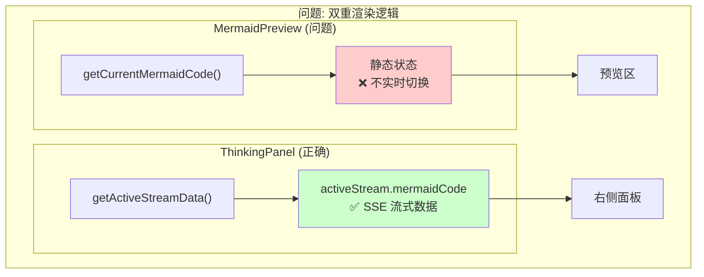
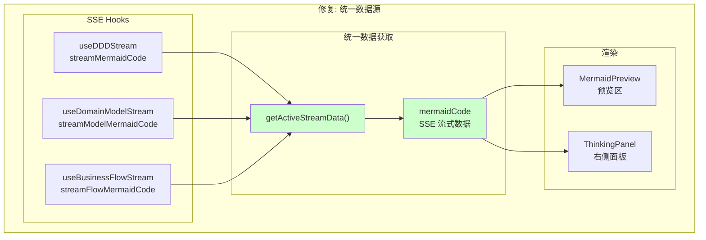
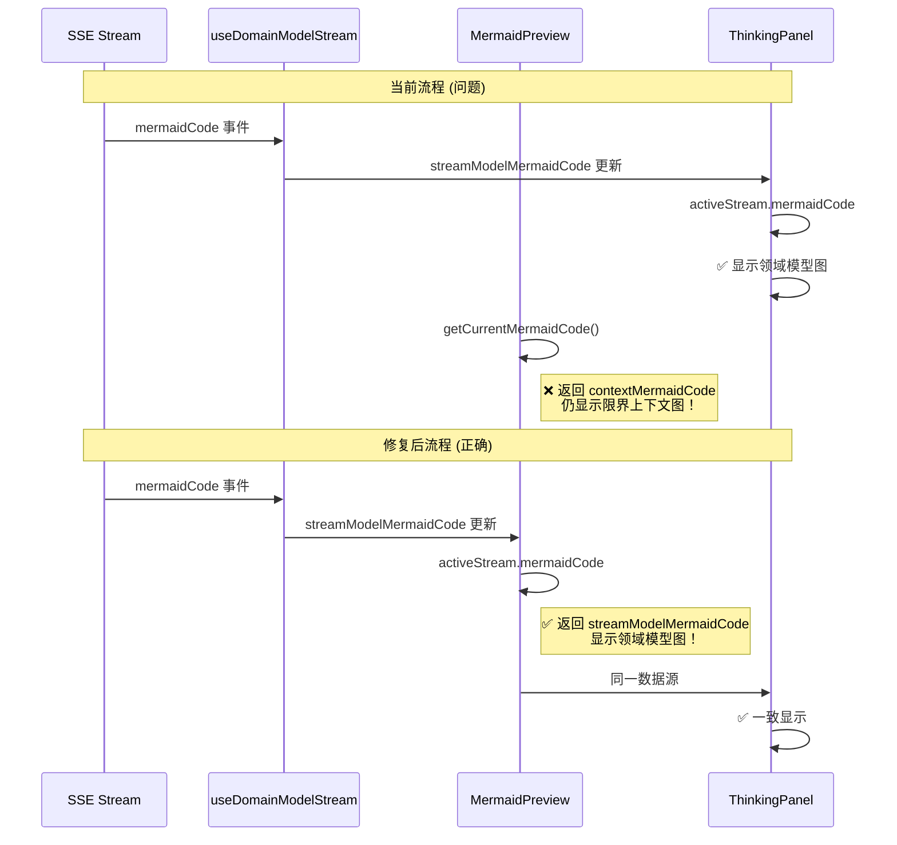
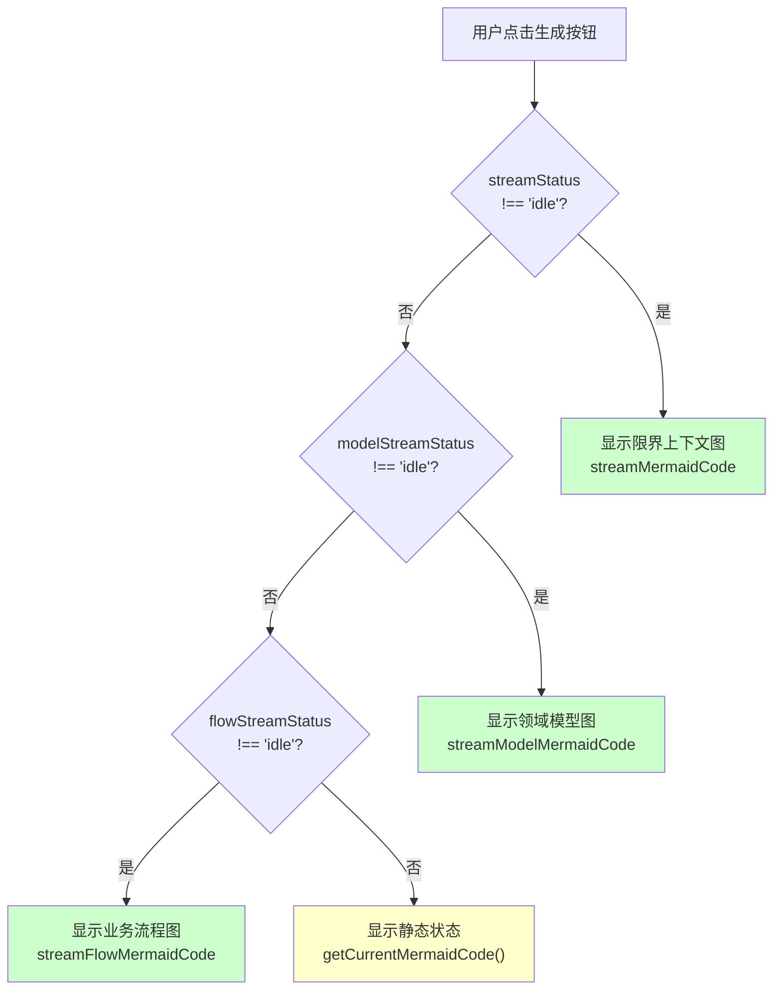

# 架构设计: 领域模型 Mermaid 实时渲染切换

**项目**: vibex-domain-model-mermaid-render
**版本**: 1.0
**日期**: 2026-03-16
**作者**: Architect Agent

---

## 1. Tech Stack (技术栈选型)

### 1.1 核心技术栈

| 组件 | 选型 | 版本 | 理由 |
|------|------|------|------|
| **渲染组件** | MermaidPreview | 现有 | 无需修改组件本身 |
| **状态管理** | SSE Hooks + React State | 现有 | 保持一致性 |
| **数据获取** | getActiveStreamData | 已实现 | 复用现有逻辑 |
| **React 优化** | useCallback/useMemo | 现有 | 性能优化 |

### 1.2 技术选型对比

| 方案 | 优点 | 缺点 | 推荐度 |
|------|------|------|--------|
| **方案 A: 统一使用 activeStream** | 与 ThinkingPanel 逻辑一致、易维护 | 需重构渲染逻辑 | ⭐⭐⭐⭐⭐ |
| 方案 B: 新增 getDisplayMermaidCode | 改动最小 | 需同步两处逻辑 | ⭐⭐⭐⭐ |

**结论**: 采用 **方案 A** - 预览区统一使用 `getActiveStreamData()` 获取 mermaidCode，与 ThinkingPanel 保持一致。

---

## 2. Architecture Diagram (架构图)

### 2.1 问题架构



### 2.2 修复后架构



### 2.3 数据流对比



### 2.4 状态切换流程



---

## 3. API Definitions (接口定义)

### 3.1 ActiveStreamData 接口 (已存在)

```typescript
// src/components/homepage/HomePage.tsx

interface ActiveStreamData {
  thinkingMessages: ThinkingStep[];
  contexts?: BoundedContext[];
  mermaidCode: string;       // ✅ 关键字段
  status: SSEStatus;
  errorMessage: string | null;
  onAbort: () => void;
}
```

### 3.2 getActiveStreamData 函数签名 (已存在)

```typescript
/**
 * 获取当前活跃的 SSE 流数据
 * 优先级: 限界上下文 > 领域模型 > 业务流程
 * 
 * @returns 活跃流数据，如果全部 idle 则返回 null
 */
function getActiveStreamData(): ActiveStreamData | null;
```

### 3.3 预览区显示 MermaidCode 函数

```typescript
/**
 * 获取预览区显示用的 MermaidCode
 * 优先使用 SSE 流式数据，回退到静态状态
 * 
 * @param activeStream - 活跃 SSE 流数据
 * @param staticMermaidCode - 静态状态 MermaidCode
 * @returns 用于显示的 MermaidCode
 */
function getDisplayMermaidCode(
  activeStream: ActiveStreamData | null,
  staticMermaidCode: string
): string;
```

---

## 4. Data Model (数据模型)

### 4.1 SSE 数据源映射

| SSE Hook | 状态字段 | MermaidCode 字段 | 图表类型 |
|----------|----------|-----------------|----------|
| useDDDStream | streamStatus | streamMermaidCode | 限界上下文 |
| useDomainModelStream | modelStreamStatus | streamModelMermaidCode | 领域模型 |
| useBusinessFlowStream | flowStreamStatus | streamFlowMermaidCode | 业务流程 |

### 4.2 状态优先级

```typescript
// 渲染优先级
const RENDER_PRIORITY = {
  streamContext: 1,    // 最高
  streamModel: 2,
  streamFlow: 3,
  staticState: 4,      // 最低（回退）
} as const;
```

### 4.3 currentStep 与 MermaidCode 对应

| currentStep | 静态 MermaidCode 来源 | SSE 状态时显示 |
|-------------|----------------------|----------------|
| 1 | mermaidCode (空) | streamMermaidCode |
| 2 | contextMermaidCode | streamModelMermaidCode |
| 3 | modelMermaidCode | streamFlowMermaidCode |
| 4 | flowMermaidCode | 无 SSE |

---

## 5. Implementation Details (实现细节)

### 5.1 预览区渲染修改

```tsx
// src/components/homepage/HomePage.tsx

export default function HomePage() {
  // ... 现有 hooks ...
  
  const {
    mermaidCode: streamMermaidCode,
    status: streamStatus,
    // ...
  } = useDDDStream();

  const {
    mermaidCode: streamModelMermaidCode,
    status: modelStreamStatus,
    // ...
  } = useDomainModelStream();

  const {
    mermaidCode: streamFlowMermaidCode,
    status: flowStreamStatus,
    // ...
  } = useBusinessFlowStream();

  // ✅ 使用统一的数据获取逻辑
  const activeStream = getActiveStreamData(
    // 限界上下文
    {
      messages: thinkingMessages,
      contexts: streamContexts,
      mermaid: streamMermaidCode,
      status: streamStatus,
      error: streamError,
      abort: abortContexts,
    },
    // 领域模型
    {
      messages: modelThinkingMessages,
      mermaid: streamModelMermaidCode,
      status: modelStreamStatus,
      error: modelStreamError,
      abort: abortModels,
    },
    // 业务流程
    {
      messages: flowThinkingMessages,
      mermaid: streamFlowMermaidCode,
      status: flowStreamStatus,
      error: flowStreamError,
      abort: abortFlow,
    }
  );

  // ✅ 预览区 MermaidCode
  const previewMermaidCode = activeStream?.mermaidCode || getCurrentMermaidCode();

  // ... 其他代码 ...

  return (
    <div className={styles.container}>
      {/* ... 其他内容 ... */}
      
      <div className={styles.previewArea}>
        {/* ✅ 修复: 使用 previewMermaidCode */}
        {previewMermaidCode ? (
          <MermaidPreview
            code={previewMermaidCode}
            diagramType="flowchart"
            layout="TB"
            height="60%"
          />
        ) : (
          <div className={styles.previewEmpty}>
            <div className={styles.previewEmptyIcon}>📊</div>
            <p>输入需求后，这里将实时显示生成的图表</p>
          </div>
        )}
      </div>
      
      {/* ThinkingPanel 使用相同的 activeStream */}
      {activeStream ? (
        <ThinkingPanel
          thinkingMessages={activeStream.thinkingMessages}
          contexts={activeStream.contexts}
          mermaidCode={activeStream.mermaidCode}
          status={activeStream.status}
          errorMessage={activeStream.error}
          onAbort={activeStream.abort}
        />
      ) : (
        <div className={styles.aiHeader}>...</div>
      )}
    </div>
  );
}
```

### 5.2 修改前后对比

```tsx
// ❌ 修改前 (问题)
// 预览区
<MermaidPreview 
  code={getCurrentMermaidCode()}  // 基于 currentStep 的静态状态
  diagramType="flowchart" 
/>

// ThinkingPanel (正确)
const activeStream = getActiveStreamData(...);
<ThinkingPanel
  mermaidCode={activeStream.mermaidCode}  // SSE 流式数据
  ...
/>

// 问题: 预览区不切换，ThinkingPanel 切换正常

// ✅ 修改后 (正确)
// 使用同一个 activeStream
const activeStream = getActiveStreamData(...);

// 预览区
const previewMermaidCode = activeStream?.mermaidCode || getCurrentMermaidCode();
<MermaidPreview 
  code={previewMermaidCode}  // ✅ SSE 流式数据优先
  diagramType="flowchart" 
/>

// ThinkingPanel
<ThinkingPanel
  mermaidCode={activeStream.mermaidCode}  // ✅ 同一数据源
  ...
/>
```

### 5.3 关键修改点

```typescript
// 修改点 1: 预览区使用 activeStream
// 位置: HomePage.tsx 约 361 行

// 修改前
<MermaidPreview code={getCurrentMermaidCode()} ... />

// 修改后
const previewMermaidCode = activeStream?.mermaidCode || getCurrentMermaidCode();
<MermaidPreview code={previewMermaidCode} ... />

// 修改点 2: 确保 activeStream 已计算
// 位置: HomePage.tsx 渲染逻辑前

// 确保 activeStream 在预览区渲染前已计算
const activeStream = useMemo(() => {
  return getActiveStreamData(...);
}, [streamStatus, streamMermaidCode, modelStreamStatus, streamModelMermaidCode, ...]);
```

---

## 6. Testing Strategy (测试策略)

### 6.1 测试框架

| 测试类型 | 框架 | 覆盖率目标 |
|----------|------|-----------|
| 单元测试 | Jest | ≥ 85% |
| E2E 测试 | Playwright | 关键路径 100% |

### 6.2 核心测试用例

#### 6.2.1 E2E 测试

```typescript
// e2e/mermaid-switch.spec.ts

import { test, expect } from '@playwright/test';

test.describe('Mermaid Real-time Switch', () => {
  test('should switch mermaid during domain model generation', async ({ page }) => {
    await page.goto('/');
    
    // Step 1: 限界上下文生成
    await page.fill('[data-testid="requirement-input"]', '电商系统');
    await page.click('button:has-text("开始生成")');
    
    // 等待限界上下文完成
    await page.locator('.step-complete').waitFor({ timeout: 60000 });
    
    // 验证预览区显示限界上下文图
    const previewBefore = page.locator('.mermaid-preview');
    await expect(previewBefore).toBeVisible();
    
    // Step 2: 领域模型生成
    await page.click('button:has-text("生成领域模型")');
    
    // ✅ 关键测试: SSE 过程中预览区应切换
    await expect(page.locator('.mermaid-preview')).toBeVisible();
    
    // 等待领域模型完成
    await page.locator('.step-complete').nth(1).waitFor({ timeout: 60000 });
    
    // Step 3: 业务流程生成
    await page.click('button:has-text("生成业务流程")');
    
    // ✅ 关键测试: SSE 过程中预览区应切换
    await expect(page.locator('.mermaid-preview')).toBeVisible();
  });

  test('preview and thinkingPanel should show same mermaid', async ({ page }) => {
    await page.goto('/');
    
    await page.fill('[data-testid="requirement-input"]', '电商系统');
    await page.click('button:has-text("开始生成")');
    
    // 等待 SSE 开始
    await page.locator('.thinking-panel').waitFor({ timeout: 5000 });
    
    // 预览区和 ThinkingPanel 应显示相同的图表
    const previewMermaid = await page.locator('.preview-area .mermaid').textContent();
    const panelMermaid = await page.locator('.thinking-panel .mermaid').textContent();
    
    expect(previewMermaid).toBe(panelMermaid);
  });
});
```

### 6.3 测试验证清单

```markdown
## 测试验证清单

### 正向测试
- [ ] TC-01: 领域模型生成时预览区从限界上下文切换到领域模型图
- [ ] TC-02: 业务流程生成时预览区从领域模型切换到业务流程图
- [ ] TC-03: 预览区和 ThinkingPanel 显示一致的图表

### 反向测试
- [ ] TC-04: 所有 SSE idle 时显示静态状态图表
- [ ] TC-05: SSE 错误时不影响现有显示

### 回归测试
- [ ] TC-REG-01: 限界上下文生成功能正常
- [ ] TC-REG-02: ThinkingPanel 显示正常
```

---

## 7. Implementation Roadmap (实施路线图)

### Phase 1: 修改预览区逻辑 (0.5h)

| 步骤 | 工时 | 产出物 |
|------|------|--------|
| 1.1 使用 activeStream 获取 mermaidCode | 0.5h | 组件代码修改 |

### Phase 2: 测试验证 (1h)

| 步骤 | 工时 | 内容 |
|------|------|------|
| 2.1 手动测试三个切换场景 | 0.5h | 功能验证 |
| 2.2 E2E 测试 | 0.5h | 自动化测试 |

**总工期**: 1.5h

---

## 8. 风险评估

| 风险 | 等级 | 影响 | 缓解措施 |
|------|------|------|----------|
| 预览闪烁 | 🟢 低 | 视觉效果 | 添加过渡动画 |
| 状态竞争 | 🟢 低 | 显示异常 | 优先级逻辑明确 |
| 回归问题 | 🟡 中 | 功能异常 | 完整测试三个场景 |

---

## 9. Acceptance Criteria (验收标准)

### 9.1 功能验收

- [ ] AC1.1: 领域模型生成时预览区实时切换图表
- [ ] AC1.2: 业务流程生成时预览区实时切换图表
- [ ] AC1.3: SSE 流式过程中预览区实时更新
- [ ] AC2.1: 预览区与 ThinkingPanel 使用相同数据源
- [ ] AC2.2: SSE idle 时回退到静态状态

### 9.2 验证命令

```bash
# 运行测试
npm test -- --testPathPattern="HomePage"

# E2E 测试
npm run test:e2e -- --grep "Mermaid"

# 构建
npm run build
```

---

## 10. Related Components (关联组件)

### 10.1 不受影响的组件

| 组件 | 文件 | 说明 |
|------|------|------|
| /confirm 页面 | confirm/page.tsx | 使用独立的 streamMermaidCode |
| PreviewCanvas | PreviewCanvas.tsx | 使用 props 接收数据 |

### 10.2 需要同步修改

无，本次修改仅涉及 HomePage.tsx 预览区渲染逻辑。

---

## 11. References (参考文档)

| 文档 | 路径 |
|------|------|
| 需求分析 | `/root/.openclaw/vibex/docs/vibex-domain-model-mermaid-render/analysis.md` |
| PRD | `/root/.openclaw/vibex/docs/prd/vibex-domain-model-mermaid-render-prd.md` |

---

**产出物**: `/root/.openclaw/vibex/docs/vibex-domain-model-mermaid-render/architecture.md`
**作者**: Architect Agent
**日期**: 2026-03-16