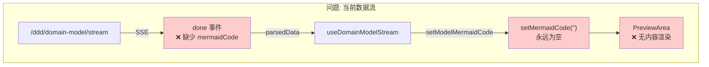
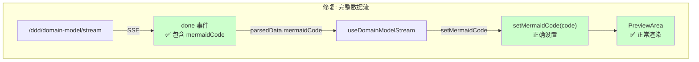
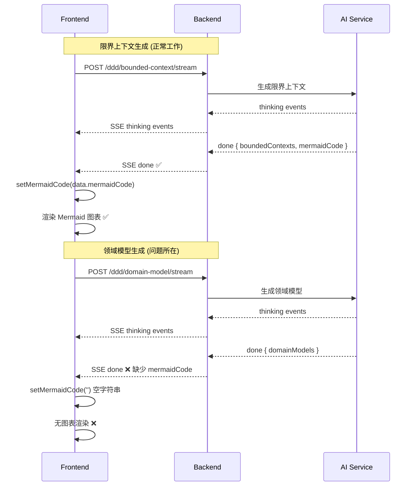
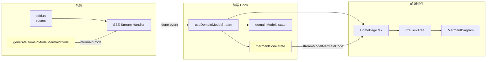
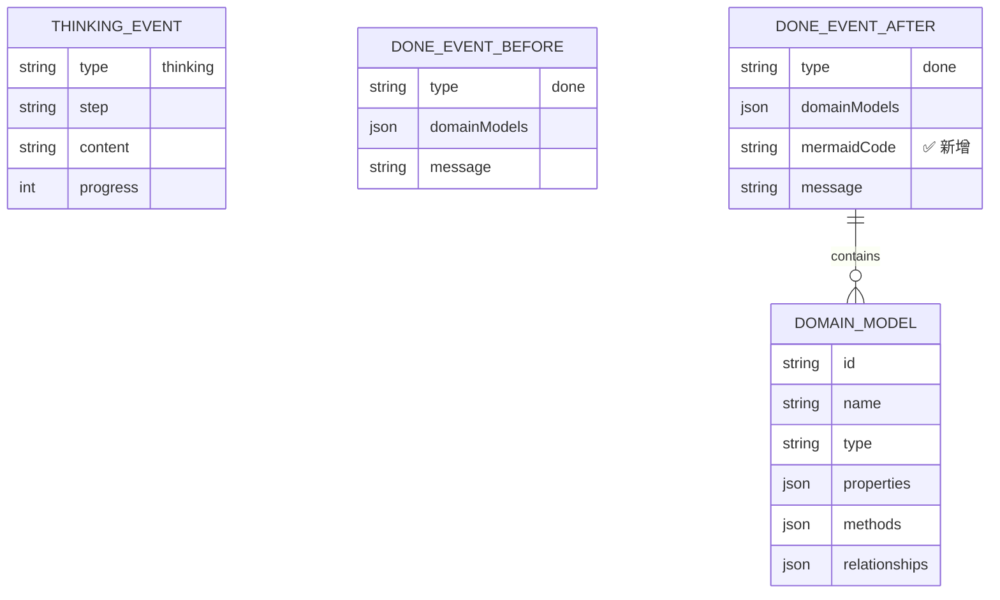

# 架构设计: 领域模型页面不渲染修复

**项目**: vibex-domain-model-not-rendering  
**版本**: v1.0  
**日期**: 2026-03-16  
**作者**: Architect Agent

---

## 1. Tech Stack (技术栈选型)

### 1.1 核心技术栈

| 组件 | 选型 | 版本 | 理由 |
|------|------|------|------|
| **SSE 流式传输** | EventSource API | 原生 | 后端已有实现 |
| **Mermaid 渲染** | mermaid.js | 现有版本 | 已集成 |
| **状态管理** | Zustand | 现有 | 保持一致性 |
| **React Hooks** | 自定义 Hook | 现有 | 扩展现有 Hook |

### 1.2 技术选型对比

| 方案 | 优点 | 缺点 | 推荐度 |
|------|------|------|--------|
| **方案 A: 仅后端修改** | 最小改动，风险低 | 前端需确认返回结构 | ⭐⭐⭐⭐⭐ |
| 方案 B: 拆分 Hook | 完全隔离 | 大规模重构 | ⭐⭐ |
| 方案 C: 新增状态管理 | 独立状态 | 增加复杂度 | ⭐⭐⭐ |

**结论**: 采用 **方案 A - 最小化修改**，仅修改后端返回和前端状态同步。

---

## 2. Architecture Diagram (架构图)

### 2.1 问题根因数据流



### 2.2 修复后数据流



### 2.3 SSE 事件流对比



### 2.4 模块依赖关系



---

## 3. API Definitions (接口定义)

### 3.1 后端 SSE Done 事件 (修复后)

```typescript
// vibex-backend/src/routes/ddd.ts

// 修复前
interface DomainModelDoneEvent {
  domainModels: DomainModel[];
  message: string;
}

// 修复后
interface DomainModelDoneEvent {
  domainModels: DomainModel[];
  mermaidCode: string;  // ✅ 新增
  message: string;
}
```

### 3.2 前端 Hook 返回类型 (修复后)

```typescript
// vibex-fronted/src/hooks/useDDDStream.ts

// 修复前
interface UseDomainModelStreamReturn {
  thinkingMessages: ThinkingStep[];
  domainModels: DomainModel[];
  status: DomainModelStreamStatus;
  errorMessage: string | null;
  generateDomainModels: (requirementText: string, boundedContexts?: BoundedContext[]) => void;
  abort: () => void;
  reset: () => void;
}

// 修复后
interface UseDomainModelStreamReturn {
  thinkingMessages: ThinkingStep[];
  domainModels: DomainModel[];
  mermaidCode: string;  // ✅ 新增
  status: DomainModelStreamStatus;
  errorMessage: string | null;
  generateDomainModels: (requirementText: string, boundedContexts?: BoundedContext[]) => void;
  abort: () => void;
  reset: () => void;
}
```

### 3.3 Mermaid 生成函数签名

```typescript
// vibex-backend/src/routes/ddd.ts

/**
 * 生成领域模型 Mermaid 代码
 * @param domainModels 领域模型数组
 * @param boundedContexts 限界上下文数组
 * @returns Mermaid 代码字符串
 */
function generateDomainModelMermaidCode(
  domainModels: DomainModel[],
  boundedContexts: BoundedContext[]
): string;
```

---

## 4. Data Model (数据模型)

### 4.1 SSE 事件数据结构



### 4.2 前端状态模型

```typescript
// 前端状态
interface DomainModelStreamState {
  // 思考过程
  thinkingMessages: ThinkingStep[];
  
  // 模型数据
  domainModels: DomainModel[];
  mermaidCode: string;  // ✅ 关键状态
  
  // 流状态
  status: 'idle' | 'streaming' | 'done' | 'error';
  errorMessage: string | null;
}
```

---

## 5. Implementation Details (实现细节)

### 5.1 后端修改 (vibex-backend/src/routes/ddd.ts)

**位置**: 第 567-573 行

```typescript
// ❌ 修复前
send('done', { 
  domainModels,
  message: '领域模型生成完成'
})

// ✅ 修复后
send('done', { 
  domainModels,
  mermaidCode: generateDomainModelMermaidCode(domainModels, (boundedContexts || []).map(c => ({
    ...c,
    relationships: [],
    description: c.description || ''
  }))),
  message: '领域模型生成完成'
})
```

### 5.2 前端 Hook 修改 (vibex-fronted/src/hooks/useDDDStream.ts)

**修改点 1**: 添加 mermaidCode 状态 (约第 453-464 行附近)

```typescript
// ✅ 确认已有 mermaidCode 状态
const [mermaidCode, setMermaidCode] = useState('')
```

**修改点 2**: done 事件提取 mermaidCode (约第 544 行附近)

```typescript
// ❌ 修复前
case 'done':
  const models = Array.isArray(parsedData.domainModels) 
    ? parsedData.domainModels 
    : []
  setDomainModels(models)
  setStatus('done')
  break

// ✅ 修复后
case 'done':
  const models = Array.isArray(parsedData.domainModels) 
    ? parsedData.domainModels 
    : []
  setDomainModels(models)
  setMermaidCode(parsedData.mermaidCode || '')  // ✅ 添加
  setStatus('done')
  break
```

**修改点 3**: 返回对象添加 mermaidCode (约第 577-585 行)

```typescript
// ❌ 修复前
return {
  thinkingMessages,
  domainModels,
  status,
  errorMessage,
  generateDomainModels,
  abort,
  reset,
}

// ✅ 修复后
return {
  thinkingMessages,
  domainModels,
  mermaidCode,  // ✅ 添加
  status,
  errorMessage,
  generateDomainModels,
  abort,
  reset,
}
```

**修改点 4**: reset 函数清空 mermaidCode

```typescript
const reset = useCallback(() => {
  setThinkingMessages([])
  setDomainModels([])
  setMermaidCode('')  // ✅ 确认添加
  setStatus('idle')
  setErrorMessage(null)
}, [])
```

### 5.3 前端组件修改 (vibex-fronted/src/components/homepage/HomePage.tsx)

**修改点 1**: 解构添加 mermaidCode (约第 112 行)

```typescript
// ❌ 修复前
const {
  thinkingMessages: modelThinkingMessages, 
  domainModels: streamDomainModels,
  status: modelStreamStatus, 
  errorMessage: modelStreamError, 
  generateDomainModels, 
  abort: abortModels,
} = useDomainModelStream();

// ✅ 修复后
const {
  thinkingMessages: modelThinkingMessages, 
  domainModels: streamDomainModels,
  mermaidCode: streamModelMermaidCode,  // ✅ 添加
  status: modelStreamStatus, 
  errorMessage: modelStreamError, 
  generateDomainModels, 
  abort: abortModels,
} = useDomainModelStream();
```

**修改点 2**: useEffect 使用 streamModelMermaidCode (约第 142-149 行)

```typescript
// ❌ 修复前
useEffect(() => {
  if (modelStreamStatus === 'done' && streamDomainModels.length > 0) {
    setDomainModels(streamDomainModels as DomainModel[]);
    setModelMermaidCode(''); // TODO: Generate mermaid code
    setCurrentStep(3);
    setCompletedStep(3);
  }
}, [modelStreamStatus, streamDomainModels]);

// ✅ 修复后
useEffect(() => {
  if (modelStreamStatus === 'done' && streamDomainModels.length > 0) {
    setDomainModels(streamDomainModels as DomainModel[]);
    setModelMermaidCode(streamModelMermaidCode);  // ✅ 修改
    setCurrentStep(3);
    setCompletedStep(3);
  }
}, [modelStreamStatus, streamDomainModels, streamModelMermaidCode]);  // ✅ 添加依赖
```

---

## 6. Testing Strategy (测试策略)

### 6.1 测试框架

| 测试类型 | 框架 | 覆盖率目标 |
|----------|------|-----------|
| 单元测试 | Jest | ≥ 80% |
| 集成测试 | Jest + MSW | ≥ 70% |
| E2E 测试 | Playwright | 关键路径 |

### 6.2 核心测试用例

#### 6.2.1 后端 SSE 端点测试

```typescript
// __tests__/routes/ddd.test.ts

describe('POST /ddd/domain-model/stream', () => {
  it('should return mermaidCode in done event', async () => {
    const response = await request(app)
      .post('/ddd/domain-model/stream')
      .send({ requirementText: '测试需求', boundedContexts: [] })
      .expect(200);

    // 解析 SSE 事件
    const events = parseSSEEvents(response.text);
    const doneEvent = events.find(e => e.type === 'done');

    expect(doneEvent).toBeDefined();
    expect(doneEvent.data).toHaveProperty('mermaidCode');
    expect(doneEvent.data.mermaidCode).toContain('graph TD');
  });

  it('should handle empty boundedContexts', async () => {
    const response = await request(app)
      .post('/ddd/domain-model/stream')
      .send({ requirementText: '测试', boundedContexts: null })
      .expect(200);

    const events = parseSSEEvents(response.text);
    const doneEvent = events.find(e => e.type === 'done');

    expect(doneEvent.data.mermaidCode).toBeDefined();
  });
});
```

#### 6.2.2 前端 Hook 测试

```typescript
// __tests__/hooks/useDomainModelStream.test.ts

import { renderHook, act } from '@testing-library/react';
import { useDomainModelStream } from '@/hooks/useDDDStream';

describe('useDomainModelStream', () => {
  it('should return mermaidCode from done event', async () => {
    const { result } = renderHook(() => useDomainModelStream());

    // 模拟 SSE 事件
    await act(async () => {
      // 触发生成
      result.current.generateDomainModels('测试需求', []);
      
      // 等待 done 事件
      await waitFor(() => {
        expect(result.current.status).toBe('done');
      });
    });

    expect(result.current.mermaidCode).toBeTruthy();
    expect(result.current.mermaidCode).toContain('graph');
  });

  it('should reset mermaidCode when reset called', async () => {
    const { result } = renderHook(() => useDomainModelStream());

    // 先获取数据
    await act(async () => {
      result.current.generateDomainModels('测试', []);
      await waitFor(() => expect(result.current.status).toBe('done'));
    });

    expect(result.current.mermaidCode).toBeTruthy();

    // 重置
    act(() => {
      result.current.reset();
    });

    expect(result.current.mermaidCode).toBe('');
  });
});
```

#### 6.2.3 组件集成测试

```typescript
// __tests__/components/HomePage.domainModel.test.tsx

import { render, screen, waitFor } from '@testing-library/react';
import userEvent from '@testing-library/user-event';
import HomePage from '@/components/homepage/HomePage';

describe('HomePage - Domain Model Rendering', () => {
  it('should render domain model diagram after generation', async () => {
    const user = userEvent.setup();
    render(<HomePage />);

    // 输入需求
    await user.type(screen.getByPlaceholderText(/输入需求/), '电商系统');
    
    // 点击生成限界上下文
    await user.click(screen.getByText(/开始生成/));
    
    // 等待限界上下文完成
    await waitFor(() => {
      expect(screen.getByText(/生成领域模型/)).toBeEnabled();
    });

    // 点击生成领域模型
    await user.click(screen.getByText(/生成领域模型/));

    // 验证图表渲染
    await waitFor(() => {
      const mermaidContainer = screen.getByTestId('mermaid-diagram');
      expect(mermaidContainer).toBeInTheDocument();
    });
  });

  it('should not affect bounded context generation', async () => {
    const user = userEvent.setup();
    render(<HomePage />);

    await user.type(screen.getByPlaceholderText(/输入需求/), '测试系统');
    await user.click(screen.getByText(/开始生成/));

    // 验证限界上下文进度条显示
    await waitFor(() => {
      expect(screen.getByText(/AI 分析/)).toBeInTheDocument();
    });

    // 验证限界上下文图表渲染
    await waitFor(() => {
      expect(screen.getByTestId('mermaid-diagram')).toBeInTheDocument();
    });
  });
});
```

### 6.3 测试验证清单

```markdown
## 测试验证清单

### 正向测试 (≥2 案例)
- [ ] TC-01: 正常需求 → 领域模型生成 → mermaidCode 有值 → 图表渲染
- [ ] TC-02: 复杂需求 → 多实体领域模型 → 完整 mermaid 代码

### 反向测试 (≥2 案例)
- [ ] TC-03: boundedContexts 为 null → 不崩溃 → 返回空字符串或默认图
- [ ] TC-04: domainModels 为空数组 → mermaidCode 为空 → 不崩溃

### 边界测试 (≥1 案例)
- [ ] TC-05: 超大领域模型 (50+ 实体) → mermaid 生成成功 → 渲染正常

### 回归测试
- [ ] TC-REG-01: 限界上下文生成进度条正常
- [ ] TC-REG-02: 业务流程生成不受影响
- [ ] TC-REG-03: 领域模型生成进度条正常
```

---

## 7. Implementation Roadmap (实施路线图)

### Phase 1: 后端修改 (0.25 天)

| 步骤 | 工时 | 产出物 |
|------|------|--------|
| 1.1 修改 ddd.ts done 事件 | 0.5h | 后端代码 |
| 1.2 后端测试 | 1h | 测试用例 |

### Phase 2: 前端 Hook 修改 (0.25 天)

| 步骤 | 工时 | 产出物 |
|------|------|--------|
| 2.1 修改返回对象和类型 | 0.5h | Hook 代码 |
| 2.2 Hook 测试 | 1h | 测试用例 |

### Phase 3: 前端组件修改 (0.25 天)

| 步骤 | 工时 | 产出物 |
|------|------|--------|
| 3.1 修改 HomePage.tsx | 0.5h | 组件代码 |
| 3.2 集成测试 | 1h | E2E 测试 |

### Phase 4: 验证部署 (0.25 天)

| 步骤 | 工时 | 内容 |
|------|------|------|
| 4.1 回归测试 | 1h | 全流程测试 |
| 4.2 部署验证 | 1h | Cloudflare 部署 |

**总工期**: 1 天

---

## 8. 风险评估

| 风险 | 等级 | 缓解措施 |
|------|------|----------|
| 修改影响限界上下文生成 | 🟡 中 | 分步测试，每次修改验证 |
| mermaidCode 生成异常 | 🟢 低 | try-catch + 空字符串 fallback |
| boundedContexts 为 undefined | 🟢 低 | 使用空数组默认值 |
| 前端类型不匹配 | 🟢 低 | TypeScript 编译时检查 |

---

## 9. Acceptance Criteria (验收标准)

### 9.1 功能验收

| # | 验收条件 | 验证方法 |
|---|---------|---------|
| 1 | 领域模型生成后显示 Mermaid 图表 | 手动测试 |
| 2 | 限界上下文生成进度条正常显示 | 手动测试 |
| 3 | 业务流程生成不受影响 | 手动测试 |
| 4 | 领域模型生成进度条正常 | 手动测试 |
| 5 | 单元测试全部通过 | `npm test` |
| 6 | TypeScript 编译无错误 | `npm run build` |

### 9.2 代码验收

- [ ] 后端 done 事件包含 `mermaidCode` 字段
- [ ] 前端 Hook 返回对象包含 `mermaidCode`
- [ ] 前端组件使用 `streamModelMermaidCode`
- [ ] 无硬编码空字符串 `setModelMermaidCode('')`

### 9.3 验证命令

```bash
# 运行测试
npm test

# 构建
npm run build

# E2E 测试
npm run test:e2e
```

---

## 10. References (参考文档)

| 文档 | 路径 |
|------|------|
| 分析报告 v3 | `/root/.openclaw/vibex/docs/vibex-domain-model-render-fix-v3/analysis.md` |
| 分析报告 v4 | `/root/.openclaw/vibex/docs/vibex-domain-model-render-fix-v4/analysis.md` |
| Mermaid 修复分析 | `/root/.openclaw/vibex/docs/vibex-domain-model-mermaid-fix/analysis.md` |
| 项目约束 | `/root/.openclaw/workspace-coord/projects/vibex-domain-model-crash-fix-constraints.md` |

---

**产出物**: `/root/.openclaw/vibex/docs/vibex-domain-model-not-rendering/architecture.md`  
**作者**: Architect Agent  
**日期**: 2026-03-16