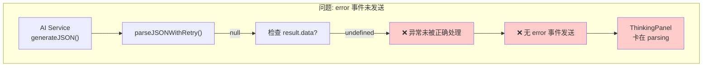
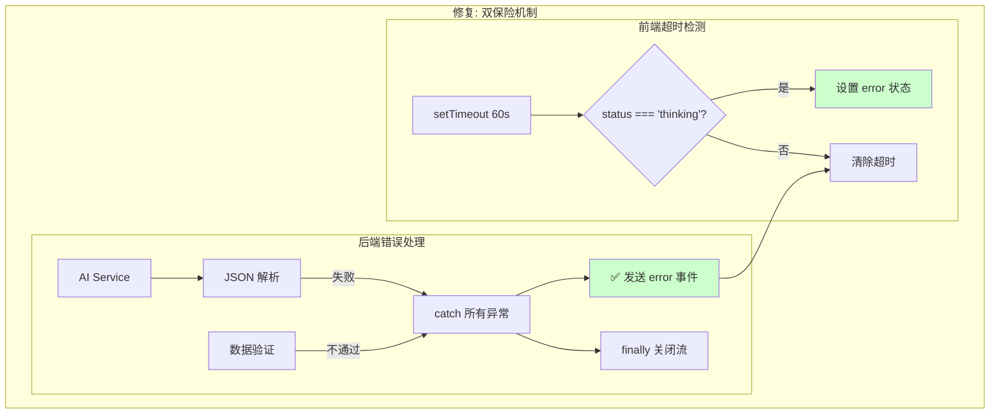
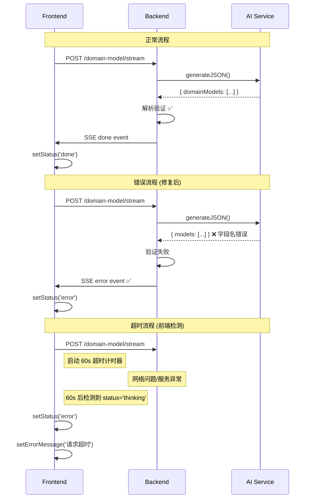
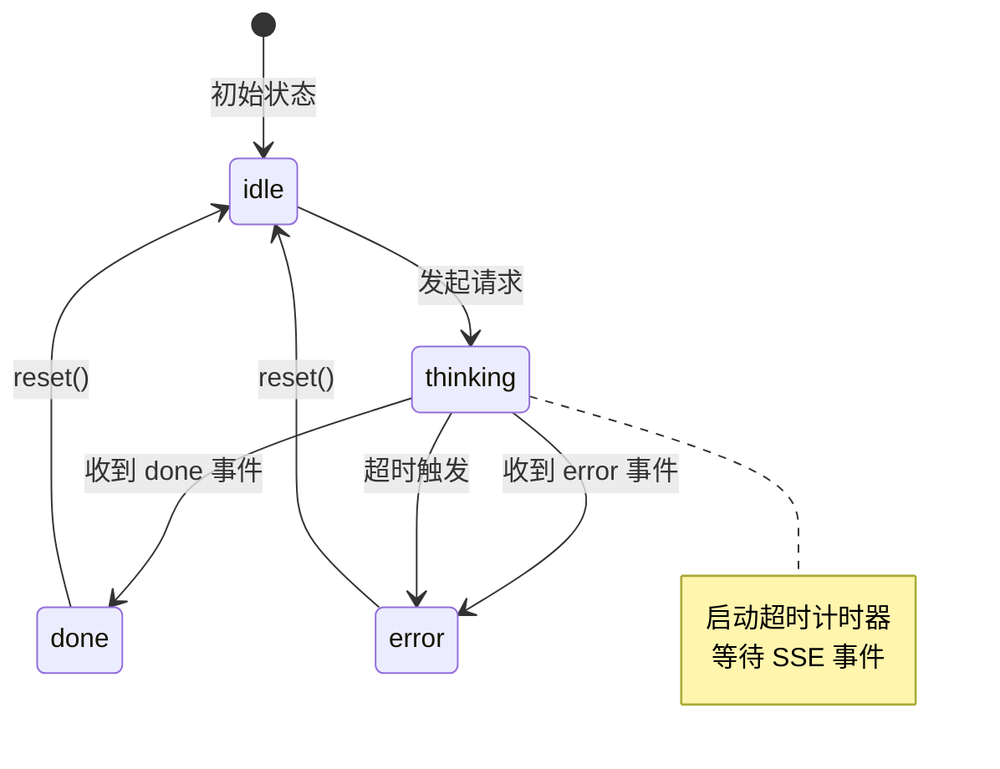

# 架构设计: 领域模型 Parsing 卡顿问题修复

**项目**: vibex-domain-model-parsing-stuck
**版本**: 1.0
**日期**: 2026-03-16
**作者**: Architect Agent

---

## 1. Tech Stack (技术栈选型)

### 1.1 核心技术栈

| 组件 | 选型 | 版本 | 理由 |
|------|------|------|------|
| **后端框架** | Hono | 现有 | Cloudflare Workers |
| **SSE 流** | EventSource | 原生 | 前端已实现 |
| **AI Service** | 自研 | 现有 | 需增强错误处理 |
| **状态管理** | Zustand | 现有 | 前端状态 |

### 1.2 技术选型对比

| 方案 | 优点 | 缺点 | 推荐 |
|------|------|------|------|
| **A: 后端错误处理增强** | 根治问题 | 需要修改多处 | ⭐⭐⭐⭐⭐ |
| B: 仅前端超时检测 | 快速实现 | 治标不治本 | ⭐⭐⭐ |
| C: 两方案结合 | 最完整 | 工作量增加 | ⭐⭐⭐⭐ |

**结论**: 采用 **方案 A + B 结合** - 后端增强错误处理 + 前端超时检测双保险。

---

## 2. Architecture Diagram (架构图)

### 2.1 问题架构



### 2.2 修复后架构



### 2.3 SSE 错误处理流程



---

## 3. API Definitions (接口定义)

### 3.1 SSE Error Event 格式

```typescript
// 后端发送的 error 事件格式
interface SSEErrorEvent {
  type: 'error';
  message: string;       // 用户友好的错误信息
  code?: string;         // 错误码 (可选)
  details?: string;      // 详细错误信息 (可选，用于调试)
}

// 示例
send('error', {
  message: 'AI 返回的领域模型格式不正确',
  code: 'INVALID_RESPONSE_FORMAT',
  details: 'Expected domainModels array, got object'
});
```

### 3.2 后端错误码定义

```typescript
enum DomainModelErrorCode {
  AI_REQUEST_FAILED = 'AI_REQUEST_FAILED',
  INVALID_RESPONSE_FORMAT = 'INVALID_RESPONSE_FORMAT',
  JSON_PARSE_FAILED = 'JSON_PARSE_FAILED',
  EMPTY_RESPONSE = 'EMPTY_RESPONSE',
  TIMEOUT = 'TIMEOUT',
  UNKNOWN_ERROR = 'UNKNOWN_ERROR',
}
```

### 3.3 前端状态接口

```typescript
// useDDDStream hook 返回的状态
interface DomainModelStreamState {
  status: 'idle' | 'thinking' | 'done' | 'error';
  errorMessage: string | null;
  // ... 其他字段
}

// 超时配置
interface TimeoutConfig {
  domainModel: number;  // 领域模型生成超时时间 (ms)
  boundedContext: number;  // 限界上下文生成超时时间 (ms)
  businessFlow: number;  // 业务流程生成超时时间 (ms)
}

const DEFAULT_TIMEOUT_CONFIG: TimeoutConfig = {
  domainModel: 60000,  // 60 秒
  boundedContext: 60000,
  businessFlow: 60000,
};
```

---

## 4. Data Model (数据模型)

### 4.1 错误处理状态机



### 4.2 后端错误处理流程

```typescript
// 错误处理决策树
interface ErrorResponse {
  shouldSendError: boolean;
  message: string;
  code: DomainModelErrorCode;
}

function handleError(error: unknown, context: string): ErrorResponse {
  // 1. JSON 解析错误
  if (error instanceof SyntaxError) {
    return {
      shouldSendError: true,
      message: 'AI 响应格式错误，请重试',
      code: DomainModelErrorCode.JSON_PARSE_FAILED,
    };
  }
  
  // 2. AI 服务错误
  if (error instanceof AIError) {
    return {
      shouldSendError: true,
      message: `AI 请求失败: ${error.message}`,
      code: DomainModelErrorCode.AI_REQUEST_FAILED,
    };
  }
  
  // 3. 未知错误
  return {
    shouldSendError: true,
    message: '处理过程中发生未知错误',
    code: DomainModelErrorCode.UNKNOWN_ERROR,
  };
}
```

---

## 5. Implementation Details (实现细节)

### 5.1 后端错误处理增强 (ddd.ts)

```typescript
// vibex-backend/src/routes/ddd.ts

ddd.post('/domain-model/stream', async (c) => {
  const { readable, writable } = new TransformStream();
  const writer = writable.getWriter();
  const encoder = new TextEncoder();
  
  const send = async (type: string, data: unknown) => {
    await writer.write(encoder.encode(`data: ${JSON.stringify({ type, ...data })}\n\n`));
  };

  // 超时控制
  const timeoutId = setTimeout(async () => {
    await send('error', {
      message: '请求超时，请重试',
      code: 'TIMEOUT',
    });
    await writer.close();
  }, 90000); // 90 秒后端超时

  try {
    // Step 3: 调用 AI
    await send('thinking', { step: 'calling-ai', message: '正在调用 AI 生成领域模型...' });

    const result = await aiService.generateJSON<DomainModelResponse>(prompt, schema, options);

    // ✅ 增强错误检查
    if (!result.success) {
      clearTimeout(timeoutId);
      await send('error', {
        message: `AI 请求失败: ${result.error}`,
        code: 'AI_REQUEST_FAILED',
      });
      return;
    }

    if (!result.data) {
      clearTimeout(timeoutId);
      await send('error', {
        message: 'AI 返回数据为空',
        code: 'EMPTY_RESPONSE',
      });
      return;
    }

    // Step 4: 解析结果
    await send('thinking', { step: 'parsing', message: '正在解析结果...' });

    // ✅ 验证数据格式
    if (!Array.isArray(result.data.domainModels)) {
      clearTimeout(timeoutId);
      await send('error', {
        message: 'AI 返回的领域模型格式不正确',
        code: 'INVALID_RESPONSE_FORMAT',
        details: `Expected domainModels array, got ${typeof result.data.domainModels}`,
      });
      return;
    }

    // ... 正常处理 ...
    clearTimeout(timeoutId);
    await send('done', { domainModels, mermaidCode, message: '领域模型生成完成' });

  } catch (error) {
    clearTimeout(timeoutId);
    
    // ✅ 确保所有异常都发送 error 事件
    console.error('[Domain Model Stream] Error:', error);
    
    const errorMessage = error instanceof Error ? error.message : 'Unknown error';
    await send('error', {
      message: `处理异常: ${errorMessage}`,
      code: 'UNKNOWN_ERROR',
    });
  } finally {
    // ✅ 确保总是关闭 writer
    try {
      await writer.close();
    } catch (e) {
      // Ignore close errors
    }
  }

  return new Response(readable, {
    headers: {
      'Content-Type': 'text/event-stream',
      'Cache-Control': 'no-cache',
      'Connection': 'keep-alive',
    },
  });
});
```

### 5.2 AI Service 错误处理 (ai-service.ts)

```typescript
// vibex-backend/src/services/ai-service.ts

async generateJSON<T>(
  prompt: string,
  schema?: object,
  options?: GenerateOptions
): Promise<AIResult<T>> {
  try {
    const response = await this.executeWithFallback(prompt, options);

    if (!response?.content) {
      return {
        success: false,
        error: 'Empty response from AI',
        data: null as T,
      };
    }

    const result = this.parseJSONWithRetry<T>(response.content);

    if (!result) {
      // ✅ 记录详细日志
      console.error('[AI Service] Failed to parse JSON. Raw response:', {
        length: response.content?.length,
        preview: response.content?.substring(0, 500),
      });

      return {
        success: false,
        error: 'Failed to parse JSON response',
        data: null as T,
      };
    }

    return {
      success: true,
      data: result,
      error: null,
    };
  } catch (error) {
    console.error('[AI Service] Unexpected error:', error);
    
    return {
      success: false,
      error: error instanceof Error ? error.message : 'Unknown error',
      data: null as T,
    };
  }
}
```

### 5.3 前端超时检测 (useDDDStream.ts)

```typescript
// vibex-fronted/src/hooks/useDDDStream.ts

export function useDomainModelStream() {
  const [status, setStatus] = useState<SSEStatus>('idle');
  const [errorMessage, setErrorMessage] = useState<string | null>(null);
  const timeoutRef = useRef<NodeJS.Timeout | null>(null);

  const clearTimeoutIfExists = useCallback(() => {
    if (timeoutRef.current) {
      clearTimeout(timeoutRef.current);
      timeoutRef.current = null;
    }
  }, []);

  const generateDomainModels = useCallback(async (
    requirementText: string,
    boundedContexts?: BoundedContext[]
  ) => {
    // 清理之前的状态
    clearTimeoutIfExists();
    setStatus('thinking');
    setErrorMessage(null);

    // ✅ 启动超时检测
    timeoutRef.current = setTimeout(() => {
      if (status === 'thinking') {
        setStatus('error');
        setErrorMessage('请求超时，请检查网络连接后重试');
        clearTimeoutIfExists();
      }
    }, 60000); // 60 秒超时

    try {
      await fetchSSE('/api/ddd/domain-model/stream', {
        onMessage: (event) => {
          // ... 处理 SSE 事件 ...
        },
        onError: (error) => {
          clearTimeoutIfExists();
          setStatus('error');
          setErrorMessage(error.message || '请求失败');
        },
        onClose: () => {
          clearTimeoutIfExists();
        },
      });
    } catch (error) {
      clearTimeoutIfExists();
      setStatus('error');
      setErrorMessage(error instanceof Error ? error.message : 'Unknown error');
    }
  }, [status, clearTimeoutIfExists]);

  // 清理 effect
  useEffect(() => {
    return () => {
      clearTimeoutIfExists();
    };
  }, [clearTimeoutIfExists]);

  return {
    status,
    errorMessage,
    generateDomainModels,
    // ...
  };
}
```

### 5.4 ThinkingPanel 错误显示

```tsx
// vibex-fronted/src/components/ui/ThinkingPanel.tsx

export function ThinkingPanel({ status, errorMessage, onRetry, ... }: Props) {
  return (
    <div className={styles.thinkingPanel}>
      {/* 进度条 */}
      <ProgressBar 
        percent={status === 'done' ? 100 : status === 'error' ? 0 : undefined}
      />

      {/* 错误状态 */}
      {status === 'error' && (
        <div className={styles.errorState}>
          <div className={styles.errorIcon}>⚠️</div>
          <div className={styles.errorMessage}>
            {errorMessage || '生成过程中发生错误'}
          </div>
          {onRetry && (
            <button className={styles.retryButton} onClick={onRetry}>
              重试
            </button>
          )}
        </div>
      )}

      {/* 正常状态 */}
      {status !== 'error' && (
        <ThinkingSteps steps={thinkingMessages} />
      )}
    </div>
  );
}
```

---

## 6. Testing Strategy (测试策略)

### 6.1 测试框架

| 测试类型 | 框架 | 覆盖率目标 |
|----------|------|-----------|
| 单元测试 | Jest | ≥ 85% |
| E2E 测试 | Playwright | 错误场景 100% |

### 6.2 核心测试用例

#### 6.2.1 后端错误处理测试

```typescript
// __tests__/routes/ddd-error.test.ts

describe('Domain Model Stream Error Handling', () => {
  it('should send error event when AI returns invalid format', async () => {
    // Mock AI 返回错误格式
    mockAIService.generateJSON.mockResolvedValue({
      success: true,
      data: { models: [] }, // 错误：应该是 domainModels
    });

    const response = await request(app)
      .post('/api/ddd/domain-model/stream')
      .send({ requirementText: 'test' });

    const events = parseSSEEvents(response.text);
    const errorEvent = events.find(e => e.type === 'error');

    expect(errorEvent).toBeDefined();
    expect(errorEvent.message).toContain('格式不正确');
  });

  it('should send error event when JSON parse fails', async () => {
    mockAIService.generateJSON.mockResolvedValue({
      success: false,
      error: 'Failed to parse JSON',
    });

    const response = await request(app)
      .post('/api/ddd/domain-model/stream')
      .send({ requirementText: 'test' });

    const events = parseSSEEvents(response.text);
    const errorEvent = events.find(e => e.type === 'error');

    expect(errorEvent).toBeDefined();
  });

  it('should always close writer in finally', async () => {
    mockAIService.generateJSON.mockRejectedValue(new Error('Network error'));

    const response = await request(app)
      .post('/api/ddd/domain-model/stream')
      .send({ requirementText: 'test' });

    // 验证响应正常结束
    expect(response.status).toBe(200);
  });
});
```

#### 6.2.2 前端超时测试

```typescript
// __tests__/hooks/useDomainModelStream-timeout.test.ts

describe('Domain Model Stream Timeout', () => {
  beforeEach(() => {
    jest.useFakeTimers();
  });

  afterEach(() => {
    jest.useRealTimers();
  });

  it('should set error status after 60s timeout', async () => {
    const { result } = renderHook(() => useDomainModelStream());

    // 触发生成
    act(() => {
      result.current.generateDomainModels('test requirement');
    });

    expect(result.current.status).toBe('thinking');

    // 快进 60 秒
    act(() => {
      jest.advanceTimersByTime(60000);
    });

    expect(result.current.status).toBe('error');
    expect(result.current.errorMessage).toContain('超时');
  });

  it('should clear timeout on done event', async () => {
    const { result } = renderHook(() => useDomainModelStream());

    act(() => {
      result.current.generateDomainModels('test');
    });

    // 模拟 done 事件
    act(() => {
      // 触发 SSE done 回调
      mockSSECallback({ type: 'done', domainModels: [] });
    });

    // 快进 60 秒，不应该超时
    act(() => {
      jest.advanceTimersByTime(60000);
    });

    expect(result.current.status).toBe('done');
    expect(result.current.errorMessage).toBeNull();
  });
});
```

---

## 7. Implementation Roadmap (实施路线图)

### Phase 1: 后端错误处理 (1h)

| 步骤 | 工时 | 产出物 |
|------|------|--------|
| 1.1 增强 ddd.ts 错误检查 | 0.5h | ddd.ts |
| 1.2 增强 ai-service.ts 返回 | 0.5h | ai-service.ts |

### Phase 2: 前端超时检测 (0.5h)

| 步骤 | 工时 | 产出物 |
|------|------|--------|
| 2.1 添加 setTimeout | 0.25h | useDDDStream.ts |
| 2.2 清理和重试逻辑 | 0.25h | 组件代码 |

### Phase 3: 测试验证 (1h)

| 步骤 | 工时 | 内容 |
|------|------|------|
| 3.1 后端单元测试 | 0.5h | Jest 测试 |
| 3.2 前端测试 | 0.5h | Hook 测试 |

**总工期**: 2.5h

---

## 8. 风险评估

| 风险 | 等级 | 影响 | 缓解措施 |
|------|------|------|----------|
| 修改影响其他 SSE 端点 | 🟢 低 | 功能异常 | 统一错误处理模式 |
| 超时时间设置不合理 | 🟢 低 | 用户体验 | 可配置化 |
| finally 中 close 异常 | 🟢 低 | 资源泄漏 | try-catch 包裹 |

---

## 9. Acceptance Criteria (验收标准)

### 9.1 后端验收

- [ ] AC1.1: AI 返回格式错误时发送 error 事件
- [ ] AC1.2: JSON 解析失败时发送 error 事件
- [ ] AC1.3: 空响应时发送 error 事件
- [ ] AC1.4: 所有异常都被捕获
- [ ] AC1.5: finally 中关闭 writer

### 9.2 前端验收

- [ ] AC2.1: 60 秒无响应自动超时
- [ ] AC2.2: 超时后显示错误信息
- [ ] AC2.3: 清理超时计时器
- [ ] AC2.4: 重试功能正常

### 9.3 验证命令

```bash
# 后端测试
npm test -- --testPathPattern="ddd-error"

# 前端测试
npm test -- --testPathPattern="useDomainModelStream-timeout"

# 构建
npm run build
```

---

## 10. References (参考文档)

| 文档 | 路径 |
|------|------|
| 需求分析 | `/root/.openclaw/vibex/docs/vibex-domain-model-parsing-stuck/analysis.md` |
| PRD | `/root/.openclaw/vibex/docs/prd/vibex-domain-model-parsing-stuck-prd.md` |

---

**产出物**: `/root/.openclaw/vibex/docs/vibex-domain-model-parsing-stuck/architecture.md`
**作者**: Architect Agent
**日期**: 2026-03-16