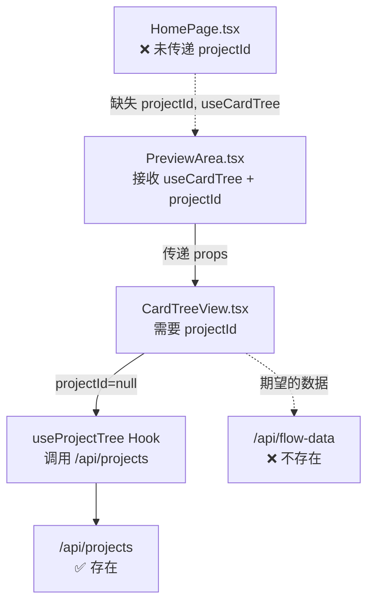
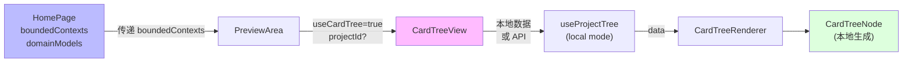
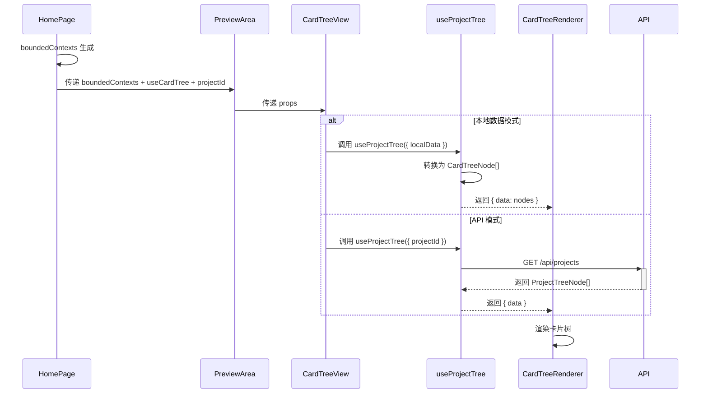

# Architecture: homepage-cardtree-debug — 首页卡片树修复

**项目**: homepage-cardtree-debug
**阶段**: design-architecture
**Architect**: architect
**日期**: 2026-03-24
**状态**: ✅ 完成

---

## 1. 问题分析

### 1.1 根因定位

| # | 根因 | 影响 | 位置 |
|---|------|------|------|
| 🔴 R1 | HomePage 未传递 `projectId` 和 `useCardTree` | CardTreeView 无数据源 | `HomePage.tsx` Line 141 |
| 🔴 R2 | `/api/flow-data` API 端点不存在 | CardTree 无法通过 API 获取数据 | API 路由缺失 |
| 🟡 R3 | CardTree 数据模型与首页数据不对应 | children 步骤数据源不明确 | 数据转换逻辑 |

### 1.2 调用链路分析



### 1.3 关键发现

- `CardTreeView` 已存在，位置 `/components/homepage/CardTree/CardTreeView.tsx`
- `CardTreeRenderer` 已存在，位置 `/components/visualization/CardTreeRenderer/`
- `useProjectTree` Hook 已存在，位置 `/hooks/useProjectTree.ts`
- `/api/projects` API 存在，可复用
- `/api/flow-data` **不存在**，PRD 方案 A（移除依赖）正确

---

## 2. 修复方案

### 方案 A: 数据复用（推荐）

**核心思路**: 不依赖 `/api/flow-data`，复用首页已有数据。



### 2.1 Epic 1: 数据传递修复

```typescript
// HomePage.tsx 修改
<PreviewArea
  currentStep={currentStep}
  mermaidCode={currentMermaidCode}
  boundedContexts={boundedContexts}
  domainModels={domainModels}
  businessFlow={businessFlow}
  isGenerating={isGenerating}
  useCardTree={IS_CARD_TREE_ENABLED}   // ← 新增
  projectId={createdProjectId}           // ← 新增（从 useHomePage 获取）
/>
```

**注意**: 需确认 `useHomePage` 是否暴露 `createdProjectId`。

### 2.2 Epic 2: 本地数据模式

`useProjectTree` 扩展支持本地数据模式：

```typescript
// hooks/useProjectTree.ts
interface UseProjectTreeOptions {
  localData?: {
    boundedContexts: BoundedContext[];
    domainModels: DomainModel[];
    businessFlow: BusinessFlow;
  };
  // ...existing options
}

// 本地模式优先级: localData > API
// 如果 localData 存在，直接转换，跳过 API 调用
```

### 2.3 CardTree children 数据来源

**决策**: boundedContexts 子项作为 children。

| 层级 | 数据源 | 说明 |
|------|--------|------|
| L1 | `boundedContexts[]` | 限界上下文（父节点）|
| L2 | `boundedContext.entities[]` | 实体（子节点）|

CardTreeNode 映射：
```typescript
interface CardTreeNode {
  id: string;                    // boundedContext.id
  label: string;                // boundedContext.name
  status: 'done' | 'in-progress' | 'pending';
  children: CardTreeNode[];      // boundedContext.entities
  type: 'context' | 'entity';
}
```

---

## 3. Tech Stack

| 层级 | 技术 | 说明 |
|------|------|------|
| 框架 | Next.js 14 | 现有 |
| 状态 | Zustand | useHomePage store |
| Hook | useProjectTree | 扩展本地模式 |
| 组件 | CardTreeView + CardTreeRenderer | 已有 |
| 类型 | CardTreeVisualizationRaw | 已有 |

**无新增依赖**。

---

## 4. 数据流



---

## 5. 开放问题决策

### OQ-1: CardTree children 数据来源

**决策**: boundedContexts 子项（entities + valueObjects）。

**理由**:
- boundedContexts 是 DDD 建模的核心输出
- 已有数据结构，不需要额外 API
- 与首页建模流程一致

**备选方案**: 固定模板（如果 PM 选择）

---

## 6. 性能评估

| 关注点 | 评估 |
|--------|------|
| 本地数据转换 | < 10ms（boundedContexts 通常 ≤ 10 项）|
| CardTree 渲染 | 依赖节点数，≤ 50 节点预计 < 200ms |
| 构建影响 | 无新增依赖，构建时间不变 |

---

**架构文档完成**: 2026-03-24 01:52 (Asia/Shanghai)
