# Architecture: Homepage Event Binding Audit & Fix

**Project**: `homepage-event-audit`  
**Architect**: architect  
**Date**: 2026-03-22  
**Status**: design-architecture

---

## 1. Context & Problem Summary

### Current State
HomePage.tsx has **14 stub callbacks** across 3 components:

| Component | Stubs | Severity |
|-----------|-------|----------|
| BottomPanel | 8 callbacks (onAIAsk, onDiagnose, onOptimize, onHistory, onSave, onRegenerate, onCreateProject, onSendMessage) | P0 |
| Navbar | 2 callbacks (onMenuToggle, onSettingsClick) | P0 |
| AIPanel | 2 callbacks (onClose, handleAIPanelSend) | P0 |

Additionally: `requirementText` data flow is broken — BottomPanelInputArea input never triggers SSE generation.

### Goals
1. Wire all stub callbacks to real logic
2. Fix `requirementText` data flow → SSE stream
3. Implement new backend API endpoints (diagnosis, optimize, chat)
4. Consolidate state management
5. Add SSE timeout protection

---

## 2. Architecture

### 2.1 Component Architecture

```mermaid
flowchart TB
    subgraph "HomePage Container"
        HP["HomePage.tsx<br/>(State Owner)"]
    end

    subgraph "Child Components"
        NB["Navbar"]
        BP["BottomPanel"]
        AP["AIPanel"]
        SA["Sidebar"]
    end

    subgraph "Hooks"
        UHP["useHomePage<br/>(State Provider)"]
        DDD["useDDDStream<br/>(SSE Client)"]
    end

    subgraph "Backend APIs (NEW)"
        DIAG["/ddd/diagnosis<br/>(POST)"]
        OPT["/ddd/optimize<br/>(POST)"]
        CHAT["/ddd/chat<br/>(POST)"]
        PROJ["/projects<br/>(POST)"]
    end

    %% Stub → Real bindings
    HP -->|"handleBottomPanelSend"| BP
    HP -->|"handleDiagnose → fetch /ddd/diagnosis"| DIAG
    HP -->|"handleOptimize → fetch /ddd/optimize"| OPT
    HP -->|"handleSave → localStorage"| LS["localStorage"]
    HP -->|"handleHistory → setHistoryDrawerOpen"| HP
    HP -->|"handleRegenerate → retryCurrentStep"| UHP
    HP -->|"handleCreateProject → router.push"| R["router"]
    HP -->|"handleAIPanelSend → fetch /ddd/chat"| CHAT
    HP -->|"isMenuOpen, setIsMenuOpen"| NB
    HP -->|"setIsAIPanelOpen(false)"| AP
    HP -->|"handleAIPanelSend"| AP

    %% Data flow
    BP -->|"onSendMessage"| HP
    HP -->|"generateContexts"| DDD
    DDD -->|"SSE stream"| SA
    DDD -->|"setThinkingMessages"| AP
```



### 2.2 Data Flow (Fixed)

**Before** (broken):
```
BottomPanelInputArea → internal inputValue → handleSend → onSendMessage (stub)
```

**After** (fixed):
```
BottomPanelInputArea.value
  → handleSend(inputValue)
  → handleBottomPanelSend(inputValue)
  → setRequirementText(inputValue)
  → clearDraft()
  → setCompletedStep(0)
  → setCurrentStep(1)
  → setThinkingMessages([])
  → generateContexts(inputValue)
  → SSE stream → thinkingMessages → PreviewArea
```

### 2.3 File Changes Map

| File | Change | Epic |
|------|--------|------|
| `HomePage.tsx` | Wire all 14 stubs + new state | P0 |
| `useHomePage.ts` | Add new handlers, fix auto-step trigger | P0 |
| `BottomPanel.tsx` | Fix handleSend + QuickAsk + ChatHistory | P1 |
| `AIPanel.tsx` | Fix onClose + onSendMessage | P0 |
| `Navbar.tsx` | Wire onMenuToggle, onSettingsClick | P0 |
| `FloatingMode.tsx` | Integrate into HomePage | P1 |
| `stream-service.ts` | Add AbortSignal timeout | P2 |
| `api/index.ts` | Add diagnosis/optimize/chat endpoints | P0 |
| `confirmationStore.ts` | Optional consolidation | P2 |

---

## 3. Tech Stack

| Component | Choice | Rationale |
|-----------|--------|-----------|
| Language | TypeScript 5.x | Existing |
| State | useHomePage + Zustand | Existing, minimal change |
| API Client | fetch with AbortSignal | Existing pattern + timeout |
| SSE | EventSource / fetch ReadableStream | Existing |
| Testing | Jest + Cypress | Existing |

---

## 4. API Definitions

### POST /ddd/diagnosis
```typescript
// Request
interface DiagnosisRequest {
  requirementText: string;
  boundedContexts: BoundedContext[];
}

// Response
interface DiagnosisResponse {
  issues: Array<{
    severity: 'high' | 'medium' | 'low';
    message: string;
    suggestion: string;
  }>;
}
```

### POST /ddd/optimize
```typescript
// Request
interface OptimizeRequest {
  requirementText: string;
  domainModels: DomainModel[];
}

// Response
interface OptimizeResponse {
  suggestions: Array<{
    type: 'refactor' | 'performance' | 'ux';
    message: string;
  }>;
}
```

### POST /ddd/chat
```typescript
// Request
interface ChatRequest {
  message: string;
  requirementText: string;
  context?: string;
}

// Response
interface ChatResponse {
  reply: string;
  thinking?: string;
}
```

### POST /projects
```typescript
// Request
interface CreateProjectRequest {
  requirement: string;
}

// Response
interface CreateProjectResponse {
  projectId: string;
  url: string;
}
```

---

## 5. Implementation Phases

### Phase 1: Core Callbacks (P0)

**HomePage.tsx changes:**

```typescript
// New state
const [isMenuOpen, setIsMenuOpen] = useState(false);
const [isAIPanelOpen, setIsAIPanelOpen] = useState(true);

// Handlers
const handleBottomPanelSend = useCallback(async (message: string) => {
  if (!message.trim() || isGenerating) return;
  setRequirementText(message);
  clearDraft();
  setCompletedStep(0);
  setCurrentStep(1);
  setThinkingMessages([]);
  generateContexts(message);
}, [isGenerating, setRequirementText, clearDraft, generateContexts]);

const handleDiagnose = useCallback(async () => {
  try {
    const res = await fetch(getApiUrl('/ddd/diagnosis'), {
      method: 'POST',
      headers: { 'Content-Type': 'application/json' },
      body: JSON.stringify({ requirementText, boundedContexts }),
      signal: AbortSignal.timeout(30000),
    });
    const data = await res.json();
    setDiagnosisCount(data.issues?.length || 0);
  } catch (err) {
    if (err.name !== 'AbortError') console.error('Diagnosis failed:', err);
  }
}, [requirementText, boundedContexts]);

const handleOptimize = useCallback(async () => {
  try {
    const res = await fetch(getApiUrl('/ddd/optimize'), {
      method: 'POST',
      headers: { 'Content-Type': 'application/json' },
      body: JSON.stringify({ requirementText, domainModels }),
      signal: AbortSignal.timeout(30000),
    });
    const data = await res.json();
    setOptimizeCount(data.suggestions?.length || 0);
  } catch (err) {
    if (err.name !== 'AbortError') console.error('Optimize failed:', err);
  }
}, [requirementText, domainModels]);

const handleSave = useCallback(() => {
  const snapshot = {
    step: currentStep,
    requirementText,
    timestamp: Date.now(),
  };
  localStorage.setItem(`vibex-snapshot-${Date.now()}`, JSON.stringify(snapshot));
}, [currentStep, requirementText]);

const handleHistory = useCallback(() => {
  setHistoryDrawerOpen(true);
}, []);

const handleCreateProject = useCallback(async () => {
  try {
    const res = await fetch(getApiUrl('/projects'), {
      method: 'POST',
      headers: { 'Content-Type': 'application/json' },
      body: JSON.stringify({ requirement: requirementText }),
      credentials: 'include',
      signal: AbortSignal.timeout(10000),
    });
    const data = await res.json();
    router.push(data.url || `/projects/${data.projectId}`);
  } catch (err) {
    if (err.name !== 'AbortError') console.error('Create project failed:', err);
  }
}, [requirementText]);

const handleAIPanelSend = useCallback(async (message: string) => {
  setThinkingMessages(prev => [...prev, { step: 'chat', message: `[用户]: ${message}` }]);
  try {
    const res = await fetch(getApiUrl('/ddd/chat'), {
      method: 'POST',
      headers: { 'Content-Type': 'application/json' },
      body: JSON.stringify({ message, requirementText }),
      signal: AbortSignal.timeout(30000),
    });
    const data = await res.json();
    setThinkingMessages(prev => [...prev, { step: 'chat', message: data.reply }]);
  } catch (err) {
    if (err.name !== 'AbortError') {
      setThinkingMessages(prev => [...prev, { step: 'chat', message: `错误: ${err.message}` }]);
    }
  }
}, [requirementText]);
```

### Phase 2: Quick Features (P1)
- FloatingMode integration into HomePage
- ChatHistory auto-send on expand
- QuickAskButtons auto-send

### Phase 3: State & Reliability (P2)
- SSE timeout protection (AbortSignal.timeout)
- Error boundary + retry UI
- Optional store consolidation

---

## 6. Testing Strategy

### 6.1 Test Framework
- **Unit**: Jest + @testing-library/react
- **E2E**: Cypress (for button → API flow)

### 6.2 Core Test Cases

| ID | Description | Method |
|----|-------------|--------|
| TC1 | BottomPanel send triggers SSE | Jest mock fetch |
| TC2 | Diagnose button calls /ddd/diagnosis | Jest mock fetch |
| TC3 | Optimize button calls /ddd/optimize | Jest mock fetch |
| TC4 | Save button writes localStorage | Jest mock localStorage |
| TC5 | History button opens drawer | RTL fireEvent |
| TC6 | Regenerate calls retryCurrentStep | Jest spy |
| TC7 | Create project calls /projects | Jest mock fetch |
| TC8 | AIPanel send calls /ddd/chat | Jest mock fetch |
| TC9 | AIPanel close button sets state | RTL fireEvent |
| TC10 | Navbar menu toggle toggles state | RTL fireEvent |
| TC11 | SSE timeout via AbortSignal | Jest mock AbortController |
| TC12 | Error boundary catches SSE failure | Jest + error boundary |

### 6.3 Verification Commands

```bash
# Unit tests
npm test -- --watchAll=false --testPathPattern="HomePage|BottomPanel|AIPanel|Navbar"

# E2E tests
npx cypress run --spec "cypress/e2e/homepage-events.cy.js"
```

### 6.4 Coverage Targets

| File | Target |
|------|--------|
| HomePage.tsx | > 80% |
| BottomPanel.tsx | > 80% |
| AIPanel.tsx | > 80% |
| stream-service.ts | 100% |

---

## 7. Trade-offs

| Decision | Trade-off |
|----------|-----------|
| Add AbortSignal.timeout | ✅ Prevents infinite waits; ⚠️ Needs fallback for older browsers |
| Keep 3 stores (no consolidation) | ✅ No breaking changes; ⚠️ State duplication persists |
| New API endpoints vs extend existing | ✅ Clean separation; ⚠️ More backend work |
| Cypress vs RTL for button→API | ✅ Real browser; ⚠️ Slower CI |

---

## 8. Verification Checklist

- [ ] All 14 stub callbacks replaced with real handlers
- [ ] `requirementText` data flow is end-to-end tested
- [ ] `/ddd/diagnosis`, `/ddd/optimize`, `/ddd/chat` endpoints called correctly
- [ ] SSE has AbortSignal.timeout(60000)
- [ ] Error boundary handles SSE failure gracefully
- [ ] Unit tests cover > 80% of changed files
- [ ] Cypress E2E covers button → API flow
- [ ] No breaking changes to existing SSE streams
