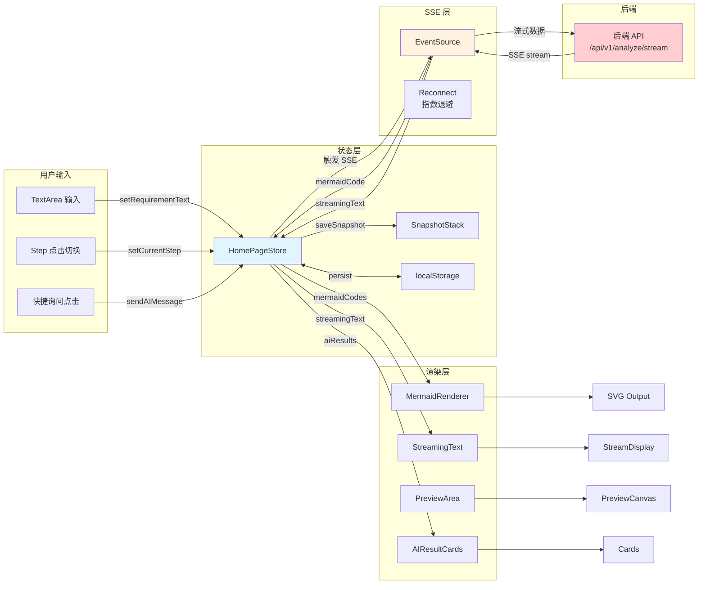
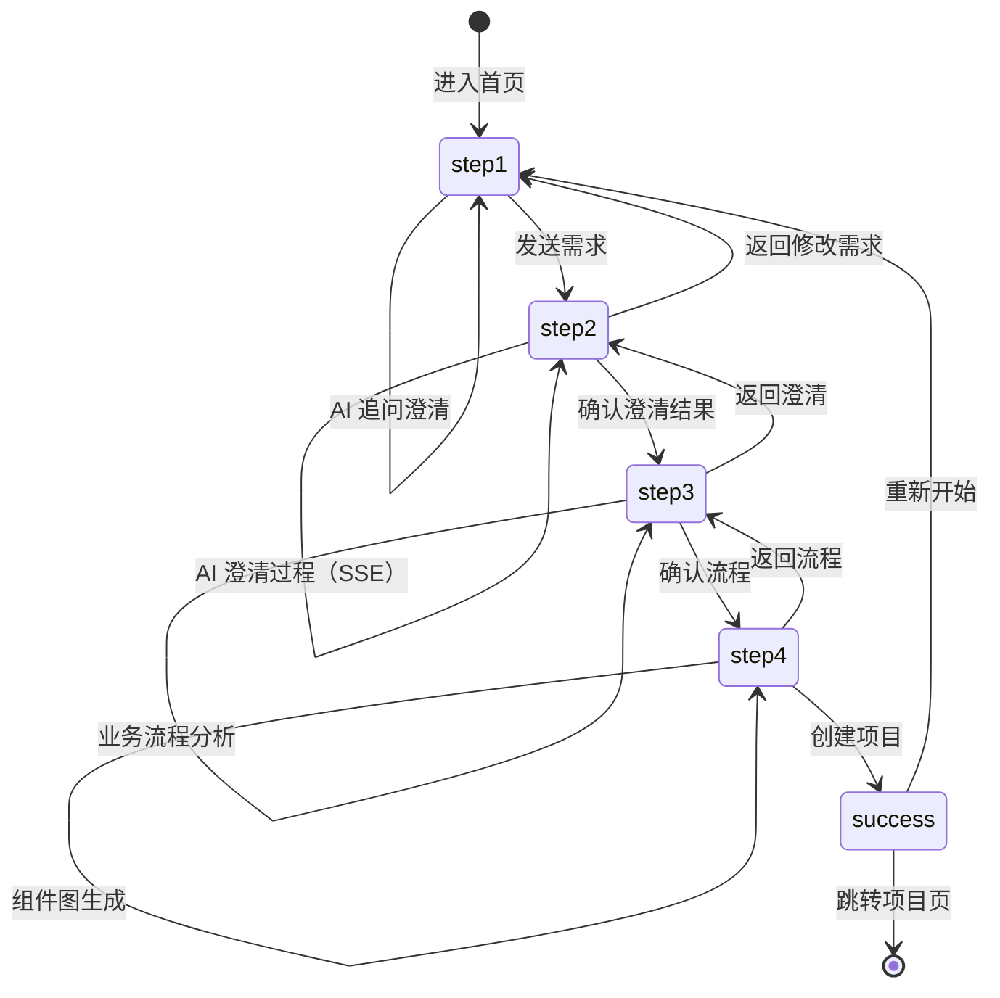
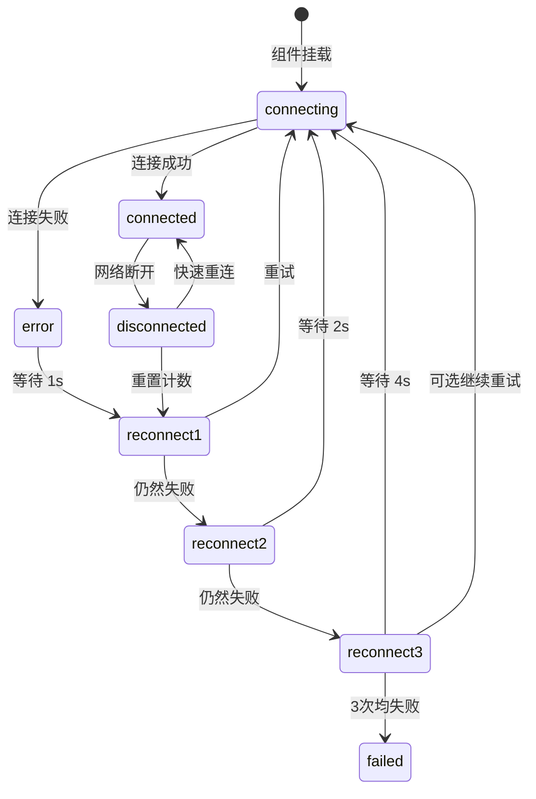
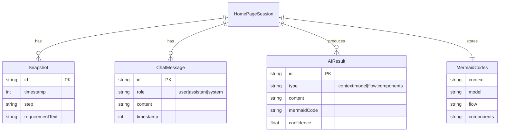

# 架构设计: VibeX 首页重构 (homepage-redesign-analysis)

> **项目**: homepage-redesign-analysis  
> **版本**: v1.0  
> **架构师**: Architect Agent  
> **日期**: 2026-03-21  
> **依赖**: PRD (`docs/homepage-redesign-analysis/prd.md`), 分析报告 (`docs/homepage-redesign-analysis/analysis.md`)  
> **工作目录**: `/root/.openclaw/vibex`

---

## 变更日志

| 版本 | 日期 | 变更内容 |
|------|------|----------|
| 1.0 | 2026-03-21 | 初始架构设计，对齐 PRD v1.0 |

---

## 1. 技术栈与选型决策

### 1.1 核心技术栈

| 技术 | 版本 | 选型理由 |
|------|------|----------|
| **Next.js** | 14.x | 现有项目基础，App Router 支持 |
| **React** | 18.x | 组件化，Hooks + Suspense |
| **TypeScript** | 5.x | 类型安全 |
| **Zustand** | 4.x | 轻量状态管理，已有 store |
| **Mermaid.js** | 10.x | 图表渲染，项目已集成 |
| **CSS Modules** | - | 样式隔离 |
| **SSE (EventSource)** | - | AI 流式响应，已有后端支持 |

### 1.2 选型决策

```
Zustand vs Redux Toolkit
├── 已有 Zustand store，改造成本最低
├── persist 中间件开箱即用，支持 localStorage
└── 轻量无 boilerplate，团队已熟悉

Mermaid.js 渲染优化
├── 动态导入减少首屏体积
├── SVG 渲染结果缓存（避免重复解析）
└── 大图虚拟化渲染（viewport clipping）

SSE vs WebSocket
├── 后端已有 /api/v1/analyze/stream SSE 接口
├── 单向数据流足够（服务端推送分析结果）
└── 自动重连由浏览器 EventSource 处理
```

---

## 2. 架构图

### 2.1 整体组件架构

```mermaid
graph TB
    subgraph "页面层 (Page Layer)"
        HP[HomePage]
    end

    subgraph "Header (Epic 2)"
        HD[Header]
        HD --> LG[Logo]
        HD --> NV[NavLinks]
        HD --> AU[AuthButton / Avatar]
    end

    subgraph "布局容器 (Epic 1)"
        GC[GridContainer<br/>1400px centered<br/>3×3 CSS Grid]
        GC --> HG[Header Grid Area]
        GC --> LP[Left Drawer<br/>240px]
        GC --> MP[Main Preview<br/>flex-grow]
        GC --> RP[Right Drawer<br/>320px]
        GC --> BP[Bottom Panel<br/>120px–400px]
    end

    subgraph "左侧抽屉 (Epic 3)"
        LD[LeftDrawer]
        LD --> SN[StepNavigator]
        SN --> S1[Step 1: 需求录入]
        SN --> S2[Step 2: 需求澄清]
        SN --> S3[Step 3: 业务流程]
        SN --> S4[Step 4: 组件图]
    end

    subgraph "预览区 (Epic 4)"
        PV[PreviewArea]
        PV --> PVH[PreviewHeader<br/>缩放控制 + 导出]
        PV --> PVC[PreviewCanvas<br/>MermaidRenderer]
        PV --> PVS[ScaleControls]
    end

    subgraph "右侧抽屉 (Epic 5)"
        RD[RightDrawer<br/>AI 思考过程]
        RD --> SSE[EventSource Stream]
        RD --> ST[StreamingText]
        RD --> RT[ReconnectLogic]
    end

    subgraph "底部面板 (Epic 6)"
        BP --> BPH[BottomPanelHandle<br/>30px 收起手柄]
        BP --> BPT[BottomPanelContent]
        BPT --> TA[RequirementTextarea<br/>5000字]
        BPT --> SB[SendButton]
        BPT --> SQ[AI 快捷询问]
        BPT --> DH[DiagnosisButtons]
        BPT --> HR[HistoryRecord]
        BPT --> SBtn[SaveDraft]
        BPT --> RGen[重新生成]
        BPT --> CPB[CreateProjectButton]
    end

    subgraph "AI 展示区 (Epic 7)"
        AI[AIResultCards<br/>三列卡片]
        AI --> C1[Context Card]
        AI --> C2[Model Card]
        AI --> C3[Flow Card]
    end

    subgraph "悬浮模式 (Epic 8)"
        FM[FloatingMode<br/>IntersectionObserver]
    end

    subgraph "状态层 (Epic 9)"
        HMS[HomePageStore<br/>Zustand + persist]
        HMS --> HSS[SnapshotStack<br/>最近5个快照]
        HMS --> LSP[localStorage persist]
        HMS --> SSE[SSE Connection Manager]
    end

    HP --> HD
    HP --> GC
    GC --> LD
    GC --> PV
    GC --> RD
    GC --> BP
    HP --> AI
    HP --> FM
    HMS -.-> LD
    HMS -.-> PV
    HMS -.-> RD
    HMS -.-> BP
    HMS -.-> AI

    style HMS fill:#e1f5fe
    style GC fill:#fff3e0
    style BP fill:#f3e5f5
```



### 2.2 数据流架构



### 2.3 四步流程状态机



### 2.4 SSE 重连状态机



---

## 3. 接口定义

### 3.1 状态接口

```typescript
// src/types/homepage.ts

export type Step = 'step1' | 'step2' | 'step3' | 'step4' | 'success';

export type DrawerSide = 'left' | 'right' | 'bottom';

export interface StepState {
  id: Step;
  label: string;
  status: 'default' | 'active' | 'completed';
}

export interface Snapshot {
  id: string;
  timestamp: number;
  step: Step;
  requirementText: string;
  mermaidCodes: MermaidCodes;
  aiResults: AIResult[];
}

export interface MermaidCodes {
  context: string;
  model: string;
  flow: string;
  components: string;
}

export interface AIResult {
  type: 'context' | 'model' | 'flow';
  content: string;
  mermaidCode: string;
  confidence: number;
}

export interface ChatMessage {
  id: string;
  role: 'user' | 'assistant' | 'system';
  content: string;
  timestamp: number;
}

export interface HomePageState {
  // 步骤
  currentStep: Step;
  completedSteps: Step[];

  // 抽屉状态
  leftDrawerOpen: boolean;
  rightDrawerOpen: boolean;
  bottomPanelExpanded: boolean;
  bottomPanelHeight: number; // 120–400

  // 需求输入
  requirementText: string;

  // AI 结果
  mermaidCodes: MermaidCodes;
  aiResults: AIResult[];
  chatHistory: ChatMessage[];

  // SSE 状态
  sseStatus: 'idle' | 'connecting' | 'connected' | 'error' | 'reconnecting';
  streamingText: string;
  reconnectCount: number;

  // 快照
  snapshots: Snapshot[];

  // 草稿
  draftSaved: number | null;

  // Actions
  setCurrentStep: (step: Step) => void;
  setLeftDrawer: (open: boolean) => void;
  setRightDrawer: (open: boolean) => void;
  setBottomPanel: (expanded: boolean, height?: number) => void;
  setRequirementText: (text: string) => void;
  appendChatMessage: (msg: ChatMessage) => void;
  appendStreamingText: (text: string) => void;
  clearStreamingText: () => void;
  setMermaidCodes: (codes: Partial<MermaidCodes>) => void;
  setAIResults: (results: AIResult[]) => void;
  setSSEStatus: (status: HomePageState['sseStatus']) => void;
  incrementReconnect: () => void;
  resetReconnect: () => void;
  saveSnapshot: () => void;
  restoreSnapshot: (id: string) => void;
  saveDraft: () => void;
  reset: () => void;
}
```

### 3.2 组件 Props 接口

```typescript
// src/components/home/types.ts

export interface GridContainerProps {
  children: React.ReactNode;
}

export interface HeaderProps {
  onLoginClick: () => void;
  isAuthenticated: boolean;
  user?: { name: string; avatar: string };
}

export interface StepNavigatorProps {
  steps: StepState[];
  currentStep: Step;
  onStepClick: (step: Step) => void;
}

export interface PreviewAreaProps {
  mermaidCodes: MermaidCodes;
  isLoading: boolean;
  error?: string;
  scale: number; // 0.5–2.0
  onScaleChange: (scale: number) => void;
  onExportPNG: () => void;
  onExportSVG: () => void;
}

export interface RightDrawerProps {
  isOpen: boolean;
  onClose: () => void;
  streamingText: string;
  sseStatus: string;
  messages: ChatMessage[];
}

export interface BottomPanelProps {
  isExpanded: boolean;
  height: number;
  onHeightChange: (height: number) => void;
  onToggle: () => void;
  value: string;
  onChange: (value: string) => void;
  onSend: () => void;
  onQuickAsk: (question: string) => void;
  onDiagnosis: (type: 'diagnose' | 'optimize') => void;
  onSaveDraft: () => void;
  onRegenerate: () => void;
  onCreateProject: () => void;
  isSending: boolean;
  reconnectCount: number;
}

export interface AIResultCardsProps {
  results: AIResult[];
  onCardClick: (type: AIResult['type']) => void;
}
```

### 3.3 API 接口

#### 3.3.1 SSE 流式分析接口（已有）

```typescript
// src/services/api/analyze.ts

/**
 * GET /api/v1/analyze/stream
 *
 * SSE 流式分析接口，一次请求返回所有步骤的 AI 分析结果
 *
 * @param requirement - 用户需求文本
 * @param step - 当前步骤（可选）
 *
 * SSE 事件类型:
 * - event: step_context   data: { type, content, mermaidCode }
 * - event: step_model    data: { type, content, mermaidCode }
 * - event: step_flow     data: { type, content, mermaidCode }
 * - event: step_components data: { type, content, mermaidCode }
 * - event: thinking      data: { text }  (流式思考过程)
 * - event: done          data: { projectId? }
 * - event: error         data: { message }
 *
 * 重连策略: 指数退避 1s → 2s → 4s，最多 3 次
 */
export function createAnalyzeStream(requirement: string): EventSource {
  const url = `/api/v1/analyze/stream?requirement=${encodeURIComponent(requirement)}`;
  return new EventSource(url);
}
```

#### 3.3.2 项目创建接口

```typescript
// src/services/api/project.ts

export const projectApi = {
  createProject: async (data: {
    requirementText: string;
    mermaidCodes: MermaidCodes;
    aiResults: AIResult[];
    chatHistory: ChatMessage[];
  }): Promise<{
    success: boolean;
    data?: { projectId: string; url: string };
    error?: string;
  }> => {
    const res = await fetch('/api/v1/projects', {
      method: 'POST',
      headers: { 'Content-Type': 'application/json' },
      body: JSON.stringify(data),
    });
    return res.json();
  },
};
```

---

## 4. 数据模型

### 4.1 核心实体关系



### 4.2 localStorage 持久化结构

```typescript
// localStorage key: 'vibex-homepage-session'

interface PersistedHomePage {
  version: number;       // schema version
  state: {
    currentStep: Step;
    requirementText: string;
    mermaidCodes: MermaidCodes;
    aiResults: AIResult[];
    chatHistory: ChatMessage[];
    completedSteps: Step[];
    draftSaved: number;
    snapshots: Snapshot[]; // 仅保留最近 5 个
  };
}

const persistConfig = {
  name: 'vibex-homepage-session',
  version: 1,
  partialize: (state: HomePageState) => ({
    currentStep: state.currentStep,
    requirementText: state.requirementText,
    mermaidCodes: state.mermaidCodes,
    aiResults: state.aiResults,
    chatHistory: state.chatHistory.slice(-20), // 仅保留最近 20 条
    completedSteps: state.completedSteps,
    draftSaved: state.draftSaved,
    snapshots: state.snapshots.slice(-5), // 仅保留最近 5 个
  }),
};
```

---

## 5. 组件结构

### 5.1 目录结构

```
src/
├── app/
│   └── page.tsx                    # 首页入口（改造）
├── components/
│   ├── home/
│   │   ├── HomePage.tsx           # 首页主组件
│   │   ├── HomePage.module.css
│   │   ├── GridContainer.tsx       # 3×3 网格布局容器
│   │   ├── GridContainer.module.css
│   │   ├── Header.tsx              # Header (Epic 2)
│   │   ├── Header.module.css
│   │   ├── LeftDrawer.tsx          # 左侧抽屉 (Epic 3)
│   │   ├── LeftDrawer.module.css
│   │   ├── StepNavigator.tsx       # 步骤导航
│   │   ├── StepNavigator.module.css
│   │   ├── PreviewArea.tsx        # 预览区 (Epic 4)
│   │   ├── PreviewArea.module.css
│   │   ├── PreviewHeader.tsx      # 预览区头部（缩放+导出）
│   │   ├── PreviewHeader.module.css
│   │   ├── RightDrawer.tsx        # 右侧抽屉 (Epic 5)
│   │   ├── RightDrawer.module.css
│   │   ├── StreamingText.tsx      # 流式文本渲染
│   │   ├── BottomPanel.tsx         # 底部面板 (Epic 6)
│   │   ├── BottomPanel.module.css
│   │   ├── BottomPanelHandle.tsx  # 收起手柄
│   │   ├── RequirementTextarea.tsx
│   │   ├── QuickAskButtons.tsx    # 快捷询问
│   │   ├── DiagnosisButtons.tsx  # 诊断/优化按钮
│   │   ├── ChatHistory.tsx        # 历史记录
│   │   ├── AIResultCards.tsx      # AI 展示区 (Epic 7)
│   │   ├── AIResultCards.module.css
│   │   ├── AICard.tsx             # 单个结果卡片
│   │   ├── AICard.module.css
│   │   └── FloatingMode.tsx       # 悬浮模式 (Epic 8)
│   ├── preview/
│   │   ├── MermaidRenderer.tsx    # Mermaid 渲染（改造）
│   │   ├── MermaidRenderer.module.css
│   │   ├── ScaleControls.tsx      # 缩放控制
│   │   └── ExportControls.tsx     # 导出控制
│   └── ui/
│       ├── Drawer.tsx              # 通用抽屉组件
│       ├── Drawer.module.css
│       └── Skeleton.tsx            # 骨架屏
├── hooks/
│   ├── useHomePageStore.ts        # 状态管理 (Epic 9)
│   ├── useSSEStream.ts             # SSE 连接管理 (Epic 5, 9)
│   ├── useFloatingMode.ts         # 悬浮模式 (Epic 8)
│   └── useExport.ts               # 导出功能 (Epic 4)
├── stores/
│   └── homePageStore.ts           # Zustand store（改造）
├── services/
│   └── api/
│       ├── analyze.ts             # SSE 流式分析
│       └── project.ts              # 项目创建
├── types/
│   └── homepage.ts                # 类型定义
└── styles/
    ├── variables.css               # CSS 主题变量 (Epic 1)
    └── reset.css
```

### 5.2 组件职责矩阵

| 组件 | Epic | 职责 | 状态 |
|------|------|------|------|
| `HomePage` | - | 布局组装，状态分发 | 改造 |
| `GridContainer` | Epic 1 | 3×3 CSS Grid，响应式断点 | 新增 |
| `Header` | Epic 2 | Logo、导航、登录状态 | 改造 |
| `LeftDrawer` | Epic 3 | 左侧抽屉容器 | 新增 |
| `StepNavigator` | Epic 3 | 四步导航，状态高亮 | 新增 |
| `PreviewArea` | Epic 4 | 预览区容器，状态切换 | 新增 |
| `PreviewHeader` | Epic 4 | 缩放控制，导出按钮 | 新增 |
| `MermaidRenderer` | Epic 4 | Mermaid SVG 渲染，缩放拖拽 | 改造 |
| `RightDrawer` | Epic 5 | 右侧抽屉，SSE 流式文本 | 新增 |
| `StreamingText` | Epic 5 | 流式文本逐步显示 | 新增 |
| `BottomPanel` | Epic 6 | 底部面板容器 | 新增 |
| `RequirementTextarea` | Epic 6 | 需求输入，5000字 | 新增 |
| `QuickAskButtons` | Epic 6 | 5 个预设快捷问题 | 新增 |
| `DiagnosisButtons` | Epic 6 | 诊断/优化按钮 | 新增 |
| `ChatHistory` | Epic 6 | 最近 10 条对话 | 新增 |
| `AIResultCards` | Epic 7 | 三列卡片展示 | 新增 |
| `AICard` | Epic 7 | 单个 AI 结果卡片 | 新增 |
| `FloatingMode` | Epic 8 | 悬浮模式，IntersectionObserver | 新增 |
| `useHomePageStore` | Epic 9 | Zustand store + persist | 改造 |
| `useSSEStream` | Epic 5/9 | SSE 连接、重连逻辑 | 新增 |
| `useFloatingMode` | Epic 8 | 悬浮检测 | 新增 |
| `useExport` | Epic 4 | PNG/SVG 导出 | 新增 |

---

## 6. 测试策略

### 6.1 测试框架

| 工具 | 用途 |
|------|------|
| **Jest** | 单元测试、集成测试 |
| **React Testing Library** | 组件测试 |
| **Playwright** | E2E 测试 |

### 6.2 覆盖率目标

| 指标 | 目标 |
|------|------|
| 行覆盖率 | ≥ 80% |
| 分支覆盖率 | ≥ 75% |
| 函数覆盖率 | ≥ 80% |

### 6.3 核心测试用例

#### 6.3.1 Zustand Store 测试 (Epic 9)

```typescript
// __tests__/stores/homePageStore.test.ts

describe('homePageStore', () => {
  beforeEach(() => {
    localStorage.clear();
    useHomePageStore.getState().reset();
  });

  describe('ST-9.1 localStorage 持久化', () => {
    it('刷新后应恢复 requirementText', () => {
      const { setRequirementText } = useHomePageStore.getState();
      setRequirementText('测试需求');
      expect(useHomePageStore.getState().requirementText).toBe('测试需求');
    });
  });

  describe('ST-9.2 状态快照', () => {
    it('应保存最近 5 个快照', () => {
      const { setRequirementText, saveSnapshot, setCurrentStep } = useHomePageStore.getState();
      for (let i = 0; i < 7; i++) {
        setRequirementText(`需求 ${i}`);
        setCurrentStep('step2');
        saveSnapshot();
      }
      expect(useHomePageStore.getState().snapshots).toHaveLength(5);
    });

    it('应能恢复到指定快照', () => {
      const { saveSnapshot, restoreSnapshot, setRequirementText } = useHomePageStore.getState();
      setRequirementText('原始需求');
      saveSnapshot();
      setRequirementText('修改后');
      restoreSnapshot(useHomePageStore.getState().snapshots[0].id);
      expect(useHomePageStore.getState().requirementText).toBe('原始需求');
    });
  });

  describe('ST-3.2 步骤切换性能', () => {
    it('setCurrentStep 应在 500ms 内完成', () => {
      const { setCurrentStep } = useHomePageStore.getState();
      const start = performance.now();
      setCurrentStep('step2');
      const duration = performance.now() - start;
      expect(duration).toBeLessThan(500);
    });
  });
});
```

#### 6.3.2 SSE 重连测试 (Epic 5)

```typescript
// __tests__/hooks/useSSEStream.test.ts

describe('useSSEStream', () => {
  describe('ST-5.2 流式文本逐步显示', () => {
    it('应逐步更新 streamingText', async () => {
      // Mock EventSource
    });
  });

  describe('ST-5.3 重连逻辑', () => {
    it('应使用指数退避重连', () => {
      const { reconnectTimes } = getReconnectSchedule();
      expect(reconnectTimes).toEqual([1000, 2000, 4000]);
    });

    it('最多重连 3 次', () => {
      const { canRetry } = useSSEStream();
      expect(canRetry(3)).toBe(false);
    });
  });
});
```

#### 6.3.3 组件测试

```typescript
// __tests__/components/StepNavigator.test.tsx

describe('StepNavigator', () => {
  describe('ST-3.1 步骤列表渲染', () => {
    it('应渲染 4 个步骤', () => {
      render(<StepNavigator steps={mockSteps} currentStep="step1" onStepClick={jest.fn()} />);
      expect(screen.getAllByRole('listitem')).toHaveLength(4);
    });
  });

  describe('ST-3.3 步骤状态样式', () => {
    it('当前步骤应有 active 样式', () => {
      render(<StepNavigator steps={mockSteps} currentStep="step2" onStepClick={jest.fn()} />);
      expect(screen.getByTestId('step-step2')).toHaveClass(/active/);
    });

    it('已完成步骤应有 completed 样式', () => {
      render(<StepNavigator steps={mockSteps} currentStep="step3" onStepClick={jest.fn()} />);
      expect(screen.getByTestId('step-step1')).toHaveClass(/completed/);
    });
  });
});

// __tests__/components/PreviewArea.test.tsx

describe('PreviewArea', () => {
  describe('ST-4.1 空状态占位符', () => {
    it('无代码时应显示引导文案', () => {
      render(<PreviewArea mermaidCodes={{context:'',model:'',flow:'',components:''}} isLoading={false} scale={1} onScaleChange={jest.fn()} onExportPNG={jest.fn()} onExportSVG={jest.fn()} />);
      expect(screen.getByText(/输入需求后预览/)).toBeInTheDocument();
    });
  });

  describe('ST-4.2 加载骨架屏', () => {
    it('加载中应显示 skeleton', () => {
      render(<PreviewArea mermaidCodes={{context:'',model:'',flow:'',components:''}} isLoading scale={1} onScaleChange={jest.fn()} onExportPNG={jest.fn()} onExportSVG={jest.fn()} />);
      expect(screen.getByTestId('preview-skeleton')).toBeInTheDocument();
    });
  });
});
```

#### 6.3.4 E2E 测试

```typescript
// e2e/homepage-redesign-analysis.spec.ts

import { test, expect } from '@playwright/test';

test.describe('首页重构 E2E', () => {
  test('ST-1.1 页面容器居中', async ({ page }) => {
    await page.goto('/');
    const container = page.locator('[data-testid="grid-container"]');
    await expect(container).toHaveCSS('max-width', '1400px');
  });

  test('ST-1.2 Grid 三栏布局', async ({ page }) => {
    await page.setViewportSize({ width: 1440, height: 900 });
    await page.goto('/');
    const grid = page.locator('[data-testid="grid-container"]');
    await expect(grid).toHaveCSS('grid-template-columns', /3/);
  });

  test('ST-1.3 响应式断点', async ({ page }) => {
    await page.setViewportSize({ width: 900, height: 600 });
    await page.goto('/');
    const grid = page.locator('[data-testid="grid-container"]');
    await expect(grid).toHaveCSS('grid-template-columns', /1/);
  });

  test('ST-3.2 步骤切换 < 500ms', async ({ page }) => {
    await page.goto('/');
    const start = Date.now();
    await page.click('[data-testid="step-step2"]');
    const duration = Date.now() - start;
    expect(duration).toBeLessThan(500);
  });

  test('ST-4.3 Mermaid 渲染 (4种类型)', async ({ page }) => {
    await page.goto('/');
    // 触发分析
    await page.fill('[data-testid="requirement-textarea"]', '开发一个电商系统');
    await page.click('button:has-text("开始分析")');
    // 验证 4 种图表
    for (const type of ['context', 'model', 'flow', 'components']) {
      await expect(page.locator(`[data-testid="mermaid-${type}"] svg`)).toBeVisible();
    }
  });

  test('ST-6.7 保存草稿', async ({ page }) => {
    await page.goto('/');
    await page.fill('[data-testid="requirement-textarea"]', '测试草稿');
    await page.reload();
    await expect(page.locator('[data-testid="requirement-textarea"]')).toHaveValue('测试草稿');
  });

  test('ST-8.1 悬浮模式', async ({ page }) => {
    await page.goto('/');
    await page.evaluate(() => window.scrollTo(0, 300));
    await page.waitForTimeout(1200); // 等待检测 + 动画
    const bottomPanel = page.locator('[data-testid="bottom-panel"]');
    await expect(bottomPanel).toHaveClass(/collapsed/);
  });
});
```

---

## 7. 性能优化

### 7.1 NFR 目标

| 指标 | 目标 | 实现策略 |
|------|------|----------|
| 首屏 LCP | < 2s | 动态导入非关键组件 |
| 步骤切换 | < 500ms | Zustand 直接更新，无重渲染 |
| AI 首次结果 | < 10s | 后端 SSE 流式推送，前端增量渲染 |
| 状态持久化 | < 100ms | 异步写入 localStorage |
| Mermaid 渲染 | < 500ms | 懒加载 + SVG 缓存 |

### 7.2 优化策略

```typescript
// 1. Mermaid 动态导入
const MermaidRenderer = dynamic(
  () => import('@/components/preview/MermaidRenderer'),
  {
    loading: () => <Skeleton height={400} data-testid="preview-skeleton" />,
    ssr: false,
  }
);

// 2. 组件懒加载（Epic 5, 7, 8）
const RightDrawer = dynamic(() => import('@/components/home/RightDrawer'), {
  ssr: false,
});
const AIResultCards = dynamic(() => import('@/components/home/AIResultCards'), {
  ssr: false,
});
const FloatingMode = dynamic(() => import('@/components/home/FloatingMode'), {
  ssr: false,
});

// 3. useDeferredValue 优化输入响应
const deferredText = useDeferredValue(requirementText);
// 预览渲染使用 deferredText，避免阻塞输入

// 4. Zustand 选择器避免不必要重渲染
const currentStep = useHomePageStore(s => s.currentStep);
const isLoading = useHomePageStore(s => s.sseStatus === 'connecting');
```

---

## 8. 风险与缓解

| 风险 | 概率 | 影响 | 缓解措施 |
|------|------|------|----------|
| Mermaid 大图渲染卡顿 | 中 | 中 | viewport clipping + SVG 虚拟化 |
| SSE 断开影响 AI 体验 | 中 | 高 | 指数退避重连 + 离线提示 |
| localStorage 容量限制 | 低 | 中 | 仅持久化必要字段，控制 chatHistory 数量 |
| 响应式布局在不同浏览器不一致 | 低 | 低 | CSS Grid 兼容性良好，使用 autoprefixer |
| SSE 与 SSR 不兼容 | 低 | 高 | SSE 组件 `ssr: false`，动态导入 |
| 快照过多导致内存占用 | 中 | 低 | 限制最多 5 个快照 |

---

## 9. 验收清单

- [x] 架构文档产出
- [x] 9 Epic 组件结构定义
- [x] 状态接口完整（HomePageState + 所有子类型）
- [x] SSE API 接口定义
- [x] 状态机图（Mermaid × 3）
- [x] 组件架构图
- [x] 数据流图
- [x] 目录结构定义
- [x] 测试策略（Jest + RTL + Playwright）
- [x] 性能优化策略
- [x] 风险识别与缓解
