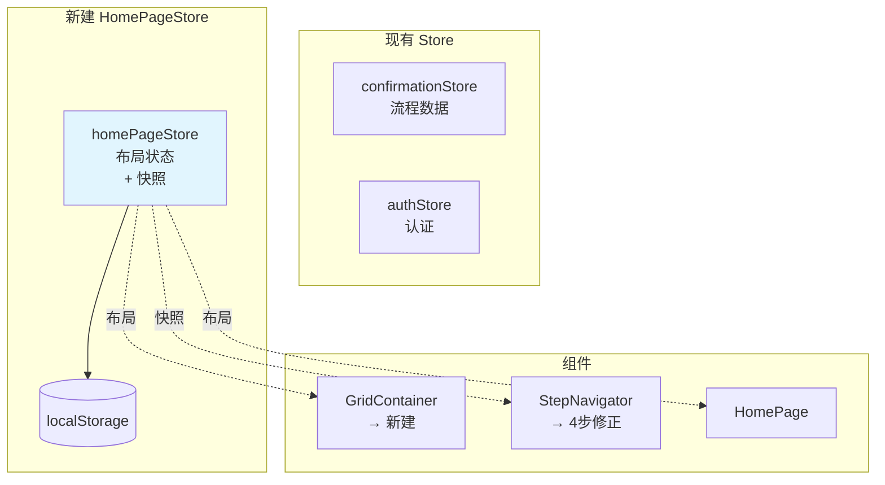
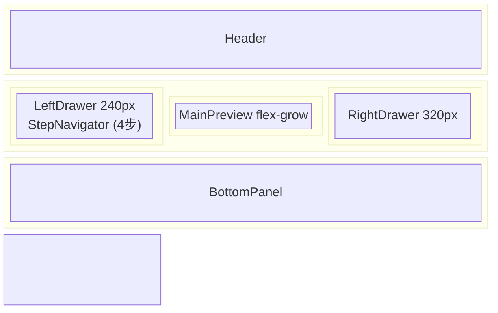
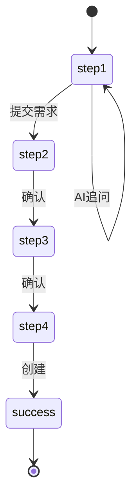

# 架构设计: homepage-redesign-reviewer-sprint1-fix

> **项目**: homepage-redesign-reviewer-sprint1-fix  
> **版本**: v1.0  
> **架构师**: Architect Agent  
> **日期**: 2026-03-21  
> **目标**: 修复 Sprint 1 Reviewer 发现的 5 个阻塞问题（4 Epic）  
> **工作目录**: `/root/.openclaw/vibex/vibex-fronted`

---

## 变更日志

| 版本 | 日期 | 变更内容 |
|------|------|----------|
| 1.0 | 2026-03-21 | 初始架构设计，4 Epic：Store + GridContainer + 步骤修正 + 快照 |

---

## 1. 架构图

### 1.1 HomePageStore 定位



### 1.2 GridContainer 布局



### 1.3 四步流程



---

## 2. 接口定义

### 2.1 HomePageStore

```typescript
// src/stores/homePageStore.ts

import { create } from 'zustand';
import { devtools, persist } from 'zustand/middleware';

export type HomePageStep = 'step1' | 'step2' | 'step3' | 'step4' | 'success';

export interface StepInfo {
  id: HomePageStep;
  label: string;
  status: 'default' | 'active' | 'completed';
}

export interface Snapshot {
  id: string;
  timestamp: number;
  step: HomePageStep;
  leftDrawerOpen: boolean;
  rightDrawerOpen: boolean;
  bottomPanelExpanded: boolean;
  bottomPanelHeight: number;
  panelSizes: { [key: string]: number };
  maximizedPanel: string | null;
  minimizedPanel: string | null;
}

export type SSEStatus = 'idle' | 'connecting' | 'connected' | 'error' | 'reconnecting';

export interface HomePageState {
  leftDrawerOpen: boolean;
  rightDrawerOpen: boolean;
  bottomPanelExpanded: boolean;
  bottomPanelHeight: number;
  panelSizes: { [key: string]: number };
  maximizedPanel: string | null;
  minimizedPanel: string | null;
  currentStep: HomePageStep;
  completedSteps: HomePageStep[];
  steps: StepInfo[];
  sseStatus: SSEStatus;
  reconnectCount: number;
  snapshots: Snapshot[];
  setLeftDrawer: (open: boolean) => void;
  setRightDrawer: (open: boolean) => void;
  setBottomPanel: (expanded: boolean, height?: number) => void;
  setPanelSize: (panel: string, size: number) => void;
  setMaximizedPanel: (panel: string | null) => void;
  setMinimizedPanel: (panel: string | null) => void;
  setCurrentStep: (step: HomePageStep) => void;
  completeStep: (step: HomePageStep) => void;
  resetSteps: () => void;
  setSSEStatus: (status: SSEStatus) => void;
  incrementReconnect: () => void;
  resetReconnect: () => void;
  saveSnapshot: () => void;
  restoreSnapshot: (id: string) => void;
  clearSnapshots: () => void;
  reset: () => void;
}

const STEP_DEFINITIONS: StepInfo[] = [
  { id: 'step1', label: '需求录入', status: 'default' },
  { id: 'step2', label: '需求澄清', status: 'default' },
  { id: 'step3', label: '业务流程', status: 'default' },
  { id: 'step4', label: '组件图',   status: 'default' },
];

const initialState = {
  leftDrawerOpen: true,
  rightDrawerOpen: false,
  bottomPanelExpanded: true,
  bottomPanelHeight: 200,
  panelSizes: {} as { [key: string]: number },
  maximizedPanel: null as string | null,
  minimizedPanel: null as string | null,
  currentStep: 'step1' as HomePageStep,
  completedSteps: [] as HomePageStep[],
  steps: STEP_DEFINITIONS,
  sseStatus: 'idle' as SSEStatus,
  reconnectCount: 0,
  snapshots: [] as Snapshot[],
};

export const useHomePageStore = create<HomePageState>()(
  devtools(
    persist(
      (set, get) => ({
        ...initialState,
        setLeftDrawer: (open) => set({ leftDrawerOpen: open }),
        setRightDrawer: (open) => set({ rightDrawerOpen: open }),
        setBottomPanel: (expanded, height) =>
          set({ bottomPanelExpanded: expanded, ...(height !== undefined && { bottomPanelHeight: height }) }),
        setPanelSize: (panel, size) =>
          set((s) => ({ panelSizes: { ...s.panelSizes, [panel]: size } })),
        setMaximizedPanel: (panel) => set({ maximizedPanel: panel }),
        setMinimizedPanel: (panel) => set({ minimizedPanel: panel }),
        setCurrentStep: (step) => {
          const { steps } = get();
          set({ currentStep: step, steps: steps.map((s) => ({ ...s, status: s.id === step ? 'active' : s.status })) as StepInfo[] });
        },
        completeStep: (step) => {
          const { completedSteps, steps } = get();
          if (!completedSteps.includes(step)) {
            set({ completedSteps: [...completedSteps, step], steps: steps.map((s) => ({ ...s, status: s.id === step ? 'completed' : s.status })) as StepInfo[] });
          }
        },
        resetSteps: () => set({ currentStep: 'step1', completedSteps: [], steps: STEP_DEFINITIONS }),
        setSSEStatus: (status) => set({ sseStatus: status }),
        incrementReconnect: () => set((s) => ({ reconnectCount: s.reconnectCount + 1, sseStatus: 'reconnecting' })),
        resetReconnect: () => set({ reconnectCount: 0 }),
        saveSnapshot: () => {
          const s = get();
          const snapshot: Snapshot = { id: `snap-${Date.now()}`, timestamp: Date.now(), step: s.currentStep, leftDrawerOpen: s.leftDrawerOpen, rightDrawerOpen: s.rightDrawerOpen, bottomPanelExpanded: s.bottomPanelExpanded, bottomPanelHeight: s.bottomPanelHeight, panelSizes: s.panelSizes, maximizedPanel: s.maximizedPanel, minimizedPanel: s.minimizedPanel };
          set({ snapshots: [...s.snapshots, snapshot].slice(-5) });
        },
        restoreSnapshot: (id) => {
          const snap = get().snapshots.find((s) => s.id === id);
          if (snap) set({ currentStep: snap.step, leftDrawerOpen: snap.leftDrawerOpen, rightDrawerOpen: snap.rightDrawerOpen, bottomPanelExpanded: snap.bottomPanelExpanded, bottomPanelHeight: snap.bottomPanelHeight, panelSizes: snap.panelSizes, maximizedPanel: snap.maximizedPanel, minimizedPanel: snap.minimizedPanel });
        },
        clearSnapshots: () => set({ snapshots: [] }),
        reset: () => set({ ...initialState }),
      }),
      {
        name: 'vibex-homepage-layout',
        version: 1,
        partialize: (state) => ({
          leftDrawerOpen: state.leftDrawerOpen, rightDrawerOpen: state.rightDrawerOpen,
          bottomPanelExpanded: state.bottomPanelExpanded, bottomPanelHeight: state.bottomPanelHeight,
          panelSizes: state.panelSizes, maximizedPanel: state.maximizedPanel,
          minimizedPanel: state.minimizedPanel, currentStep: state.currentStep,
          completedSteps: state.completedSteps,
        }),
      }
    ),
    { name: 'HomePageStore' }
  )
);
```

### 2.2 GridContainer

```typescript
// src/components/homepage/GridContainer/index.tsx
import React from 'react';
import styles from './GridContainer.module.css';

export interface GridContainerProps {
  children: React.ReactNode;
  'data-testid'?: string;
}

export function GridContainer({ children, ...props }: GridContainerProps) {
  return <div className={styles.container} {...props}>{children}</div>;
}
```

```css
/* src/components/homepage/GridContainer/GridContainer.module.css */
.container {
  display: grid;
  grid-template-columns: 240px 1fr 320px;
  grid-template-rows: auto 1fr auto;
  grid-template-areas: "header header header" "left main right" "bottom bottom bottom";
  width: 100%; max-width: 1400px; margin: 0 auto; min-height: 100vh;
}
@media (max-width: 1200px) {
  .container { grid-template-columns: 200px 1fr; grid-template-areas: "header header" "left main" "bottom bottom bottom"; }
  :global(.grid-right) { display: none; }
}
@media (max-width: 900px) {
  .container { grid-template-columns: 1fr; grid-template-areas: "header" "main" "bottom"; }
  :global(.grid-left) { display: none; }
}
:global(.grid-header) { grid-area: header; }
:global(.grid-left)   { grid-area: left; }
:global(.grid-main)   { grid-area: main; }
:global(.grid-right)  { grid-area: right; }
:global(.grid-bottom) { grid-area: bottom; }
```

### 2.3 StepNavigator（4步）

```typescript
// src/components/homepage/StepNavigator.tsx
export type StepId = 'step1' | 'step2' | 'step3' | 'step4' | 'success';
export interface StepInfo { id: StepId; label: string; description?: string; }
export const STEP_DEFINITIONS: StepInfo[] = [
  { id: 'step1', label: '需求录入', description: '输入业务需求' },
  { id: 'step2', label: '需求澄清', description: 'AI 追问与澄清' },
  { id: 'step3', label: '业务流程', description: '设计业务流程' },
  { id: 'step4', label: '组件图',   description: '生成组件关系' },
];
export interface StepNavigatorProps {
  steps: StepInfo[]; currentStep: StepId;
  onStepClick?: (stepId: StepId) => void;
  completedSteps?: StepId[]; disabled?: boolean;
}
```

---

## 3. 验收标准

| ID | Given | When | Then |
|----|-------|------|------|
| AC-9.1 | import 语句 | 执行 | `useHomePageStore` 已定义 |
| AC-9.2 | 刷新页面 | localStorage 有数据 | `currentStep` 保持 |
| AC-9.3 | 调用 store | 任意时刻 | `saveSnapshot` / `restoreSnapshot` 可用 |
| AC-1.1 | 文件检查 | test 命令 | `GridContainer/index.tsx` 存在且非空 |
| AC-3.1 | 页面加载 | 获取 steps | `steps.length === 4` |
| AC-4.1 | 保存快照 | 第6次 | 数组长度仍为 5 |
