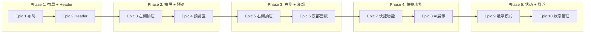

# AGENTS.md - VibeX 首页重构协作指南

> **项目**: vibex-homepage-redesign  
> **版本**: v1.0  
> **日期**: 2026-03-21

---

## 1. 项目概述

VibeX 首页重构，基于 v4 原型实现 3×3 网格布局、步骤指示器、AI 分析、SSE 实时通信。

### 1.1 技术栈

| 层级 | 技术 |
|------|------|
| 前端 | Next.js 16.2, Tailwind CSS, Zustand |
| 后端 | Fastify 4.x, PostgreSQL, Redis |
| 实时 | SSE (Server-Sent Events) |
| AI | OpenAI API (GPT-4o) |

### 1.2 工作目录

```
/root/.openclaw/vibex
```

---

## 2. 目录结构

```
vibex/
├── vibex-frontend/              # 前端代码
│   ├── src/
│   │   ├── app/
│   │   │   └── page.tsx        # 首页容器
│   │   ├── components/
│   │   │   ├── Header/         # Header 组件
│   │   │   ├── Drawers/
│   │   │   │   ├── LeftDrawer/ # 左侧抽屉
│   │   │   │   └── RightDrawer/# 右侧抽屉
│   │   │   ├── PreviewArea/    # 预览区
│   │   │   └── BottomPanel/    # 底部面板
│   │   │       ├── InputArea/  # 录入区
│   │   │       ├── ActionBar/  # 操作栏
│   │   │       ├── AIDisplay/ # AI 展示
│   │   │       └── FloatBar/   # 悬浮栏
│   │   ├── store/
│   │   │   ├── designStore.ts  # 设计状态
│   │   │   └── uiStore.ts      # UI 状态
│   │   └── styles/
│   │       └── tokens.css     # CSS 变量
│   └── __tests__/              # 测试文件
│
├── vibex-backend/              # 后端代码
│   ├── src/
│   │   ├── routes/
│   │   │   ├── auth.ts        # 认证路由
│   │   │   ├── analyze.ts     # 分析路由
│   │   │   ├── projects.ts    # 项目路由
│   │   │   └── ...
│   │   ├── services/
│   │   │   ├── auth.service.ts
│   │   │   ├── analyze.service.ts
│   │   │   └── ...
│   │   └── plugins/
│   │       ├── redis.ts
│   │       └── sse.ts
│   └── __tests__/              # 测试文件
│
├── docs/
│   └── homepage-redesign/     # 项目文档
│       ├── architecture.md     # 架构设计
│       ├── IMPLEMENTATION_PLAN.md
│       ├── AGENTS.md          # 本文件
│       ├── prd.md             # PRD
│       ├── analysis.md        # 需求分析
│       └── specs/             # 详细规格
│           └── epic-X/
│
└── scripts/
    └── deploy.sh              # 部署脚本
```

---

## 3. Agent 专属命令

### 3.1 Dev Agent

```bash
# 前端开发
cd /root/.openclaw/vibex/vibex-frontend
npm run dev                    # 启动开发服务器
npm run build                  # 构建
npm run lint                   # ESLint
npm test                       # 运行测试

# 后端开发
cd /root/.openclaw/vibex/vibex-backend
npm run dev                    # 启动开发服务器
npm run build                  # 构建
npm test                       # 运行测试

# 组件开发模板
# FE-1.1.1: 页面容器组件
# 创建: src/components/PageContainer/index.tsx
# 测试: src/components/PageContainer/__tests__/index.test.tsx
```

### 3.2 Tester Agent

```bash
# 单元测试
cd /root/.openclaw/vibex/vibex-frontend
npm test -- --grep "PreviewArea"

# E2E 测试
npx playwright test homepage.spec.ts

# 测试覆盖率
npm test -- --coverage
```

### 3.3 Reviewer Agent

```bash
# 代码质量检查
npm run lint
npm run type-check

# 安全扫描
npm audit

# 变更检查
git diff origin/main --stat
```

### 3.4 PM Agent

```bash
# 任务进度
python3 /root/.openclaw/skills/team-tasks/scripts/task_manager.py status vibex-homepage-redesign

# 导出报告
python3 /root/.openclaw/skills/team-tasks/scripts/task_manager.py result vibex-homepage-redesign
```

### 3.5 Analyst Agent

```bash
# 需求分析
cat /root/.openclaw/vibex/docs/homepage-redesign/analysis.md

# API 契约
cat /root/.openclaw/vibex/docs/首页API契约.md
```

### 3.6 Architect Agent

```bash
# 架构文档
cat /root/.openclaw/vibex/docs/homepage-redesign/architecture.md

# 实施计划
cat /root/.openclaw/vibex/docs/homepage-redesign/IMPLEMENTATION_PLAN.md
```

---

## 4. 协作流程

### 4.1 开发流程



### 4.2 任务领取

```bash
# Dev 领取任务
python3 /root/.openclaw/skills/team-tasks/scripts/task_manager.py claim vibex-homepage-redesign <task-id>

# 示例: 领取 Epic 1 Story 1.1
python3 /root/.openclaw/skills/team-tasks/scripts/task_manager.py claim vibex-homepage-redesign epic-1-story-1.1
```

### 4.3 任务完成

```bash
# 标记完成
python3 /root/.openclaw/skills/team-tasks/scripts/task_manager.py update vibex-homepage-redesign <task-id> done

# 示例: 标记 Epic 1 Story 1.1 完成
python3 /root/.openclaw/skills/team-tasks/scripts/task_manager.py update vibex-homepage-redesign epic-1-story-1.1 done
```

---

## 5. 代码规范

### 5.1 命名规范

| 类型 | 规范 | 示例 |
|------|------|------|
| 组件 | PascalCase | `PreviewArea.tsx` |
| Hooks | camelCase + use 前缀 | `useDesignStore.ts` |
| 测试 | 与源文件同目录 | `PreviewArea.test.tsx` |
| CSS 模块 | kebab-case | `page-container.module.css` |

### 5.2 提交规范

```
<type>(<scope>): <subject>

Types:
- feat: 新功能
- fix: Bug 修复
- refactor: 重构
- test: 测试
- docs: 文档
- style: 格式

Examples:
- feat(preview): 添加 Mermaid 渲染功能
- fix(drawer): 修复抽屉层级问题
- refactor(store): 重构 designStore
```

### 5.3 PR 规范

```markdown
## 描述
[简要描述改动]

## 改动类型
- [ ] 新功能
- [ ] Bug 修复
- [ ] 重构
- [ ] 测试

## 测试
- [ ] 单元测试通过
- [ ] E2E 测试通过
- [ ] Lighthouse 性能 > 80

## 截图/录屏
[如有 UI 改动，附上截图]
```

---

## 6. 验收标准

### 6.1 Dev 完成标准

- [ ] 代码提交到 `vibex-frontend` / `vibex-backend`
- [ ] `git status --porcelain` 无未提交文件
- [ ] 测试文件存在
- [ ] `npm test` 全部通过

### 6.2 Tester 完成标准

- [ ] `npm test` 100% 通过
- [ ] E2E 测试截图/日志
- [ ] 性能测试通过

### 6.3 Reviewer 完成标准

- [ ] 代码质量检查通过
- [ ] 安全扫描无漏洞
- [ ] CHANGELOG 已更新
- [ ] 远程 commit 存在

---

## 7. 关键文件

### 7.1 设计文档

| 文件 | 说明 |
|------|------|
| `docs/homepage-redesign/prd.md` | 产品需求文档 |
| `docs/homepage-redesign/analysis.md` | 需求分析报告 |
| `docs/homepage-redesign/architecture.md` | 架构设计文档 |
| `docs/homepage-redesign/IMPLEMENTATION_PLAN.md` | 实施计划 |
| `docs/首页API契约.md` | API 接口定义 |
| `vibex-frontend/src/styles/tokens.css` | CSS 设计令牌 |

### 7.2 核心文件

| 文件 | 说明 |
|------|------|
| `vibex-frontend/src/app/page.tsx` | 首页入口 |
| `vibex-frontend/src/store/designStore.ts` | 设计状态管理 |
| `vibex-frontend/src/store/uiStore.ts` | UI 状态管理 |
| `vibex-backend/src/routes/analyze.ts` | 分析 API |
| `vibex-backend/src/plugins/sse.ts` | SSE 插件 |

---

## 8. 常见问题

### 8.1 Mermaid 渲染失败

**症状**: `.mermaid svg` 不存在

**排查**:
1. 检查 Mermaid.js 库是否正确加载
2. 检查容器 div 是否有 `class="mermaid"`
3. 检查代码是否包含 `graph TD` 等关键字

**解决**: 重构为服务端渲染或增加错误边界

### 8.2 SSE 连接断开

**症状**: 实时数据不更新

**排查**:
1. 检查 Redis 连接状态
2. 检查 SSE 心跳间隔
3. 检查网络代理超时设置

**解决**: 实现断线重连机制

### 8.3 状态不同步

**症状**: 步骤切换后预览区未更新

**排查**:
1. 检查 Zustand store 是否正确更新
2. 检查 SSE 事件是否正确触发
3. 检查组件是否正确订阅 store

**解决**: 使用 Zustand DevTools 调试

---

## 9. 联系方式

| Agent | Channel | 职责 |
|-------|---------|------|
| Dev | #dev | 前端/后端开发 |
| Tester | #tester | 测试验证 |
| Reviewer | #reviewer | 代码审查 |
| PM | #pm | 项目管理 |
| Analyst | #analyst | 需求分析 |
| Architect | #architect | 架构设计 |
| Coord | #coord | 协调调度 |

---

*协作指南 - Architect Agent | vibex-homepage-redesign*
