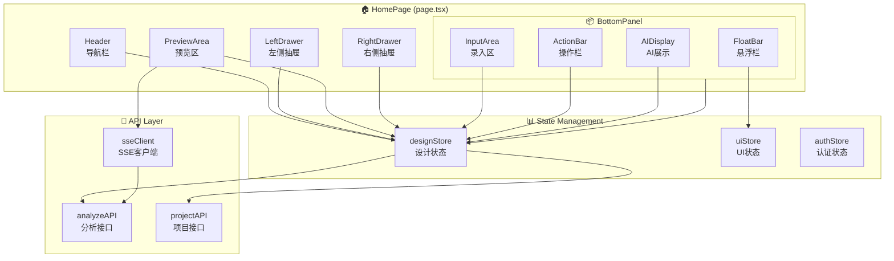
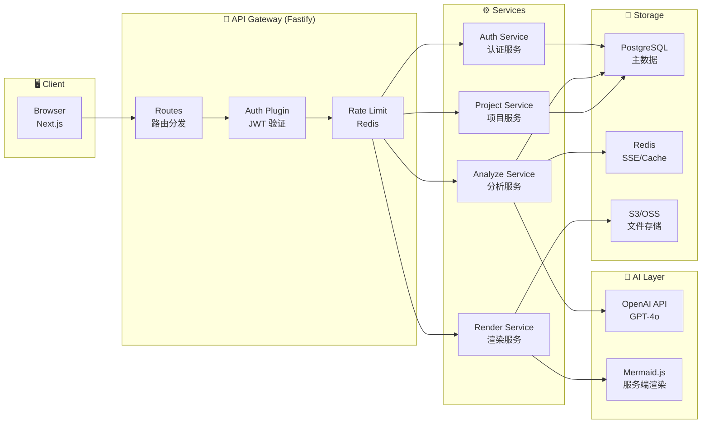
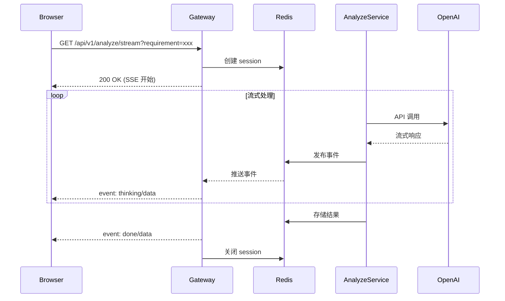
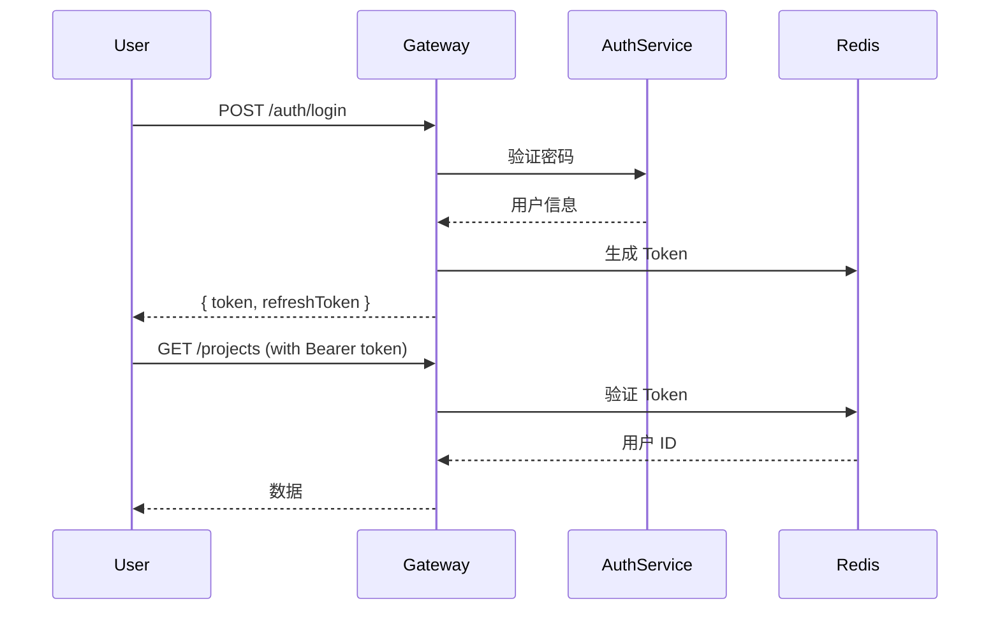
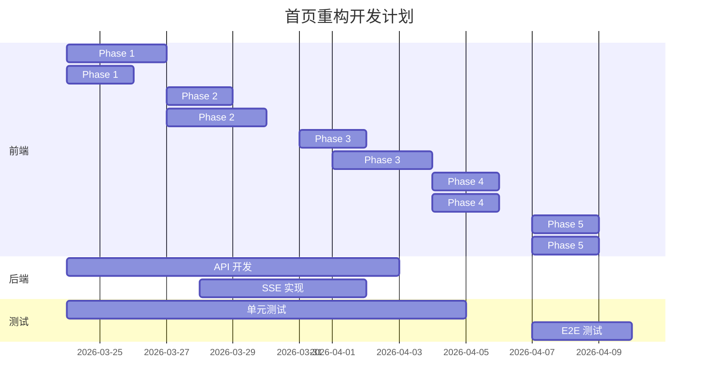

# Architecture: VibeX 首页重构

> **项目**: vibex-homepage-redesign  
> **版本**: v1.0  
> **日期**: 2026-03-21  
> **Agent**: Architect  
> **状态**: Draft

---

## 1. 执行摘要

基于 PRD v1.0，完成 VibeX 首页前后端架构设计。10 Epic，42 Story，138+ Task。

| 指标 | 值 |
|------|-----|
| 前端组件数 | 25+ |
| 后端 API 数 | 24 |
| 预计工时 | 68h |
| P0 功能 | 32 Task |

---

## 2. 技术栈

| 层级 | 技术选型 | 版本 | 说明 |
|------|----------|------|------|
| 前端框架 | Next.js | 16.2.x | App Router, RSC |
| UI 库 | Tailwind CSS + Radix | - | 原子化 CSS + 无障碍组件 |
| 状态管理 | Zustand | 5.x | 轻量级, 支持 persist |
| 图表渲染 | Mermaid | 11.x | 前端渲染 |
| 后端框架 | Fastify | 4.x | 高性能 Node.js |
| 数据库 | PostgreSQL | 16.x | JSONB 存储分析结果 |
| 缓存 | Redis | 7.x | SSE 会话, 限流 |
| 实时通信 | SSE | - | Server-Sent Events |

**选型理由**:
- Next.js 16 + Tailwind: 已有技术栈，复用 `tokens.css`
- Zustand: 比 Redux 轻量，`persist` middleware 支持 localStorage
- Mermaid 11: 支持 dark theme，与 tokens.css 主题系统兼容
- Fastify: 比 Express 快 2x，支持 schema validation

---

## 3. 前端架构

### 3.1 组件架构图



### 3.2 组件清单

| 组件 | 路径 | 职责 | 状态 |
|------|------|------|------|
| HomePage | `src/app/page.tsx` | 页面容器, Grid 布局 | 新建 |
| Header | `src/components/Header/` | Logo, 导航, 登录 | 重构 |
| LeftDrawer | `src/components/Drawers/LeftDrawer/` | 步骤指示器 | 新建 |
| PreviewArea | `src/components/PreviewArea/` | 预览区, Mermaid | 重构 |
| RightDrawer | `src/components/Drawers/RightDrawer/` | AI 思考 | 新建 |
| BottomPanel | `src/components/BottomPanel/` | 底部面板容器 | 重构 |
| InputArea | `src/components/BottomPanel/InputArea/` | 需求录入 | 重构 |
| ActionBar | `src/components/BottomPanel/ActionBar/` | 操作按钮 | 新建 |
| AIDisplay | `src/components/BottomPanel/AIDisplay/` | AI 结果展示 | 新建 |
| FloatBar | `src/components/BottomPanel/FloatBar/` | 悬浮模式 | 新建 |

### 3.3 状态管理设计

```typescript
// src/store/designStore.ts
interface DesignState {
  // 步骤控制
  currentStep: 1 | 2 | 3 | 4;
  completedSteps: number[];
  
  // 分析数据
  requirement: string;
  boundedContexts: BoundedContext[];
  domainModels: DomainModel[];
  flowCharts: FlowChart[];
  
  // SSE 状态
  sseStatus: 'disconnected' | 'connecting' | 'connected' | 'error';
  thinkingMessages: ThinkingMessage[];
  
  // 草稿
  draft: Draft | null;
  isDirty: boolean;
  
  // 操作
  actions: {
    setStep: (step: number) => void;
    submitRequirement: (req: string) => Promise<void>;
    regenerate: () => Promise<void>;
    saveDraft: () => Promise<void>;
    loadDraft: (id: string) => Promise<void>;
  };
}
```

```typescript
// src/store/uiStore.ts
interface UIState {
  // 布局状态
  leftDrawerOpen: boolean;
  rightDrawerOpen: boolean;
  bottomPanelHeight: number;
  
  // 悬浮模式
  floatMode: boolean;
  floatModeTriggered: boolean;
  
  // 主题
  theme: 'light' | 'dark' | 'auto';
  
  // 预览交互
  zoomLevel: number;
  panOffset: { x: number; y: number };
}
```

### 3.4 CSS 架构

```css
/* src/app/page.module.css */
.page-container {
  /* Grid 3×3 布局 */
  display: grid;
  grid-template-areas:
    "header header header"
    "left preview right"
    "left bottom-panel right";
  grid-template-rows: 64px 1fr auto;
  grid-template-columns: 280px 1fr 320px;
  height: 100vh;
  max-width: var(--container-xl, 1400px);
  margin: 0 auto;
}

/* 响应式断点 */
@media (max-width: 1200px) {
  .page-container {
    grid-template-columns: 240px 1fr 280px;
  }
}

@media (max-width: 900px) {
  .page-container {
    grid-template-areas:
      "header"
      "preview"
      "bottom-panel";
    grid-template-columns: 1fr;
    grid-template-rows: 64px 1fr auto;
  }
  .left-drawer,
  .right-drawer {
    display: none;
  }
}
```

---

## 4. 后端架构

### 4.1 服务架构图



### 4.2 API 路由设计

```
/api/v1/
├── auth/
│   ├── login          POST   登录
│   ├── register       POST   注册
│   ├── logout         POST   登出
│   ├── refresh        POST   刷新 Token
│   ├── google         GET    Google OAuth
│   ├── google/callback GET   OAuth 回调
│   ├── verify-email   GET    邮箱验证
│   ├── forgot-password POST   忘记密码
│   └── reset-password  POST   重置密码
│
├── users/
│   └── me             GET/PATCH 个人信息
│   └── me/avatar      POST      头像上传
│
├── analyze/
│   ├──                POST   同步分析
│   ├── stream         GET    SSE 流式分析
│   ├── diagnose       POST   智能诊断
│   ├── optimize      POST   优化建议
│   └── clarify/stream GET   SSE 澄清对话
│
├── drafts/
│   ├──                GET/POST   草稿列表/创建
│   └── /:id          GET/DELETE 草稿详情/删除
│
├── projects/
│   ├──                GET/POST   项目列表/创建
│   ├── /:id          GET/PATCH/DELETE  项目详情/更新/删除
│   ├── /:id/publish  POST   发布项目
│   ├── /:id/clone    POST   复制项目
│   └── /:id/export   GET    导出项目
│
├── templates/
│   ├──                GET    模板列表
│   ├── /:id          GET    模板详情
│   └── /:id/apply    POST   应用模板
│
├── render/
│   ├── mermaid        POST   Mermaid 渲染
│   └── export         POST   图表导出
│
├── history/
│   ├──                GET    历史列表
│   └── /:id          GET    历史详情
│
└── webhooks/
    └── project-status POST   项目状态回调
```

### 4.3 数据库设计

```sql
-- 核心表结构

-- 用户表
CREATE TABLE users (
  id UUID PRIMARY KEY DEFAULT gen_random_uuid(),
  email VARCHAR(255) UNIQUE NOT NULL,
  password_hash VARCHAR(255),
  name VARCHAR(100),
  avatar_url TEXT,
  plan VARCHAR(20) DEFAULT 'free',
  email_verified BOOLEAN DEFAULT FALSE,
  created_at TIMESTAMPTZ DEFAULT NOW(),
  updated_at TIMESTAMPTZ DEFAULT NOW()
);

-- 项目表
CREATE TABLE projects (
  id UUID PRIMARY KEY DEFAULT gen_random_uuid(),
  user_id UUID REFERENCES users(id),
  name VARCHAR(100) NOT NULL,
  description TEXT,
  requirement TEXT NOT NULL,
  analysis JSONB NOT NULL,  -- 存储 BoundedContext[], DomainModel[], FlowChart[]
  status VARCHAR(20) DEFAULT 'draft',
  tags TEXT[],
  created_at TIMESTAMPTZ DEFAULT NOW(),
  updated_at TIMESTAMPTZ DEFAULT NOW()
);

-- 草稿表
CREATE TABLE drafts (
  id UUID PRIMARY KEY DEFAULT gen_random_uuid(),
  user_id UUID REFERENCES users(id),
  type VARCHAR(20) NOT NULL,  -- 'analysis' | 'conversation'
  data JSONB NOT NULL,
  auto_save BOOLEAN DEFAULT FALSE,
  created_at TIMESTAMPTZ DEFAULT NOW(),
  updated_at TIMESTAMPTZ DEFAULT NOW()
);

-- 分析历史表
CREATE TABLE analysis_history (
  id UUID PRIMARY KEY DEFAULT gen_random_uuid(),
  user_id UUID REFERENCES users(id),
  type VARCHAR(20) NOT NULL,
  requirement TEXT,
  preview TEXT,
  messages JSONB,
  result JSONB,
  created_at TIMESTAMPTZ DEFAULT NOW()
);

-- 索引
CREATE INDEX idx_projects_user_id ON projects(user_id);
CREATE INDEX idx_projects_status ON projects(status);
CREATE INDEX idx_drafts_user_id ON drafts(user_id);
CREATE INDEX idx_history_user_id ON analysis_history(user_id);
```

---

## 5. SSE 架构

### 5.1 连接流程



### 5.2 SSE 事件类型

```typescript
type SSEEvent = 
  | { event: 'connected'; data: { sessionId: string } }
  | { event: 'thinking'; data: ThinkingMessage }
  | { event: 'progress'; data: { step: number; total: number; percent: number } }
  | { event: 'bounded-contexts'; data: { boundedContexts: BoundedContext[] } }
  | { event: 'domain-models'; data: { domainModels: DomainModel[] } }
  | { event: 'flow-charts'; data: { flowCharts: FlowChart[] } }
  | { event: 'result'; data: AnalysisResult }
  | { event: 'error'; data: { code: string; message: string } }
  | { event: 'done'; data: { processingTime: number; tokensUsed: number } };
```

---

## 6. 性能优化

### 6.1 前端优化

| 策略 | 实现 | 预期收益 |
|------|------|----------|
| 代码分割 | Next.js Dynamic Import | 首屏 -40% JS |
| 状态懒加载 | Suspense + lazy | 初始 Bundle -30% |
| Mermaid 缓存 | useMemo + 虚拟化 | 重渲染 -70% |
| SSE 连接池 | 复用连接 | 延迟 -50ms |
| localStorage 压缩 | lz-string | 存储 -60% |

### 6.2 后端优化

| 策略 | 实现 | 预期收益 |
|------|------|----------|
| 连接池 | PgBouncer | QPS +100% |
| Redis 缓存 | 分析结果缓存 5min | DB 查询 -80% |
| 流式响应 | ReadableStream | TTFB -200ms |
| 限流 | Sliding Window | 防止滥用 |

---

## 7. 安全设计

### 7.1 认证流程



### 7.2 安全措施

| 风险 | 防护措施 |
|------|----------|
| XSS | CSP + Input Sanitization |
| CSRF | SameSite Cookie + CSRF Token |
| SQL 注入 | Parameterized Query |
| Token 泄露 | HTTPS Only + Short Expiry |
| 暴力破解 | 限流 + 渐进延迟 |
| 数据泄露 | 字段级加密敏感数据 |

---

## 8. 测试策略

### 8.1 测试金字塔

```
        /\
       /  \
      / E2E \        ← 10% (关键路径)
     /--------\
    /Integration\   ← 30% (API + 组件)
   /--------------\
  /   Unit Tests  \ ← 60% (函数 + 组件)
 /----------------\
```

### 8.2 测试用例设计

| 类型 | 工具 | 覆盖率目标 | 关键用例 |
|------|------|------------|----------|
| 单元测试 | Vitest | >80% | designStore actions, CSS 变量 |
| 组件测试 | Testing Library | >70% | HomePage 渲染, 交互 |
| 集成测试 | Vitest + MSW | >60% | API 响应, SSE 连接 |
| E2E 测试 | Playwright | 核心流程 | 登录→分析→创建项目 |

### 8.3 关键测试用例示例

```typescript
// src/__tests__/components/PreviewArea.test.tsx
describe('PreviewArea', () => {
  it('应渲染 Mermaid 图表', async () => {
    const { container } = render(<PreviewArea code="graph TD; A-->B" />);
    await waitFor(() => {
      expect(container.querySelector('.mermaid svg')).toBeInTheDocument();
    });
  });
  
  it('错误时显示重试按钮', async () => {
    mockMermaidRender.mockRejectedValue(new Error('Render failed'));
    render(<PreviewArea code="invalid" />);
    expect(screen.getByText(/重试/i)).toBeInTheDocument();
  });
});

// src/__tests__/store/designStore.test.ts
describe('designStore', () => {
  it('步骤切换应更新状态', () => {
    const { result } = renderHook(() => useDesignStore());
    act(() => {
      result.current.actions.setStep(2);
    });
    expect(result.current.currentStep).toBe(2);
  });
});
```

---

## 9. 实施计划

### 9.1 Phase 划分

| Phase | Epic | 组件 | 工时 | 交付物 |
|-------|------|------|------|--------|
| P1 | Epic 1-2 | 布局框架, Header | 12h | 静态页面 |
| P2 | Epic 3-4 | 左侧抽屉, 预览区 | 16h | 核心功能 |
| P3 | Epic 5-6 | 右侧抽屉, 底部面板 | 16h | 完整录入 |
| P4 | Epic 7-8 | 快捷功能, AI 展示 | 12h | 增强功能 |
| P5 | Epic 9-10 | 悬浮模式, 状态管理 | 12h | 收尾优化 |

### 9.2 开发顺序



---

## 10. 风险评估

| 风险 | 概率 | 影响 | 缓解措施 |
|------|------|------|----------|
| Mermaid 渲染性能 | 中 | 中 | 服务端渲染 + 缓存 |
| SSE 连接不稳定 | 中 | 高 | 自动重连 + 状态同步 |
| 大文件上传超时 | 低 | 中 | 分片上传 + 断点续传 |
| 复杂状态同步 | 高 | 高 | Zustand persist + 乐观更新 |
| 移动端适配 | 中 | 中 | 响应式断点 + 手势支持 |

---

## 11. 架构决策记录

### ADR-001: 状态管理选型

**决策**: 使用 Zustand 替代 Redux Toolkit

**理由**:
- Bundle size: Zustand 1KB vs RTK 12KB
- Boilerplate: Zustand 减少 70% 代码
- 支持 persist middleware，直接对接 localStorage

**代价**:
- DevTools 支持不如 Redux 完善
- 社区生态较小

### ADR-002: SSE vs WebSocket

**决策**: 使用 SSE 替代 WebSocket

**理由**:
- 单向通信，SSE 更轻量
- 自动重连，内置支持
- HTTP/2 多路复用

**代价**:
- 不支持双向通信（如需双向需额外 API）
- IE 不支持（可降级）

---

*架构设计文档 - Architect Agent | vibex-homepage-redesign*
