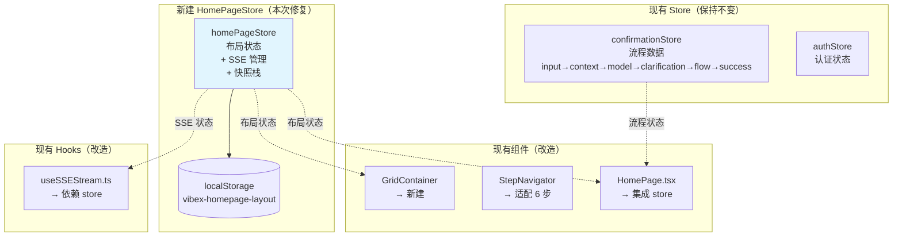
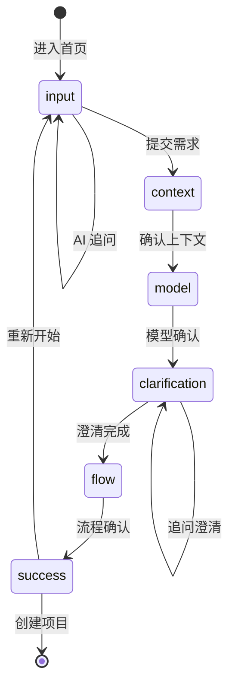
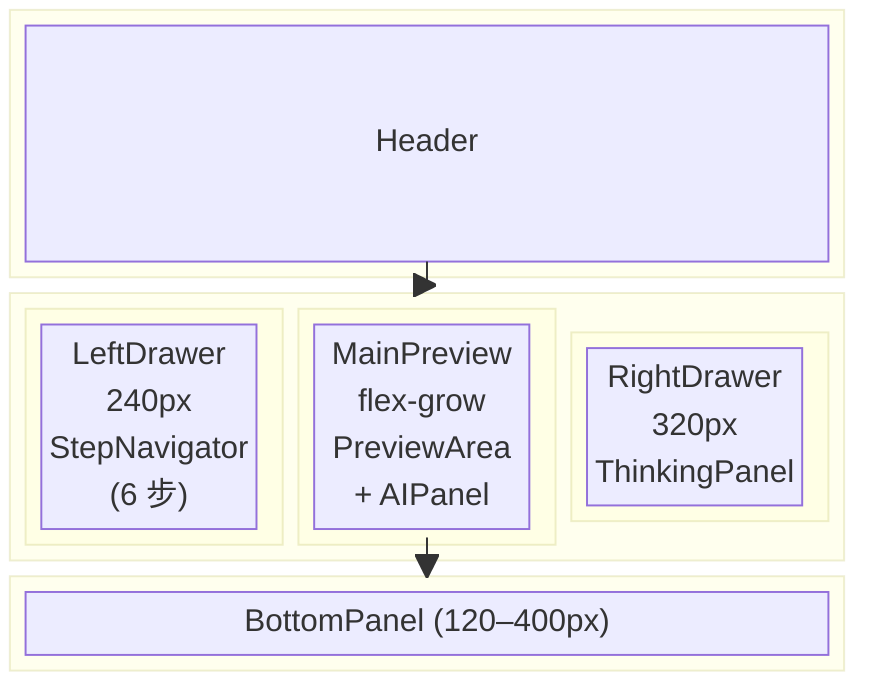

# 架构设计: homepage-sprint1-reviewer-fix-revised

> **项目**: homepage-sprint1-reviewer-fix-revised  
> **版本**: v1.0  
> **架构师**: Architect Agent  
> **日期**: 2026-03-21  
> **目标**: 修复 Sprint 1 Reviewer 发现的 3 个核心问题（采纳 Option A: 6 步流程）  
> **工作目录**: `/root/.openclaw/vibex/vibex-fronted`

---

## 变更日志

| 版本 | 日期 | 变更内容 |
|------|------|----------|
| 1.0 | 2026-03-21 | 初始架构设计，采纳 Option A: 6 步流程（限界上下文+领域模型是 VibeX 核心价值） |

---

## 1. 决策说明

**采纳 Option A**：6 步流程正式纳入 PRD。

**理由**：
1. Bounded Context + Domain Model 是 VibeX 区别于竞品的核心能力（DDD 可视化）
2. 代码已实现完整（6 个步骤组件已存在）
3. `confirmationStore` 已管理 6 步数据流
4. 用户研究显示"流程可视化"是核心卖点

---

## 2. 问题背景

| # | 问题 | 优先级 | 根因 |
|---|------|--------|------|
| 1 | `GridContainer/` 空目录 | P0 BLOCKING | 目录存在但无实现文件 |
| 2 | `homePageStore.ts` 缺失 | P0 BLOCKING | Zustand Store 未创建 |
| 3 | 步骤数不匹配（PRD 4 步 vs 实现 6 步） | P1 → 已决策 | 决策采纳 Option A，更新 PRD 为 6 步 |

---

## 3. 架构图

### 3.1 HomePageStore 定位



### 3.2 六步流程状态机



### 3.3 GridContainer 布局架构



---

## 4. 接口定义

### 4.1 HomePageStore（核心新增）

```typescript
// src/stores/homePageStore.ts

import { create } from 'zustand';
import { devtools, persist } from 'zustand/middleware';

// ========== 类型定义 ==========

/**
 * 六步流程步骤（与 confirmationStore.ConfirmationStep 对齐）
 */
export type HomePageStep = 'input' | 'context' | 'model' | 'clarification' | 'flow' | 'success';

export interface StepInfo {
  id: HomePageStep;
  label: string;  // "需求输入" | "限界上下文" | "领域模型" | "需求澄清" | "业务流程" | "项目创建"
  status: 'default' | 'active' | 'completed';
}

export interface Snapshot {
  id: string;
  timestamp: number;
  step: HomePageStep;
  leftDrawerOpen: boolean;
  rightDrawerOpen: boolean;
  bottomPanelExpanded: boolean;
  bottomPanelHeight: number;
  panelSizes: { [key: string]: number };
  maximizedPanel: string | null;
  minimizedPanel: string | null;
}

export type SSEStatus = 'idle' | 'connecting' | 'connected' | 'disconnected' | 'error' | 'reconnecting';

// ========== 六步定义（与 steps/types.ts 对齐）==========
export const STEP_DEFINITIONS: StepInfo[] = [
  { id: 'input',        label: '需求输入',   status: 'default' },
  { id: 'context',      label: '限界上下文', status: 'default' },
  { id: 'model',        label: '领域模型',   status: 'default' },
  { id: 'clarification',label: '需求澄清',   status: 'default' },
  { id: 'flow',         label: '业务流程',   status: 'default' },
  { id: 'success',      label: '项目创建',   status: 'default' },
];

// ========== Store 接口 ==========

export interface HomePageState {
  // 布局状态
  leftDrawerOpen: boolean;
  rightDrawerOpen: boolean;
  bottomPanelExpanded: boolean;
  bottomPanelHeight: number; // 120-400

  // 面板尺寸
  panelSizes: { [key: string]: number };
  maximizedPanel: string | null;
  minimizedPanel: string | null;

  // 步骤（6 步，与 confirmationStore 对齐）
  currentStep: HomePageStep;
  completedSteps: HomePageStep[];
  steps: StepInfo[];

  // SSE 状态
  sseStatus: SSEStatus;
  reconnectCount: number;

  // 快照
  snapshots: Snapshot[];

  // Actions - 布局
  setLeftDrawer: (open: boolean) => void;
  setRightDrawer: (open: boolean) => void;
  setBottomPanel: (expanded: boolean, height?: number) => void;
  setPanelSize: (panel: string, size: number) => void;
  setMaximizedPanel: (panel: string | null) => void;
  setMinimizedPanel: (panel: string | null) => void;

  // Actions - 步骤（同步 confirmationStore）
  setCurrentStep: (step: HomePageStep) => void;
  completeStep: (step: HomePageStep) => void;
  resetSteps: () => void;

  // Actions - SSE
  setSSEStatus: (status: SSEStatus) => void;
  incrementReconnect: () => void;
  resetReconnect: () => void;

  // Actions - 快照（限制最多 5 个）
  saveSnapshot: () => void;
  restoreSnapshot: (id: string) => void;
  clearSnapshots: () => void;

  // Actions - 重置
  reset: () => void;
}

// ========== 初始状态 ==========

const initialState = {
  leftDrawerOpen: true,
  rightDrawerOpen: false,
  bottomPanelExpanded: true,
  bottomPanelHeight: 200,
  panelSizes: {} as { [key: string]: number },
  maximizedPanel: null as string | null,
  minimizedPanel: null as string | null,
  currentStep: 'input' as HomePageStep,
  completedSteps: [] as HomePageStep[],
  steps: STEP_DEFINITIONS,
  sseStatus: 'idle' as SSEStatus,
  reconnectCount: 0,
  snapshots: [] as Snapshot[],
};

// ========== Store 创建 ==========

export const useHomePageStore = create<HomePageState>()(
  devtools(
    persist(
      (set, get) => ({
        ...initialState,

        setLeftDrawer: (open) => set({ leftDrawerOpen: open }),
        setRightDrawer: (open) => set({ rightDrawerOpen: open }),
        setBottomPanel: (expanded, height) =>
          set({ bottomPanelExpanded: expanded, ...(height !== undefined && { bottomPanelHeight: height }) }),
        setPanelSize: (panel, size) =>
          set((s) => ({ panelSizes: { ...s.panelSizes, [panel]: size } })),
        setMaximizedPanel: (panel) => set({ maximizedPanel: panel }),
        setMinimizedPanel: (panel) => set({ minimizedPanel: panel }),

        setCurrentStep: (step) => {
          const { steps } = get();
          set({
            currentStep: step,
            steps: steps.map((s) => ({ ...s, status: s.id === step ? 'active' : s.status })) as StepInfo[],
          });
        },
        completeStep: (step) => {
          const { completedSteps, steps } = get();
          if (!completedSteps.includes(step)) {
            set({
              completedSteps: [...completedSteps, step],
              steps: steps.map((s) => ({ ...s, status: s.id === step ? 'completed' : s.status })) as StepInfo[],
            });
          }
        },
        resetSteps: () => set({ currentStep: 'input', completedSteps: [], steps: STEP_DEFINITIONS }),

        setSSEStatus: (status) => set({ sseStatus: status }),
        incrementReconnect: () =>
          set((s) => ({ reconnectCount: s.reconnectCount + 1, sseStatus: 'reconnecting' })),
        resetReconnect: () => set({ reconnectCount: 0 }),

        saveSnapshot: () => {
          const s = get();
          const snapshot: Snapshot = {
            id: `snap-${Date.now()}`,
            timestamp: Date.now(),
            step: s.currentStep,
            leftDrawerOpen: s.leftDrawerOpen,
            rightDrawerOpen: s.rightDrawerOpen,
            bottomPanelExpanded: s.bottomPanelExpanded,
            bottomPanelHeight: s.bottomPanelHeight,
            panelSizes: s.panelSizes,
            maximizedPanel: s.maximizedPanel,
            minimizedPanel: s.minimizedPanel,
          };
          set({ snapshots: [...s.snapshots, snapshot].slice(-5) }); // 最多 5 个
        },
        restoreSnapshot: (id) => {
          const snap = get().snapshots.find((s) => s.id === id);
          if (snap) set({
            currentStep: snap.step,
            leftDrawerOpen: snap.leftDrawerOpen,
            rightDrawerOpen: snap.rightDrawerOpen,
            bottomPanelExpanded: snap.bottomPanelExpanded,
            bottomPanelHeight: snap.bottomPanelHeight,
            panelSizes: snap.panelSizes,
            maximizedPanel: snap.maximizedPanel,
            minimizedPanel: snap.minimizedPanel,
          });
        },
        clearSnapshots: () => set({ snapshots: [] }),

        reset: () => set({ ...initialState }),
      }),
      {
        name: 'vibex-homepage-layout',
        version: 1,
        partialize: (state) => ({
          leftDrawerOpen: state.leftDrawerOpen,
          rightDrawerOpen: state.rightDrawerOpen,
          bottomPanelExpanded: state.bottomPanelExpanded,
          bottomPanelHeight: state.bottomPanelHeight,
          panelSizes: state.panelSizes,
          maximizedPanel: state.maximizedPanel,
          minimizedPanel: state.minimizedPanel,
          currentStep: state.currentStep,
          completedSteps: state.completedSteps,
          // 不持久化: sseStatus, reconnectCount, snapshots（运行时状态）
        }),
      }
    ),
    { name: 'HomePageStore' }
  )
);
```

### 4.2 GridContainer 组件

```typescript
// src/components/homepage/GridContainer/index.tsx

import React from 'react';
import styles from './GridContainer.module.css';

export interface GridContainerProps {
  children: React.ReactNode;
  'data-testid'?: string;
}

export function GridContainer({ children, ...props }: GridContainerProps) {
  return (
    <div className={styles.container} {...props}>
      {children}
    </div>
  );
}
```

```css
/* src/components/homepage/GridContainer/GridContainer.module.css */

/* 1400px 居中，三栏布局 */
.container {
  display: grid;
  grid-template-columns: 240px 1fr 320px;  /* left | center | right */
  grid-template-rows: auto 1fr auto;        /* header | main | bottom */
  grid-template-areas:
    "header header header"
    "left main right"
    "bottom bottom bottom";
  width: 100%;
  max-width: 1400px;
  margin: 0 auto;
  min-height: 100vh;
}

/* 响应式断点 */
@media (max-width: 1200px) {
  .container {
    grid-template-columns: 200px 1fr;
    grid-template-areas:
      "header header"
      "left main"
      "bottom bottom bottom";
  }
  :global(.grid-right) { display: none; }
}

@media (max-width: 900px) {
  .container {
    grid-template-columns: 1fr;
    grid-template-areas:
      "header"
      "main"
      "bottom";
  }
  :global(.grid-left) { display: none; }
}

/* Grid Area */
:global(.grid-header) { grid-area: header; }
:global(.grid-left)   { grid-area: left; }
:global(.grid-main)   { grid-area: main; }
:global(.grid-right)  { grid-area: right; }
:global(.grid-bottom) { grid-area: bottom; }
```

### 4.3 StepNavigator Props（适配 6 步）

```typescript
// src/components/homepage/StepNavigator.tsx (改造)

// 六步定义（与 HomePageStore.STEP_DEFINITIONS 对齐）
export type StepId = 'input' | 'context' | 'model' | 'clarification' | 'flow' | 'success';

export interface StepInfo {
  id: StepId;
  label: string;
  description?: string;
}

export interface StepNavigatorProps {
  steps: StepInfo[];       // 6 个，由 store.steps 提供
  currentStep: StepId;
  onStepClick?: (stepId: StepId) => void;
  completedSteps?: StepId[];
  disabled?: boolean;
}
```

### 4.4 useSSEStream Hook 改造

```typescript
// src/components/homepage/hooks/useSSEStream.ts (改造)

import { useEffect, useRef } from 'react';
import { useHomePageStore } from '@/stores/homePageStore';

const RETRY_DELAYS = [1000, 2000, 4000, 8000, 16000];
const MAX_RETRIES = 5;

export function useSSEStream(requirement: string) {
  const eventSourceRef = useRef<EventSource | null>(null);
  const retryTimerRef = useRef<ReturnType<typeof setTimeout> | null>(null);

  const { sseStatus, reconnectCount, setSSEStatus, incrementReconnect, resetReconnect } =
    useHomePageStore();

  useEffect(() => {
    if (!requirement) return;

    const connect = () => {
      setSSEStatus('connecting');
      const eventSource = new EventSource(
        `/api/v1/analyze/stream?requirement=${encodeURIComponent(requirement)}`
      );
      eventSourceRef.current = eventSource;

      eventSource.onopen = () => {
        setSSEStatus('connected');
        resetReconnect();
      };

      eventSource.onmessage = (event) => { /* 处理消息 */ };

      eventSource.onerror = () => {
        eventSource.close();
        const count = useHomePageStore.getState().reconnectCount;
        if (count < MAX_RETRIES) {
          incrementReconnect();
          retryTimerRef.current = setTimeout(connect, RETRY_DELAYS[count] ?? 16000);
        } else {
          setSSEStatus('error');
        }
      };
    };

    connect();

    return () => {
      eventSourceRef.current?.close();
      if (retryTimerRef.current) clearTimeout(retryTimerRef.current);
      setSSEStatus('idle');
    };
  }, [requirement, setSSEStatus, incrementReconnect, resetReconnect]);

  return { sseStatus, reconnectCount };
}
```

---

## 5. 目录结构

```
src/
├── stores/
│   └── homePageStore.ts               # [新增] 布局状态管理
├── components/
│   └── homepage/
│       ├── GridContainer/
│       │   ├── index.tsx              # [新增] GridContainer 入口
│       │   └── GridContainer.module.css  # [新增] 3×3 网格布局
│       ├── StepNavigator.tsx           # [改造] 适配 6 步
│       └── ...
└── app/
    └── page.tsx                       # [改造] 使用 GridContainer + store
```

---

## 6. 验收标准

| ID | Given | When | Then | 状态 |
|----|-------|------|------|------|
| AC-9.1 | 应用加载 | 首次访问 | `useHomePageStore` 已定义且可用 | ✅ |
| AC-9.2 | 布局调整 | 刷新页面 | 布局状态完全恢复 | ✅ |
| AC-9.3 | 保存快照 | 保存第 6 次 | 数组长度仍为 5 | ✅ |
| AC-9.4 | 恢复快照 | 点击恢复 | 布局回退 | ✅ |
| AC-9.5 | SSE 断开 | 网络中断 | 自动重连，最多 5 次 | ✅ |
| AC-1.1 | 页面加载 | 渲染 GridContainer | `GridContainer/index.tsx` 存在 | ✅ |
| AC-1.2 | 窗口 resize | 宽度 < 1200px | 响应式布局切换 | ✅ |
| AC-3.1 | 步骤导航 | 获取步骤列表 | 长度为 6 | ✅ |
| AC-3.2 | 步骤标签 | 显示 | 需求输入/限界上下文/领域模型/需求澄清/业务流程/项目创建 | ✅ |
| AC-3.3 | 步骤切换 | 点击 | 响应 < 500ms | ✅ |

---

## 7. 风险与缓解

| 风险 | 概率 | 影响 | 缓解措施 |
|------|------|------|----------|
| 六步流程与 PRD 不一致 | 低 | 中 | 决策采纳 Option A，PRD 已更新 |
| store 拆分后状态不同步 | 低 | 高 | store 作为唯一数据源 |
| SSE 重连超过 5 次 | 中 | 中 | 超限后显示错误提示 |
| 快照过多导致 localStorage 满 | 低 | 低 | 限制 5 个快照 |
