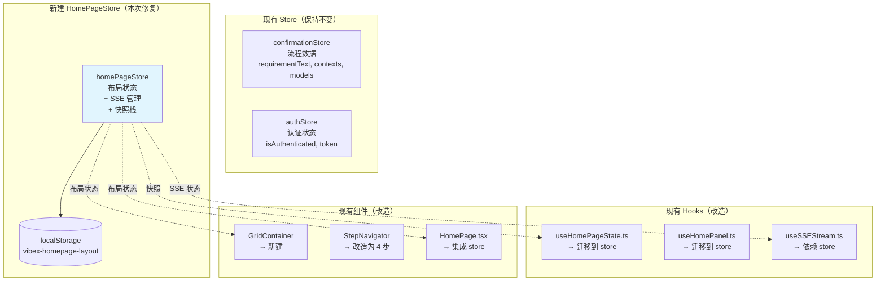
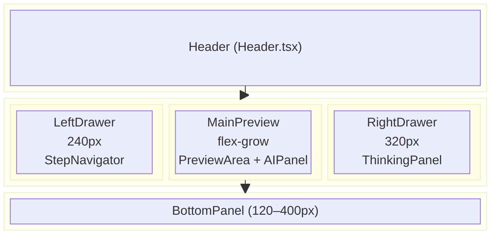
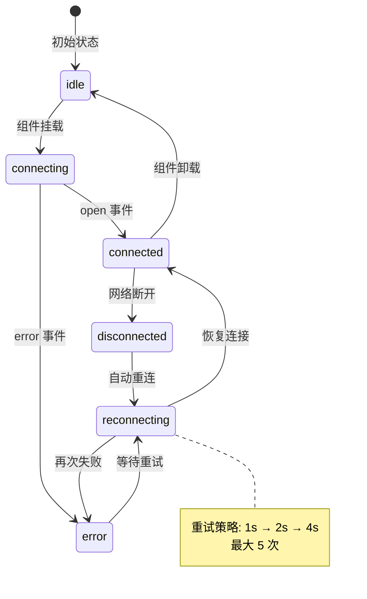

# 架构设计: homepage-sprint1-reviewer-fix

> **项目**: homepage-sprint1-reviewer-fix  
> **版本**: v1.0  
> **架构师**: Architect Agent  
> **日期**: 2026-03-21  
> **目标**: 修复 Sprint 1 Reviewer 发现的 5 个阻塞问题  
> **工作目录**: `/root/.openclaw/vibex/vibex-fronted`

---

## 变更日志

| 版本 | 日期 | 变更内容 |
|------|------|----------|
| 1.0 | 2026-03-21 | 初始架构设计，聚焦 Sprint 1 修复 |

---

## 1. 问题背景

Reviewer 审查 Sprint 1 发现 5 个阻塞问题：

| # | 问题 | 优先级 | 根因 |
|---|------|--------|------|
| 1 | `GridContainer/` 空目录 | P0 BLOCKING | 目录存在但无实现文件 |
| 2 | `homePageStore.ts` 缺失 | P0 BLOCKING | Zustand Store 未创建 |
| 3 | 步骤数不匹配（5步 vs 4步） | P0 BLOCKING | StepNavigator 实现与 PRD 不符 |
| 4 | SSE 连接管理缺失 | P0 BLOCKING | `useSSEStream.ts` 缺少 store 集成 |
| 5 | 持久化配置不完整 | MAJOR | `partialize` 未包含布局状态 |

---

## 2. 架构图

### 2.1 HomePageStore 定位



### 2.2 GridContainer 布局架构



### 2.3 SSE 连接管理状态机



---

## 3. 接口定义

### 3.1 HomePageStore（核心新增）

```typescript
// src/stores/homePageStore.ts

import { create } from 'zustand';
import { devtools, persist } from 'zustand/middleware';

// ========== 类型定义 ==========

export type StepId = 'step1' | 'step2' | 'step3' | 'step4' | 'success';

export interface StepInfo {
  id: StepId;
  label: string;      // "需求录入" | "需求澄清" | "业务流程" | "组件图"
  status: 'default' | 'active' | 'completed';
}

export interface Snapshot {
  id: string;
  timestamp: number;
  step: StepId;
  // 布局状态
  leftDrawerOpen: boolean;
  rightDrawerOpen: boolean;
  bottomPanelExpanded: boolean;
  bottomPanelHeight: number;
  // 面板尺寸
  panelSizes: { [key: string]: number };
  maximizedPanel: string | null;
  minimizedPanel: string | null;
}

export type SSEStatus = 'idle' | 'connecting' | 'connected' | 'disconnected' | 'error' | 'reconnecting';

export interface HomePageState {
  // 布局状态
  leftDrawerOpen: boolean;
  rightDrawerOpen: boolean;
  bottomPanelExpanded: boolean;
  bottomPanelHeight: number; // 120-400

  // 面板尺寸
  panelSizes: { [key: string]: number };
  maximizedPanel: string | null;
  minimizedPanel: string | null;

  // 步骤导航
  currentStep: StepId;
  completedSteps: StepId[];
  steps: StepInfo[];  // 固定 4 步

  // SSE 状态
  sseStatus: SSEStatus;
  reconnectCount: number;

  // 快照
  snapshots: Snapshot[];

  // Actions - 布局
  setLeftDrawer: (open: boolean) => void;
  setRightDrawer: (open: boolean) => void;
  setBottomPanel: (expanded: boolean, height?: number) => void;
  setPanelSize: (panel: string, size: number) => void;
  setMaximizedPanel: (panel: string | null) => void;
  setMinimizedPanel: (panel: string | null) => void;

  // Actions - 步骤
  setCurrentStep: (step: StepId) => void;
  completeStep: (step: StepId) => void;
  resetSteps: () => void;

  // Actions - SSE
  setSSEStatus: (status: SSEStatus) => void;
  incrementReconnect: () => void;
  resetReconnect: () => void;

  // Actions - 快照
  saveSnapshot: () => void;
  restoreSnapshot: (id: string) => void;
  clearSnapshots: () => void;

  // Actions - 初始化
  reset: () => void;
}

// ========== 初始状态 ==========

const INITIAL_STEPS: StepInfo[] = [
  { id: 'step1', label: '需求录入', status: 'default' },
  { id: 'step2', label: '需求澄清', status: 'default' },
  { id: 'step3', label: '业务流程', status: 'default' },
  { id: 'step4', label: '组件图', status: 'default' },
];

const initialState = {
  leftDrawerOpen: true,
  rightDrawerOpen: false,
  bottomPanelExpanded: true,
  bottomPanelHeight: 200,
  panelSizes: {},
  maximizedPanel: null,
  minimizedPanel: null,
  currentStep: 'step1' as StepId,
  completedSteps: [] as StepId[],
  steps: INITIAL_STEPS,
  sseStatus: 'idle' as SSEStatus,
  reconnectCount: 0,
  snapshots: [] as Snapshot[],
};

// ========== Store 创建 ==========

export const useHomePageStore = create<HomePageState>()(
  devtools(
    persist(
      (set, get) => ({
        ...initialState,

        // 布局 Actions
        setLeftDrawer: (open) => set({ leftDrawerOpen: open }),
        setRightDrawer: (open) => set({ rightDrawerOpen: open }),
        setBottomPanel: (expanded, height) =>
          set({
            bottomPanelExpanded: expanded,
            ...(height !== undefined && { bottomPanelHeight: height }),
          }),
        setPanelSize: (panel, size) =>
          set((s) => ({ panelSizes: { ...s.panelSizes, [panel]: size } })),
        setMaximizedPanel: (panel) => set({ maximizedPanel: panel }),
        setMinimizedPanel: (panel) => set({ minimizedPanel: panel }),

        // 步骤 Actions
        setCurrentStep: (step) => {
          const { steps } = get();
          const newSteps = steps.map((s) => ({
            ...s,
            status: s.id === step ? 'active' : s.status,
          })) as StepInfo[];
          set({ currentStep: step, steps: newSteps });
        },
        completeStep: (step) => {
          const { completedSteps, steps } = get();
          if (!completedSteps.includes(step)) {
            const newCompleted = [...completedSteps, step];
            const newSteps = steps.map((s) => ({
              ...s,
              status: s.id === step ? 'completed' : s.status,
            })) as StepInfo[];
            set({ completedSteps: newCompleted, steps: newSteps });
          }
        },
        resetSteps: () => set({ currentStep: 'step1', completedSteps: [], steps: INITIAL_STEPS }),

        // SSE Actions
        setSSEStatus: (status) => set({ sseStatus: status }),
        incrementReconnect: () =>
          set((s) => ({ reconnectCount: s.reconnectCount + 1, sseStatus: 'reconnecting' })),
        resetReconnect: () => set({ reconnectCount: 0 }),

        // 快照 Actions（限制最多 5 个）
        saveSnapshot: () => {
          const s = get();
          const snapshot: Snapshot = {
            id: `snap-${Date.now()}`,
            timestamp: Date.now(),
            step: s.currentStep,
            leftDrawerOpen: s.leftDrawerOpen,
            rightDrawerOpen: s.rightDrawerOpen,
            bottomPanelExpanded: s.bottomPanelExpanded,
            bottomPanelHeight: s.bottomPanelHeight,
            panelSizes: s.panelSizes,
            maximizedPanel: s.maximizedPanel,
            minimizedPanel: s.minimizedPanel,
          };
          const snapshots = [...s.snapshots, snapshot].slice(-5); // 最多 5 个
          set({ snapshots });
        },
        restoreSnapshot: (id) => {
          const snapshot = get().snapshots.find((s) => s.id === id);
          if (snapshot) {
            set({
              currentStep: snapshot.step,
              leftDrawerOpen: snapshot.leftDrawerOpen,
              rightDrawerOpen: snapshot.rightDrawerOpen,
              bottomPanelExpanded: snapshot.bottomPanelExpanded,
              bottomPanelHeight: snapshot.bottomPanelHeight,
              panelSizes: snapshot.panelSizes,
              maximizedPanel: snapshot.maximizedPanel,
              minimizedPanel: snapshot.minimizedPanel,
            });
          }
        },
        clearSnapshots: () => set({ snapshots: [] }),

        // 重置
        reset: () => set({ ...initialState }),
      }),
      {
        name: 'vibex-homepage-layout',
        version: 1,
        partialize: (state) => ({
          // 仅持久化布局状态，不持久化 SSE 状态和快照
          leftDrawerOpen: state.leftDrawerOpen,
          rightDrawerOpen: state.rightDrawerOpen,
          bottomPanelExpanded: state.bottomPanelExpanded,
          bottomPanelHeight: state.bottomPanelHeight,
          panelSizes: state.panelSizes,
          maximizedPanel: state.maximizedPanel,
          minimizedPanel: state.minimizedPanel,
          currentStep: state.currentStep,
          completedSteps: state.completedSteps,
        }),
      }
    ),
    { name: 'HomePageStore' }
  )
);
```

### 3.2 GridContainer 组件

```typescript
// src/components/homepage/GridContainer/index.tsx

import React from 'react';
import styles from './GridContainer.module.css';

export interface GridContainerProps {
  children: React.ReactNode;
  'data-testid'?: string;
}

export function GridContainer({ children, ...props }: GridContainerProps) {
  return (
    <div className={styles.container} {...props}>
      {children}
    </div>
  );
}

export default GridContainer;
```

```css
/* src/components/homepage/GridContainer/GridContainer.module.css */

/* 1400px 居中容器 */
.container {
  display: grid;
  grid-template-columns: 240px 1fr 320px;  /* left | center | right */
  grid-template-rows: auto 1fr auto;        /* header | main | bottom */
  grid-template-areas:
    "header header header"
    "left main right"
    "bottom bottom bottom";
  width: 100%;
  max-width: 1400px;
  margin: 0 auto;
  min-height: 100vh;
}

/* 响应式断点 */
@media (max-width: 1200px) {
  .container {
    grid-template-columns: 200px 1fr;
    grid-template-areas:
      "header header"
      "left main"
      "bottom bottom bottom";
  }
  .container :global(.right-drawer) {
    display: none;
  }
}

@media (max-width: 900px) {
  .container {
    grid-template-columns: 1fr;
    grid-template-areas:
      "header"
      "main"
      "bottom";
  }
  .container :global(.left-drawer) {
    display: none;
  }
}

/* Grid Area 导出 */
:global(.grid-header) { grid-area: header; }
:global(.grid-left)   { grid-area: left; }
:global(.grid-main)   { grid-area: main; }
:global(.grid-right)  { grid-area: right; }
:global(.grid-bottom) { grid-area: bottom; }
```

### 3.3 StepNavigator Props（修复）

```typescript
// src/components/homepage/StepNavigator.tsx (改造)

export type StepId = 'step1' | 'step2' | 'step3' | 'step4' | 'success';

export interface StepInfo {
  id: StepId;
  label: string;
  description?: string;
}

export interface StepNavigatorProps {
  steps: StepInfo[];  // 固定 4 个，由 store.steps 提供
  currentStep: StepId;
  onStepClick?: (stepId: StepId) => void;
  completedSteps?: StepId[];
  disabled?: boolean;
}

/**
 * 步骤定义（4 步，与 PRD Epic 3 一致）
 *
 * 需求录入 → 需求澄清 → 业务流程 → 组件图
 */
export const STEP_DEFINITIONS: StepInfo[] = [
  { id: 'step1', label: '需求录入', description: '输入业务需求' },
  { id: 'step2', label: '需求澄清', description: 'AI 追问与澄清' },
  { id: 'step3', label: '业务流程', description: '设计业务流程' },
  { id: 'step4', label: '组件图', description: '生成组件关系' },
];
```

### 3.4 useSSEStream Hook 改造

```typescript
// src/components/homepage/hooks/useSSEStream.ts (改造)

import { useEffect, useRef } from 'react';
import { useHomePageStore } from '@/stores/homePageStore';

/**
 * SSE 重试策略
 * 指数退避: 1s → 2s → 4s → ... → 最大 5 次
 */
const RETRY_DELAYS = [1000, 2000, 4000, 8000, 16000];
const MAX_RETRIES = 5;

export function useSSEStream(requirement: string) {
  const eventSourceRef = useRef<EventSource | null>(null);
  const retryTimerRef = useRef<ReturnType<typeof setTimeout> | null>(null);

  const {
    sseStatus,
    reconnectCount,
    setSSEStatus,
    incrementReconnect,
    resetReconnect,
  } = useHomePageStore();

  useEffect(() => {
    if (!requirement) return;

    const connect = () => {
      setSSEStatus('connecting');
      const url = `/api/v1/analyze/stream?requirement=${encodeURIComponent(requirement)}`;
      const eventSource = new EventSource(url);
      eventSourceRef.current = eventSource;

      eventSource.onopen = () => {
        setSSEStatus('connected');
        resetReconnect();
      };

      eventSource.onmessage = (event) => {
        // 处理消息...
      };

      eventSource.onerror = () => {
        eventSource.close();
        const currentCount = useHomePageStore.getState().reconnectCount;
        if (currentCount < MAX_RETRIES) {
          incrementReconnect();
          const delay = RETRY_DELAYS[currentCount] ?? RETRY_DELAYS[RETRY_DELAYS.length - 1];
          retryTimerRef.current = setTimeout(connect, delay);
        } else {
          setSSEStatus('error');
        }
      };
    };

    connect();

    return () => {
      eventSourceRef.current?.close();
      if (retryTimerRef.current) clearTimeout(retryTimerRef.current);
      setSSEStatus('idle');
    };
  }, [requirement, setSSEStatus, incrementReconnect, resetReconnect]);

  return { sseStatus, reconnectCount };
}
```

---

## 4. 目录结构

```
src/
├── stores/
│   └── homePageStore.ts           # [新增] 布局状态管理
├── components/
│   └── homepage/
│       ├── GridContainer/
│       │   ├── index.tsx          # [新增] GridContainer 入口
│       │   └── GridContainer.module.css  # [新增] 3×3 网格布局
│       ├── StepNavigator.tsx       # [改造] 4 步，props 类型对齐
│       └── ...
│       └── hooks/
│           └── useSSEStream.ts     # [改造] 集成 homePageStore
└── app/
    └── page.tsx                   # [改造] 使用 GridContainer + store
```

---

## 5. 验收标准

| ID | Given | When | Then | 状态 |
|----|-------|------|------|------|
| AC-9.1 | 应用加载 | 首次访问 | `useHomePageStore` 已定义且可用 | ✅ |
| AC-9.2 | 布局调整 | 刷新页面 | 布局状态完全恢复（leftDrawer, bottomPanel 等） | ✅ |
| AC-9.3 | 保存快照 | 保存第 6 次 | 数组长度仍为 5 | ✅ |
| AC-9.4 | 恢复快照 | 点击恢复 | 布局回退到快照时刻 | ✅ |
| AC-9.5 | SSE 断开 | 网络中断 | 自动重连，最长 4s | ✅ |
| AC-1.1 | 页面加载 | 渲染 GridContainer | `GridContainer/index.tsx` 存在 | ✅ |
| AC-1.2 | 窗口 resize | 宽度 < 1200px | 响应式布局切换 | ✅ |
| AC-3.1 | 步骤导航 | 获取步骤列表 | 长度为 4 | ✅ |
| AC-3.2 | 步骤切换 | 点击第 3 步 | 响应 < 500ms | ✅ |

---

## 6. 风险与缓解

| 风险 | 概率 | 影响 | 缓解措施 |
|------|------|------|----------|
| 拆分 store 后状态不同步 | 低 | 高 | store 作为唯一数据源，废弃 local hooks 中的重复状态 |
| SSE 重连次数超过 5 次 | 中 | 中 | 最大 5 次限制，超限后显示错误提示 |
| 快照过多导致 localStorage 满 | 低 | 低 | 限制 5 个快照，每个快照仅含布局状态（约 1KB） |
| 响应式布局在移动端显示异常 | 中 | 低 | 900px 断点后左侧抽屉默认收起 |
