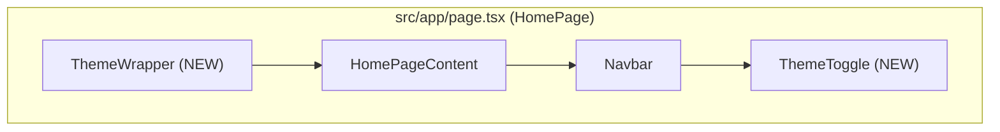

# Architecture: Homepage Theme Integration

**Project**: `homepage-theme-integration`  
**Architect**: architect  
**Date**: 2026-03-22  
**Status**: design-architecture

---

## 1. Context

### Current State
- ✅ `ThemeWrapper` component exists at `src/components/ThemeWrapper/ThemeWrapper.tsx`
- ✅ `ThemeToggle` component exists at `src/components/ThemeToggle/ThemeToggle.tsx`
- ✅ `ThemeContext` / `useTheme` hook exists
- ❌ `HomePage.tsx` does **not** import or use `ThemeWrapper`
- ❌ Navbar does **not** include `ThemeToggle`
- ❌ 12/23 `theme-binding` tests failing (mock leakage issue)

### Goal
Integrate `ThemeWrapper` into `HomePage` and add `ThemeToggle` to Navbar, enabling:
1. Automatic theme application (localStorage > API > system)
2. Manual theme toggle via UI button
3. Theme persistence across page refresh

---

## 2. Tech Stack

| Component | Choice | Rationale |
|-----------|--------|-----------|
| Language | TypeScript 5.x | Existing |
| Theme | CSS variables + `data-theme` | Existing |
| State | React Context + localStorage | Existing |
| Theme Data | `homepageAPI.ts` | Existing |
| Testing | Jest + RTL | Existing |

**No new dependencies.**

---

## 3. Architecture

### 3.1 Component Hierarchy (After Integration)



### 3.2 File Changes

| File | Change | Type |
|------|--------|------|
| `src/app/page.tsx` | Wrap with `ThemeWrapper`, render `HomePage` | Modify |
| `src/components/homepage/HomePage.tsx` | (No changes needed — integration via parent) | — |
| `Navbar.tsx` | Import & render `ThemeToggle` | Modify |
| `jest.setup.ts` | Add default fetch mock to fix test leakage | Modify |
| `theme-binding.test.tsx` | (Should pass after jest.setup fix) | Verify |

### 3.3 Integration Point

```tsx
// src/app/page.tsx

import { ThemeWrapper } from '@/components/ThemeWrapper';
import HomePage from '@/components/homepage/HomePage';

export default function Page() {
  return (
    <ThemeWrapper>
      <HomePage />
    </ThemeWrapper>
  );
}
```

Note: Integration happens at the **Next.js page level** (`src/app/page.tsx`), not inside `HomePage.tsx`. This keeps `HomePage.tsx` reusable across layouts.

### 3.4 ThemeToggle Integration

```tsx
// Navbar.tsx — add ThemeToggle to toolbar area

import { ThemeToggle } from '@/components/ThemeToggle';

// In JSX:
<div className={styles.toolbar}>
  <ThemeToggle />
  {/* other toolbar items */}
</div>
```

---

## 4. Data Flow

```
Page Load:
  1. ThemeWrapper mounts
  2. fetchHomepageData() → /api/v1/homepage
  3. ThemeProvider receives homepageData
  4. ThemeContext resolves: localStorage → userPreferences → API default → system
  5. ThemeToggle reads theme.resolved via useTheme()

User Toggle:
  1. User clicks ThemeToggle
  2. toggleTheme() → updates ThemeContext state
  3. ThemeContext writes to localStorage
  4. CSS variables update → UI reflects change immediately
```

---

## 5. Testing Strategy

### 5.1 Test Framework
Jest + React Testing Library (existing)

### 5.2 Test Cases

| ID | Description | Method |
|----|-------------|--------|
| TC1 | ThemeWrapper fetches API on mount | Mock fetch, assert called |
| TC2 | ThemeToggle renders with correct icon | RTL render, assert text |
| TC3 | Clicking toggle calls setMode | RTL fireEvent, assert called |
| TC4 | Toggle icon changes based on resolved mode | RTL render with different contexts |
| TC5 | HomePage wrapped in ThemeWrapper | Integration test |
| TC6 | Navbar contains ThemeToggle | RTL, assert container has button |
| TC7 | theme-binding.test.tsx 23/23 pass | `npm test -- theme-binding` |

### 5.3 jest.setup.ts Fix

```typescript
// jest.setup.ts — add default fetch mock

// Ensure global.fetch has a default mock for all tests
if (!global.fetch) {
  global.fetch = jest.fn();
}

(global.fetch as jest.Mock).mockResolvedValue({
  ok: true,
  status: 200,
  json: () => Promise.resolve({ theme: 'dark' }),
});
```

### 5.4 Verification Commands

```bash
# Unit tests for new integration
npm test -- --watchAll=false --testPathPattern="ThemeWrapper|ThemeToggle|theme-binding"

# Integration test
npm run build  # ensures no TS errors
```

---

## 6. Implementation Plan

### Task 1: Integrate ThemeWrapper into page.tsx
**File**: `src/app/page.tsx`
**Agent**: dev

### Task 2: Add ThemeToggle to Navbar
**File**: `src/components/homepage/Navbar/Navbar.tsx`
**Agent**: dev

### Task 3: Fix jest.setup.ts
**File**: `jest.setup.ts`
**Agent**: dev

### Task 4: Verify tests
**Command**: `npm test -- --watchAll=false --testPathPattern="theme-binding"`

---

## 7. Trade-offs

| Decision | Trade-off |
|----------|-----------|
| Integration at page.tsx vs HomePage.tsx | ✅ Keeps HomePage reusable; ⚠️ ThemeContext only available within page layout |
| jest.setup.ts mock vs per-test mock | ✅ Fixes all tests globally; ⚠️ May mask real issues in other tests |
| No global layout integration (方案 A only) | ✅ Minimal risk; ⚠️ ThemeContext not available on other pages |

---

## 8. Verification Checklist

- [ ] `ThemeWrapper` wraps `HomePage` in `src/app/page.tsx`
- [ ] `ThemeToggle` renders in Navbar toolbar
- [ ] Theme toggle button switches dark ↔ light immediately
- [ ] Theme persists in localStorage after toggle
- [ ] `theme-binding.test.tsx` passes 23/23
- [ ] No layout regressions in HomePage modules
- [ ] Theme loading shows no FOUC (Flash of Unstyled Theme)
