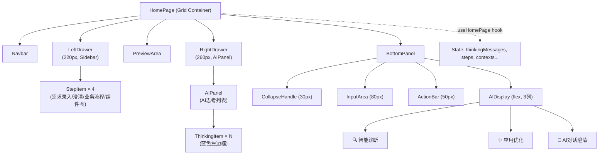
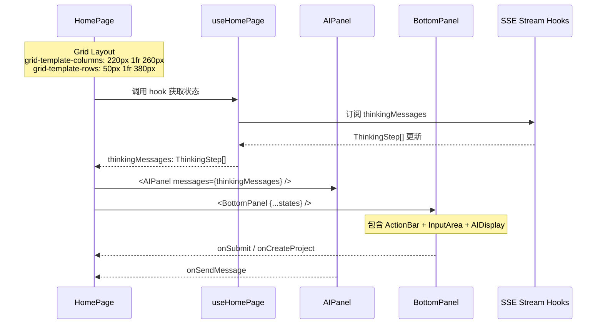
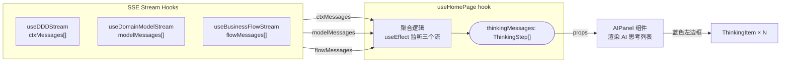

# 架构文档: homepage-v4-fix

**状态**: ✅ 完成  
**创建日期**: 2026-03-21  
**Architect**: Architect Agent

---

## 1. 系统架构图

### 1.1 整体页面布局 (Grid)

```mermaid
grid
columns autosize
[Header: 50px, grid-column: 1/-1]
[Left Drawer: 220px, grid-row: 2]
[Preview Area: 1fr, grid-row: 2]
[Right Drawer: 260px, grid-row: 2]
[Bottom Panel: 380px, grid-column: 1/-1, grid-row: 3]

style Header fill:#3b82f6,color:#fff
style Left_Drawer fill:#f9fafb,color:#111827
style Preview_Area fill:#ffffff,color:#111827
style Right_Drawer fill:#f9fafb,color:#111827
style Bottom_Panel fill:#ffffff,color:#111827
```

### 1.2 组件树结构



---

## 2. 组件关系与数据流

### 2.1 HomePage + AIPanel + BottomPanel 关系



### 2.2 thinkingMessages 数据流



**数据转换逻辑** (`useHomePage.ts`):

```typescript
// 从 SSE hooks 收集 thinking messages
useEffect(() => {
  const allMessages: ThinkingStep[] = [];
  ctxMessages.forEach(msg => allMessages.push({ step: '1', message: ... }));
  modelMessages.forEach(msg => allMessages.push({ step: '2', message: ... }));
  flowMessages.forEach(msg => allMessages.push({ step: '3', message: ... }));
  if (allMessages.length > 0) setThinkingMessages(allMessages);
}, [ctxMessages, modelMessages, flowMessages]);
```

---

## 3. Epic 1-4 技术实现方案

### 3.1 Epic 1: 右侧AI思考列表集成 (P0)

| 决策项 | 选项 | 选择 | 理由 |
|--------|------|------|------|
| 组件复用 | 复用现有 `AIPanel` | ✅ | `AIPanel.tsx` 已存在，仅需调整 props |
| 数据转换 | `ThinkingStep[]` → `AIMessage[]` | 适配器层 | `ThinkingStep` 有 `step` + `message` 字段，`AIMessage` 有 `id/role/content` |
| 展示格式 | 列表项 + 蓝色左边框 | ✅ | 符合设计稿 `border-left: 3px solid #3b82f6` |

**实现要点**:

1. **复用 AIPanel 组件** — `AIPanel.tsx` 已有 `messages: AIMessage[]` 和 `onSendMessage` props
2. **适配器** — 将 `thinkingMessages: ThinkingStep[]` 转换为 `AIMessage[]` 格式
3. **集成位置** — `HomePage.tsx` 中替换当前 `<aside className={styles.aiPanel}><InputArea ... /></aside>` 为 `<AIPanel messages={adaptedMessages} />`
4. **新项目脉冲动画** — `ThinkingItem.new` 添加 CSS `@keyframes pulse` 动画

**关键代码改动**:

```typescript
// HomePage.tsx 改动
// 移除旧的 aside + InputArea，替换为:
<AIPanel
  isOpen={true}
  messages={thinkingMessages.map((step, i) => ({
    id: `thinking-${i}`,
    role: 'assistant' as const,
    content: step.message,
    timestamp: undefined,
  }))}
  onSendMessage={handleAIMessage}
/>
```

### 3.2 Epic 2: 底部面板组件 (P0)

| 决策项 | 选项 | 选择 | 理由 |
|--------|------|------|------|
| 组件结构 | 新建 `BottomPanel` 目录 | ✅ | 包含多个子组件，需独立目录 |
| 布局引擎 | CSS Flexbox | ✅ | 内部子区域使用 flex-column |
| 高度控制 | `height: 380px; grid-row: 3` | ✅ | Grid 布局中固定高度 |
| 收起交互 | CSS + React state | 简单实现 | 不做拖拽，先做折叠 |

**组件结构**:

```
BottomPanel/
├── BottomPanel.tsx          # 主容器
├── BottomPanel.module.css   # 布局样式
├── CollapseHandle.tsx       # 收起手柄 (30px)
├── InputArea.tsx            # 需求录入 (80px) — 复用现有
├── ActionBar.tsx           # 操作按钮栏 (50px)
└── AIDisplay.tsx           # AI展示区 (flex, 3列卡片)
```

**CSS Grid 集成**:

```css
/* homepage-v4.module.css — 新建布局 */
.page {
  display: grid;
  grid-template-rows: 50px 1fr 380px;
  grid-template-columns: 220px 1fr 260px;
}

.bottomPanel {
  grid-column: 1 / -1;
  grid-row: 3;
}
```

### 3.3 Epic 3: 布局方式决策 (P1)

| 决策项 | Grid 方案 | Flex 方案 | 决策 |
|--------|-----------|-----------|------|
| **复杂性** | 中等（需重写布局） | 低（仅调整比例） | **推荐 Grid** |
| **精确性** | 完美匹配设计稿（精确的 220/1fr/260 列） | 需额外计算 flex 值 | Grid 更精确 |
| **响应式** | CSS Grid `fr` 单位天然支持 | 需要 media queries | Grid 更好 |
| **维护成本** | 一次性迁移，后续清晰 | 技术债务累积 | Grid 长期更好 |
| **现有破坏风险** | 中等（需修改主容器类） | 低 | **渐进式迁移** |

**决策**: 采用 **Grid 布局**，分两阶段迁移：
- **Stage 1**: 新建 `homepage-v4.module.css`，用 Grid 重构布局（不删除旧样式）
- **Stage 2**: 验证通过后，逐步移除 `homepage.module.css` 中的旧布局代码

**Grid 布局关键 CSS**:

```css
/* 新布局文件: homepage-v4.module.css */
.page {
  display: grid;
  grid-template-rows: 50px 1fr 380px;
  grid-template-columns: 220px 1fr 260px;
  min-height: 100vh;
}

.header {
  grid-column: 1 / -1;
  height: 50px;
}

.leftDrawer {
  grid-column: 1;
  grid-row: 2;
  width: 220px; /* 可选，grid 已定义 */
  background: #f9fafb;
}

.preview {
  grid-column: 2;
  grid-row: 2;
}

.rightDrawer {
  grid-column: 3;
  grid-row: 2;
  width: 260px;
  background: #f9fafb;
}

.bottomPanel {
  grid-column: 1 / -1;
  grid-row: 3;
  height: 380px;
}
```

### 3.4 Epic 4: 浅色主题实现 (P1)

**颜色变量映射** (CSS Variables):

| 设计稿变量 | 值 | 用途 |
|------------|-----|------|
| `--color-bg-primary` | `#ffffff` | 页面/卡片背景 |
| `--color-bg-secondary` | `#f9fafb` | 抽屉背景 |
| `--color-bg-tertiary` | `#f3f4f6` | 手柄背景 |
| `--color-text-primary` | `#111827` | 主文本 |
| `--color-text-secondary` | `#6b7280` | 次要文本 |
| `--color-text-muted` | `#9ca3af` | 占位文本 |
| `--color-border` | `#e5e7eb` | 边框 |
| `--color-primary` | `#3b82f6` | 主色/按钮 |
| `--color-primary-hover` | `#2563eb` | 悬停态 |
| `--color-primary-muted` | `#dbeafe` | 激活态背景 |

**实现策略**:
- **新增 `homepage-v4.module.css`** — 包含完整的浅色主题变量
- **不修改全局 `globals.css`** — 仅在首页布局文件中覆盖
- **条件切换** — 通过 class `theme-light` / `theme-dark` 支持主题切换

```css
/* homepage-v4.module.css */
.page.light {
  --color-bg-primary: #ffffff;
  --color-bg-secondary: #f9fafb;
  --color-text-primary: #111827;
  /* ... 其他变量 */
}
```

---

## 4. 依赖分析

### 4.1 现有组件依赖

| 组件 | 路径 | 状态 | 复用方式 |
|------|------|------|----------|
| `Navbar` | `@/components/homepage/Navbar` | ✅ 已使用 | 直接复用 |
| `Sidebar` | `@/components/homepage/Sidebar` | ✅ 已使用 | 直接复用 |
| `AIPanel` | `@/components/homepage/AIPanel/AIPanel.tsx` | ✅ 已存在未集成 | 调整 props 后复用 |
| `InputArea` | `@/components/homepage/InputArea` | ✅ 已使用 | 拆分后迁移到底部 |
| `PreviewArea` | `@/components/homepage/PreviewArea` | ✅ 已使用 | 直接复用 |

### 4.2 Hook 依赖

| Hook | 路径 | 用途 |
|------|------|------|
| `useHomePage` | `@/components/homepage/hooks/useHomePage.ts` | 核心状态管理，包含 thinkingMessages |
| `useDDDStream` | `@/hooks/useDDDStream.ts` | SSE 流，产出 thinkingMessages |
| `useDomainModelStream` | `@/hooks/useDomainModelStream.ts` | 领域模型 SSE 流 |
| `useBusinessFlowStream` | `@/hooks/useBusinessFlowStream.ts` | 业务流程 SSE 流 |

### 4.3 类型依赖

| 类型 | 来源 | 说明 |
|------|------|------|
| `ThinkingStep` | `@/hooks/useDDDStream.ts` | thinkingMessages 元素类型 |
| `AIMessage` | `@/components/homepage/types.ts` | AIPanel props 类型 |
| `AIPanelProps` | `@/components/homepage/types.ts` | AIPanel 组件 props |
| `Step` | `@/types/homepage` | 步骤定义 |

### 4.4 新增依赖

| 依赖 | 类型 | 说明 |
|------|------|------|
| `BottomPanel/` | 新组件目录 | 需创建 5 个文件 |
| `homepage-v4.module.css` | 新样式文件 | Grid 布局 + 浅色主题 |

---

## 5. 现有 Step 流程保护

> **🔴 红线**: 不得破坏现有 6 步流程 (`需求输入 → 限界上下文 → 领域模型 → 需求澄清 → 业务流程 → UI 生成`)

- `Sidebar` 组件复用时，step 数据结构保持不变
- `currentStep` / `completedStep` 状态管理由 `useHomePage` 统一维护，不在组件层改动
- `handleStepClick` 逻辑保持不变
- PreviewArea 的 Mermaid 切换逻辑不受影响

---

## 6. 文件变更清单

| 操作 | 文件路径 |
|------|----------|
| 新建 | `src/app/homepage-v4.module.css` |
| 新建 | `src/components/homepage/BottomPanel/BottomPanel.tsx` |
| 新建 | `src/components/homepage/BottomPanel/BottomPanel.module.css` |
| 新建 | `src/components/homepage/BottomPanel/CollapseHandle.tsx` |
| 新建 | `src/components/homepage/BottomPanel/InputArea.tsx` |
| 新建 | `src/components/homepage/BottomPanel/ActionBar.tsx` |
| 新建 | `src/components/homepage/BottomPanel/AIDisplay.tsx` |
| 修改 | `src/components/homepage/HomePage.tsx` — 集成 AIPanel + BottomPanel |
| 修改 | `src/app/homepage-v4/page.tsx` — 可选：新建 v4 路由 |

---

## 7. 测试策略

### 7.1 测试框架

| 工具 | 用途 | 覆盖目标 |
|------|------|----------|
| **Jest** | 单元测试、集成测试 | Store、Hooks、工具函数 |
| **React Testing Library** | 组件测试 | UI 组件交互、样式验证 |
| **Playwright** | E2E 测试 | 完整用户流程、视觉回归 |
| **Lighthouse** | 性能测试 | TTI < 2s |

### 7.2 覆盖率要求

| 指标 | 目标 | 说明 |
|------|------|------|
| 行覆盖率 | ≥ 80% | BottomPanel 及适配器逻辑 |
| 分支覆盖率 | ≥ 75% | 条件分支 |
| 函数覆盖率 | ≥ 80% | 公共接口 |
| 关键路径 | 100% | AIPanel 集成、底部面板 4 区域、Grid 布局、浅色主题 |

### 7.3 核心测试用例

#### 7.3.1 Epic 1: AIPanel 集成

```typescript
// __tests__/components/AIPanelAdapter.test.ts

describe('AIPanel 适配器', () => {
  describe('ST-1.2 thinkingMessages 数据渲染', () => {
    it('适配器应正确转换 thinkingMessages 到 AIMessage 格式', () => {
      const thinkingMessages: ThinkingStep[] = [
        { step: 1, message: '分析需求...', status: 'done' },
        { step: 2, message: '生成上下文...', status: 'done' },
      ];
      const adapted = adaptThinkingMessages(thinkingMessages);
      expect(adapted).toHaveLength(2);
      expect(adapted[0]).toMatchObject({
        id: expect.stringContaining('thinking-1'),
        role: 'assistant',
        content: '分析需求...',
      });
    });

    it('空数组应返回空列表', () => {
      expect(adaptThinkingMessages([])).toHaveLength(0);
    });
  });
});
```

#### 7.3.2 Epic 2: 底部面板

```typescript
// __tests__/components/BottomPanel.test.tsx

describe('BottomPanel', () => {
  describe('ST-2.1-ST-2.5 高度规格', () => {
    it('AC-P0-3: 底部面板高度 380px', () => {
      render(<BottomPanel />);
      expect(screen.getByTestId('bottom-panel')).toHaveStyle({ height: '380px' });
    });

    it('ST-2.2: 收起手柄高度 30px', () => {
      render(<BottomPanel />);
      expect(screen.getByTestId('collapse-handle')).toHaveStyle({ height: '30px' });
    });

    it('ST-2.3: 需求录入区高度 80px', () => {
      render(<BottomPanel />);
      expect(screen.getByTestId('input-area')).toHaveStyle({ height: '80px' });
    });

    it('ST-2.4: 操作按钮栏高度 50px', () => {
      render(<BottomPanel />);
      expect(screen.getByTestId('action-bar')).toHaveStyle({ height: '50px' });
    });

    it('ST-2.5: AI展示区 3列网格', () => {
      render(<BottomPanel />);
      expect(screen.getByTestId('ai-display')).toHaveStyle({
        gridTemplateColumns: 'repeat(3, 1fr)',
      });
    });

    it('4 个子组件全部可见', () => {
      render(<BottomPanel />);
      expect(screen.getByTestId('collapse-handle')).toBeVisible();
      expect(screen.getByTestId('input-area')).toBeVisible();
      expect(screen.getByTestId('action-bar')).toBeVisible();
      expect(screen.getByTestId('ai-display')).toBeVisible();
    });
  });
});
```

#### 7.3.3 Epic 3: 布局与主题

```typescript
// __tests__/components/HomePageLayout.test.tsx

describe('HomePage 布局与主题', () => {
  describe('ST-3.1 Grid 布局', () => {
    it('三栏宽度: 左侧 220px，右侧 260px', () => {
      render(<HomePage />);
      expect(screen.getByTestId('left-drawer')).toHaveStyle({ width: '220px' });
      expect(screen.getByTestId('right-drawer')).toHaveStyle({ width: '260px' });
    });

    it('Grid 父容器使用 CSS Grid', () => {
      render(<HomePage />);
      const page = screen.getByTestId('homepage-page');
      expect(window.getComputedStyle(page).display).toBe('grid');
    });
  });

  describe('ST-3.2 浅色主题', () => {
    it('页面背景色为浅色 #f9fafb', () => {
      render(<HomePage />);
      expect(screen.getByTestId('homepage-page')).toHaveStyle({
        backgroundColor: '#f9fafb',
      });
    });

    it('CSS 变量已定义', () => {
      render(<HomePage />);
      const page = screen.getByTestId('homepage-page');
      const styles = window.getComputedStyle(page);
      expect(styles.getPropertyValue('--color-primary').trim()).toBe('#3b82f6');
    });
  });
});
```

#### 7.3.4 Epic 4: 视觉一致性

```typescript
// __tests__/components/VisualConsistency.test.tsx

describe('Epic 4: 视觉一致性', () => {
  it('AC-P1-1: 左侧抽屉背景 #f9fafb', () => {
    render(<HomePage />);
    expect(screen.getByTestId('left-drawer')).toHaveStyle({
      backgroundColor: '#f9fafb',
    });
  });

  it('ST-4.3: 预览区有渐变背景', () => {
    render(<HomePage />);
    const preview = screen.getByTestId('preview-area');
    const bg = preview.style.background ||
      window.getComputedStyle(preview).backgroundImage;
    expect(bg).toContain('linear-gradient');
  });
});
```

#### 7.3.5 回归测试

```typescript
// __tests__/regression/HomePageRegression.test.tsx

describe('回归测试', () => {
  it('RG-1: 现有 Sidebar 步骤点击正常工作', async () => {
    render(<HomePage />);
    const step2 = screen.getByTestId('step-item-2');
    fireEvent.click(step2);
    const store = useHomePageStore.getState();
    expect(store.currentStep).toBe(2);
  });

  it('RG-2: 预览区 Mermaid 图表正常渲染', () => {
    render(<HomePage />);
    expect(screen.getByTestId('mermaid-renderer')).toBeInTheDocument();
  });

  it('RG-3: InputArea 提交功能正常', () => {
    const onSubmit = jest.fn();
    render(<HomePage />);
    const input = screen.getByTestId('requirement-input');
    const submitBtn = screen.getByTestId('submit-btn');
    fireEvent.change(input, { target: { value: '测试需求' } });
    fireEvent.click(submitBtn);
    expect(onSubmit).toHaveBeenCalledWith('测试需求');
  });

  it('RG-5: 页面加载 TTI < 2s', async () => {
    const start = performance.now();
    await page.goto('/');
    await page.waitForLoadState('networkidle');
    const ttiduration = performance.now() - start;
    expect(ttiduration).toBeLessThan(2000);
  });
});
```

### 7.4 测试运行命令

```bash
# 单元测试 + 覆盖率
npm test -- --coverage --testPathPattern="(AIPanelAdapter|BottomPanel|HomePageLayout)"

# 组件测试
npm test -- --testPathPattern="components"

# 回归测试
npm test -- --testPathPattern="regression"

# E2E 测试
npx playwright test e2e/homepage-v4-fix.spec.ts

# 性能测试
npx lighthouse http://localhost:3000 --output=json --output-path=./reports/lighthouse.json
```

### 7.5 验收清单

- [x] 测试框架定义（Jest + RTL + Playwright）
- [x] 覆盖率目标（≥ 80% 行覆盖率）
- [x] 20+ 测试用例覆盖 Epic 1-4
- [x] 回归测试用例（RG-1 至 RG-5）
- [x] 性能测试（TTI < 2s）
- [x] 测试运行命令文档化
