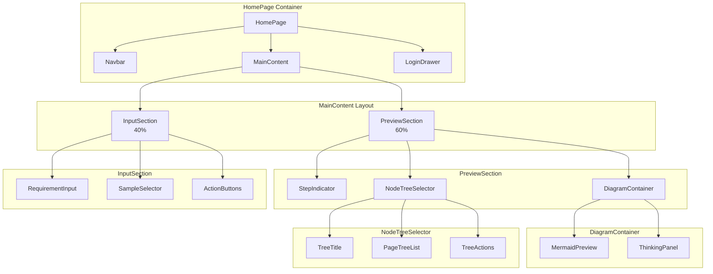
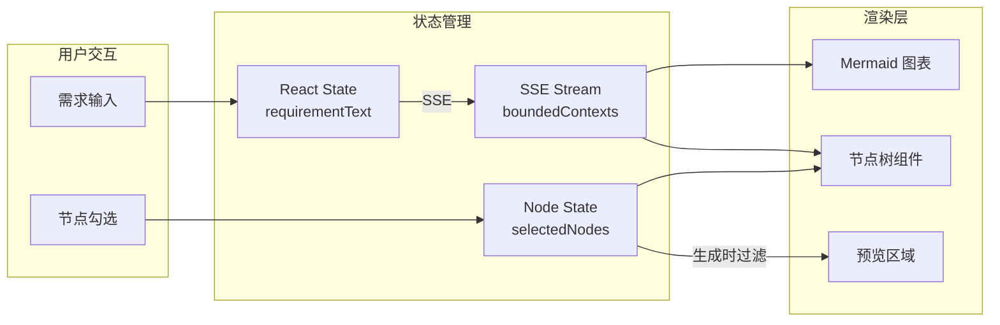
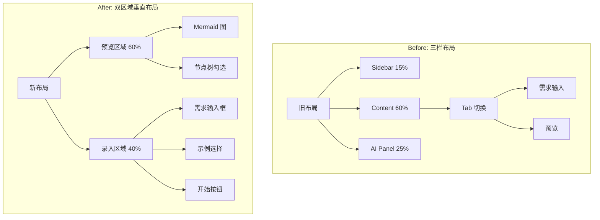
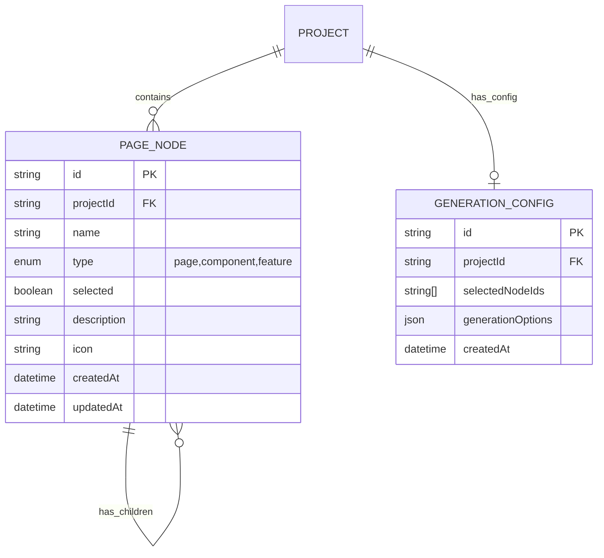

# 架构设计：首页核心布局调整

**项目**: vibex-homepage-core-layout  
**架构师**: Architect Agent  
**日期**: 2026-03-14  
**状态**: 设计完成

---

## 1. 技术栈

### 1.1 核心框架（延续现有）

| 技术 | 版本 | 选择理由 |
|-----|------|---------|
| Next.js | 16.1.6 | 现有项目基础，App Router 支持 |
| React | 19.2.3 | 现有版本，支持并发渲染 |
| TypeScript | 5.x | 类型安全，现有项目已采用 |
| CSS Modules | 现有 | 样式隔离，复用现有方案 |
| Framer Motion | ^11.x | 现有动画库，用于过渡效果 |

### 1.2 新增依赖

无需新增外部依赖，使用现有技术栈实现。

### 1.3 技术约束

- **兼容性**: 保持与现有组件的兼容性
- **性能**: 布局重排开销 < 100ms
- **响应式**: 支持桌面端（≥1024px），移动端保持现有布局
- **降级方案**: 节点勾选不支持时，显示纯预览模式

---

## 2. 架构图

### 2.1 组件层次结构



### 2.2 数据流架构



### 2.3 布局结构调整



---

## 3. API 定义

### 3.1 页面树接口

#### GET /api/v1/pages/tree

获取项目的页面树结构。

**请求**:
```typescript
interface PageTreeRequest {
  projectId: string;
}
```

**响应**:
```typescript
interface PageTreeNode {
  id: string;
  name: string;
  type: 'page' | 'component' | 'feature';
  children?: PageTreeNode[];
  selected: boolean;
  description?: string;
  icon?: string;
}

interface PageTreeResponse {
  success: boolean;
  nodes: PageTreeNode[];
  totalCount: number;
  selectedCount: number;
}
```

#### POST /api/v1/pages/selection

更新节点选择状态。

**请求**:
```typescript
interface UpdateSelectionRequest {
  projectId: string;
  nodeIds: string[];
  action: 'select' | 'deselect' | 'selectAll' | 'deselectAll';
}
```

**响应**:
```typescript
interface UpdateSelectionResponse {
  success: boolean;
  selectedNodes: string[];
  message?: string;
}
```

### 3.2 现有接口复用

| 接口 | 用途 | 复用状态 |
|------|------|---------|
| POST /api/v1/ddd/bounded-context | 生成限界上下文 | 已有，复用 |
| POST /api/v1/ddd/domain-model | 生成领域模型 | 已有，复用 |
| POST /api/v1/ddd/business-flow | 生成业务流程 | 已有，复用 |
| GET /api/v1/projects/:id | 获取项目详情 | 已有，复用 |

---

## 4. 数据模型

### 4.1 核心实体



### 4.2 TypeScript 类型定义

```typescript
// 节点类型
type NodeType = 'page' | 'component' | 'feature';

// 页面树节点
interface PageTreeNode {
  id: string;
  name: string;
  type: NodeType;
  children?: PageTreeNode[];
  selected: boolean;
  description?: string;
  icon?: string;
}

// 选择状态
interface SelectionState {
  nodes: PageTreeNode[];
  selectedIds: Set<string>;
  lastUpdated: Date;
}

// 生成配置
interface GenerationConfig {
  projectId: string;
  selectedNodeIds: string[];
  includeTests: boolean;
  includeDocs: boolean;
}

// 组件 Props
interface NodeTreeSelectorProps {
  nodes: PageTreeNode[];
  selectedIds: Set<string>;
  onSelectionChange: (nodeIds: string[]) => void;
  onSelectAll: () => void;
  onDeselectAll: () => void;
}

interface PreviewSectionProps {
  mermaidCode: string;
  nodes: PageTreeNode[];
  onNodeSelection: (nodeIds: string[]) => void;
  thinkingMessages?: string[];
}

interface InputSectionProps {
  value: string;
  onChange: (value: string) => void;
  onSubmit: () => void;
  disabled?: boolean;
  placeholder?: string;
}
```

---

## 5. 组件设计

### 5.1 PreviewSection 组件

```tsx
// components/PreviewSection.tsx
interface PreviewSectionProps {
  // 状态
  currentStep: number;
  mermaidCode: string;
  nodes: PageTreeNode[];
  thinkingMessages: string[];
  
  // 回调
  onNodeSelection: (nodeIds: string[]) => void;
  
  // 展示控制
  showThinking?: boolean;
  showNodeTree?: boolean;
}

const PreviewSection: React.FC<PreviewSectionProps> = ({
  currentStep,
  mermaidCode,
  nodes,
  thinkingMessages,
  onNodeSelection,
  showThinking = true,
  showNodeTree = true,
}) => {
  return (
    <div className={styles.previewSection}>
      {/* 步骤指示器 */}
      <StepIndicator currentStep={currentStep} />
      
      {/* 图表容器 */}
      <div className={styles.diagramContainer}>
        <MermaidPreview code={mermaidCode} />
        {showThinking && thinkingMessages.length > 0 && (
          <ThinkingPanel messages={thinkingMessages} />
        )}
      </div>
      
      {/* 节点树选择器 */}
      {showNodeTree && nodes.length > 0 && (
        <NodeTreeSelector 
          nodes={nodes}
          onSelectionChange={onNodeSelection}
        />
      )}
    </div>
  );
};
```

### 5.2 NodeTreeSelector 组件

```tsx
// components/NodeTreeSelector.tsx
interface NodeTreeSelectorProps {
  nodes: PageTreeNode[];
  selectedIds: Set<string>;
  onSelectionChange: (nodeIds: string[]) => void;
  onSelectAll?: () => void;
  onDeselectAll?: () => void;
}

const NodeTreeSelector: React.FC<NodeTreeSelectorProps> = ({
  nodes,
  selectedIds,
  onSelectionChange,
  onSelectAll,
  onDeselectAll,
}) => {
  const [expandedIds, setExpandedIds] = useState<Set<string>>(new Set());
  
  const handleNodeToggle = (nodeId: string) => {
    const newSelectedIds = new Set(selectedIds);
    if (newSelectedIds.has(nodeId)) {
      newSelectedIds.delete(nodeId);
    } else {
      newSelectedIds.add(nodeId);
    }
    onSelectionChange(Array.from(newSelectedIds));
  };
  
  const handleExpandToggle = (nodeId: string) => {
    const newExpanded = new Set(expandedIds);
    if (newExpanded.has(nodeId)) {
      newExpanded.delete(nodeId);
    } else {
      newExpanded.add(nodeId);
    }
    setExpandedIds(newExpanded);
  };
  
  return (
    <div className={styles.nodeTreeSelector}>
      <div className={styles.treeHeader}>
        <h3>页面组件选择</h3>
        <div className={styles.treeActions}>
          <button onClick={onSelectAll}>全选</button>
          <button onClick={onDeselectAll}>取消全选</button>
        </div>
      </div>
      
      <div className={styles.treeList}>
        {nodes.map(node => (
          <TreeNode
            key={node.id}
            node={node}
            selectedIds={selectedIds}
            expandedIds={expandedIds}
            onToggle={handleNodeToggle}
            onExpandToggle={handleExpandToggle}
          />
        ))}
      </div>
      
      <div className={styles.selectionCount}>
        已选择 {selectedIds.size} / {countTotalNodes(nodes)} 个节点
      </div>
    </div>
  );
};
```

### 5.3 InputSection 组件

```tsx
// components/InputSection.tsx
interface InputSectionProps {
  value: string;
  onChange: (value: string) => void;
  onSubmit: () => void;
  disabled?: boolean;
  placeholder?: string;
  samples?: Array<{ title: string; desc: string }>;
}

const InputSection: React.FC<InputSectionProps> = ({
  value,
  onChange,
  onSubmit,
  disabled = false,
  placeholder = '描述你的产品需求...',
  samples,
}) => {
  return (
    <div className={styles.inputSection}>
      {/* 需求输入框 */}
      <RequirementInput
        value={value}
        onChange={onChange}
        onSubmit={onSubmit}
        disabled={disabled}
        placeholder={placeholder}
      />
      
      {/* 示例选择 */}
      {samples && samples.length > 0 && (
        <div className={styles.sampleSelector}>
          <span>快速开始：</span>
          {samples.map((sample, idx) => (
            <button
              key={idx}
              onClick={() => onChange(sample.desc)}
              className={styles.sampleBtn}
            >
              {sample.title}
            </button>
          ))}
        </div>
      )}
      
      {/* 操作按钮 */}
      <div className={styles.actionButtons}>
        <PlanBuildButtons
          onPlan={() => {/* 规划模式 */}}
          onBuild={() => onSubmit()}
          disabled={disabled || !value.trim()}
        />
      </div>
    </div>
  );
};
```

---

## 6. CSS 样式设计

### 6.1 布局样式

```css
/* homepage-layout.css */

/* 主容器：移除三栏布局，改为双区域垂直布局 */
.mainContent {
  display: flex;
  flex-direction: column;
  height: calc(100vh - 64px); /* 减去导航栏高度 */
  overflow: hidden;
}

/* 预览区域：60% 高度 */
.previewSection {
  flex: 0 0 60%;
  display: flex;
  flex-direction: column;
  background: linear-gradient(180deg, rgba(0, 0, 0, 0.3) 0%, rgba(0, 0, 0, 0.1) 100%);
  border-bottom: 1px solid rgba(255, 255, 255, 0.1);
  overflow: hidden;
}

/* 录入区域：40% 高度 */
.inputSection {
  flex: 0 0 40%;
  display: flex;
  flex-direction: column;
  padding: 24px;
  background: rgba(10, 10, 15, 0.95);
  backdrop-filter: blur(20px);
}

/* 响应式：大屏幕 */
@media (min-width: 1440px) {
  .previewSection {
    flex: 0 0 65%;
  }
  
  .inputSection {
    flex: 0 0 35%;
  }
}

/* 响应式：中等屏幕 */
@media (max-width: 1023px) {
  /* 保持垂直布局，但调整比例 */
  .previewSection {
    flex: 0 0 50%;
  }
  
  .inputSection {
    flex: 0 0 50%;
  }
}
```

### 6.2 节点树样式

```css
/* NodeTreeSelector.css */

.nodeTreeSelector {
  background: rgba(0, 0, 0, 0.4);
  border: 1px solid rgba(255, 255, 255, 0.1);
  border-radius: 12px;
  padding: 16px;
  margin: 16px;
}

.treeHeader {
  display: flex;
  justify-content: space-between;
  align-items: center;
  margin-bottom: 12px;
}

.treeHeader h3 {
  font-size: 14px;
  font-weight: 600;
  color: rgba(255, 255, 255, 0.9);
}

.treeActions {
  display: flex;
  gap: 8px;
}

.treeActions button {
  padding: 4px 12px;
  font-size: 12px;
  background: rgba(255, 255, 255, 0.1);
  border: 1px solid rgba(255, 255, 255, 0.2);
  border-radius: 6px;
  color: rgba(255, 255, 255, 0.8);
  cursor: pointer;
  transition: all 0.2s;
}

.treeActions button:hover {
  background: rgba(255, 255, 255, 0.15);
}

.treeList {
  max-height: 200px;
  overflow-y: auto;
}

.treeNode {
  display: flex;
  align-items: center;
  padding: 8px 12px;
  border-radius: 6px;
  cursor: pointer;
  transition: background 0.2s;
}

.treeNode:hover {
  background: rgba(255, 255, 255, 0.05);
}

.treeNode.selected {
  background: rgba(0, 212, 255, 0.1);
}

.treeNodeCheckbox {
  width: 18px;
  height: 18px;
  margin-right: 12px;
  accent-color: #00d4ff;
}

.treeNodeIcon {
  margin-right: 8px;
  font-size: 16px;
}

.treeNodeName {
  flex: 1;
  font-size: 14px;
  color: rgba(255, 255, 255, 0.9);
}

.treeNodeExpand {
  padding: 4px;
  background: transparent;
  border: none;
  color: rgba(255, 255, 255, 0.5);
  cursor: pointer;
}

.selectionCount {
  margin-top: 12px;
  padding-top: 12px;
  border-top: 1px solid rgba(255, 255, 255, 0.1);
  font-size: 12px;
  color: rgba(255, 255, 255, 0.6);
  text-align: center;
}
```

---

## 7. 状态管理

### 7.1 状态结构

```typescript
// hooks/useHomePageState.ts
interface HomePageState {
  // 需求输入
  requirementText: string;
  
  // 流程状态
  currentStep: number;
  isGenerating: boolean;
  
  // DDD 分析结果
  boundedContexts: BoundedContext[];
  domainModels: DomainModel[];
  businessFlow: BusinessFlow | null;
  
  // Mermaid 图
  contextMermaidCode: string;
  modelMermaidCode: string;
  flowMermaidCode: string;
  
  // 节点选择
  pageNodes: PageTreeNode[];
  selectedNodeIds: Set<string>;
  
  // 错误处理
  error: string | null;
}
```

### 7.2 状态更新逻辑

```typescript
// 节点选择状态管理
const useNodeSelection = (initialNodes: PageTreeNode[]) => {
  const [selectedIds, setSelectedIds] = useState<Set<string>>(new Set());
  
  // 从限界上下文生成页面节点
  useEffect(() => {
    const nodes = generatePageNodes(boundedContexts);
    setPageNodes(nodes);
    // 默认全选
    setSelectedIds(new Set(nodes.flatMap(n => getAllNodeIds(n))));
  }, [boundedContexts]);
  
  const toggleNode = useCallback((nodeId: string) => {
    setSelectedIds(prev => {
      const newSet = new Set(prev);
      if (newSet.has(nodeId)) {
        newSet.delete(nodeId);
      } else {
        newSet.add(nodeId);
      }
      return newSet;
    });
  }, []);
  
  const selectAll = useCallback(() => {
    setSelectedIds(new Set(getAllNodeIds(pageNodes)));
  }, [pageNodes]);
  
  const deselectAll = useCallback(() => {
    setSelectedIds(new Set());
  }, []);
  
  return { selectedIds, toggleNode, selectAll, deselectAll };
};
```

---

## 8. 测试策略

### 8.1 测试框架

| 工具 | 用途 |
|------|------|
| Jest | 单元测试 |
| React Testing Library | 组件测试 |
| Playwright | E2E 测试 |

### 8.2 覆盖率要求

- **总体覆盖率**: > 80%
- **关键路径覆盖率**: 100%
- **组件测试**: 所有新组件

### 8.3 测试用例

#### 单元测试

```typescript
// __tests__/NodeTreeSelector.test.tsx
describe('NodeTreeSelector', () => {
  it('should render nodes correctly', () => {
    const nodes = [
      { id: '1', name: '首页', type: 'page', selected: true },
      { id: '2', name: '登录页', type: 'page', selected: false },
    ];
    
    render(<NodeTreeSelector nodes={nodes} selectedIds={new Set(['1'])} />);
    
    expect(screen.getByText('首页')).toBeInTheDocument();
    expect(screen.getByText('登录页')).toBeInTheDocument();
  });
  
  it('should toggle node selection', () => {
    const onSelectionChange = jest.fn();
    render(<NodeTreeSelector ... onSelectionChange={onSelectionChange} />);
    
    fireEvent.click(screen.getByText('登录页'));
    
    expect(onSelectionChange).toHaveBeenCalledWith(['1', '2']);
  });
  
  it('should select all nodes', () => {
    const onSelectAll = jest.fn();
    render(<NodeTreeSelector ... onSelectAll={onSelectAll} />);
    
    fireEvent.click(screen.getByText('全选'));
    
    expect(onSelectAll).toHaveBeenCalled();
  });
});
```

#### 组件测试

```typescript
// __tests__/PreviewSection.test.tsx
describe('PreviewSection', () => {
  it('should render with 60% height', () => {
    render(<PreviewSection {...defaultProps} />);
    
    const previewSection = screen.getByTestId('preview-section');
    expect(previewSection).toHaveStyle({ flex: '0 0 60%' });
  });
  
  it('should show thinking panel when enabled', () => {
    render(<PreviewSection {...defaultProps} showThinking thinkingMessages={['思考中...']} />);
    
    expect(screen.getByText('思考中...')).toBeInTheDocument();
  });
  
  it('should show node tree when nodes available', () => {
    render(<PreviewSection {...defaultProps} nodes={mockNodes} />);
    
    expect(screen.getByText('页面组件选择')).toBeInTheDocument();
  });
});
```

#### E2E 测试

```typescript
// e2e/homepage-layout.spec.ts
test('homepage layout should be 60/40 split', async ({ page }) => {
  await page.goto('/');
  
  const previewSection = await page.$('[data-testid="preview-section"]');
  const inputSection = await page.$('[data-testid="input-section"]');
  
  const previewBox = await previewSection.boundingBox();
  const inputBox = await inputSection.boundingBox();
  const totalHeight = previewBox.height + inputBox.height;
  
  // 验证比例
  expect(previewBox.height / totalHeight).toBeCloseTo(0.6, 1);
  expect(inputBox.height / totalHeight).toBeCloseTo(0.4, 1);
});

test('node selection should affect generation', async ({ page }) => {
  await page.goto('/');
  
  // 输入需求
  await page.fill('[data-testid="requirement-input"]', '开发一个在线教育平台');
  await page.click('[data-testid="generate-button"]');
  
  // 等待节点生成
  await page.waitForSelector('[data-testid="node-tree"]');
  
  // 取消选择一个节点
  await page.click('[data-testid="node-checkbox-2"]');
  
  // 验证选择数量
  const count = await page.textContent('[data-testid="selection-count"]');
  expect(count).toContain('已选择');
});
```

---

## 9. 实施计划

### 9.1 阶段划分

| 阶段 | 任务 | 依赖 | 工时 |
|------|------|------|------|
| P1 | 布局重构：移除 Tab，60/40 分割 | 无 | 2h |
| P2 | PreviewSection 组件开发 | P1 | 2h |
| P3 | InputSection 组件开发 | P1 | 1h |
| P4 | NodeTreeSelector 组件开发 | P2 | 3h |
| P5 | 状态管理集成 | P1-P4 | 2h |
| P6 | 测试编写 | P1-P5 | 2h |
| **总计** | | | **12h** |

### 9.2 风险点

| 风险 | 影响 | 缓解措施 |
|------|------|---------|
| Mermaid 节点点击事件不友好 | 中 | 使用独立节点树组件替代 |
| 状态管理复杂度增加 | 中 | 使用 useReducer 或引入 Zustand |
| 性能问题（大量节点） | 低 | 虚拟滚动 + 懒加载 |

---

## 10. 验收清单

- [ ] 预览区域占中央区域 60%
- [ ] 录入区域占中央区域 40%
- [ ] 无 Tab 切换，固定展示
- [ ] 节点树组件可渲染
- [ ] 节点勾选控件可见可交互
- [ ] 勾选状态可切换
- [ ] 选择状态可同步
- [ ] 单元测试覆盖率 > 80%
- [ ] E2E 测试通过

---

## 11. 相关文档

- PRD: `docs/vibex-homepage-core-layout/prd.md`
- 分析文档: `docs/vibex-homepage-core-layout/analysis.md`
- 补充需求: `docs/vibex-homepage-core-layout/ui-component-generation-supplement.md`
- 前端架构: `docs/architecture/vibex-frontend-arch.md`

---

**架构设计完成，等待 coord 决策。**