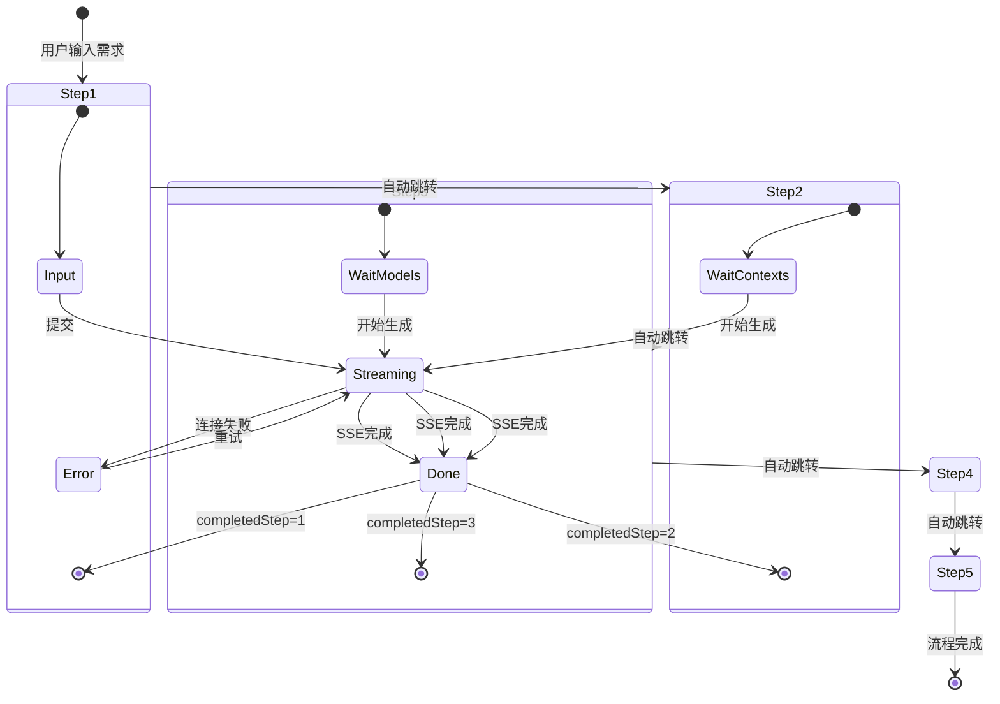
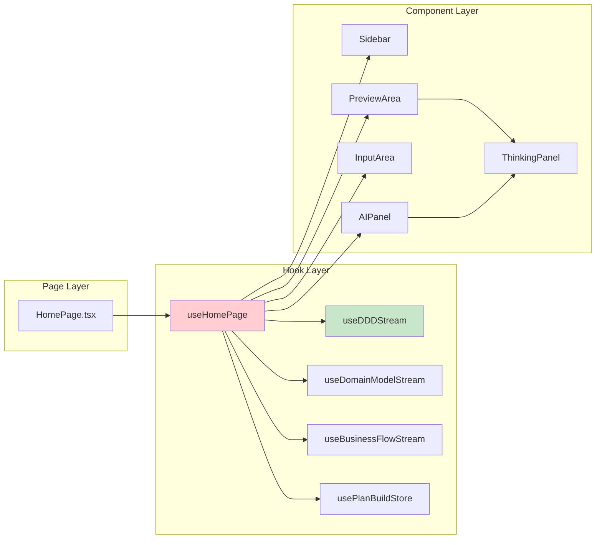
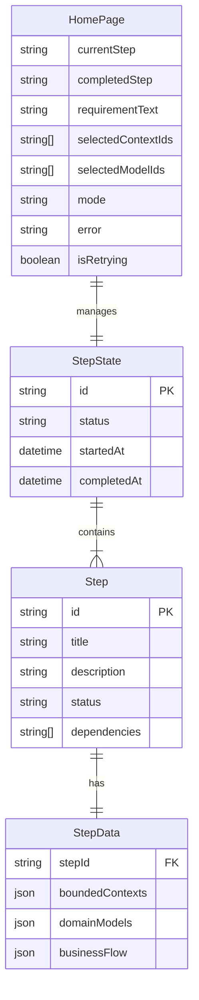
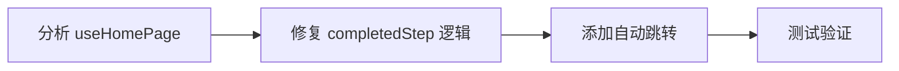
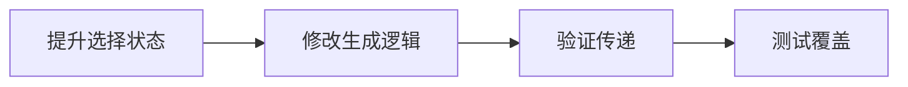
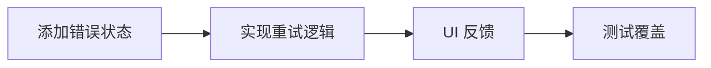

# Architecture: 首页流程修复

**项目**: vibex-homepage-flow-fix
**架构师**: Architect Agent
**日期**: 2026-03-17
**状态**: ✅ 设计完成

---

## 1. Tech Stack (版本选择及理由)

### 1.1 现有技术栈

| 技术 | 版本 | 理由 |
|------|------|------|
| React | 19.2.3 | 已有，支持 Hooks + useState 管理 |
| Zustand | ^4.x | 已有，plan-build-store 状态管理 |
| SSE (EventSource) | 浏览器原生 | 已有，流式数据传输 |
| CSS Modules | 内置 | 已有样式方案 |

### 1.2 复用组件

| 组件 | 路径 | 状态 | 改动 |
|------|------|------|------|
| useHomePage | `hooks/useHomePage.ts` | ✅ 存在 | 需增强 |
| useDDDStream | `hooks/useDDDStream.ts` | ✅ 存在 | 需调整 |
| Sidebar | `components/homepage/Sidebar/` | ✅ 存在 | 可复用 |
| AIPanel | `components/homepage/AIPanel/` | ✅ 存在 | 可复用 |
| PreviewArea | `components/homepage/PreviewArea/` | ✅ 存在 | 需调整状态 |
| InputArea | `components/homepage/InputArea/` | ✅ 存在 | 可复用 |

---

## 2. Architecture Diagram (Mermaid)

### 2.1 步骤状态流转架构



### 2.2 数据流架构

```mermaid
graph TB
    subgraph "UI Layer"
        INPUT[InputArea<br/>需求输入]
        SIDEBAR[Sidebar<br/>步骤导航]
        PREVIEW[PreviewArea<br/>图表预览]
        AI[AIPanel<br/>AI分析过程]
    end
    
    subgraph "State Layer (useHomePage)"
        STEP[currentStep<br/>completedStep]
        DATA[boundedContexts<br/>domainModels<br/>businessFlow]
        SELECT[selectedContextIds<br/>selectedModelIds]
        MODE[mode<br/>Build/Plan]
    end
    
    subgraph "Stream Layer"
        DDD[useDDDStream]
        DOMAIN[useDomainModelStream]
        FLOW[useBusinessFlowStream]
    end
    
    subgraph "API Layer"
        API1[/api/contexts]
        API2[/api/models]
        API3[/api/flows]
    end
    
    INPUT --> STEP
    STEP --> SIDEBAR
    STEP --> DDD
    DDD --> API1
    API1 --> DATA
    
    DATA --> SELECT
    SELECT --> DOMAIN
    DOMAIN --> API2
    API2 --> DATA
    
    DATA --> FLOW
    FLOW --> API3
    API3 --> DATA
    
    DATA --> PREVIEW
    DDD --> AI
    DOMAIN --> AI
    FLOW --> AI
    
    style STEP fill:#e3f2fd
    style DATA fill:#e8f5e9
    style AI fill:#fff8e1
```

### 2.3 组件依赖关系



---

## 3. API Definitions (接口签名)

### 3.1 useHomePage Hook 增强

```typescript
// src/components/homepage/hooks/useHomePage.ts

interface UseHomePageState {
  // 现有状态
  currentStep: StepId;
  completedStep: StepId | null;
  requirementText: string;
  
  // 新增状态
  selectedContextIds: Set<string>;
  selectedModelIds: Set<string>;
  mode: 'build' | 'plan';
  error: Error | null;
  isRetrying: boolean;
}

interface UseHomePageActions {
  // 现有方法
  setCurrentStep: (step: StepId) => void;
  setRequirementText: (text: string) => void;
  
  // 新增方法
  handleStepComplete: (step: StepId) => void;
  handleStepError: (step: StepId, error: Error) => void;
  retryCurrentStep: () => void;
  setSelectedContextIds: (ids: Set<string>) => void;
  setSelectedModelIds: (ids: Set<string>) => void;
}

type StepId = 1 | 2 | 3 | 4 | 5;

// Hook 返回值
interface UseHomePageReturn extends UseHomePageState, UseHomePageActions {}
```

### 3.2 步骤完成处理接口

```typescript
// 步骤完成处理器
interface StepCompletionHandler {
  step: StepId;
  onComplete: () => void;
  onError: (error: Error) => void;
  onRetry: () => void;
}

// 步骤状态
interface StepStatus {
  id: StepId;
  status: 'pending' | 'streaming' | 'done' | 'error';
  data?: unknown;
  error?: Error;
}

// 自动跳转逻辑
function handleStepComplete(
  currentStep: StepId,
  completedStep: StepId | null,
  setCompletedStep: (step: StepId) => void,
  setCurrentStep: (step: StepId) => void
): void {
  // 1. 更新 completedStep
  if (!completedStep || currentStep > completedStep) {
    setCompletedStep(currentStep);
  }
  
  // 2. 自动推进到下一步
  if (currentStep < 5) {
    const nextStep = (currentStep + 1) as StepId;
    setCurrentStep(nextStep);
  }
}
```

### 3.3 Build/Plan 模式区分接口

```typescript
// src/components/homepage/hooks/useHomePage.ts

import { usePlanBuildStore } from '@/stores/plan-build-store';

interface ModeBasedGeneration {
  mode: 'build' | 'plan';
  
  generate: (requirement: string, options?: GenerateOptions) => Promise<void>;
}

interface GenerateOptions {
  selectedContextIds?: Set<string>;
  selectedModelIds?: Set<string>;
}

// 模式区分实现
function useModeBasedGeneration(): ModeBasedGeneration {
  const mode = usePlanBuildStore((state) => state.mode);
  
  const generate = useCallback(async (
    requirement: string, 
    options?: GenerateOptions
  ) => {
    if (mode === 'plan') {
      // Plan 模式：先规划，再分步执行
      await runPlanAnalysis(requirement);
    } else {
      // Build 模式：直接生成
      await generateDirectly(requirement, options);
    }
  }, [mode]);
  
  return { mode, generate };
}
```

### 3.4 组件选择状态传递接口

```typescript
// 状态提升后的接口
interface SelectionState {
  // 限界上下文选择
  selectedContextIds: Set<string>;
  toggleContextSelection: (id: string) => void;
  selectAllContexts: () => void;
  clearContextSelection: () => void;
  
  // 领域模型选择
  selectedModelIds: Set<string>;
  toggleModelSelection: (id: string) => void;
  selectAllModels: () => void;
  clearModelSelection: () => void;
}

// 传递给下一步生成
interface GenerationWithSelection {
  // 步骤 2 → 3: 只生成选中的上下文对应的领域模型
  generateDomainModelsForSelected: (
    contexts: BoundedContext[],
    selectedIds: Set<string>
  ) => Promise<void>;
  
  // 步骤 3 → 4: 只生成选中的模型对应的业务流程
  generateBusinessFlowForSelected: (
    models: DomainModel[],
    selectedIds: Set<string>
  ) => Promise<void>;
}
```

---

## 4. Data Model (核心实体关系)

### 4.1 步骤状态模型



### 4.2 步骤依赖关系

```typescript
// 步骤依赖配置
const STEP_DEPENDENCIES: Record<StepId, StepId[]> = {
  1: [],                    // 需求分析：无依赖
  2: [1],                   // 限界上下文：依赖需求分析
  3: [2],                   // 领域模型：依赖限界上下文
  4: [3],                   // 业务流程：依赖领域模型
  5: [4],                   // 代码生成：依赖业务流程
};

// 步骤数据传递配置
const STEP_DATA_PASSING: Record<StepId, (state: UseHomePageState) => unknown> = {
  2: (state) => state.requirementText,
  3: (state) => ({
    contexts: state.boundedContexts,
    selectedIds: state.selectedContextIds,
  }),
  4: (state) => ({
    models: state.domainModels,
    selectedIds: state.selectedModelIds,
  }),
  5: (state) => state.businessFlow,
};
```

### 4.3 状态持久化模型

```typescript
// 本地存储键
const STORAGE_KEYS = {
  REQUIREMENT_TEXT: 'vibex_requirement_text',
  COMPLETED_STEP: 'vibex_completed_step',
  BOUNDED_CONTEXTS: 'vibex_bounded_contexts',
  DOMAIN_MODELS: 'vibex_domain_models',
  BUSINESS_FLOW: 'vibex_business_flow',
};

// 状态持久化 Hook
function usePersistedState<T>(key: string, initialValue: T) {
  const [state, setState] = useState<T>(() => {
    const stored = localStorage.getItem(key);
    return stored ? JSON.parse(stored) : initialValue;
  });
  
  useEffect(() => {
    localStorage.setItem(key, JSON.stringify(state));
  }, [key, state]);
  
  return [state, setState] as const;
}
```

---

## 5. Testing Strategy (测试契约)

### 5.1 测试框架

| 类型 | 框架 | 覆盖目标 |
|------|------|----------|
| Unit Tests | Jest + React Testing Library | Hook 逻辑 > 80% |
| Integration Tests | Jest | 步骤流转 > 70% |
| E2E Tests | Playwright | 用户流程 > 90% |

### 5.2 核心测试用例

```typescript
// src/components/homepage/hooks/__tests__/useHomePage.test.ts

describe('useHomePage Step Flow', () => {
  // TC-001: 步骤自动跳转
  it('should auto-advance to next step on completion', async () => {
    const { result } = renderHook(() => useHomePage());
    
    // 模拟步骤 1 完成
    act(() => {
      result.current.handleStepComplete(1);
    });
    
    expect(result.current.completedStep).toBe(1);
    expect(result.current.currentStep).toBe(2);
  });

  // TC-002: 步骤错误处理
  it('should handle step error and allow retry', async () => {
    const { result } = renderHook(() => useHomePage());
    
    // 模拟步骤 2 错误
    act(() => {
      result.current.handleStepError(2, new Error('SSE failed'));
    });
    
    expect(result.current.error).not.toBeNull();
    expect(result.current.currentStep).toBe(2); // 停留在当前步骤
    
    // 重试
    act(() => {
      result.current.retryCurrentStep();
    });
    
    expect(result.current.isRetrying).toBe(true);
  });

  // TC-003: 组件选择传递
  it('should pass selected context IDs to domain model generation', async () => {
    const { result } = renderHook(() => useHomePage());
    
    // 设置选择
    act(() => {
      result.current.setSelectedContextIds(new Set(['ctx-1', 'ctx-2']));
    });
    
    // 验证选择状态
    expect(result.current.selectedContextIds.size).toBe(2);
    expect(result.current.selectedContextIds.has('ctx-1')).toBe(true);
  });

  // TC-004: Build/Plan 模式区分
  it('should call different API based on mode', async () => {
    const mockGenerate = jest.fn();
    
    // Build 模式
    act(() => {
      usePlanBuildStore.setState({ mode: 'build' });
    });
    
    const { result } = renderHook(() => useHomePage());
    
    await act(async () => {
      await result.current.handleGenerate('test requirement');
    });
    
    // 验证 Build 模式调用
    expect(mockGenerate).toHaveBeenCalledWith('test requirement');
  });
});
```

### 5.3 E2E 测试场景

```typescript
// tests/e2e/homepage-flow.spec.ts

import { test, expect } from '@playwright/test';

test.describe('HomePage Step Flow', () => {
  test('should complete full 5-step flow', async ({ page }) => {
    await page.goto('/');
    
    // 步骤 1: 输入需求
    await page.fill('textarea', '电商订单管理系统');
    await page.click('button:has-text("开始生成")');
    
    // 等待步骤 1 完成，自动跳转到步骤 2
    await expect(page.locator('[data-step="2"].active')).toBeVisible({ timeout: 10000 });
    
    // 步骤 2: 限界上下文生成
    await expect(page.locator('[data-testid="context-list"]')).toBeVisible({ timeout: 15000 });
    
    // 验证自动跳转到步骤 3
    await expect(page.locator('[data-step="3"].active')).toBeVisible({ timeout: 10000 });
    
    // 步骤 3: 领域模型生成
    await expect(page.locator('[data-testid="model-diagram"]')).toBeVisible({ timeout: 15000 });
    
    // 继续后续步骤...
  });

  test('should allow retry on error', async ({ page }) => {
    await page.goto('/');
    
    // 模拟网络错误
    await page.route('**/api/**', route => route.abort());
    
    await page.fill('textarea', 'test');
    await page.click('button:has-text("开始生成")');
    
    // 等待错误状态
    await expect(page.locator('button:has-text("重试")')).toBeVisible({ timeout: 5000 });
    
    // 恢复网络并重试
    await page.unroute('**/api/**');
    await page.click('button:has-text("重试")');
    
    // 验证重试成功
    await expect(page.locator('[data-step="2"]')).toBeVisible({ timeout: 10000 });
  });

  test('should pass selected components to next step', async ({ page }) => {
    await page.goto('/');
    
    // 完成步骤 1
    await page.fill('textarea', 'test');
    await page.click('button:has-text("开始生成")');
    await page.waitForSelector('[data-testid="context-checkbox"]');
    
    // 选择部分上下文
    await page.check('[data-context-id="ctx-1"]');
    await page.check('[data-context-id="ctx-3"]');
    
    // 继续到步骤 3
    await page.click('button:has-text("继续")');
    
    // 验证只有选中的上下文被传递
    const request = await page.waitForRequest(req => 
      req.url().includes('/api/models') && req.method() === 'POST'
    );
    
    const body = request.postDataJSON();
    expect(body.contextIds).toContain('ctx-1');
    expect(body.contextIds).toContain('ctx-3');
    expect(body.contextIds).not.toContain('ctx-2');
  });
});
```

---

## 6. 实施路径

### Phase 1: 步骤状态修复 (3h)



**关键改动**:
```typescript
// useHomePage.ts
useEffect(() => {
  if (streamStatus === 'done' && currentData) {
    // 1. 更新数据
    setBoundedContexts(currentData);
    
    // 2. 更新完成状态
    setCompletedStep(currentStep);
    
    // 3. 自动跳转到下一步
    if (currentStep < 5) {
      setCurrentStep((currentStep + 1) as StepId);
    }
  }
}, [streamStatus, currentData, currentStep]);
```

### Phase 2: 数据传递修复 (2h)



**关键改动**:
```typescript
// useHomePage.ts
const [selectedContextIds, setSelectedContextIds] = useState<Set<string>>(new Set());
const [selectedModelIds, setSelectedModelIds] = useState<Set<string>>(new Set());

// 传递给步骤 3 生成
const generateDomainModels = useCallback(() => {
  const selectedContexts = boundedContexts.filter(c => selectedContextIds.has(c.id));
  domainModelStream.generate(requirementText, selectedContexts);
}, [boundedContexts, selectedContextIds]);
```

### Phase 3: 错误恢复实现 (3h)



**关键改动**:
```typescript
// useHomePage.ts
const [error, setError] = useState<Error | null>(null);
const [isRetrying, setIsRetrying] = useState(false);

const handleStepError = useCallback((step: StepId, err: Error) => {
  setError(err);
  // 停留在当前步骤，不自动跳转
}, []);

const retryCurrentStep = useCallback(async () => {
  setIsRetrying(true);
  setError(null);
  
  try {
    await regenerateCurrentStep();
  } catch (err) {
    setError(err as Error);
  } finally {
    setIsRetrying(false);
  }
}, [currentStep]);
```

---

## 7. 技术决策记录

### ADR-001: 步骤完成自动跳转策略

**Status**: Accepted

**Context**: SSE 流完成后是否应该自动跳转到下一步？

**Decision**: 
是的，自动跳转到下一步。但保留用户手动导航能力（可点击已完成的步骤）。

**Consequences**:
- ✅ 用户体验流畅
- ✅ 减少手动操作
- ⚠️ 需要清晰的视觉反馈

### ADR-002: 选择状态提升位置

**Status**: Accepted

**Context**: `selectedContextIds` 和 `selectedModelIds` 应该存储在哪里？

**Decision**: 
提升到 `useHomePage` hook 中，作为全局状态管理。

**Consequences**:
- ✅ 可在所有步骤间传递
- ✅ 持久化更方便
- ⚠️ 需要调整 PreviewArea 组件

### ADR-003: 错误处理策略

**Status**: Accepted

**Context**: SSE 流失败时如何处理？

**Decision**: 
1. 停留在当前步骤
2. 显示错误信息和重试按钮
3. 保持已完成的数据不丢失

**Consequences**:
- ✅ 用户可恢复流程
- ✅ 数据不丢失
- ⚠️ 需要错误 UI 设计

---

## 8. 验收检查清单

### 8.1 功能验收

- [ ] 步骤 1→5 完整流转无中断
- [ ] 每步完成自动跳转到下一步
- [ ] 可点击已完成步骤进行回退
- [ ] SSE 错误后可重试
- [ ] 选择的上下文正确传递到领域模型生成

### 8.2 回归验收

- [ ] 需求诊断功能保留
- [ ] 现有 SSE 流功能不受影响
- [ ] 图表渲染功能正常
- [ ] 导航功能正常

### 8.3 性能验收

- [ ] 步骤切换无明显卡顿
- [ ] 状态更新渲染时间 < 100ms
- [ ] 无内存泄漏

---

## 9. 风险评估

| 风险 | 可能性 | 影响 | 缓解措施 |
|------|--------|------|----------|
| 步骤状态竞态 | 🟡 中 | 高 | 使用 useEffect 依赖正确管理 |
| 数据传递丢失 | 🟢 低 | 高 | 类型检查 + 测试覆盖 |
| 错误恢复失败 | 🟡 中 | 中 | 兜底机制：本地存储 |
| 重试无限循环 | 🟢 低 | 中 | 最大重试次数限制 |

---

## 10. 产出物清单

| 文件 | 说明 | 状态 |
|------|------|------|
| `architecture.md` | 架构设计文档 | ✅ 本文档 |
| `useHomePage.ts` | 状态管理 Hook (待修改) | 待实施 |
| `PreviewArea.tsx` | 预览组件 (待修改) | 待实施 |
| `InputArea.tsx` | 输入组件 (可能调整) | 待实施 |

---

**预估工时**: 10 小时

**完成标准**: 所有步骤 1→5 流程完整，错误可恢复，数据正确传递

---

*Generated by: Architect Agent*
*Date: 2026-03-17*